# Conexiones
{: .no_toc }

## Tabla de Contenidos
{: .no_toc .text-delta }

1. TOC
{:toc}

## ¿Por qué usarlas?

Si bien TEKLA permite de forma nativa plantear una conexión/unión con todas las herramientas descriptas en [Perfiles](perfiles.md), para agilizar su creación siempre deben usarse componente.

>El componente de TEKLA es análogo a las macros de un libro de Excel. Se les da una serie de parámetros y por detrás ejecutan una rutina que modela automáticamente cierta solución en base a los datos de entrada.

Por lo tanto, el proceso consta en:

1. Identificar componente que nos aproxime a lo que se desea resolver (por ejemplo, una chapa de nudo de reticulado).
2. Encontrar el componente adecuado. Muchas veces puede haber más de uno que resuelva el problema, y se diferencian principalmente en el grado de complejidad del detalle.
3. Leer la documentación para entender cómo utilizar el componente.
4. Setear todas las partes creadas por el componente de acuerdo con los estándares descriptos en [Perfiles](perfiles.md) a nivel materiales y atributos requeridos.
5. Realizar modificaciones sobre los objetos como `Partes` en todo aquello donde el componente "no llega". Por ejemplo, si la chapa de nudo se precisa en otra dimensión arbitraria y no es posible setearse en el componente, deberá agrandarse la placa a mano.

### Alternar entre selección de componentes y partes

(foto del selector)

Una vez modelado el componente con las partes involucradas, se deberá tener conocimiento del uso de selector entre `Parte` y `Componente`. Esto se hace a través del ribbon que se ve debajo.

Los componentes si están correctamente modelados figurarán en verde, en amarillo si hay alguna advertencia (por ejemplo, no cumplir distancia a borde) y en rojo si directamente hay un error en el modelado.

En caso de tener que refinar algo por fuera del alcance del componente, deberá pasarse al selector de `Parte` y modificar manualmente las partes involucradas.

---

## Componentes de acero

Se detallan a continuación distintos componentes utilizados dentro de la empresa para soluciones habituales.

El cómo usar componente se describe con extenso detalle en el siguiente documento: [Componentes del sistema](../manuales/TS_COMP_2024_es_Componentes%20de%20sistema.pdf).

### Placa base

En función de lo comentado en [Diseño de anclajes](../hormigon/elementos.md#diseño-de-anclajes), se aconseja el uso del **componente 1047** ya que viene con los anclajes correctamente modelado. Se presentan los otros con los que cuenta el programa en la siguiente tabla:

| ID | Componente | Descripción | Imagen | Comentario |
|----|------------|-------------|--------|------------|
| 55 | Columna a viga | Placa base |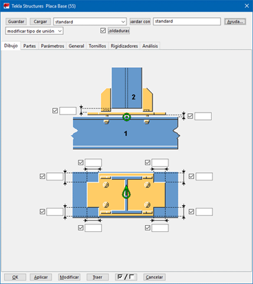 | Placa base a estructura metálica |
| 1004 | Placa base | Placa base |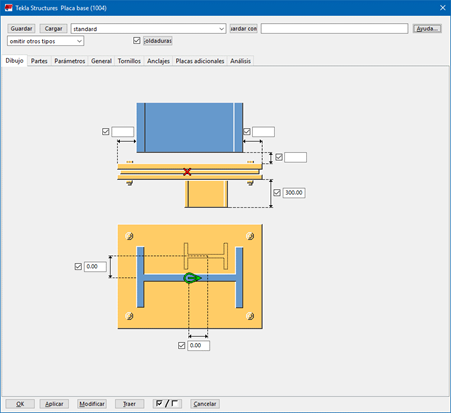 | Sólo permite un agujero para colado de grout |
| 1042 | Placa Base | Placa base | 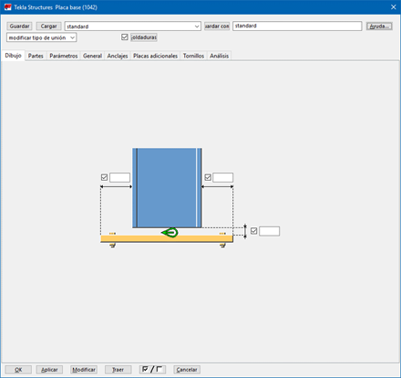 | |
| 1047 | Placa base | Placa base U.S. |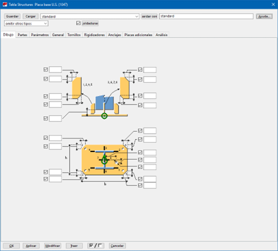 | **El que debe utilizarse en lo posible** .Permite girar el taco de corte.  |

### Uniones

| ID | Componente | Descripción | Imagen | Comentario |
|----|------------|-------------|--------|------------|
| **11** | Arriostramiento | Cartela Atornillada |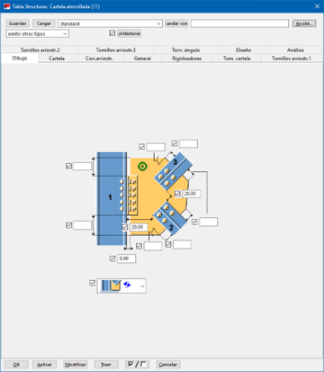 | Para chapas de nudo a viga o columna|
| **14** | Viga a viga | Placas de unión | 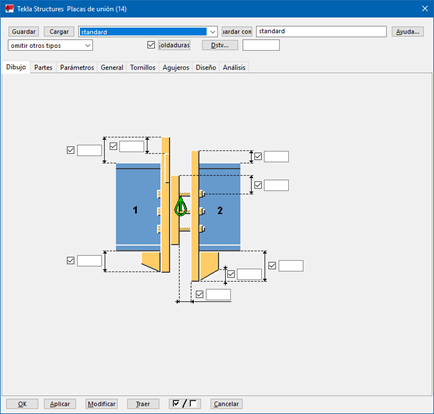|Unión entre viga o unión viga-columna a momento |
| **19** | Arriostramiento | Cruz arriostramiento |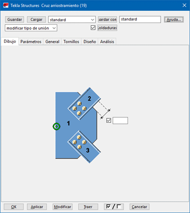 | Crea bulones en barras. Hay que tener previamente la cartela |
| **31** | Viga a columna | Viga soldada a columna |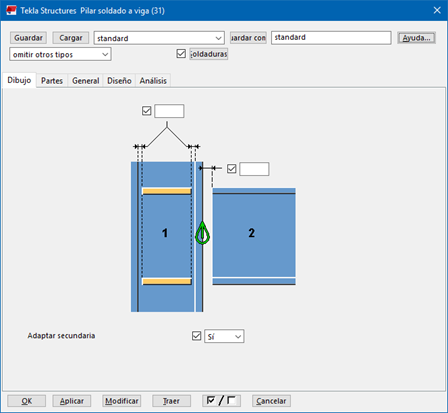 | |
| **40** | Viga a Columna | Cantonera |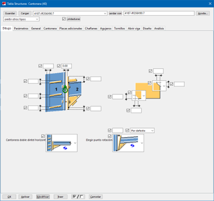 | |
| **42** | Viga a Columna | Banderita con rigidizadores |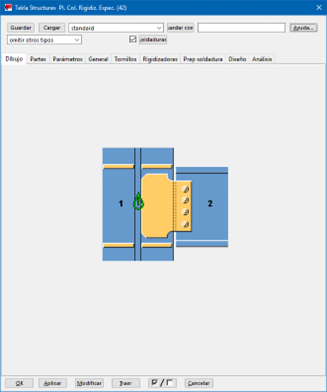 | |
| **42** | Empalme | Empalme con cubrejuntas |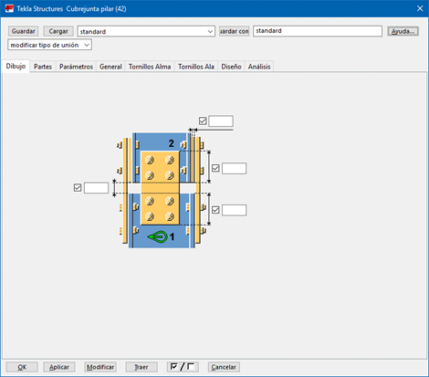 | |
| **44** | Viga a viga | Aplica recortes en uniones entre vigas |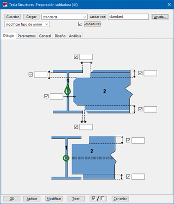 | |
| **87** | Poste a viga | Placa doble montante |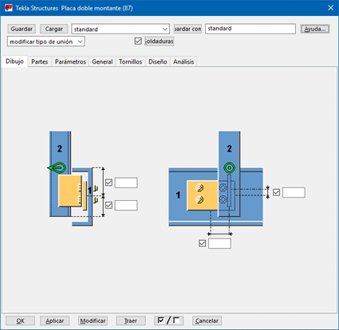 | |
| **101** | Viga a Viga | Unión a alma |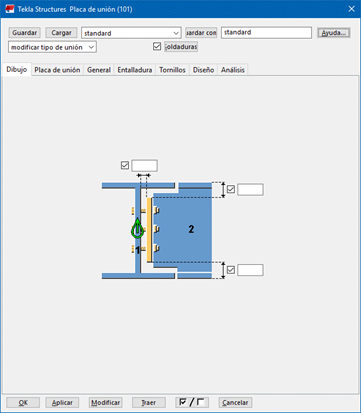 | |
| **106** | Viga a Viga | Cantonera cumbrera |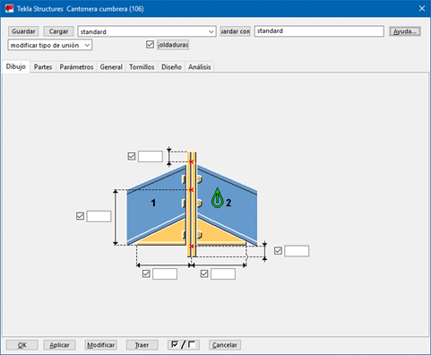 | |
| **119** | Viga a Columna | Stub desde columna |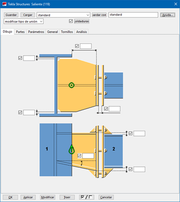 | |
| **132** | Empalme | Cubrejunta  |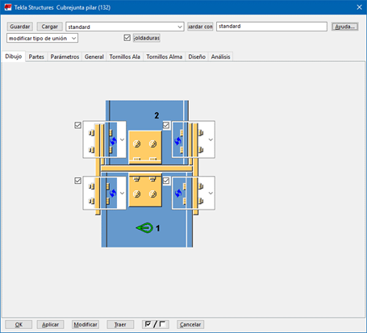 | |
| **134** | Viga a Columna | Unión a momento abulonada |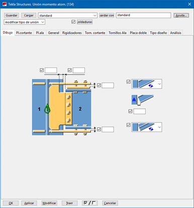 | |
| **141** | Viga a Columna | Ángulo de unión | 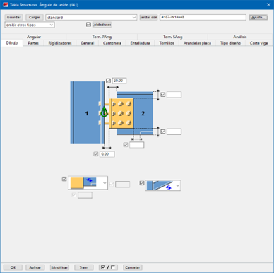| 1- Se pueden abulonar en ambas alas de los ángulos |
| **144** | Viga a Columna | Placa de unión | 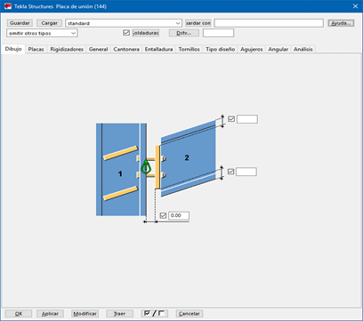| |
| **149** | Arriostramiento | Arriostramiento para dos diagonales |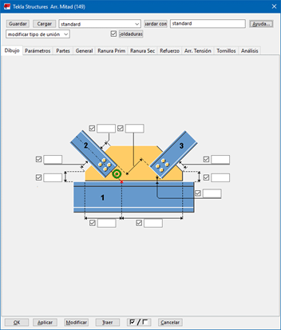 | |
| **185** | Viga a Viga | Banderita extendida |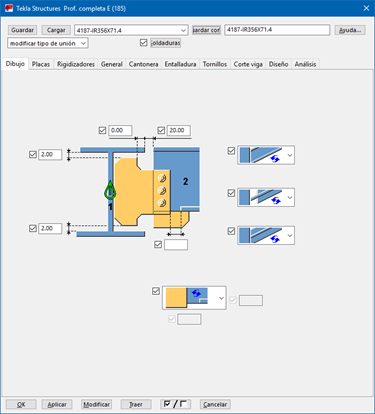 | |
| **187** | Viga a Columna | Banderita extendida |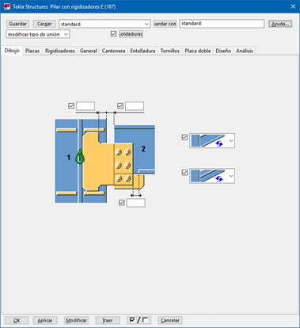 | |

### Geometría

| ID | Componente | Descripción | Imagen | Referencia |
|----|------------|-------------|--------|------------|
| **10** | Corte 3D | Para recortar partes arbitrarias |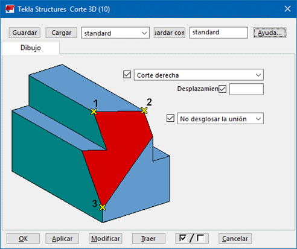 | |
| **1003** | Rigidizadores en perfiles | Rigidizadores |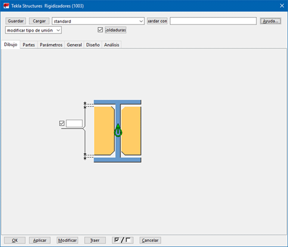 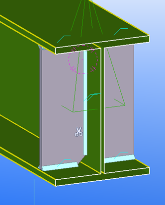 | Crea 1 o 2 rigidizadores, de ala a ala |
| **1024** | Barandas | Barandilla | 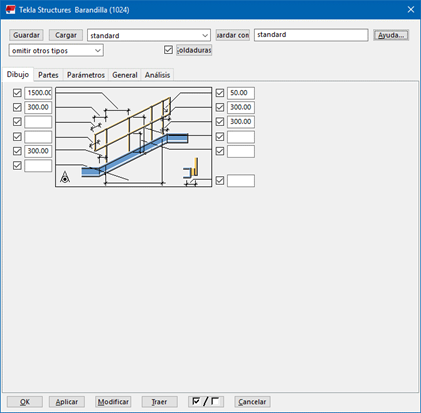| No permite mover verticalmente el guardapie |
| **1034** | Rigidizadores genérico | Rigidizadores | 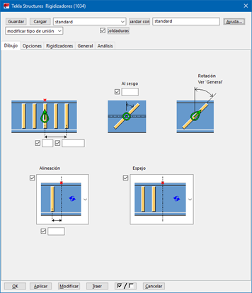| Permite crear varios rigidizadores con el mismo componente |
| **1041** | Rigidizadores PG | Rigidizadores |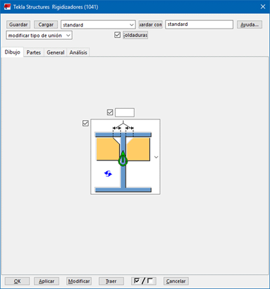 | |
| **S86** | Componente personalizado | Montantes - Barandillas - Placas inferiores |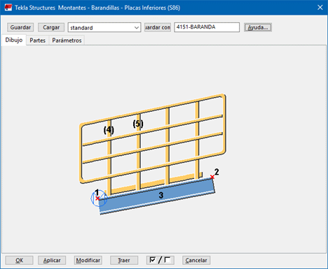 | Este componente utiliza otros 3 componentes: uno para los postes (S76), uno para el pasamanos y guardarodilla (S77) y otro para el guardapie (S75) |

## U.S. Base Plate (1047)
El componente es utilizado para el diseño de placas base, se utiliza este componente porque permite generar rigidizadores, agregar taco de corte y generar uniones de placas base, abulonadas o con anclajes:

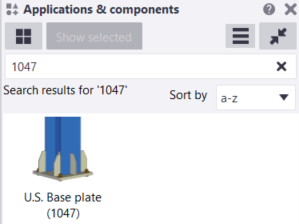

{: .warning}
> El componente permite realizar configuraciones con hasta 8 rigidizadores. Si se quisieran agregar mas se debe de explotar los componentes y duplicar los rigidizadores

### Atributos a completar
1. `Picture`: contiene el recorte de los rigidizadores  y su distancia a los bordes de la Placa Base.
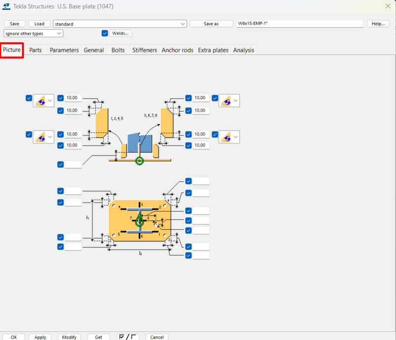
*Figura 1: Pestaña profile del componente*

2. `Parts`: Define las partes a modelar, como la placa base, los rigidizadores, el taco de corte. Y modificar atributso respecto a su tamaño, material, clase  y nombre. como comentario adicional, se puede completar la pestaña coment y finish.
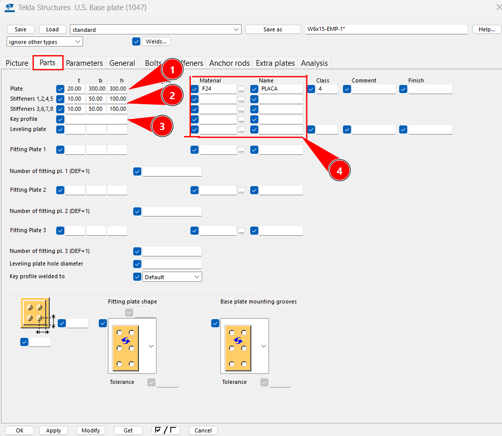 
*Figura 2: Pestaña parts del componente*
    1. `Plate`: Dimensiones de la placa base, espesor largo y ancho
    2. `Stiffeners`: Dimensiones de los rigidizadores, espesor largo y ancho
    3. `Key profile`: Permite generar un taco de corte automatico, se puede seleccionar perfiles del catalogo de materiales. 
    4. `Dimensiones`: Material y nombre y clase del los puntos 1  / 2  /  3

3. Las pestañas `Parameters` y `General` no suelen utilizarse en este componente
4. `Bolts`: Permite la configuración de bulones
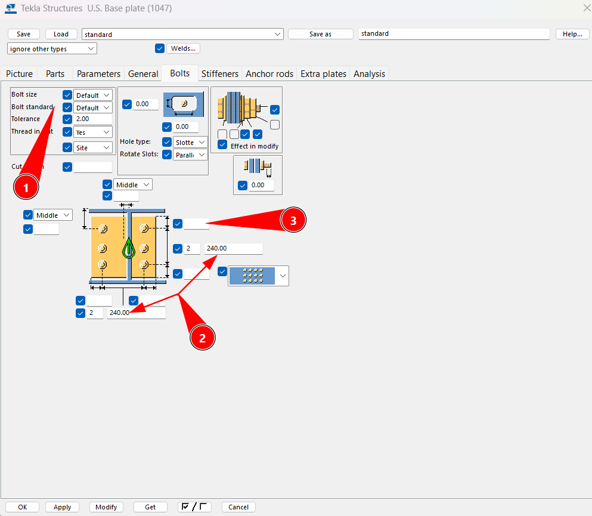
*Figura 3: Pestaña Bolts del componente*
    1. `Bolts configuration`: permite la configuración de los bulones, tanto su tamaño como el standar del mismo
    2. `Separación entre bulones`: Permite modificar la [separación entre bulones](../faq/faq.md#en-el-componente-1047-no-aparecen-mis-bulones) y su cantidad en ambos ejes de la PB.
    3. `Separación a borde` Permite modificar la separación a borde de los bulones/anclajes a la placa base.

5. `Stiffeners`: permite la configuración de rigidizadores, su posición y cantidad a visualizar. Pueden desplazarse de las alas o almas del perfil estableciendo distancias en los recuadros blancos. 
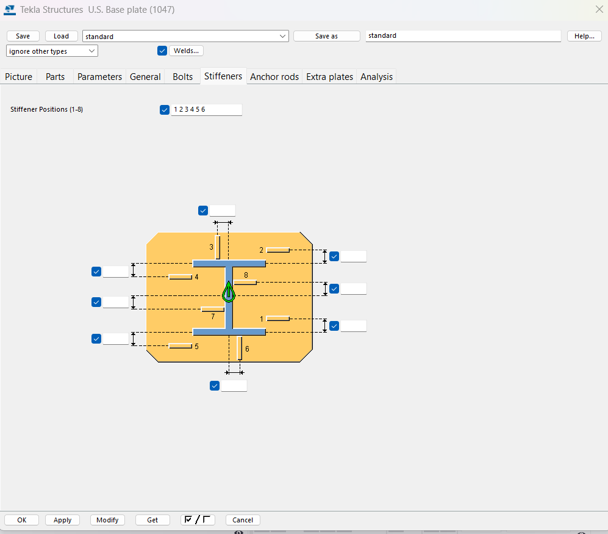
*Figura 4: Pestaña Stiffeners del componente*
El recuadro superior `Stiffeners positions`permite generar los rigidizadores que se indiquen con su numero de posición. 
{: .note}
>Solo se pueden utilizar los 8 mostrados en la imagen, si se quieren utilizar más, se recomienda explotar el componente y copiar los rigidizadores que se precisen.

6. `Anchor rods`: permite la configuración de anclajes

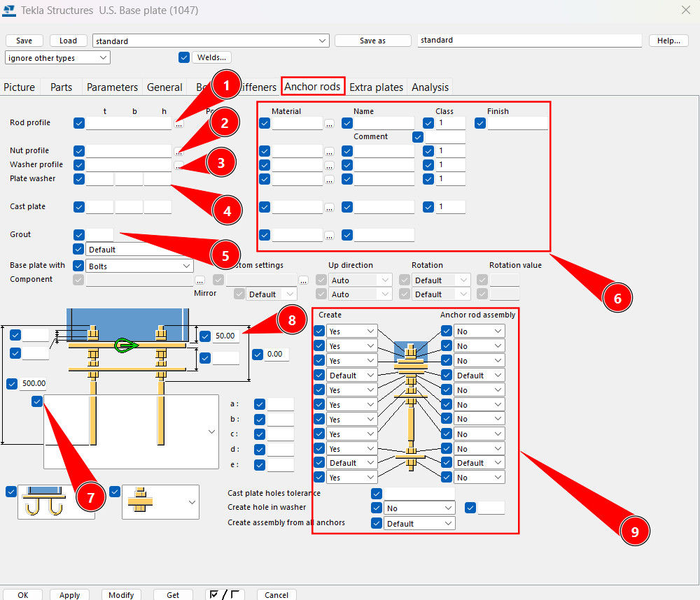
*Figura 5: Pestaña Anchor rods del componente*
    1. `Rod profile`: Permite elegir el perfil de anclaje, para anclajes se recomienda usar los perfiles metricos: 
    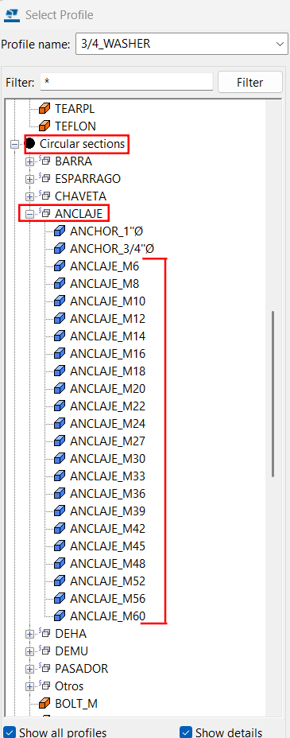
    2. `Nut profile`: Perfil de la tuerca, se recomienda usar los siguientes perfiles:
    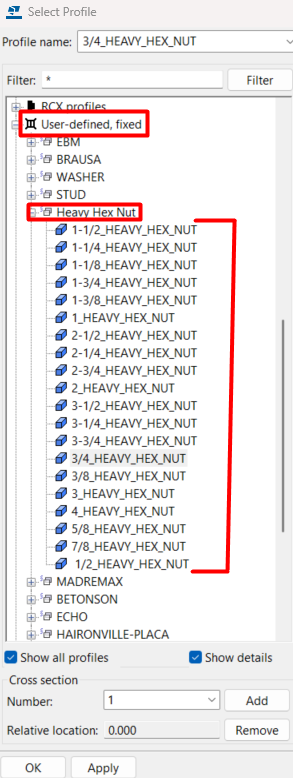
    3. `Washer profile`: Perfil de la arandela, 
    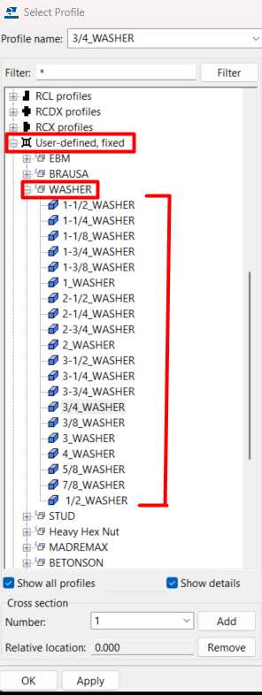
    4. `Plate Washer`: Perfil cuadrado de la arandela, este se modifica agregando medidas a los campos que aparecen vacios por defecto. Se completa el largo ancho y espesor.
    5. `Grout`: Se completa el espesor del mismo, se modifica según MC.
    6. `Propiedades`: Material, nombre y clase de los puntos 1 al 5, para un correcto desarollo verificar nombres y clases de [acero](../acero/perfiles.md#atributos-a-modelar) y de [hormigón](../hormigon/elementos.md#atributos-a-modelar)
    7. `Largo de anclaje`: Largo total del anclaje, se modifica según MC
    8. `Proyección sobre placa`: Largo total de la proyección sobre la placa base, se modifica según MC.
    9. `Creación de partes`: Modifica la creación de partes, se recomienda seleccionar `YES` a las partes que se crean según los puntos 1 a 5.

7. Las pestañas `Analisis` y `Extra plates`  no solemos usarla en este componente

[Planilla](../ref/Placa%20Base/PB_VERIFICACIONES.xlsx)

[← Volver al inicio](index.md)