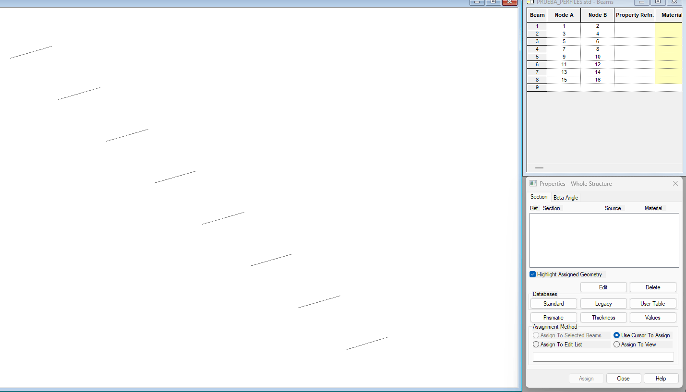
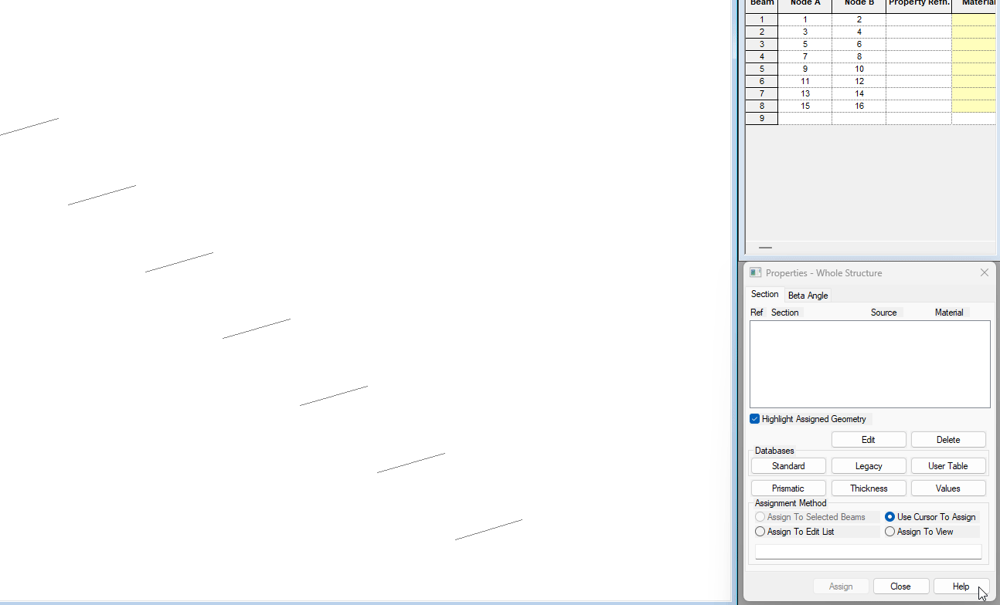
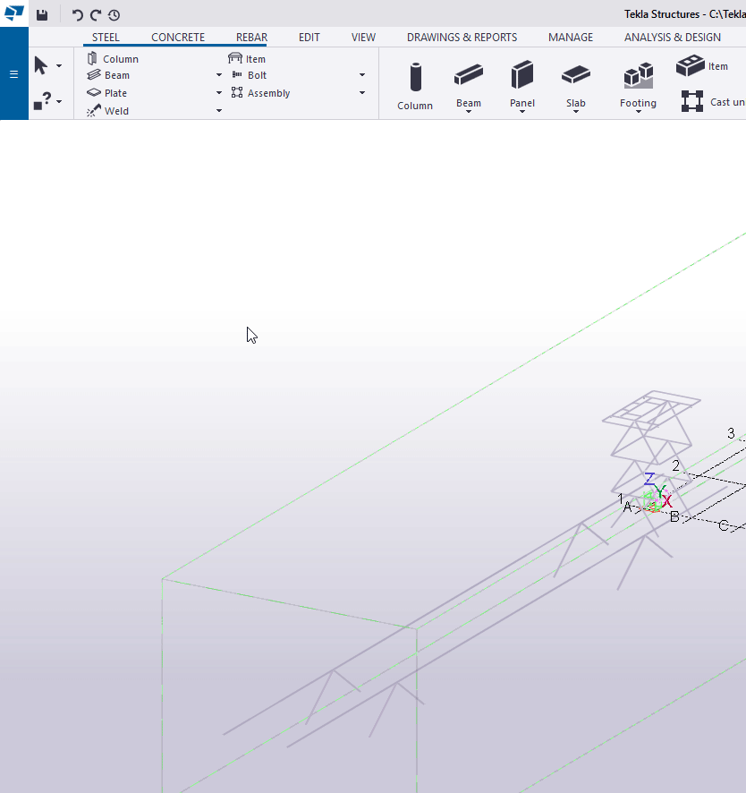
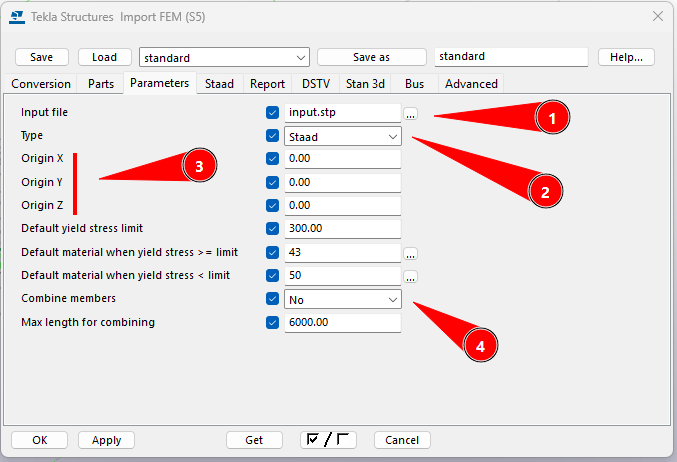
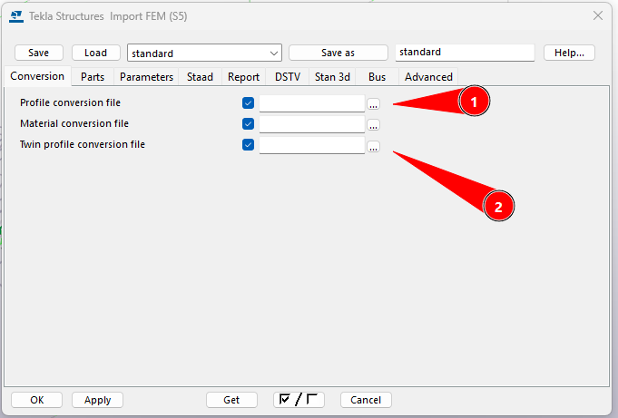

# Importar FEM
{: .no_toc }

## Tabla de Contenidos
{: .no_toc .text-delta }

1. TOC
{:toc}

## ¿Qué significa FEM?

`FEM = Finite Element Method`

Por modelo de elementos finitos entendemos a métodos numéricos para resolver ecuaciones diferenciales sobre elementos simples con cierta condición de borde, llamados elementos finitos.

A fines de este alcance, basta con entender a los FEM como aquellos modelos de barras que serán datos de entrada para el TEKLA y modelado de partes. Esto significará traer al TEKLA múltiples elementos de barra separados por nodos, con una determinada geometría.

## Opciones de importación

El TEKLA presenta las siguientes opciones. Se indica en la foto debajo cada pestaña. **En la empresa, el STAAD Pro es el programa de modelación de elementos finitos que usaremos siempre**. No se cubren otros programas los cuales el TEKLA puede importar como puede ser el SAP 2000.

## Importar desde STAAD

Dividamos por roles las cuestiones a tener en cuenta, tanto para el ingeniero que realiza el FEM como para quien lo toma desde TEKLA.

### Requisitos STAAD

En versiones recientes de STAAD, se incorporan bases de datos adicionales al programa.**Se deben utilizar siemnpre las bases hoy llamadas LEGACY**, para lograr que al importar los perfiles se vean de acuerdo nombre.


_Figura 1: Base de datos Standard_


_Figura 2: Base de datos Legacy_

{: .important}
>Los ángulos deben cargarse en versión americana (pulgadas).

{: .warning}
> En caso de requerir utilizar la base de datos "Standard", dar aviso a quien modele para que sepa cómo se debe modelarse la barra, si es que se precisase por secciones compuestas.


### Requisitos TEKLA

Para importar en TEKLA se debe,

1. Crear una instancia de modelo FEM en el programa



2. Definir propiedades generales



```
(1): ruta al archivo .std (el modelo de STAAD)
(2): origen del archivo. STAAD en nuestro caso
(3): origen a desplazar la estructura en el espacio si ya se conoce su implantación.
(4) : posibilidad de combinar o no. Útil si hay demasiados nodos
```
3. Definir material dentro de la hoja STAAD: por defecto F24

4. Ajustar archivos de perfil de conversión (si hiciese falta)

Para sintaxis del archivo ver el siguiente apartado.





>{: .higlight}
>Los archivos de conversión son archivos de texto simples que contienen el nombre de Tekla Structures en la primera columna y el nombre utilizado en el otro paquete de software en la segunda columna. Las columnas están separadas por un espacio. Todos los perfiles paramétricos deben ingresarse en el archivo de conversión de perfiles.

### Archivos de conversión

Se deja a continuación los archivos definidos. En caso de requerir modificarlo, descargar el mismo y ubicarlo en la carpeta del modelo donde se precise


[← Volver al inicio](index.md)