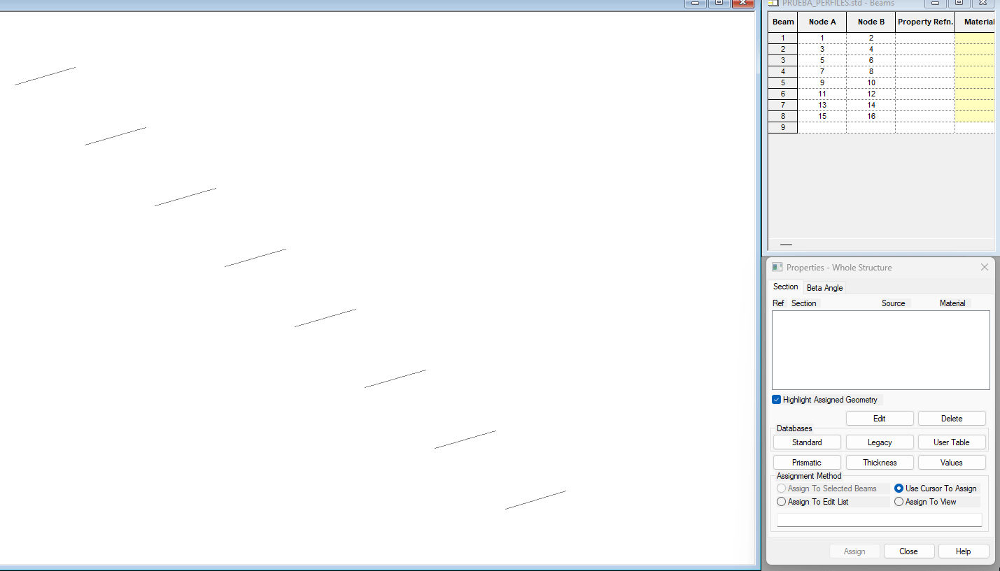
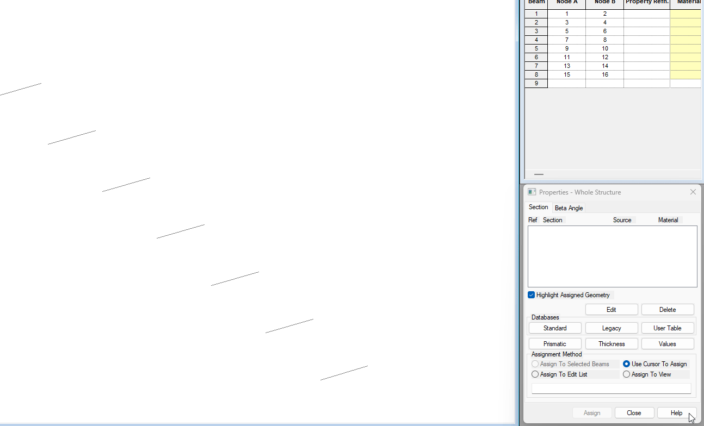
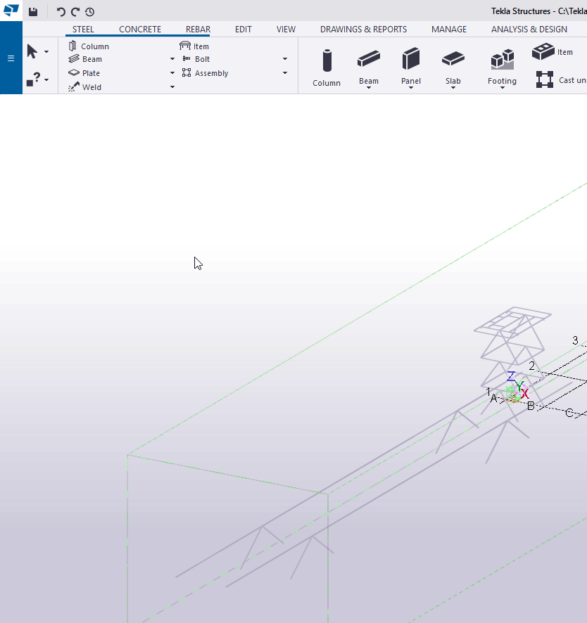
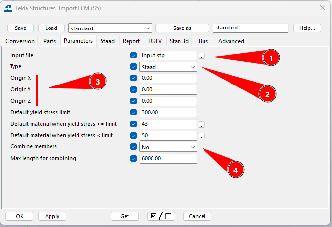
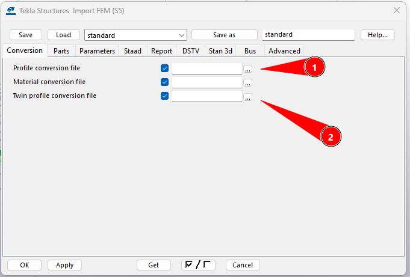
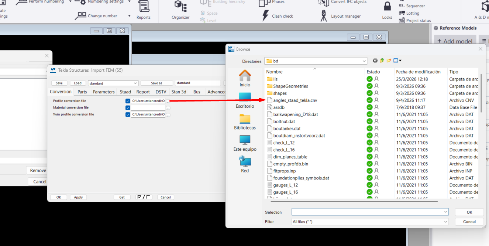
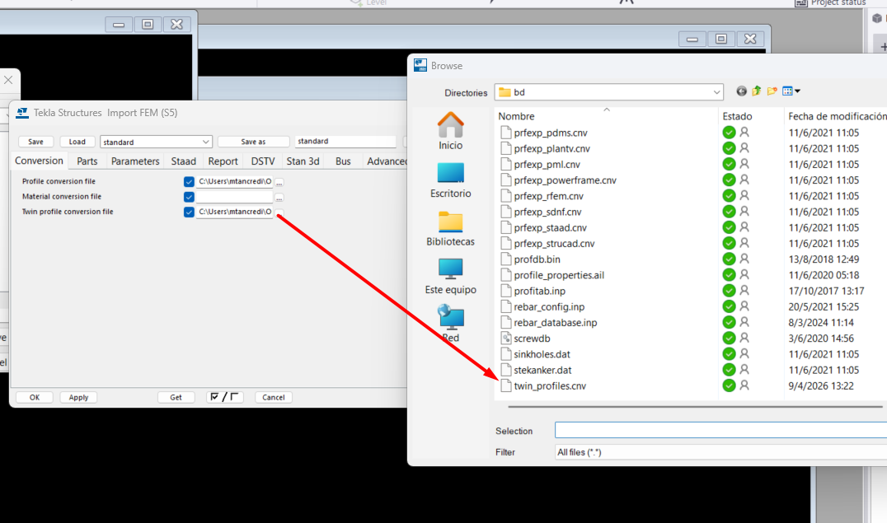

# Importar FEM
{: .no_toc }

## Tabla de Contenidos
{: .no_toc .text-delta }

1. TOC
{:toc}

## ¿Qué significa FEM?

`FEM = Finite Element Method`

Por modelo de elementos finitos entendemos a métodos numéricos para resolver ecuaciones diferenciales sobre elementos simples (barras, placas) con cierta condición de borde.

A fines de este alcance, basta con entender a los FEM como aquellos modelos de barras que serán datos de entrada para el TEKLA y modelado de partes. Esto significará traer al TEKLA múltiples elementos de barra separados por nodos, con una determinada geometría.

## Opciones de importación

El TEKLA presenta las siguientes opciones. Se indica en la foto debajo cada pestaña. **En la empresa, se utiliza principalmente el STAAD Pro**. No se cubren aquí otros programas los cuales el TEKLA puede importar como puede ser el SAP 2000.

## Importar desde STAAD

Se dan a continuación requisitos a tener en cuenta en ambos programas para importar los modelos

### Requisitos STAAD

En versiones recientes de STAAD, se incorporan bases de datos adicionales al programa.

**Se deben utilizar las bases hoy llamadas LEGACY**, para lograr que al importar los perfiles se vean de acuerdo con el nombre.


_Figura 1: Base de datos Standard_


_Figura 2: Base de datos Legacy_

{: .important}
>Los ángulos deben cargarse en versión americana (pulgadas).

{: .warning}
> En caso de requerir utilizar la base de datos "Standard", dar aviso a quien modele para que sepa cómo se debe modelarse la barra, si es que se precisase por secciones compuestas.


### Requisitos TEKLA

Para importar en TEKLA se debe,

1. Crear una instancia de modelo FEM en el programa



2. Definir propiedades generales



```
(1): ruta al archivo .std (el modelo de STAAD)
(2): origen del archivo. STAAD en nuestro caso
(3): origen a desplazar la estructura en el espacio si ya se conoce su implantación.
(4) : posibilidad de combinar o no. Útil si hay demasiados nodos
```
3. Definir material dentro de la hoja STAAD: por defecto F24

4. Ajustar archivos de perfil de conversión (si hiciese falta)

Para sintaxis del archivo ver el siguiente apartado.

{: .warning}
>La configuración actual permitirá traer doble ángulo, pero no permite disponerlos en cruz (no es posible lograrlo), por lo que se omite la conversión en ese caso, para que sea explicito que debe modelarse el `Twin Profile` directamente en TEKLA.




### Archivos de conversión

{: .highlight}
>Los archivos de conversión son archivos de texto simples que contienen el nombre de Tekla Structures en la primera columna y el nombre utilizado en el otro paquete de software en la segunda columna. Las columnas están separadas por un espacio. Todos los perfiles paramétricos deben ingresarse en el archivo de conversión de perfiles.

Se deja a continuación los perfiles que están en el archivo de conversión. En caso de requerir algún perfil que no esté en el listado, guardar un nuevo archivo `.cnv` y dejándolo a nivel modelo para su lectura.



_Figura 3: Archivo con definiciones de ángulo_

<details markdown="1">
<summary>`angles_staad_tekla.cnv`</summary>

```
!PERFILES SIMPLES
L50.8*50.8*3.2		L20201

L50.8*50.8*4.8		L20203

L50.8*50.8*6.4		L20204

L50.8*50.8*7.9		L20205

L50.8*50.8*9.5		L20206

L63.5*63.5*3.2		L25251

L63.5*63.5*4.8		L25253

L63.5*63.5*6.4		L25254

L63.5*63.5*8		L25255

L63.5*63.5*9.5		L25256

L63.5*63.5*12.7		L25258

L76.2*76.2*4.8		L30303

L76.2*76.2*6.4		L30304

L76.2*76.2*8		L30305

L76.2*76.2*9.5		L30306

L76.2*76.2*11.1		L30307

L76.2*76.2*12.7		L30308

L88.9*88.9*6.4		L35354

L88.9*88.9*8		L35355

L88.9*88.9*9.5		L35356

L88.9*88.9*11.1		L35357

L88.9*88.9*12.7		L35358

L101.6*101.6*6.4		L40404

L101.6*101.6*8		L40405

L101.6*101.6*9.5		L40406

L101.6*101.6*11.1		L40407

L101.6*101.6*12.7		L40408

L101.6*101.6*14.3		L40409

L101.6*101.6*15.9		L40410

L101.6*101.6*19.1		L40412

L25*25*4.8		L10103

L25*25*6.4		L10104

L29*29*3.2		L11111

L32*32*3.2		L12121

L32*32*4.8		L12123

L32*32*6.4		L12124

L38*38*3.2		L15151

L38*38*4.8		L15153

L38*38*6.4		L15154

L45*45*3.2		L18181

L45*45*4.8		L18183

L45*45*6.4		L18184

L51*51*3.2		L20201

L51*51*4.8		L20203

L51*51*6.4		L20204

L51*51*7.9		L20205

L51*51*9.5		L20206

L57*57*3.2		L22221

L57*57*4.8		L22223

L57*57*6.4		L22224

L64*64*4.8		L25253

L64*64*6.4		L25254

L64*64*7.9		L25255

L64*64*9.5		L25256

L76*76*6.4		L30304

L76*76*7.9		L30305

L76*76*9.5		L30306

L76*76*12.7		L30308

L89*89*6.4		L35354

L89*89*7.9		L35355

L89*89*9.5		L35356

L89*89*12.7		L35358

L102*102*6.4		L40404

L102*102*7.9		L40405

L102*102*9.5		L40406

L102*102*11.1		L40407

L102*102*12.7		L40408

!PERFILES DOBLES ESPALDA CON ESPALDA LD
L50.8*50.8*3.2		LD20201-3

L50.8*50.8*4.8		LD20203-5

L50.8*50.8*6.4		LD20204-6

L50.8*50.8*7.9		LD20205-8

L50.8*50.8*9.5		LD20206-10

L63.5*63.5*3.2		LD25251-3

L63.5*63.5*4.8		LD25253-5

L63.5*63.5*6.4		LD25254-6

L63.5*63.5*8		LD25255-8

L63.5*63.5*9.5		LD25256-20

L63.5*63.5*12.7		LD25258-13

L76.2*76.2*4.8		LD30303-5

L76.2*76.2*6.4		LD30304-6

L76.2*76.2*8		LD30305-8

L76.2*76.2*9.5		LD30306-10

L76.2*76.2*11.1		LD30307-11

L76.2*76.2*12.7		LD30308-13

L88.9*88.9*6.4		LD35354-6

L88.9*88.9*8		LD35355-8

L88.9*88.9*9.5		LD35356-10

L88.9*88.9*11.1		LD35357-11

L88.9*88.9*12.7		LD35358-13

L101.6*101.6*6.4		LD40404-6

L101.6*101.6*8		LD40405-8

L101.6*101.6*9.5		LD40406-10

L101.6*101.6*11.1		LD40407-11

L101.6*101.6*12.7		LD40408-13

L101.6*101.6*14.3		LD40409-14

L101.6*101.6*15.9		LD40410-16

L101.6*101.6*19.1		LD40412-19

L25*25*4.8		LD10103-5

L25*25*6.4		LD10104-6

L29*29*3.2		LD11111-3

L32*32*3.2		LD12121-3

L32*32*4.8		LD12123-5

L32*32*6.4		LD12124-6

L38*38*3.2		LD15151-3

L38*38*4.8		LD15153-5

L38*38*6.4		LD15154-6

L45*45*3.2		LD18181-3

L45*45*4.8		LD18183-5

L45*45*6.4		LD18184-6

L51*51*3.2		LD20201-3

L51*51*4.8		LD20203-5

L51*51*6.4		LD20204-6

L51*51*7.9		LD20205-8

L51*51*9.5		LD20206-10

L57*57*3.2		LD22221-3

L57*57*4.8		LD22223-5

L57*57*6.4		LD22224-6

L64*64*4.8		LD25253-5

L64*64*6.4		LD25254-6

L64*64*7.9		LD25255-8

L64*64*9.5		LD25256-10

L76*76*6.4		LD30304-6

L76*76*7.9		LD30305-8

L76*76*9.5		LD30306-10

L76*76*12.7		LD30308-13

L89*89*6.4		LD35354-6

L89*89*7.9		LD35355-8

L89*89*9.5		LD35356-10

L89*89*12.7		LD35358-13

L102*102*6.4		LD40404-6

L102*102*7.9		LD40405-8

L102*102*9.5		LD40406-10

L102*102*11.1		LD40407-11

L102*102*12.7		LD40408-13

!PERFILES EN ESTRELLA SA
L50.8*50.8*3.2		SA20201-3

L50.8*50.8*4.8		SA20203-5

L50.8*50.8*6.4		SA20204-6

L50.8*50.8*7.9		SA20205-8

L50.8*50.8*9.5		SA20206-10

L63.5*63.5*3.2		SA25251-3

L63.5*63.5*4.8		SA25253-5

L63.5*63.5*6.4		SA25254-6

L63.5*63.5*8		SA25255-8

L63.5*63.5*9.5		SA25256-10

L63.5*63.5*12.7		SA25258-13

L76.2*76.2*4.8		SA30303-5

L76.2*76.2*6.4		SA30304-6

L76.2*76.2*8		SA_L30305

L76.2*76.2*9.5		SA30306-10

L76.2*76.2*11.1		SA30307-11

L76.2*76.2*12.7		SA30308-13

L88.9*88.9*6.4		SA35354-6

L88.9*88.9*8		SA35355-8

L88.9*88.9*9.5		SA35356-10

L88.9*88.9*11.1		SA35357-11

L88.9*88.9*12.7		SA35358-13

L101.6*101.6*6.4		SA40404-6

L101.6*101.6*8		SA40405-8

L101.6*101.6*9.5		SA40406-10

L101.6*101.6*11.1		SA40407-11

L101.6*101.6*12.7		SA40408-13

L101.6*101.6*14.3		SA40409-14

L101.6*101.6*15.9		SA40410-16

L101.6*101.6*19.1		SA40412-19

L25*25*4.8		SA10103-5

L25*25*6.4		SA10104-6

L29*29*3.2		SA11111-3

L32*32*3.2		SA12121-3

L32*32*4.8		SA12123-5

L32*32*6.4		SA12124-6

L38*38*3.2		SA15151-3

L38*38*4.8		SA15153-5

L38*38*6.4		SA15154-6

L45*45*3.2		SA18181-3

L45*45*4.8		SA18183-5

L45*45*6.4		SA18184-6

L51*51*3.2		SA20201-3

L51*51*4.8		SA20203-5

L51*51*6.4		SA20204-6

L51*51*7.9		SA20205-8

L51*51*9.5		SA20206-10

L57*57*3.2		SA22221-3

L57*57*4.8		SA22223-5

L57*57*6.4		SA22224-6

L64*64*4.8		SA25253-5

L64*64*6.4		SA25254-6

L64*64*7.9		SA25255-8

L64*64*9.5		SA25256-10

L76*76*6.4		SA30304-6

L76*76*7.9		SA30305-8

L76*76*9.5		SA30306-10

L76*76*12.7		SA30308-13

L89*89*6.4		SA35354-6

L89*89*7.9		SA35355-8

L89*89*9.5		SA35356-10

L89*89*12.7		SA35358-13

L102*102*6.4		SA40404-6

L102*102*7.9		SA40405-8

L102*102*9.5		SA40406-10

L102*102*11.1		SA40407-11

L102*102*12.7		SA40408-13


!PERFILES UPN EUROPEOS
UPN30X15		UPN30X15

UPN40X20		UPN40X20

UPN50X25		UPN50X25

UPN50X38		UPN50X38

UPN60X30		UPN60X30

UPN65X42		UPN65X42

UPN70X40		UPN70X40

UPN80		UPN80

UPN100		UPN100

UPN120		UPN120

UPN140		UPN140

UPN160		UPN160

UPN180		UPN180

UPN200		UPN200

UPN220		UPN220

UPN240		UPN240

UPN260		UPN260

UPN280		UPN280

UPN300		UPN300

UPN320		UPN320

UPN350		UPN350

UPN380		UPN380

UPN400		UPN400

!PERFILES UPN DOBLES FRENTE A FRENTE FR
UPN30X15		FRUPN30X15-10

UPN40X20		FRUPN40X20-10

UPN50X25		FRUPN50X25-10

UPN50X38		FRUPN50X38-10

UPN60X30		FRUPN60X30-10

UPN65X42		FRUPN65X42-10

UPN70X40		FRUPN70X40-10

UPN80		FRUPN80-10

UPN100		FRUPN100-10

UPN120		FRUPN120-10

UPN140		FRUPN140-10

UPN160		FRUPN160-10

UPN180		FRUPN180

UPN200		FRUPN200-10

UPN220		FRUPN220-10

UPN240		FRUPN240-10

UPN260		FRUPN260-10

UPN280		FRUPN280-10

UPN300		FRUPN300-10

UPN320		FRUPN320-10

UPN350		FRUPN350-10

UPN380		FRUPN380-10

UPN400		FRUPN400-10

```

</details>



_Figura 4: Archivo con definiciones de ángulo doble (SOLO espalda con espalda)_


<details markdown="1">
<summary>`twin_profiles.cnv`</summary>

```python
SD 10
SA_L 10
FR 10

```

</details>

[← Volver al inicio](index.md)