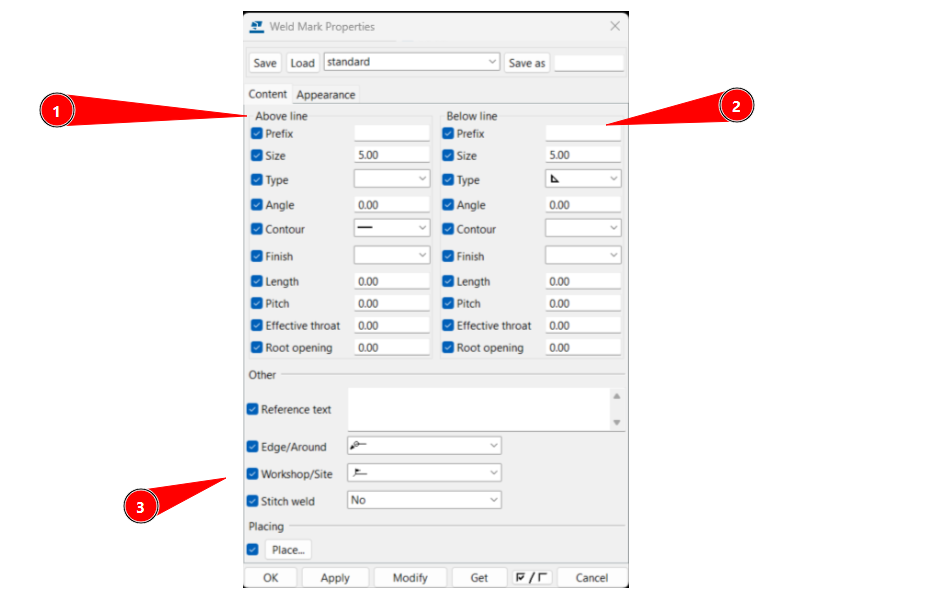
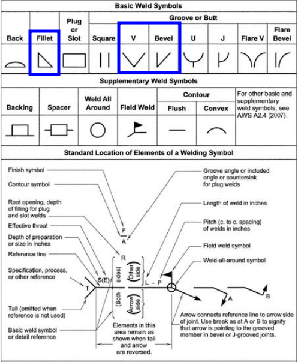
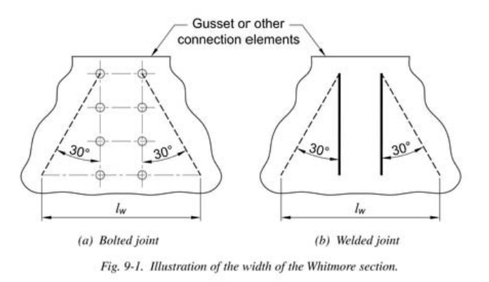
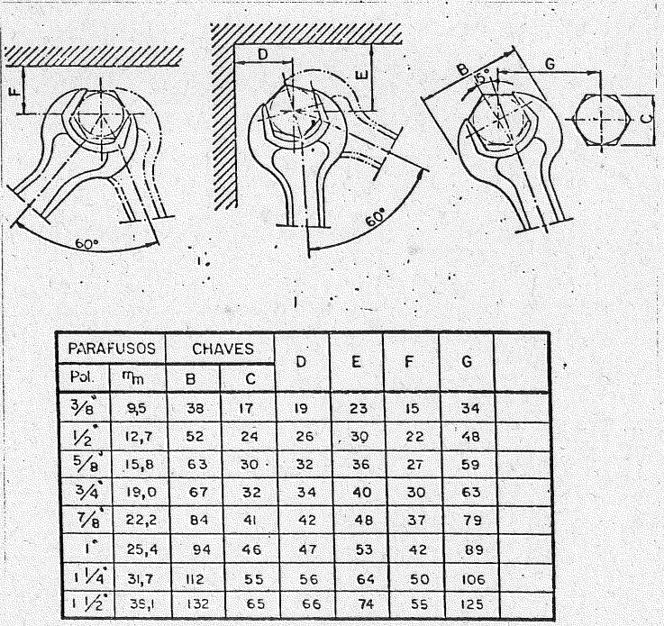

# Configuración inicial
{: .no_toc }

## Tabla de Contenidos
{: .no_toc .text-delta }

1. TOC
{:toc}

## Objeto y alcance

Contiene los estándares y procedimientos para el modelado de estructuras de hormigón armado en Tekla Structures. Cubre elementos estructurales, propiedades a completar y buenas prácticas para garantizar modelos coordinados y homogéneos.

No es alcance de este instructivo mostrar cuestiones básicas del modelado de elementos si no brindar pautas de diseño y guiar en el proceso.

---

## Descripción de elementos

Aca iría la descripcion de los elementos de TEKLA de hormigón, cuándo usar cada uno, con usos recomendados

Foto del ribbon

### Beam

### Column

### Placa

### Bolt

Describir para qué sirve y como se modela a nivel propiedaees. Va a componentes de forma automatica

### Weld

Describir para qué sirve y como se modela a nivel propiedaees. Va a componentes de forma automatica

---

## Antes de modelar

- Referemcoas de connect
- Referencias externas de cliente
- Referencias internas del proyecto de otras disciplinas

EL Lep deberá indicar a quien modele lo que debe tomar como información valida y tener en cuenta

Para referencias de Connect, ver [Connect - Ejecutor](../connect/connect-ejecutor.md)

Es altamente probable que se tenga un modelo de elementos finitos de la estructura. Ver [Importacion FEM](./importacion_FEM.md) para detalle de como importar modelos.

## Atributos a modelar

Va a depender de IB/ID, definiciones de proyecto, pero en caracter general:

## Diseño de conexiones

Solo aplicable en ID salvo detalles puntuales en IB. Indicar las conexiones típicas presentas y derivar al capitulo de conexiones

Ver [Conexiones](./conexiones.md) para detalle de cómo modelar, tipo de armaduras, y reportes asociados.

## Componentes

Se incluyen los componentes en el apartado [Conexiones](./conexiones.md)

## Proyectar la estructura

### Piezas de taller

En ingeniería básica no suele ser necesario modelar uniones y no suele ser parte del alcance modelarlas a no ser que se solicite modelar ciertas uniones que ayuden a entender la estrategia de modularización. 

En ingeniería de detalle, donde ya es necesario modelar uniones y detallarlas en los planos, se debe definir con el ingeniero principalmente dos cosas:

- Piezas de taller
- Uniones abulonadas calculadas

Las piezas de taller tendrán uniones soldadas y se abulonan distintas piezas de taller a través de uniones calculadas.

Consultar con el ingeniero para entender como se debe modularizar la estructura previo a su modelado. Esto definirá qué uniones deben hacerse soldadas y cuáles abulonadas.

### Soldaduras

Las soldaduras siempre deberán hacerse a través de componentes, pero es necesario conocer qué implica cada soldadura para alcanzar la simbología correcta. No es necesario que la misma se modele correctamente (aunque pueda hacerse), si no que se indique correctamente.

{: .note}
>Las soldaduras se indican de acuerdo con [AWS (American Welding Society)](https://en.wikipedia.org/wiki/American_Welding_Society).

En (1) se indica la soldadura sobre la línea (lugar opuesto a la flecha) y en (2) la soldadura del lado de la flecha. En (3) se suman parámetros para indicar si es intermitente, si se hace en sitio (banderita) o si es en todo el perímetro (circulo).

Respecto a la simbología a indicar en (1) y (2), se indican a continuación las simbologías más comunes en una tabla azul.

El cateto de soldadura se indicará donde la misma esté expresamente calculada. Caso contrario, existirá una nota en el plano que defina de manera genérica su espesor.

Cualquier otro detalle deberá entenderse como una solución particular que deberá ser concensuada con ingeniería.

### Chapas de nudo

El desarrollo de chapas de nudo es en gran medida artesanal a realizar por el proyectista. Siempre se deberá priorizar el uso de componentes (ver [Conexiones](./conexiones.md)) y modelar o editar en función de eso. Sin embargo, se dejan a continuación algunos lineamientos generales

A nivel general, el diseño de la chapa en extremos debe seguir el ancho de la sección que se ilustra debajo, buscando tener desde la línea de bulones/soldadura un ángulo de aproximadamente 30°.

{: .highlight}
>La geometría de las chapas de nudo debe buscar tener chapas pequeñas (para obtener la mayor cantidad de chapas por kg de acero), sin aristas vivas, y respetando distancias a borde
>
> En muchas uniones deberá ajustarse el sistema de los perfiles que concurren para facilitar la unión (por ejmplo, desplazar el sistema de los ángulos al ala inferior del perfil en lugar de ir al baricentro)

### Distancias entre bulones, distancias a borde y distancias a perfiles

El siguiente apartado menciona aspectos referentes a cada tipo de distancia, y que deberá tomar el proyectista en cuenta a la hora de proyectar las uniones. Las distancias indicadas son para agujeros normales. Ovalados tendrán algún requisito adicional que no se cubre en las tablas presentadas.

#### Distancia entre bulones y a borde

Al modelar siempre se debe optar por tener la distancia mínima entre bulones. Se dejan a modo informativo estas distancias:

| Tamaño Bulón | d (mm) | Sep.Min. (3d) | Sep.Max. | Dist.Min a borde (1.5d) |
|--------------|----------|------------------------|-------------------|---------------------------|
| 1/2"         | 12.7    | 1.50" (38 mm)         | 12t ≤ 6"          | 0.75" (19 mm)            |
| 5/8"         | 15.9    | 1.88" (48 mm)         | 12t ≤ 6"          | 0.94" (24 mm)            |
| 3/4"         | 19.05    | 2.25" (57 mm)         | 12t ≤ 6"          | 1.13" (29 mm)            |
| 7/8"         | 22.22    | 2.63" (67 mm)         | 12t ≤ 6"          | 1.31" (33 mm)            |
| 1"           | 25.4    | 3.00" (76 mm)         | 12t ≤ 6"          | 1.50" (38 mm)            |

(*) $t$ se corresponde con el mínimo espesor de la chapa de unión.

#### Otras distancias a tener en cuenta

Las uniones en general se darán con encuentros con perfiles, placas base o lugares comprometidos. Se debe asegurar en cualquier unión lugar disponible para poder asegurar que se hará un ajuste firme de estos con una llave.

Dichas distancias se visualizan en el modelo 3D en el proceso, pero se deja de referencia la imagen debajo:

### Placa base

Las placa base se harán con componentes personalizados. Verificar componente a utilizar de acuerdo a [Conexiones](../acero/conexiones.md)

Se deberá definir con ingeniería:

- Llave de corte
- Geometría y disposición de anclajes
- Necesidad o no de rigidizadores
- Presencia de chapas cuadradas (tipo arandela) a soldar en campo para 2° etapa.

{: .important}
>La calidad de los anclajes deberá ser según ASTM F1554 Gr.36 o Gr.55 según corresponda para practicamente cualquier placa base a desarrollar.

### Grating

El grating se modela con elementos de placa. Se deberá seleccionar el material de acuerdo con los siguientes. 

En caso de requerir una rejilla que se aparte de lo indicado, se deberá crear el material, asignarle su densidad para el espesor buscado.

A fines de validar que esté modelada correctamente, las placas creadas como Grating y asignadas al material adecuado deberán pintarse de verde con el filtro de representación.

[← Volver al inicio](index.md)