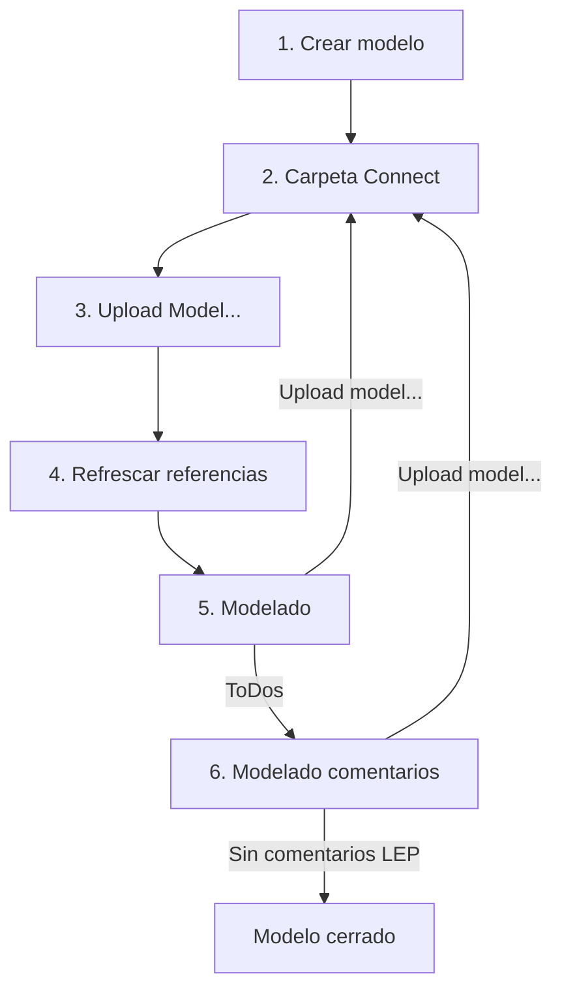

# Trimble Connect - Ejecutor
{: .no_toc }

## Tabla de Contenidos
{: .no_toc .text-delta }

1. TOC
{:toc}

## ¿A qué llamamos ejecutor?

Se entiende por ejecutor a proyectistas/ingenieros que se encarguen de crear un modelo de TEKLA en el marco de un proyecto, sin importar si sea solo para modelado o generar documentación.

## Inicio del proyecto

Iniciado el proyecto, se presupone que ya se cuenta con lo siguiente:

- Cuadros y layouts del proyecto (ver [Un proyecto nuevo...](../proyecto_nuevo/index.md) para indicaciones previas a crear un proyecto).
- Definición de los nombres de los modelos dentro de la disciplina, siguiendo lo indicado en [Modelo 3D - Generalidades](../generalidades/generalidades.md) para la nomenclatura

Confirmados estos dos puntos se deberán crear todos los modelos pertenecientes al proyecto y **solicitar al LEP** que arme la estructura de carpetas del proyecto.

## ¿Donde se suben los modelos?

El administrador de modelos deberá asignar una propiedad avanzada a todos los modelos, indicando a que carpeta debe apuntar el modelo en Connect.

Supongamos esta estructura definida por el LEP


Si el modelo que está trabajando el ejecutor pertenece al Area 03, debe ajustarse la siguiente propiedad avanzada con la ruta apuntando a la carpeta deseada:

[XS_CONNECT_UPLOAD_MODEL_FOLDER](https://support.tekla.com/doc/tekla-structures/2024/xs_connect_upload_model_folder)

{: .important}
>Este seteo puede hacerse automaticamente creando un archivo llamado `options.ini`, que deje en la carpeta raíz de cada modelo y que contenga lo siguiente:
>```
>XS_CONNECT_UPLOAD_MODEL_FOLDER = AREAS/AREA_03
>```

## Seguimiento del proyecto

La rutina básica de modelado del proyectista/ingeniero debe seguir lo siguiente del diagrama:


### Panel Trimble Connect


### Upload Model

### Referencias Connect

## Uso en Connect 


[← Volver al inicio](index.md)