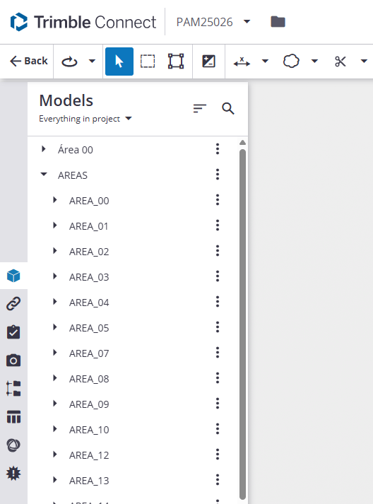
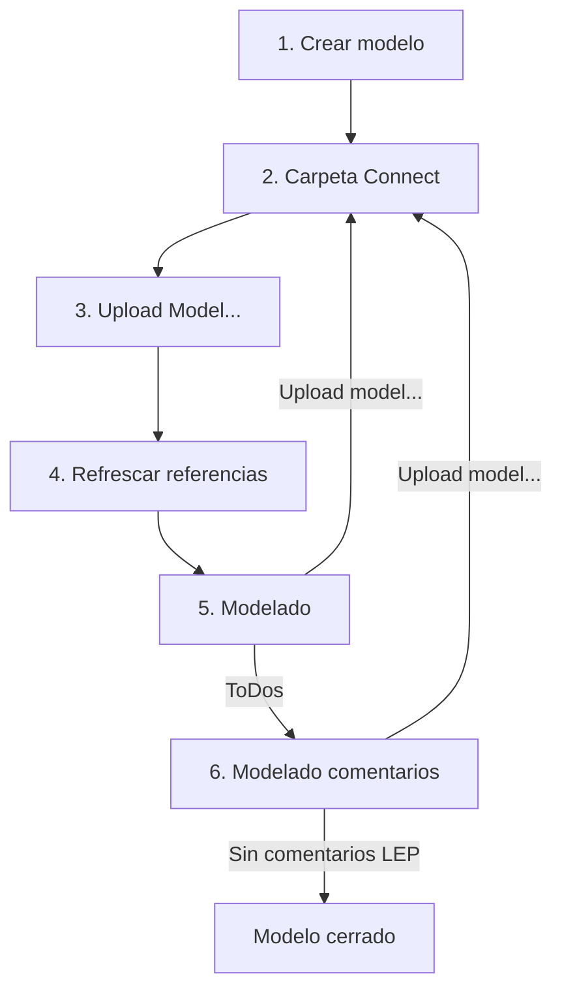
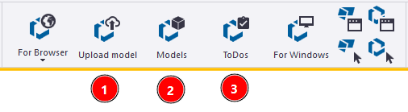
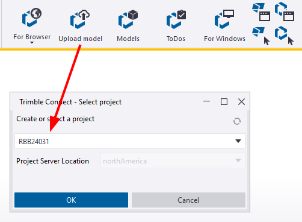
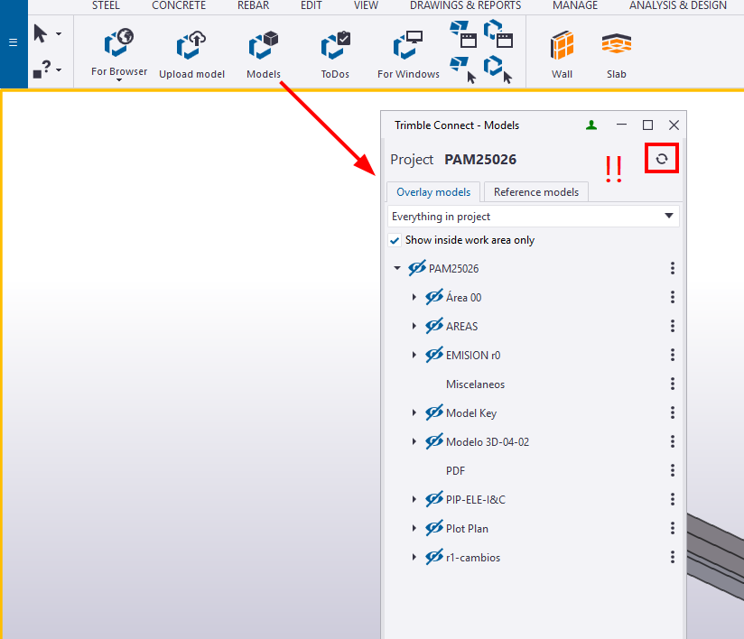
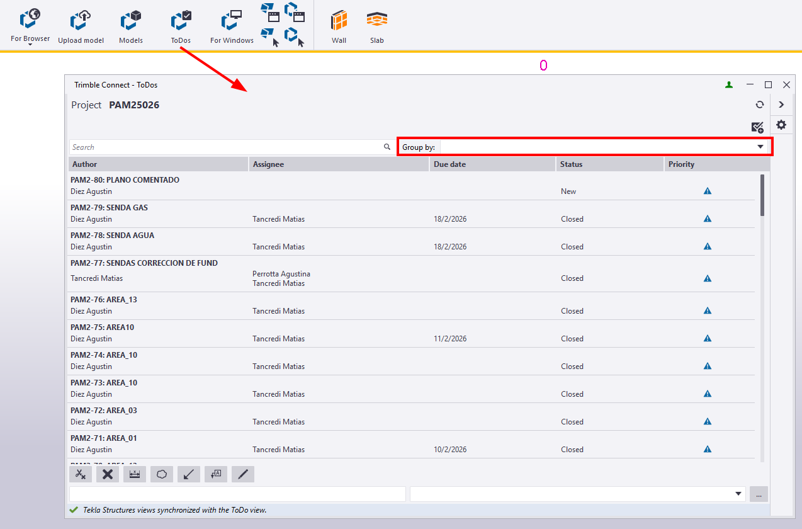
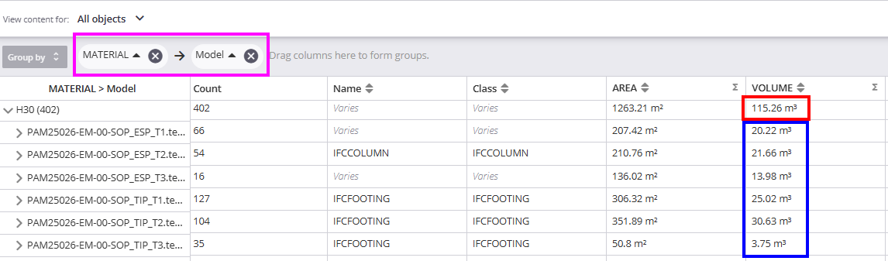

# Trimble Connect - Ejecutor
{: .no_toc }

## Tabla de Contenidos
{: .no_toc .text-delta }

1. TOC
{:toc}

## ¿A qué llamamos ejecutor?

Se entiende por ejecutor a proyectistas/ingenieros que se encarguen de crear un modelo de TEKLA en el marco de un proyecto, sin importar si sea solo para modelado o generar documentación.

## Inicio del proyecto

Iniciado el proyecto, se presupone que ya se cuenta con lo siguiente:

- Cuadros y layouts del proyecto (ver [Un proyecto nuevo...](../proyecto_nuevo/index.md) para indicaciones previas a crear un proyecto).
- Definición de los nombres de los modelos dentro de la disciplina, siguiendo lo indicado en [Modelo 3D - Generalidades](../generalidades/generalidades.md) para la nomenclatura

Confirmados estos dos puntos se deberán crear todos los modelos pertenecientes al proyecto y **solicitar al LEP** que arme la estructura de carpetas del proyecto.

## ¿Donde se suben los modelos?

El administrador de modelos deberá asignar una propiedad avanzada a todos los modelos, indicando a que carpeta debe apuntar el modelo en Connect.

Supongamos esta estructura definida por el LEP


_Figura 1: estructura de carpetas de ejemplo_

Si el modelo que está trabajando el ejecutor pertenece al Area 03, debe ajustarse la siguiente propiedad avanzada con la ruta apuntando a la carpeta deseada:

[XS_CONNECT_UPLOAD_MODEL_FOLDER](https://support.tekla.com/doc/tekla-structures/2024/xs_connect_upload_model_folder)

{: .important}
>Este seteo puede hacerse automaticamente creando un archivo llamado `options.ini`, que deje en la carpeta raíz de cada modelo y que contenga lo siguiente:
>```
>XS_CONNECT_UPLOAD_MODEL_FOLDER = AREAS/AREA_03
>```

## Seguimiento del proyecto

La rutina básica de modelado del proyectista/ingeniero debe seguir lo siguiente del diagrama:


_Figura 2: secuencia esperada en cualquier modelo_

### Panel Trimble Connect


_Figura 3: Ribbon de Connect_ 

Primero se sube el modelo al proyecto que pertenece (1), luego se modela usando las referencias (2), y se visualizan ToDos asociados al modelo (3).

### Upload Model

El primer paso una vez creado el modelo, definida la carpeta a la que debe alojarse en Connect y teniendo los roles definidos dentro del proyecto a nivel permisos, se hace `Upload model` del proyecto a donde corresponda.


_Figura 4: Subir modelo_ 

Una vez subido, se debe hacer Upload **SIEMPRE** antes de guardar y cerrar modelos.

### Referencias Connect

Las referencias del proyecto se pueden visualizar desde `Models`.

{: .important}
> Siempre tocar el botón de Actualizar las referencias cada vez que se las use. **No se hace automáticamente cada vez que abran el modelo y deben forzarlo cada vez**


_Figura 5: Referencias Connect_ 

### ToDos

Los ToDos se pueden agrupar por distintos criterios (puntos abiertos/cerrados, a quien se asigna, la fecha, etc.). Abrirlos en TEKLA cargará todas las referencias asociadas y 


_Figura 6: Puntos o tareas pendientes_ 

## Uso en Connect 

Lo descripto arriba se corresponde con el uso de Connect dentro del TEKLA.

En Trimble Connect, algunas herramientas como ver ToDos o extraer cantidades pueden ser más sencillas de ver en en el explorador.

### Visualización 3D

Entrado en el portal de visualización 3D, se pueden cargar los modelos del proyecto y acceder a características adicionales:

- Organizer
- Data Table
- Clash Tests

Lo relevante para quien ejecute está en el `Data Table`, donde visualiza todas las instancias (objetos) propios del modelo y los valores que toman sus propiedades.


_Figura 7: DataTable en Connect_ 

1. Acceso a la tabla
2. Se selecciona filtro de propiedades creado del proyecto
3. Se pueden agregar o quitar columnas, así como agregar filtros nuevos a indicar en (2).
4. Representación por `Group By`
5. Arrastre de propiedades/columnas para filtrar los objetos.
6. Lupa para buscar palabras o partes de palabras en las propiedades

Debajo tendremos una fila de totales de acuerdo a lo que se seleccione (All Objects/Selected Objects/Visible Objects)

#### Un ejemplo práctico

Supongamos que nos interesa ver el hormigón perteneneciente a layouts de soporte del proyecto y cuánto aporta cada uno.

1. Cargo modelos de soportes.
2. Filtro por Material y luego por volumen
3. Extraigo el desglose


_Figura 8: Ejemplo en DataTable_ 

[← Volver al inicio](index.md)