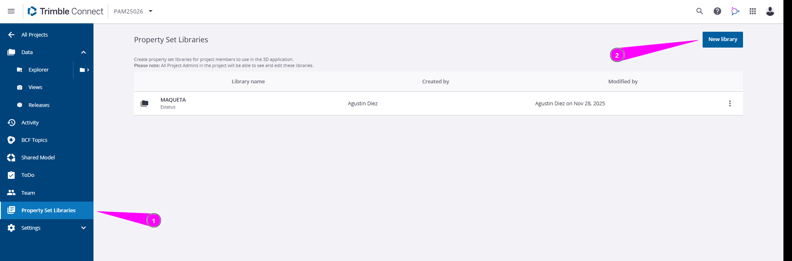
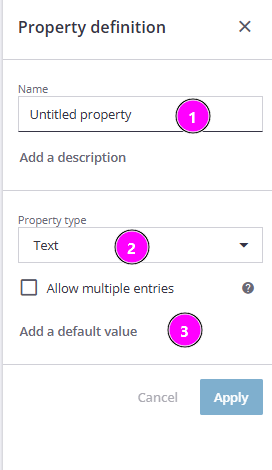
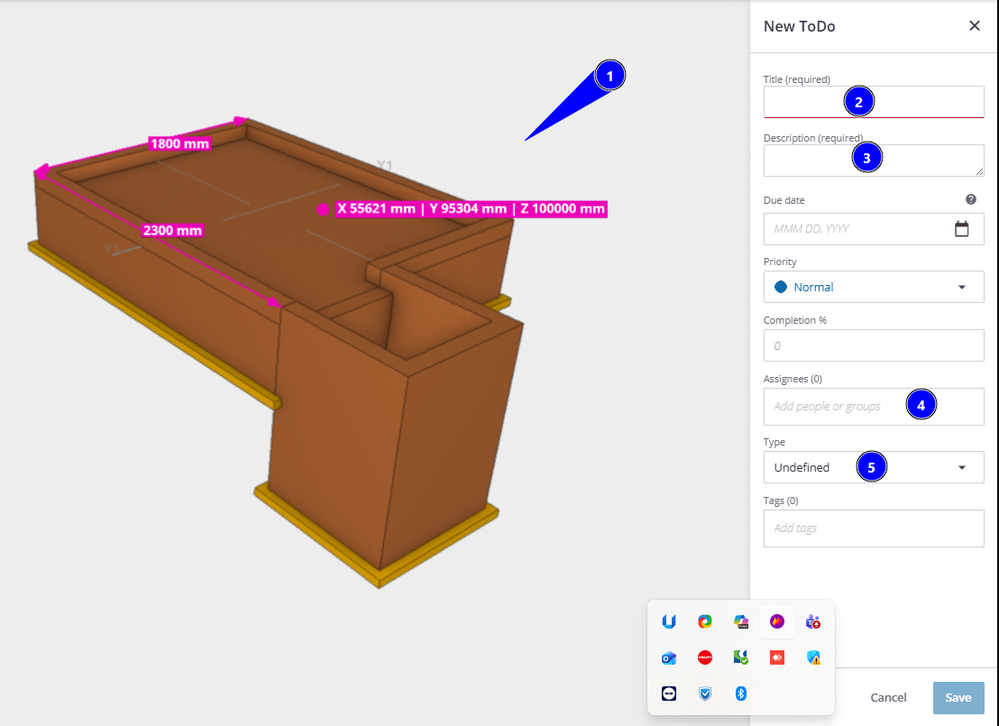
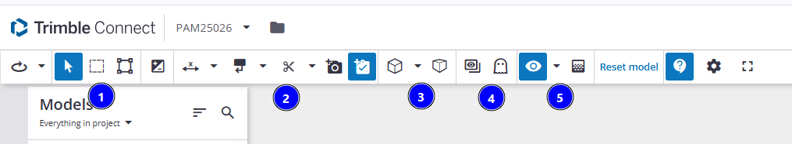
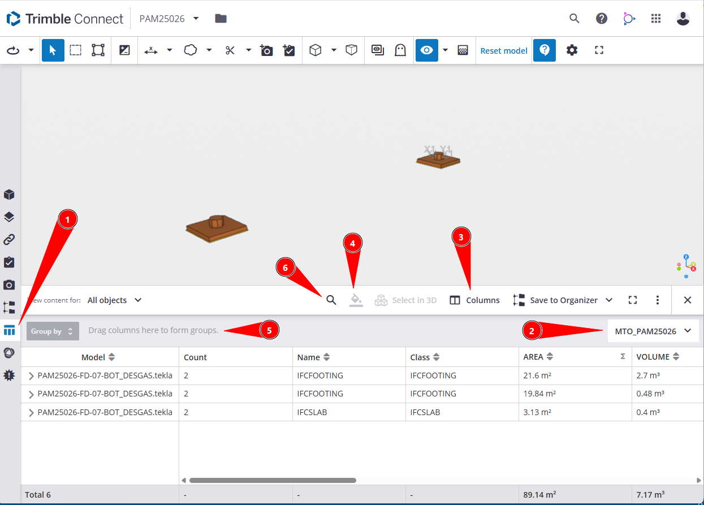

# Trimble Connect - Revisor
{: .no_toc }

## Tabla de Contenidos
{: .no_toc .text-delta }

1. TOC
{:toc}

## ¿A qué llamamos revisor?

Se entiende por revisores a los ingenieros que estén revisando los modelos que componen el proyecto así como el LEP de disciplina, que estará coordinando de una manera macro el proyecto.

## Inicio del proyecto

Iniciado el proyecto, el LEP deberá haber hecho lo siguiente:

- Solicitar cuadros y layouts del proyecto (ver [Un proyecto nuevo...](../proyecto_nuevo/index.md) para indicaciones previas a crear un proyecto).
- Solicitar crear el total de los modelos que compondrán el proyecto con el template del proyecto. La nomenclatura de los modelos debe seguir lo indicado en [Modelo 3D - Generalidades](../generalidades/generalidades.md). 

{: .important}
>A fines de estimar tiempos, lograr esto para 50 modelos no debería llevar más de 2 días de trabajo.

Es responsabilidad del LEP de proyecto las siguientes tareas que se describirán a continuación:

- Definir estructura de carpetas de Connect
- Asignar un responsable que actuará de administrador de modelos. Este rol es necesario en proyectos grandes y tendrá distintas tareas, descriptas debajo.
- Definir atributos requeridos en el modelo. Estos atributos se definen en pos de tener toda la información requerida para un listado de materiales o cualquier cosa adicional que se precise.
- Hacer seguimiento día a día del proyecto, comunicándose con los ejecutores a través de ToDo's, teniendo una especie de _**action tracker 3D**_ del proyecto.
- Manejar las herramientas de Connect con fluidez

Todas estas tareas se describen a continuación en cada apartado.

## 1. Estructura del proyecto

El LEP definirá la estructura de carpetas. Se sugiere la siguiente:

- **AREA_00**: para agrupar todos los modelos asociados a área 00, que en general provienen de otros programas (Civil 3D)
- **AREA_0X**: para agrupar los modelos .tekla por área.
- **AREAS_MAQUETA**: en proyectos grandes es útil subir diariamente los .nwd de cada área. Este proceso se puede automatizar siguiendo lo indicado en [Avanzado - Gestion de Archivos](../avanzado/gestion_archivos.md).
- **Carpetas Hito**: entendemos a todos los .ifc que están atados a determinado hito y que servirán para confeccionar listado de materiales o que serán los modelos que forman parte de un Design Review. Por ejemplo, una carpeta `DR 60%` puede contener todos los .ifc del proyecto que se llevarán a un Design Review del 60%. Otra carpeta podrá llamarse `MTO Rev.A` y representará lo modelado previo a emitir Rev.A de un listado de materiales.

## 2. Administrador de modelos

El LEP debe definir quien será el administrador de modelos. En sus roles se encuentran las siguientes tareas:

- Setear BIM Publisher
- Correr regularmente el Publisher
- Utilizar los archivos asociados a gestión de archivos para hacer dos tareas:
  - Desplazar .ifc del Publisher a modelo federado, siguiendo lo indicado en [Avanzado - Gestion de Archivos](../avanzado/gestion_archivos.md)
  - Tirar en Connect los .nwd que salen del proceso automático referido en [Avanzado - Gestion de Archivos](../avanzado/gestion_archivos.md)
- Gestionar el llenado de cada una de las carpetas descriptas en el [Apartado 1](#1-estructura-del-proyecto)

## 3. Atributos en Connect

El LEP podrá definir atributos adicionales en cada modelo que precise extraer información adicional. A modo de ejemplo, se dejan algunos casos:

- Fireproofing (SI/NO)
- Proveedor
- Estado en obra

### 3.1 Creación de Property Set

_Figura 1: Creación Property Set_ 

1. Se debe crear el Property Set, que será la carpeta que alojará las propiedades
2. Dentro se crean propiedades, en función del tipo de dato.

_Figura 2: Crear propiedad_ 

1. Se publican y luego se opera directamente sobre los modelos para cambiar sus valores.
2. Usando los colores de representación (Ver [Filtros de visualizacion](#filtros-de-visualización)) se puede ver el estado de la propiedad a nivel proyecto.

{: .important}
> Es importante setearle un valor por default (sobre todo para el caso de propiedades del estilo Si/No), para no perder una cantidad de tiempo asignando esa opción a todas las partes.

## 4. Seguimiento de modelos

El LEP tendrá en su responsabilidad hacer seguimiento de los modelos a lo largo del proyecto.

Eso se traduce en visualizar los modelos en Connect, validad que no existan interferencias con otras disciplinas, etc.

Si bien se termina emitiendo un plano, es necesario que el LEP haga seguimiento diario del proyecto a través de los modelos 3D principalmente para atajar cualquier problema que pudiese aparecer, siempre antes de realizar la documentación.

Para ello, se deben hacer uso del gestor de ToDos y de todas las herramientas que provee.

### 4.1 ToDo

Para abrir ToDos, seguir los siguientes pasos:

- Visualizar lo que se vea para el cambio pedido (por ejemplo, si es una interferencia dejar las cosas que se chocan)
- Seleccionar el modelo o parte que se desea corregir 

_Figura 3: Crear ToDo_ 

1. Las anotaciones y cotas y todo lo que se indique queda en el ToDO
2. Titulo (obligatorio)
3. Descripción (obligatorio)
4. Responsable
5. Tipo de pedido (hay varios, en función del comentario que se trate)
6. El resto vale la pena completarlo si se espera un volumen grande de comentarios, para poder filtrarlos más adelante.

### 4.2 Herramientas para revisión

Se describen todas las funciones disponibles para los modelos.

#### Ribbon superior

El ribbon superior cuenta con todas las herramientas que usarán revisores en el Connect. Basta con usarlas un tiempo para familiarizarse con todas.

_Figura 4: Ribbon Superior Connect_ 

1. Herramientas de selección (por objeto, por área, unidades de colada)
2. Las dividimos en:
   1. Herramientas de medición (cotas, niveles)
   2. Herramientas de markup (texto, nubes, mano alzada, etc.)
   3. Recortes de planos (para armar una elevación/vista)
   4. Todo lo que se haga acá puede ser guardado como un ToDO (si interesa compartirlo con quien ejecuta para correcciones) o como una vista guardada (para llevarlo en una reunión con cliente).
3. Herramientas de visualización:
   1. Vista ortogonal/perspectiva
   2. Distintos planos guardados
4. Mostrar todo/Ghost mode (para no seleccionar objetos ocultos).
5. Seleccionar elementos a visualizar y aplicar transparencia.

(4) y (5) se usarán en gran medida para seleccionar los objetos que nos interesará ver en el DataTable. Ver el siguiente apartado.

#### Filtrado de objetos

Para esto se usará el DataTable, que nos permitirá filtrar los objetos. 

Lo relevante para quien ejecute está en el `Data Table`, donde visualiza todas las instancias (objetos) propios del modelo y los valores que toman sus propiedades.

_Figura 5: DataTable en Connect_ 

1. Acceso a la tabla
2. Se selecciona filtro de propiedades creado del proyecto
3. Se pueden agregar o quitar columnas, así como agregar filtros nuevos a indicar en (2).
4. Representación por `Group By`. **Esto es importante para visualizar que se esté modelando correctamente**. Por ejemplo, si se pinta por material, todo lo que es F24 o H30/H15 debemos verlo con los mismos colores donde corresponda.
5. Arrastre de propiedades/columnas para filtrar los objetos.
6. Lupa para buscar palabras o partes de palabras en las propiedades

Debajo tendremos una fila de totales de acuerdo a lo que se seleccione (All Objects/Selected Objects/Visible Objects)

### 5. Atributos adicionales

Si se necesitan atributos adicionales hay dos caminos:

1. Se agregan como [Property Set](#31-creación-de-property-set) dentro del proyecto de Connect
2. Se agregan con el preset de propiedades del .ifc definido para el proyecto. Ver [Propiedades Preset](../proyecto_nuevo/preset_propiedades.md). Si este es el caso, esos atributos se ven sobre los .ifc y no sobre los .tekla, por lo que deberán exportarse.

### 6. Data Table

Los atributos que muestra el DataTable son fijos para los modelos .tekla que se suben al servidor.

En caso de utilizarse .ifc, todos los atributos definiddos en el preset de propiedades estarán disponibles. Ver [Propiedades Preset](../proyecto_nuevo/preset_propiedades.md) para crearlo.

Las propiedades de la tabla pueden exportarse a archivos `.csv`, para trabajarlos en Excel o usando Python o con cualquier herramienta para procesarlos.

---

[← Volver al inicio](index.md)