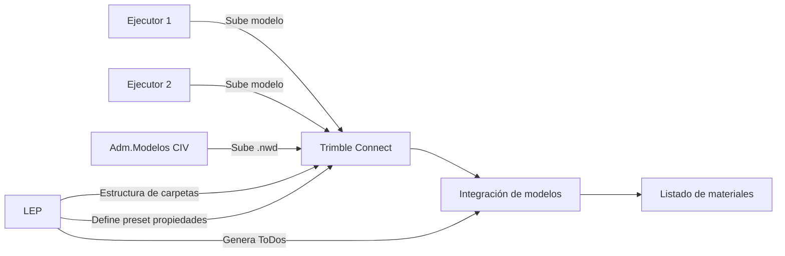

# Trimble Connect - Generalidades
{: .no_toc }

## Tabla de Contenidos
{: .no_toc .text-delta }

1. TOC
{:toc}

## ¿Qué es Trimble Connect?

Trimble Connect es una **plataforma de colaboración en la nube** diseñada para la gestión de proyectos usando Tekla Structures. Permite centralizar modelos BIM, documentos, incidencias y comunicación del equipo en un único entorno accesible desde cualquier dispositivo. 

Se accede desde [web.connect.trimble.com](https://web.connect.trimble.com/)

### Características Clave

- **Almacenamiento en la nube** para modelos 3D (IFC, SKP, DWG, Revit, Tekla)
- **Visualización federada** de múltiples modelos
- **Gestión de incidencias (ToDos)** vinculadas a ubicaciones 3D. Ver [Trimble Connect - Revisor](./connect-revisor.md) para indicaciones de como crearlos.
- **Control de versiones** automático de archivos. Ver [Trimble Connect - Ejecutor](./connect-ejecutor.md) para detalle.
- **Acceso multiplataforma**: web, desktop, móvil (iOS/Android)

---

## Apartados Principales

Hay principalmente cuatro grandes cosas que podemos subir a los proyectos de Trimble Connect. Se describe cada uno a continuación, y tanto quienes ejecutan como quienes revisan tienen incidencia sobre cada uno de ellos, con un nivel distinto de profundidad.

### 1. **Projects (Proyectos)**

Contenedor principal que organiza toda la información del proyecto. Allí encontraremos distintas cosas.
```
Proyecto PAM25026/
├── Modelos             # Modelos cargados
├── Archivos            # Documentos (PDF, Excel, etc.)
├── ToDos               # Tareas
└── Usuarios            # Otorgamiento de permisos
```

**Funciones del LEP:**
- Crear y gestionar proyectos
- Configurar estructura de carpetas. Ver [Trimble Connect - Revisor](./connect-revisor.md)
- Gestionar permisos por rol (Admin, Contributor, Viewer)

### 2. **Modelos (Modelos 3D)**

Visor federado de modelos BIM:

- **Carga automática**: Detecta cambios en archivos sincronizados y notifica
- **Clash Detection**: Detección de interferencias
- **Mediciones**: Herramientas de medición directa en 3D
- **Cortes**: Podemos hacer cortes sobre los modelos
- **Viewpoints**: Guardar capturas para reuniones

**Formatos Soportados:**
- IFC (todas las versiones)
- **Tekla Structures (.tekla)** -> Este formato será el que más utilizaremos
- Revit (.rvt)
- SketchUp (.skp)
- AutoCAD (.dwg, .dxf)

### 3. **Files (Documentos)**

Connect permite subir documentación en PDF y cuenta con un visor y posibilidad de hacer comentarios sobre el mismo.

- Planos en PDF

**Características:**
- Versionado automático (mantiene historial)
- Posibilidad de hacer comentarios y asignar un ToDo

### 4. **ToDos (Tareas/Incidencias)**

Sistema de seguimiento de problemas vinculado a modelos 3D:


**Flujo de Trabajo:**
1. Detectar problema en modelo 3D
2. Crear ToDo con viewpoint asociado
3. Asignar responsable
4. Actualizar estado (Abierto → En Progreso → Cerrado)
5. Generar reportes de seguimiento exportando los ToDo


## Casos de Uso

### Coordinación BIM en Connect


**Proceso:**
1. Cada ejecutar sube sus modelos al proyecto
2. Trimble Connect tiene una estructura ya predefinida de carpetas
3. Se nuclean los modelos y se integran
4. Aparecen comentarios e idas y vueltas con los ejecutores
5. Listado de materiales

Para entender cada una de las tareas descriptas y responsabilidades en cada caso, revisar [Connect - Ejecutor](./connect-ejecutor.md) y [Connect - Revisor](./connect-revisor.md).


---

[← Volver al inicio](index.md)