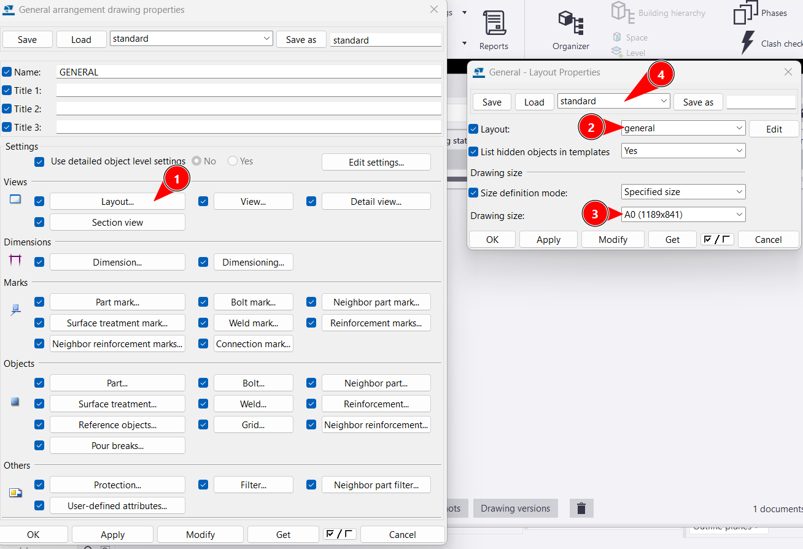
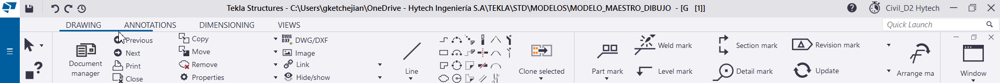
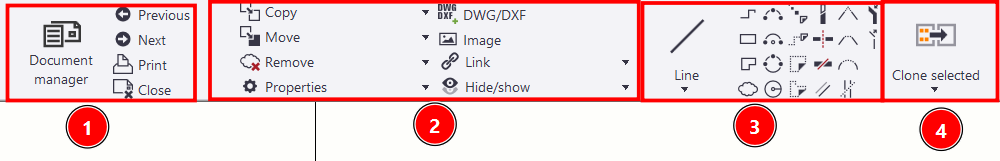
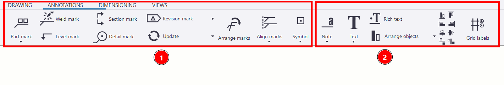
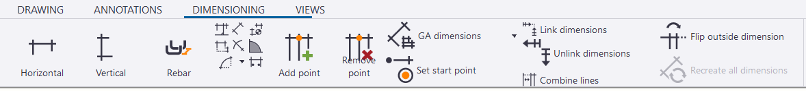
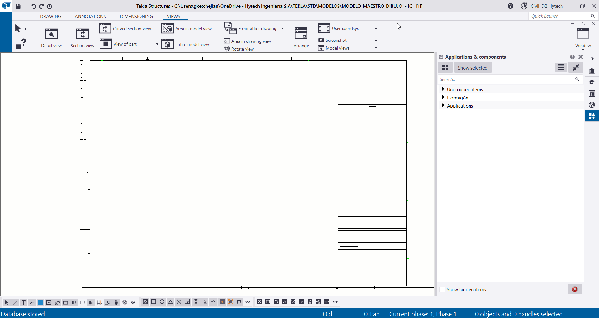

## Tabla de Contenidos
{: .no_toc .text-delta }

1. TOC
{:toc}

# Configuración inicial
{: .no_toc }

Desde el model para crear un dibujo debe dirigirse al "DOCUMENT MANAGER", y luego haciendo click en el apartado de "Create GA drawing" se creará la hoja.

Tanto desde el "Document Manager" como dentro del modo dibujo se puede acceder a las propiedades del documento, para empezar la configuración. 

Dentro del panel de propiedades puede optarse por seleccionar propiedades pre-configuradas dentro del menú desplegable, siendo conveniente elegir las llamadas "HYT-GENERAL" y a partir de ahí configurar las distintas opciones que ofrece el panel.

También debe completarse los campos de Name; Title 1, Title 2; Title 3; si en el Template que se utiliza esos campos definen algún parámetro dentro del rótulo.

### Views

una de las primeras opciones es el apartado de Views, donde puede configurarse en la celda de Layout (1), el template con el rótulo que se quiere utilizar (2), y definir el tamaño de hoja que se desea (3). También puede optarse por usar alguna pre-configuración de template+tamaño de hoja (4), que puede estar definida por cada proyecto.

También dentro del apartado "views" puede configurarse la escala que se quiere dejar configurada para cada una de las vistas que se creen, esto sujeto a que cada escala al momento del dibujo pueda modificarse a la escala que se desee, partiendo de la que se asigné en esta instancia.

---

## Descripción del modo dibujo

Una vez ya creado un dibujo nuevo (ver apartado configuración inicial), se tiene en el panel de navegación superior 4 opciones de configuración con distintas utilidades.

en el primer apartado "Drawing" se encuentra:

- El Document Manager, la opción de avanzar y retroceder entre dibujos, imprimir la hoja y cerrar el modo dibujo (1).
- Edición de vistas y propiedades de los objetos dentro de las mismas, importar/exportar dwg, imagenes (2).
- herramientas de dibujo lineales (3).
- Clonar seleccionado (4).

En el apartado "Annotations" se encuentran distintas marcas (1), como las "part marks" utilizadas en estructura metálica y armaduras, marcas de soldadura, niveles, revisión, etc. También como útil encontramos la opción de poner símbolos ya pre-configurados. 
Luego encontramos las opciones de escritura (2).

>Aclaración: no solemos usar la marca de sección ni la marca de detalle por el hecho de que se usa en el apartado views.

En el apartado "Dimensioning" se utiliza principalmente la acotación Horizontal, Vertical, y de vez en cuanto la angular. Algo útil a tener en cuenta es que al seleccionar las teclas (Ctrl+F) se puede hacer una acotación con el sentido que se desee, y al seleccionar (Ctrl+G) se puede realizar una acotación ortogonal.

Por último el apartado de Views nos permite trasladar a nuestro dibujo los elementos de modelo que deseamos representar. Para lograr esto, dentro del modo dibujo, debemos en primer lugar trasladarnos desde la pestaña "Window" a donde se encuentren las vistas que hayamos dejado preparadas en el Model. 

Una vez allí si utilizamos las herramientas de vista (Area en vista modelo), y también en base a una vista puede generarse otras más (secciones, detalles).

### Document Manager

El document manager almacena los diferentes dibujos que se fueron creando, además de los documentos que se generaron en base a estos. Dentro de estos se pueden ver las celdas con la información de cada dibujo, con sus propiedades y atributos definidos por el usuario, fecha de creación, etc.
Puede filtrarse para únicamente ver los dibujos (GA drawings)(3), los archivos (pdf)(2), o todo en su conjunto (1). También pueden visualizarse las versiones anteriores de los dibujos (4).

descripción 

Ribbon 

!¨[gesdrgdg](../hormigon/elementos.md#objeto-y-alcance)

*Figura 1: foto de prueba*

| Atributo | Descripción | Valor Ejemplo |
|----------|-------------|---------------|
| **Name** | Identificador del elemento | `BA` |
| **Profile** | Base y altura del elemento | `700*400` |
| **Material** | Material del elemento | `H30` |
| **Class** | Clase del elemento  | `8` |
| **Position** | Desplazamiento del elemento  | `-100` |
| **IFC export** | Config. de exportación | - |
| **User field / UDAS** | Atributos del elementos  | - |
| **Alto** | Alto del elemento |`400` |

**negrita**

1. prtkjiewr
    1. plokertype
        1. r,elpkmye

`all models` slt 96

  {: .note}
>Suele ser la función mas utilizada para modelar cualquier fundación independientemente de la forma

### Colocar un layout en el dibujo

### Descripción generlaz del ribbon
---
## Atributos del documento

## Creacion de vistas

Derivá a vistas_dibujo

### DOCUMENT MANAGER

dentro de model y modo dibujo

[← Volver al inicio](index.md)