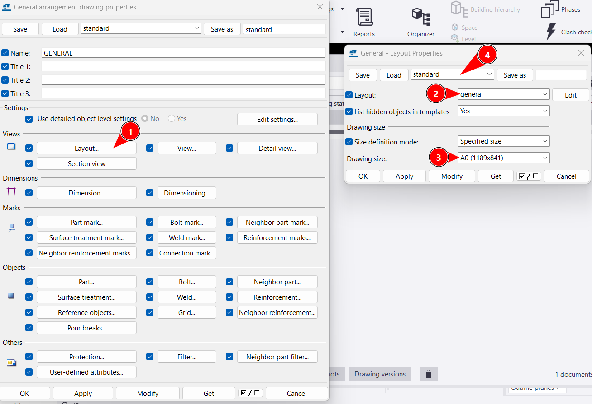
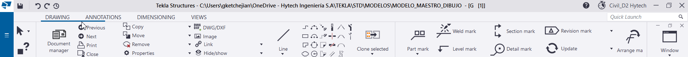
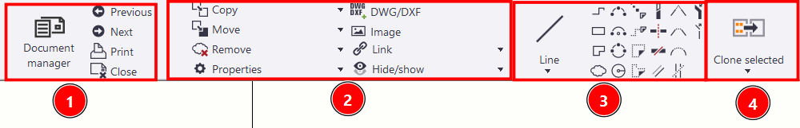
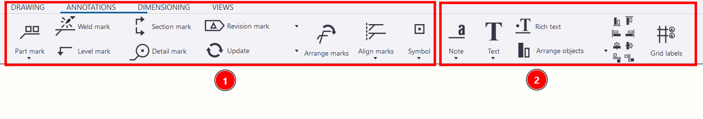
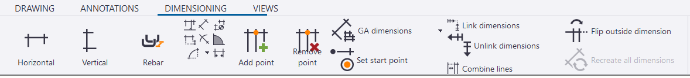

## Modo dibujo - General
{: .no_toc }

## Tabla de Contenidos
{: .no_toc .text-delta }

1. TOC
{:toc}

## Crear nuevo GA drawing 

Desde el model para crear un dibujo debe dirigirse al ["Document Manager"](generalidades_dibujo.md#document-manager), y luego haciendo click en el apartado de "Create GA drawing" se creará la hoja.

*Figura 1: Crear nuevo dibujo*

Tanto desde el ["Document Manager"](generalidades_dibujo.md#document-manager) como dentro del modo dibujo se puede acceder a las propiedades del documento, para empezar la configuración. 

## Propiedades de GA drawing

Dentro del panel de propiedades puede optarse por seleccionar propiedades preconfiguradas dentro del menú desplegable, siendo conveniente elegir las llamadas "HYT-GENERAL" y a partir de ahí configurar las distintas opciones que ofrece el panel.

También deben completarse los campos de Name; Title 1, Title 2; Title 3; si en el Template que se utilizan esos campos definen algún parámetro dentro del rótulo.

### Layout

- Dentro del apartado de "Views" puede configurarse en la celda de "Layout" (1), la disposición que tendrá nuestro dibujo.
- En (2) tenemos las disposiciones que se fueron creando en cada proyecto, pudiendo ser modificadas clickeando el botón `Edit` e ingresando a el ["Layout editor"](generalidades_dibujo.md#layout-editor).
- y definir el tamaño de hoja que se desea (3),
- También puede optarse por usar alguna pre-configuración de template+tamaño de hoja (4), que puede estar definida por cada proyecto,

{: .note}
> También dentro del apartado "Views" puede configurarse la escala que se quiere dejar configurada para cada una de las vistas que se creen, esto sujeto a que cada escala al momento del dibujo pueda modificarse a la que se desee, partiendo de la que se asigne en esta instancia.

{: .warning}
> El resto de las propiedades, aunque el programa permite editar las propiedades de "Dimensions", "Marks", "Objects", "Others", es preferible modificarlas individualmente a medida que se va avanzando en un modelo.

#### Layout editor

---

## Descripción del modo dibujo

Una vez ya creado un dibujo nuevo (ver apartado [configuración inicial](../dibujo/generalidades_dibujo.md#modo-dibujo---general)), se tiene en el panel de navegación superior 4 opciones de configuración con distintas utilidades.

en el primer apartado "Drawing" se encuentra:

- El Document Manager, la opción de avanzar y retroceder entre dibujos, imprimir la hoja y cerrar el modo dibujo (1).
- Edición de vistas y propiedades de los objetos dentro de las mismas, importar/exportar dwg, imagenes (2).
- herramientas de dibujo lineales (3).
- Clonar seleccionado (4).

En el apartado "Annotations" se encuentran distintas marcas (1), como las ["part marks"](./marcas_simbolos_notas.md#part-mark) utilizadas en estructura metálica y armaduras, [marcas de soldadura](./marcas_simbolos_notas.md#weld-mark), [niveles](./marcas_simbolos_notas.md#level-mark), [revisión](./marcas_simbolos_notas.md#revision-mark), etc. También como útil encontramos la opción de poner [símbolos](./marcas_simbolos_notas.md#simbolos) ya pre-configurados. 
Luego encontramos las opciones de [escritura](./marcas_simbolos_notas.md#textos) (2).

{: .warning}
>No solemos usar la marca de sección ni la marca de detalle por el hecho de que se usa en el apartado views.

En el apartado ["Dimensioning"](./marcas_simbolos_notas.md#cotas) se utiliza principalmente la acotación horizontal, vertical, y de vez en cuanto la angular. 

{: .highlight}
> Algo útil a tener en cuenta es que al seleccionar las teclas (Ctrl+F) se puede hacer una acotación libre, y al seleccionar (Ctrl+G) se puede realizar una acotación ortogonal.

Por último el apartado de ["Views"](generalidades_dibujo.md#views) nos permite trasladar a nuestro dibujo los elementos de modelo que deseamos representar. Solemos usar mas el ["Detail view"](./vistas_dibujo.md#detail-view), ["Section view"](./vistas_dibujo.md#section-view), ["Area in model view"](./vistas_dibujo.md#area-in-model-view), ["Entire model view"](./vistas_dibujo.md#entire-model-view), ["Area in drawing view"](./vistas_dibujo.md#area-in-drawing-view), etc.

### Document Manager

El document manager almacena los diferentes dibujos que se fueron creando, además de los documentos que se generaron en base a estos. Dentro de estos se pueden ver las celdas con la información de cada dibujo, con sus propiedades y atributos definidos por el usuario, fecha de creación, etc.

- Puede filtrarse para únicamente ver los dibujos (GA drawings)(3), los archivos (pdf)(2), o todo en su conjunto (1). 
- Pueden visualizarse las versiones anteriores de los dibujos desde (4).

#### Crear revision 

descripción 

### Panel lateral

#### Libreria 2d

#### Instructor

#### Drawing content manager

#### Tekla online

#### Applications & components

### Barra de herramientas inferior

### Barra de estado

### Menú (Panel lateral izquierdo)

### Significado de simbolos en atributos de textos/notas...

### 

[← Volver al inicio](index.md)