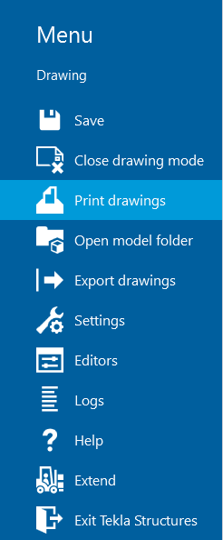

## Modo dibujo - General
{: .no_toc }

## Tabla de Contenidos
{: .no_toc .text-delta }

1. TOC
{:toc}

## Crear nuevo GA drawing 

Desde el "model" para crear un dibujo nuevo debemos dirigirnos al ["Document Manager"](generalidades_dibujo.md#document-manager), y luego haciendo click en el apartado de "Create GA drawing" se creará la hoja.

*Figura 1: Crear nuevo dibujo*.

Tanto desde el ["Document Manager"](generalidades_dibujo.md#document-manager) como dentro del modo dibujo se puede acceder a las propiedades del documento, para empezar la configuración. 

*Figura 2: Acceder a las [propiedades del dibujo](generalidades_dibujo.md#propiedades-de-ga-drawing)*.

También desde el Ribbon del model podremos acceder a:

- En `(1)` podremos acceder a las [Propiedades de GA drawing](generalidades_dibujo.md#propiedades-de-ga-drawing) y al ["Layout editor"](../reportes/cuadro_rotulo.md).

- En `(2)` podremos ingresar al `Master drawing catalog` y podremos crear un dibujo en base a alguna vista que tengamos:
    - El `Master drawing catalog` permite crear dibujos en base a un "dibujo maestro", donde los nuevos dibujos serán igual a este. En nuestro caso en la empresa nos basamos en:
    
    si tocamos click derecho aquí podremos crear un nuevo dibujo.

        > No se explaya mucho esta herramienta ya que no suele usarse, forma parte más de la configuración inicial del programa.

    - En `GA drawing` tendremos el siguiente panel:
    
    En `(1)` tendremos las vistas de modelo que podremos elegir que aparezcan en nuestro dibujo y en `(2)` si colocar las vistas seleccionadas o todas las que hayan, además de que podremos editar las [Propiedades de GA drawing](generalidades_dibujo.md#propiedades-de-ga-drawing). Seleccionamos si queremos abrir el dibujo o no y clickeamos en `Create`. 

## Propiedades de GA drawing

Dentro del panel de propiedades puede optarse por seleccionar propiedades preconfiguradas dentro del menú desplegable, siendo conveniente elegir las llamadas "HYT-GENERAL" y a partir de ahí configurar las distintas opciones que ofrece el panel.

*Figura 3: Panel de propiedades GA drawing*.

{: .note}
> También deben completarse los campos de Name; Title 1, Title 2; Title 3; si en el Template que se utiliza esos campos definen algún parámetro dentro del rótulo.

### Layout

*Figura 4: Layout dentro del panel de propiedades*.

- Dentro del apartado de "Views" puede configurarse en la celda de "Layout" `(1)`, la disposición que tendrá nuestro dibujo.
- En `(2)` tenemos las disposiciones que se fueron creando en cada proyecto, pudiendo ser modificadas clickeando el botón `Edit` e ingresando al ["Layout editor"](../reportes/cuadro_rotulo.md).
- y definir el tamaño de hoja que se desea `(3)`,
- También puede optarse por usar alguna pre-configuración de template+tamaño de hoja `(4)`, que puede estar definida por cada proyecto,

{: .note}
> También dentro del apartado "Views" puede configurarse la escala que se quiere dejar configurada para cada una de las vistas que se creen, esto sujeto a que cada escala al momento del dibujo pueda modificarse a la que se desee, partiendo de la que se asigne en esta instancia.

{: .warning}
> El resto de las propiedades, aunque el programa permite editar "Dimensions", "Marks", "Objects", "Others", es preferible modificarlas individualmente a medida que se va avanzando en el dibujo.

---

## Descripción del modo dibujo

Una vez ya creado un dibujo nuevo (ver apartado [configuración inicial](../dibujo/generalidades_dibujo.md#modo-dibujo---general)), se tiene en el panel de navegación superior 4 opciones de configuración con distintas utilidades.

*Figura 5: Paneo Ribbon modo dibujo*.

en el primer apartado "Drawing" se encuentra:

- El Document Manager, la opción de avanzar y retroceder entre dibujos, imprimir la hoja y cerrar el modo dibujo `(1)`.
- Edición de vistas y propiedades de los objetos dentro de las mismas, importar/exportar dwg, imagenes `(2)`.
- herramientas de dibujo lineales `(3)`.
- Clonar seleccionado `(4)`.

En el apartado "Annotations" se encuentran distintas marcas `(1)`, como las ["part marks"](./marcas_simbolos_notas.md#part-mark) utilizadas en estructura metálica y armaduras, [marcas de soldadura](./marcas_simbolos_notas.md#weld-mark), [niveles](./marcas_simbolos_notas.md#level-mark), [revisión](./marcas_simbolos_notas.md#revision-mark), etc. También como útil encontramos la opción de poner [símbolos](./marcas_simbolos_notas.md#simbolos) ya pre-configurados. 
Luego encontramos las opciones de [escritura](./marcas_simbolos_notas.md#textos)`(2)`.

{: .warning}
>No solemos usar la marca de sección ni la marca de detalle por el hecho de que se usa en el apartado views.

En el apartado ["Dimensioning"](./marcas_simbolos_notas.md#cotas) se utiliza principalmente la acotación horizontal, vertical, y de vez en cuanto la angular. 

{: .highlight}
> Algo útil a tener en cuenta es que al seleccionar las teclas (Ctrl+F) se puede hacer una acotación libre, y al seleccionar (Ctrl+G) se puede realizar una acotación ortogonal.

Por último el apartado de ["Views"](generalidades_dibujo.md#views) nos permite trasladar a nuestro dibujo los elementos de modelo que deseamos representar. Solemos usar mas el ["Detail view"](./vistas_dibujo.md#detail-view), ["Section view"](./vistas_dibujo.md#section-view), ["Area in model view"](./vistas_dibujo.md#area-in-model-view), ["Entire model view"](./vistas_dibujo.md#entire-model-view), ["Area in drawing view"](./vistas_dibujo.md#area-in-drawing-view), etc.

### Document Manager

El document manager almacena los diferentes dibujos que se fueron creando, además de los documentos que se generaron en base a estos. Dentro de estos se pueden ver las celdas con la información de cada dibujo, con sus propiedades y atributos definidos por el usuario, fecha de creación, etc.

*Figura 6: Document manager*.

- Puede filtrarse para únicamente ver los dibujos (GA drawings)`(3)`, los archivos (pdf)`(2)`, o todo en su conjunto `(1)`. 
- Pueden visualizarse las versiones anteriores de los dibujos desde `(4)`.

*Figura 7: Properties GA drawing*.

Debtro de las propiedades que pueden modificarse de un GA drawing se encuentran:
- **User-defined attributes**: son parámetros que completa la persona que realiza el dibujo. Suelen tener que completarse según los atributos que se necesiten dentro del cuadro que haya que completar. Los valores disponibles para completar son los siguientes:

Para entender la dinámica de en donde se verán reflejados estos valores se recomienda leer tanto la explicación del ["Editor de cuadros"](../reportes/editor_cuadros.md), como la del ["Layout editor"](../reportes/cuadro_rotulo.md).

- **Revisión**: Este parámetro se verá reflejado en los cuadros dentro del "Layout editor" donde se indique en que revisión se está trabajando, además también en las [Revisión marks](../dibujo/marcas_simbolos_notas.md#revision-mark).

    
    - En `(1)` tendremos guardados la configuración con los valores que suelen utilizarse en la empresa dentro de los rótulos.
    - En `(2)` colocaremos la revisión que estemos trabajando, puede ser A,0,1,etc.
    - En `(3)` indicaremos las personas que formaron parte del proceso del documento, siendo que `Created by` representa a quién hace el plano, en `Checked by` es quién revisa el plano (LEP) y en `Approved by` irá el lider del proyecto.
    - En `(4)` colocaremos la fecha en que cada participante realizó su tarea (para fines del rótulo con completar solo la primer casilla es suficiente).
    - En `(5)` se coloca el tipo de emisión que corresponda, por ejemplo si en `(2)` tenemos el valor "A", entonces aquí irá "Emisión para aprobación", si tenemos "0" es "Emisión para construcción", y así sucesivamente según lo que indique el LEP.

    En el siguiente ejemplo vemos aplicado cada parámetro según la imagen anterior:

    

Una vez completados los valores que se requieran, hay que seleccionar el botón `Create`. Luego aparecerá la última revisión que creamos y en caso de crear otra, aparecerá esta nueva pero la otra seguirá existiendo.

*Figura 8: Ejemplo de crear revisión*.

- **Copy drawing views/with layout**: Permite copiar un dibujo que se encuentra en un "GA Drawing" en otro, además de poderse hacer con o sin el layout.

    

- **Lock**: Sirve para marcar que un dibujo no está disponible para su edición. Se coloca `On` o `Off`.

- **Freeze**: Sirve para que la inteligencia del dibujo se pause. Si se hace alguna modificación en el model, se modificarán los elementos en las vistas del dibujo pero no las marcas, cotas, etc.

- **Ready for issuing**: Es para marcar cuando un dibujo está listo para su emisión. Si se modifica algo en el model también se modificará aquí.

- **Issue**: Marcar como emitido un plano.

- **Manual category**: Podremos crear categorías para diferenciar nuestros planos.

    
    - Podremos ponerle un nombre para identificarlo y otras propiedades, luego tocamos en `Save`. Para agregar a un dibujo a una categoria tocamos `Manual category`-> `Add to` -> `Nombre de la categoria que creamos`.
    

Las propiedades que permiten modificarse del GA drawing desde el modo dibujo (las que vimos más arriba), no son las mismas que las que pueden modificarse desde el model, ya que aquí las opciones serán las siguientes:

*Figura 9: Porpiedades GA drawing desde el modo dibujo*.

Se agregan:

- **Update marks**: Se utiliza para actualizar marcas de un dibujo.

- **Recreate**: Sirve para recrear el dibujo en caso de haber realizado algún ajuste que no se vea reflejado en el mismo. Para evitar que suceda automaticamente puede usarse "Freeze".

- **Print**: Se usa para [imprimir](impresion_exportacion.md#print-drawings-pdf) el dibujo.

- **Export**: Se usa para [exportar](impresion_exportacion.md#export-drawings-dwg) nuestro dibujo a formato DWG/DXF.

- **Copy rows to Clipboard**: Sirve para copiar las propiedades del documento en el portapepeles, y puede pegarse luego en otros programas como Excel.

- **Select all**: Se usa para seleccionar todos los elementos que hayan en el document manager (según si se está en "All documents", "All files", etc.)

- **Add to Master drawing catalog**: Puede añadirse ese drawing al [Master drawing catalog](generalidades_dibujo.md#crear-nuevo-ga-drawing).

- **Copy to new sheet**: Se copia nuestro drawing a uno nuevo con las mismas características. Temporalmente aparecerá como "Drawing was cloned".

- **Delete**: Sirve para eliminar un drawing.

### Panel lateral derecho: 
Dentro de este panel tenemos 5 herramientas útiles:

*Figura 10: Paneo panel lateral derecho*.

#### Libreria 2d
La imagen que la representa es:  y sirve para seleccionar rápidamente objetos en cualquier dibujo y guardarlos como detalles de dibujo 2D. Puede insertar detalles en las vistas de dibujo y en los dibujos en cualquier modelo. Puede crear detalles a partir de muchos tipos de objetos de dibujo, tales como partes, textos, notas, objetos de esquema de dibujo o archivos DWG. Además de los detalles, puede buscar e insertar archivos DWG e imágenes directamente en sus dibujos desde la Biblioteca 2D Dibujo.

Para utilizarlo, en `(1)` podremos crear una carpeta que se guardará en una ruta local de nuestro modelo `(3)`:
 
donde podremos subir archivos en ".dwg" y estos aparecerán para poder colocarlos como dibujos en nuestro plano.
Con `(2)` podremos añadir como detalle a una parte del dibujo que hayamos creado, perderá suspropiedades y pasará a ser como una imagen que podremos usar en otros modelos.

*Figura 11: `Libreria 2D` ejemplo*.

#### Instructor
El objetivo principal del instructor es que en base a alguna herramienta que se seleccione, brindar apoyo en el modo de uso de la misma. Funciona principalmente para herramientas del [ribbon](generalidades_dibujo.md#descripción-del-modo-dibujo).

*Figura 12: ejemplo `Instructor`*

> Puede modificarse el idioma en la parte inferior en `Select language`.

#### Drawing content manager
Se usa para tener un control de los elementos que están en nuestras vistas de dibujo, y evaluar si no falta alguno de los elementos.

*Figura 13: ejemplo `Content manager`*

#### Tekla online

Sirve para acceder a los servicios que ofrece el programa, como pueden ser:
- La ayuda en el uso de alguna herramienta en particular con el [Trimble User assistance](https://support.tekla.com/es?utm_source=prod-tekla-structures&utm_medium=feat-sidepane) (Aunque se recomienda también acceder a la [IA](https://assistant.tekla.com/?product=Tekla%2520Structures&version=2026&language=en-us) que ofrece el programa). 
- También se puede acceder a foros donde las personas consultan sobre inconvenientes o dificultades que fueron teniendo a lo largo del uso del programa desde el [Tekla Discussion Forum](https://forum.tekla.com/?utm_source=prod-tekla-structures&utm_medium=feat-sidepane). 
- Luego podemos contactar al [soporte](https://support.tekla.com/es/contact-us?type_of_request=support&common_regarding=installed_product&common_installed_product=1&common_product_version=2022#no-back) si hay algún error en el programa que no podamos resolver.
- También podremos acceder a [Tekla Warehouse](https://warehouse.tekla.com/) en caso de querer instalar algún componente del modo dibujo (como por ejemplo el [Excel to Drawing](elementos_graficos.md#excel--plugin)).
- Por último tenemos las `Latest help updates` donde suben las últimas actualizaciones de soporte que van surgiendo.

*Figura 14: paneo `Tekla online`*

> Puede modificarse el idioma en la parte superior en `Select language`.

#### Applications & components

Aquí estarán almacenados todos los componentes que podremos utilizar en el modo dibujo. Algunos vienen incluidos con la descarga del programa, mientras que los que descarguemos desde el [Tekla Warehouse](https://warehouse.tekla.com/) se verán también aquí. Como ejemplo se encuentra el [Excel to Drawing](elementos_graficos.md#excel--plugin) o el [Rebar group marking](marcas_simbolos_notas.md#utilizando-un-componente).

*Figura 15: paneo `Applications & components`*

### Barra de herramientas inferior

- En `(1)` podremos elegir que elementos de dibujo podrán ser o no seleccionados, además de poder agregar un filtro de selección desde aquí.
- En `(2)` elegiremos los "Snaps" que queremos utilizar al dibujar, como el "Intersection points", el "Mid points", etc.
- En `(3)` podemos elegir algún Snap temporal, por ejemplo si no tuviese seleccionado el "Mid point" pero necesito en un lugar ese punto hago click primero en la herramienta que voy a poner en el punto y luego en 

*Figura 16: Ejemplo de uso de "snap" temporal*

### Barra de estado

- `(1)`: sirve para guiar en el uso de las distintas herramientas del programa. 

    Te puede decir por ejemplo que hagas un click en algún lugar , y luego que hagas otro según la herramienta que esté en uso. 

- `(2)`: nos avisa si tenemos activa la ortogonalidad de las lineas (clickeando con la letra `O`).

- `(3)`: clickeando `Mayús + M` podemos alternar entre la forma de trasladarnos "PAN" (más usada) o "SCROLL", donde el primero se traslada con el click del medio fijando un punto, mientras que la otra opción con el mismo click se traslada en la dirección que tenga el cursor después del click.

- `(4)`: Indica en la fase que está el objeto que seleccionemos en el dibujo. Las fases se pueden ver desde el model.

- `(5)`: Nos avisa que elementos tenemos seleccionados en el dibujo.

*Figura 17: ejemplos con la `Barra de estado`*

### Menú (Panel lateral izquierdo)

*Figura 18: Herramientas menú*

- **Save**: se usa para guardar el progreso del modo dibujo unicamente.
- **Close drawing mode**: cierra el modo dibujo y vuelve al model.
- **Print drawings**: Se usa para [imprimir](impresion_exportacion.md#print-drawings-pdf) el dibujo.
- **Open model folder**: Abre la carpeta del modelo que estamos trabajando.
- **Export drawings**: Se usa para [exportar](impresion_exportacion.md#export-drawings-dwg) nuestro dibujo a formato DWG/DXF.
- **Settings**: Podremos ingresar a la configuración dentro de la parte dibujo.

    - En `(1)` tendremos todas las opciones de configuración del modo dibujo.

    > En `Advanced options` es importante que se tenga la siguente configuración para crear correctamente las "Draw Clouds":
    Buscando en `(1)` la palabra "Cloud", luego en `(2)` seleccionamos "In all categories" aparecerá para editar el "Value" de "XS_ARC_WIDTH_OF_CLOUD" que deberá tener el número `5` (aunque depende de la escala del dibujo, se puede ir probando el valor).

    - En `(2)` podremos cambiar la visualización de los colores en el dibujo.
    - En `(3)` podremos configurar nuestros atajos de teclado, podremos personalizar el Ribbon si quiere agregarse o sacarse algo o podremos crear comandos definidos por el usuario.
    - En `(4)` tendremos `Switches` que permite decidir que mostrar y que no en la [barra de estado](generalidades_dibujo.md#barra-de-estado), y luego en `Toolbars` que herramientas mostrar o no en la [barra de herramientas inferior](generalidades_dibujo.md#barra-de-herramientas-inferior).

[← Volver al inicio](index.md)