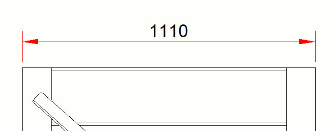
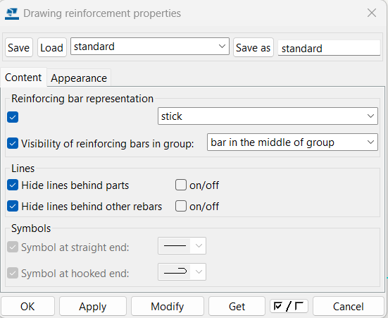

# Marcas, símbolos y notas
{: .no_toc }

## Tabla de Contenidos
{: .no_toc .text-delta }

1. TOC
{:toc}

## Marcas

### Part Mark
Esta marca puede ser usada en cualquier cosa que sea una parte a nivel programa. Los usos más frecuentes de este tipo de marca son en perfiles metálicos, en armaduras, partes de unidades de colada, anclajes, etc.

Para colocarla en el dibujo hay que seguir los siguientes pasos:

1. Seleccionar el objeto al que se colocará la marca
2. Hacer click en `Part mark`.
3. Editar las propiedades.
4. Seleccionar `Modify`.

*Figura 1: Ejemplo "Part mark"*

#### Propiedades:

*Figura 2: Propiedades en `content`*

- Dentro del apartado de `content` en (1) seleccionamos lo que queremos que se vea en nuestra marca (en la imagen está puesto "Profile" por ejemplo).
- En (2) está el panel que controla lo que entra, lo que sale, y el orden como se muestran las marcas. Se pone `add` para agregar marcas desde (1) y `remove` para quitarlas desde (3), luego `Move up/down` para darle un orden linealmente en el renglón.
- En (3) vemos todas las marcas que hay en el renglón, siendo lo más arriba lo que está mas a la izquierda.
- En (4) está el panel de edición de las marcas, seleccionando la marca en (3) se puede agregar recuadros, cambiar colores, tamaño de texto, etc.

*Figura 3: Propiedades en `General`*

- Dentro del apartado de `General` en (1) podemos asignarle un recuadro alrededor de la marca y modificar el color de esta.
- En (2) podemos asignarle una flecha que permita mover el texto a diferentes lugares del dibujo sin perder la referencia de lo que se quiere mostrar, pudiendose modificar el tipo de flecha aquí y el color dependerá de (2).
- En (3) se modifica la posición del texto, aunque se suele modificar con el cursor manualmente.

#### Ejemplos

| Descripción marca | Contenido marca | Output |
|-------------------|-----------------|--------|
| Perfil metálico |  | |
| Perfil metálico + símbolo |   |  
| Dimensión de pedestal + nombre | . |
| Marca de anclaje | . |
| Marca de armadura | . |
| Marca de coordenada | .|
| Marca de texto | .  |

>Tener en cuenta que estas marcas pueden realizarse tanto como una `Note` como con un `Text`.

### Weld Mark
Los pasos para hacer una marca de soldadura son:
1. Seleccionar `Weld mark`
2. Hacer click en el punto donde estará ubicada la soldadura.
3. Mover el cursor hacia donde estará ubicada la nota de la soldadura y hacer click.

#### Propiedades:

*Figura 4: Configuración en "Content"*
- En el apartado de "Content" encontramos estos diferentes parámetros en (1) y (2):

| Atributo | Descripción | 
|----------|-------------|
| **Prefix** | Permite agregar un texto antes del valor de la soldadura. | 
| **Size** | Tamaño de la soldadura (cateto). | 
| **Type** | Determina el tipo de soldadura. |
| **Angle** | Ángulo de la preparación, biseles o ranura de soldadura. |
| **Contour** | Contorno de tipo de relleno de una soldadura. |
| **Finish** | G: Amolar ;  M: Mecanizar; C: Cepillar ;  Soldadura de acabado nivelado ;  Cara soldadura transición uniforme.
| **Lenght** | Define el valor de longitud que se muestra en la marca de soldadura.  |
| **Pitch** | Espacio entre las partes soldadas. |
| **Effective throat** | Tamaño de soldadura utilizado en el cálculo de fuerza de soldadura. |
| **Root opening** | Altura de la parte más estrecha dentro de la separación de bordes. |
| **Reference text** | Se agrega en caso de necesitar escribir alguna aclaración. |
| **Edge/Around** | Se define si la soldadura es solo en el borde o alrededor. |
| **Workshop/Site** | Se define si se suelda en taller o en obra. |
| **Stitch weld** | Soldadura intermitente. |

>En los tipos de soldadura compuestas se permitirá introducir dos valores de tamaño.

>Importante: Las soldaduras más utilizadas en los proyectos dentro de la empresa tienen las siguientes características:
    - La gran mayoria son soldaduras de filete, en las cuales no se suele indicar el cateto ya que el mismo termina siendo indicado por notas (salvo que expresamente haya sido calculado o lo queramos indicar).(`Size - Type`)
    - Para placas base se suele indicar penetración parcial.
    - La banderita indicando que se suelda en campo es usual en anclajes en 2° etapa (para arandelas cuadradas) o soportes menores.
    - Si se suelda todo el perímetro, indicarlo con el círculo en el símbolo de soldadura (`Edge/Around`).

*Figura 5: Configuración en "Appeareance"*

- En (1) se configura el color de la marca, y en (2) se configura el color y la morfología de la flecha.

*Figura 6: Ejemplo de "Weld Mark" en el panel de propiedades*

*Figura 7: Ejemplo de "Weld Mark" en el dibujo*

*Figura 8: Ejemplo de "Weld Marks"*

### Level mark
Los pasos para hacer una marca de nivel son:
1. Seleccionar `Level mark`
2. Hacer click en el punto donde se desea marcar el nivel.
3. Mover el cursor hacia donde estará ubicada la nota del nivel y hacer click.

*Figura 9: Ejemplo colocación de `Level mark`*

#### Propiedades:

*Figura 10: Configuración en "General" del "Level Mark"*

- En (1) dentro del apartado "General" se seleccionan todas las cosas que se desean mostrar, o no, en la marca de nivel, como por ejemplo el valor numérico, el signo "+" y algún texto como postfijo,etc.
- En (2) se elije el formato del valor numérico que aparecerá en la marca, si es que en (1) se decidió colocar.

*Figura 11: Configuración en "Appearance" del "Level Mark"*

- En (1) dentro del apartado "Appearance" se configuran las características del texto en la marca, como puede ser el color o el tamaño.
- En (2) se configura la apariencia de la flecha que marca el nivel, su morfología, colores, etc.

### Section mark
Los pasos para hacer una marca de nivel son:
1. Seleccionar `Section mark`
2. Hacer click en el primer punto donde se hará la marca de corte (flecha). El lado izquierdo orientará la marca hacia arriba, y el lado derecho la orientará hacia abajo.
3. Hacer otro click en el otro punto donde se hará la segunda marca (flecha).
4. Mover el cursor hacia donde estará ubicada la nota de la soldadura y hacer click.

*Figura 12: Ejemplo colocación de `Section mark`*

>Aclaración: Como fue mencionado en generalidades, la section mark no suele usarse, ya que la vista de sección ya incluye el simbolo.

#### Propiedades:
Las propiedades son similares a las detalladas en [Section view](../dibujo/vistas_dibujo.md/#section-view), solo que en este caso el apartado de "View label" no tiene ninguna utilidad.

### Detail mark
Los pasos para hacer una marca de detalle son:
1. Seleccionar `Detail mark`
2. Hacer click en el punto central donde se desea detallar.
3. Mover el cursor hasta que el circulo se expanda cubriendo con la región a detallar.
4. Hacer click para definir la circunferencia, ubicar con el cursor donde se colocará la marca del detalle y hacer click.

*Figura 13: Ejemplo colocación de `Detail mark`*

#### Propiedades:
Las propiedades son similares a las detalladas en [Detail View](../dibujo/vistas_dibujo.md/#detail-view), solo que en este caso el apartado de "View label" no tiene ninguna utilidad.

### Revision mark

1. Seleccionar `Revisión mark` y en la lista desplegable seleccionar `Add revisión mark`.
2. Hacer click en el lugar donde se desea colocar la marca. Posteriormente editar las propiedades.

*Figura 14: Ejemplo colocación de `Revisión mark`*

> Aclaración 1: Antes de colocar la Revisión Mark se recomienda completar los campos de revisión del drawing que se esté editando, así ciertas propiedades se completan automaticamente.
> Aclaración 2: Pueden utilizarse simbolos para marcar las revisiones, aunque estos no tendrán configurados los parámetros de la revisión que uno le asigna.

#### Propiedades:

*Figura 15: Propiedades de marcas de revisión.*

- Dentro del apartado (1) se pueden guardar la configuración de la apariencia de marcas de revisión que se hayan hecho en otro momento, siendo útil ya que suelen ser siempre de la misma forma.
- Una vez que en (1) se carguen las configuraciones de apariencia, en (2) se seleccionará el número de revisión al que se hará alución, de las revisiones cargadas previamente.

*Figura 16: Ejemplo de configuración de apariencia de marcas de revisión.*

- Si fuera el caso que se desee editar la apariencia de la marca, como se ve en la Figura x, puede editarse la geometría, tamaño del texto, colores, etc.

## Cotas
Como fue mencionado en [Views](../dibujo/generalidades_dibujo.md#descripción-del-modo-dibujo), los tipos más utilizados de cotas son la horizontal, vertical, free y la angular.
Para realizar las tres primeras se debe hacer lo siguiente:

1. Seleccionar alguna de las dos cotas que se van a utilizar.
2. Hacer click en el primer extremo de la región a acotar.
3. Hacer click en el otro extremo de la región a acotar. Si se quiere realizar varias cotas, clickear en los lugares parciales a acotar.
4. Ya habiendo aparecido el valor numérico, ubicar con el mouse en el sentido perpendicular a la cota el lugar en que esta se desea colocar. 
5. Cuando esté colocada donde se desea, hacer click con el `botón central del mouse`.

>La cota "Free"  funciona de la misma manera que las ortogonales, pudiendo ser paralela a cualquier elemento que se desee. Puede funcionar como la horizontal o vertical.

*Figura 17: Ejemplo cota horizontal*

Para realizar la cota angular se deben seguir los siguientes pasos:

1. Seleccionar la cota angular 
2. Hacer click en el punto de intersección de los lados a acotar.
3. Clickear en el primer lado de la cota, separado del punto de intersección lo suficiente para que entre el valor numérico del ángulo.
4. Clickear en el segundo lado siguiendo la trayectoria circular desde el click anterior.
5. Definir la ubicación con un último click. Suele suceder que la cota se mueve un poco del lugar que se asigna, pudiendose mover posteriormente con el click izquierdo del mouse hacia la ubicación deseada.

*Figura 18: Ejemplo cota angular*

Por último, los pasos para una cota curva son los siguientes:
1. Seleccionar la cota curva con lineas de referencia radiales . Hay otra opción con lineas de referencia ortogonales pero no la solemos usar
2. Seleccionar el primer punto del radio interior de la curva a acotar.
3. Seleccionar el punto medio de la curva interior y el punto final.
4. Luego sobre la curva exterior seleccionar los puntos donde se desea realizar las cotas.
5. Por último perpendicular a la cota ubicar donde se quiera el valor numérico.
6. Cuando esté colocada donde se desea, hacer click con el `botón central del mouse`.

> Aclaración general: podremos unir o separar un grupo de cotas de la siguiente manera:

### Propiedades

*Figura 19: Propiedades general de cota*

- Dentro de `General`, en (1) se podrá modificar la disposición de el texto de las cotas según se desee.
- En (2) podremos editar el formato de dichos textos, las unidades, la precisión, los decimales, etc.
- En (3) designaremos como queremos que esté ubicado ese texto respecto a las lineas de acotación. En las `Short dimensions`cuando se quiera poner `Outside` solo lo hará si el espacio de la cota es reducido.
- En (4) tendremos nuestras propiedades de cotas guardadas, siendo que en la empresa utilizamos `HY-COTA`.

*Figura 20: Propiedades appeareance de cota*

- Dentro de `Appearance`, en (1) podremos modificar la apariencia del texto, la ubicación, el color, el tamaño, etc.
- En (2) podremos modificar la linea de cota, el tipo de flecha, el color y las medidas, ya que hay veces que las medidas por default de las cotas son muy grandes para dimensionar ciertos elementos.

*Figura 21: Propiedades marks de cota*

- Dentro de `Marks`, en (1) podremos decidir que se ve y que no en el texto de la cota, si queremos que aparezca o no el valor numérico, o agregarle un prefijo/postfijo. A continuación se muestra un ejemplo, donde había que referenciar un tipo de soporte, y se uso un postfijo "(B,C)".

- En (2) se podrá colocar alguna marca o configurar en general las lineas que unen los lugares que estamos acotando con la flecha de cota.

- En (3) se podrá optar por exagerar las dimensiones que no puedan ser muy legibles por un tema de escala, aunque es conveniente agrandar la escala o hacer un detalle de los objetos que sean pequeños. La idea sería masomenos la siguiente:

*Figura 22: Propiedades tags de cota*

- Dentro de `Tags`, en (1) podremos agregar textos por fuera de el lugar donde se encuentre el valor numérico/postfijo/prefijo. Esos tags podrán contar con las propiedades de cualquier Note/Text/Part mark como simbolos, perfiles, coordenadas, etc, por lo que es una herramienta muy versátil si se quisiera aclarar algo.

> Importante: La cotas de la empresa tendrán las propiedades de la forma que se mostraron en las figuras anteriores, y se verán en nuestro dibujo de la siguiente manera:
    

## Notas

1. Seleccionar `Note`.
2. Hacer click en el lugar al que va a hacer referencia la nota.
3. Hacer otro click donde se va a colocar el texto.

*Figura 23: Ejemplo colocar `Note`*

### Propiedades:

*Figura 24:  Configuración en "Content"*

- En (1) seleccionamos lo que queremos que se vea en nuestra nota.
- En (2) está el panel que controla lo que entra, lo que sale, y el orden como se muestran las marcas. Se pone `add` para agregar marcas desde (1) y `remove` para quitarlas desde (3), luego `Move up/down` para darle un orden linealmente en el renglón.
- En (3) vemos todas las marcas que hay en el renglón, siendo lo más arriba lo que está mas a la izquierda.
- En (4) está el panel de edición de las marcas, seleccionando la marca en (3) se puede agregar recuadros, cambiar colores, tamaño de texto, etc.

Luego en General podemos configurar lo relacionado a la apariencia de la nota.

## Textos
Como texto pueden colocarse dos tipos diferentes, `Text` y `Rich text`.

- `Text` se utiliza para colocar algo escrito en el lugar que se desee, y posteriormente se pueden agregar flechas, recuadros, y demás cosas alrededor de ese texto pudiendo simular una nota. Se usa para cosas puntuales y más chicas.
- `Rich text` se utiliza para importar desde un archivo de texto tipo word, textos más extensos con varios párrafos o con las características que tenga ese archivo de base.

### Text
Se coloca haciendo click en `Text` y seleccionando el lugar donde se desea colocar.

*Figura 25: Colocación de texto*

> Si el texto que se quiere colocar está pensado para tener una flecha referenciando algún lugar, es conveniente que se coloque en el lugar donde irá la punta de la flecha, y posteriormente al configurarlo, mover el texto hacia el lugar que se desee.

*Figura 26: propiedades de texto*

- En (1) podemos editar todo lo relacionado al texto en sí, lo que se quiere incluir, el tamaño, colores, alineación, etc.
- En (2) podemos configurar el entorno de ese texto, como flechas, recuadros y el color de estos.

> Tip 1: Los textos permiten la función copiar y pegar para replicarlo entre vistas, a diferencia de las notas que hay que hacer los pasos de colocación por cada una que se desee agregar.
> Tip 2: El texto al modificarse en base a otro porque se quieren adoptar las mismas propiedades, puede que pierda el formato (2), por lo que hay que tener en consideración la edición posterior de este parámetro. Con el método del tip 1 no pasa esto.

*Figura 27: Ejemplo Tip 1*

*Figura 28: Ejemplo Tip 2*

### Rich text

Pasos para colocar el texto:

1. Se coloca primero editando las propiedades. Tener en cuenta que el archivo debe tener la extensión .rtf (Rich Text Format) o .txt (Plain Text), por lo que se deberá en caso de ser necesario, hacer un `Save As` de su archivo de texto en alguna de estas extensiones.

2. Luego se pone `Modify`/ `Apply`/ `OK`. 

3. Una vez que se cierra la ventana se selecciona `Rich Text` y con la ventana abierta se selecciona la ubicación del texto en el dibujo.

*Figura 29: Ejemplo `Rich text`*`

>Aclaración: La altura de los textos se adoptan de los parámetros del archivo de texto importado, pero puede escalarse según se necesite desde este programa, aunque es recomendable editar el tamaño desde el archivo original.

## [Simbolos](../index.md#documentación-oficial)
1. Para colocar símbolos seleccionamos `Symbol`.
2. Seleccionamos el lugar donde se va a colocar.
3. Se colocará por defecto un simbolo cualquiera, se debe ingresar a las propiedades desde ese simbolo y modificarlo según se desee.

### Propiedades

*Figura 30: Selección de simbolos*

- Dentro de (1) podremos seleccionar en `File` el archivo del cual se van a tomar los diferentes simbolos que podremos agregar haciendo click en `Select...`. Los archivos que aparezcan para seleccionar, de extensión ".sym" y que contienen los simbolos, estarán dentro de `custom firm/symbols`, pudiendo editarse dentro del programa "Editor simbolos" incluído con la descarga del programa.

- También en (1), en `Number`, seleccionaremos el simbolo que deseemos poniendo el número en que se encuentra el simbolo dentro del archivo ".sym". Si no sabemos a cual nos referimos, al tocar en `Select...` podremos ver una previsualización de los simbolos que se encuentran disponibles.

- En (2) podremos configurar, clickeando en `Place`, que nuestro simbolo mantenga la ubicación que le asignamos en el dibujo. Para esto hay que asegurarnos que se encuentre en `fixed` y no en `free`.

*Figura 31: Apariencia de simbolos*

- En appearance tendremos la posibilidad en (1) de modificar el color y las dimensiones del simbolo, aunque si viene de un archivo ".dwg" no podrán hacerse modificaciones del color, ya que respetará los que vienen de dicho archivo. En (2) se podrá agregar un marco a nuestro simbolo si así lo quisieramos.

### Editor de símbolos

*Figura 32: Propiedades editor de simbolos*

- Dentro del editor de simbolos en "Home" encontraremos las herramientas de dibujo para crear nuestros simbolos (1). Podremos dibujar en (6) siguiendo el grillado provisto por el programa. Este grillado se puede configurar en (4) según la separación que se desee, además de poder agregar una imagen de fondo o dibujar "hatchs" o grillas, entre otras cosas.
- En (2) podremos copiar, pegar, eliminar, diferentes simbolos creados en el programa, pero no podremos copiar estos simbolos entre diferentes archivos ".sym"
- En (3) editamos la forma en que visualizamos el panel (6) según nos convenga.
- En (5) se almacenarán todos los simbolos que hayamos creado. El orden que le asignemos en esta parte determinará el número que colocaremos en `Number` dentro del apartado (1) en las propiedades de simbolos.
- En (7) podremos importar dibujos de autocad que pasarán a ser simbolos dentro de nuestro archivo.

*Figura 33: Panel de importación de archivos ".dwg"*

- Dentro de "Import" nos dará la posibilidad en (1) de traer un archivo ".dwg" para transformalo en un simbolo.
- En (2) podremos modificar la escala del dibujo y la ubicación del mismo.

*Figura 34: Ejemplo de colocación de simbolo en base a un archivo ".dwg"*

## Detallar armadura

### Visualización de las barras
Cuando se tenga la vista con las barras, se podrá optar dentro de las propiedades del grupo de barras, por mostrarlas de diferentes maneras:

*Figura x: Propiedades generales de barras*

- Dentro de `Content`, en (1) podremos elegir como se ven las barras, y si se desean ver todas o solo alguna en particular.
- En (2) podemos elegir si mostrar con linea oculta (punteada) alguna de las barras en la vista.
- En (3) podremos elegir como se visualizará el extremo recto de la barra o el extremo curvo de esta.

*Figura 35: Propiedades de apariencia de barras*

- Dentro de `Appeareance`, en (1) podremos configurar el color de las lineas de las barras y el tipo de estas.
- En (2), si hubiesemos elegido que se visualicen lineas ocultas, podremos asignarles el color y tipo de linea que deseemos.

> Tip: Si se colocará unicamente una barra en el dibujo, para moverse se debe hacer click derecho en ella y seleccionar `Adjust location`  
    y luego con el cursor mover la barra hacia donde el programa lo permita y hacer click, lo que hace realmente es darte a elegir la barra que se desea mostrar. A continuación se muestra un ejemplo:
    

#### Ejemplos

| Descripción barra | Configuración | Output |
|-------------------|-----------------|--------|
| Single line + all |  | |
| Single line with filled ends + all | | |
| double lines + bar in the middle of group|  |
| double lines with filled ends |  |
| filled line |  |
| stick |  | 

### Marcas armadura
Para detallar armadura podemos optar por hacerlo de dos formas diferentes, mediante un componente o con `Part mark`.

> Aclaración: Antes de comenzar a hacer las marcas, es necesario realizar la numeración de la armadura y en lo posible tener la PDH para constatar que las posiciones de cada barra sea la correcta, y que no falte señalar a ninguna.

#### Utilizando un componente
El componente que se utiliza para la marca de armaduras en grupo de barras es el siguiente:

aunque existen muchos mas que pueden ser utilizados.

Para colocarlo se deben seguir los siguientes pasos:
1. Seleccionar el grupo de barras que queremos marcar.
2. Seleccionar el componente.
3. Seleccionar el rango en donde ese grupo de barras se encuentra haciendo click en un extremo, y luego click en el otro.
4. Mover la marca hacia donde se desee, por defecto se colocará sobre los dos extremos donde se hizo click en el paso anterior.

*Figura x: Ejemplo de colocación marca armadura con componente*

Para la configuración de la marca, podremos modificar los siguientes parámetros:

*Figura 36: Marca grupo de barras (Geometry)*

- En (1) podremos asignar la orientación del texto de referencia del grupo de barras respecto a este.
- En (2) podremos darle una inclinación a la linea que contiene la marca de las barras.
- En (3) podremos asignar la ubicación del texto respecto al punto P2, que este es el punto verde a la derecha sobre la linea que contiene las marcas.
- En (4) tenemos la posibilidad de editar los textos que aparecerán en las `Mark 1`, `Mark 2` y `Mark 3`, y estos estarán colocados como se ve en (1).
- En (5) podremos guardar una configuración personalizada de la marca de la barra.

*Figura 37: Marca grupo de barras (Mark 1)*

- En (1) podremos elegir que se desea mostrar en las marcas de armaduras, y debe estar la marca con "Create" en `yes` para que aparezcan estas. Las propiedades también deberán asignarse según algunas configuradas previamente, no podrá configurarse el texto desde aquí.
- En (2) podremos agregar una marca antes o después de la `Mark 1`, esto asignandolo en el apartado de "Create". Luego se configura como cualquier marca.

*Figura 38: Marca grupo de barras (Lines and symbol)* 

- En (1) en `Distribution line` asignaremos el aspecto de las lineas que acompañan a la marca del lado exterior a las cotas, y en `Leader line` la linea que se encuentra dentro de las cotas.
- En (2) podremos elegir si poner un simbolo en lugar de la cota derecha.

*Figura 39: Marca grupo de barras (Symbols on rebars)*

- En (1) podremos elegir si en las barras que aparezcan en el dibujo se les colocará una linea señalando a estas o si solo marcaremos el rango en el que se encuentran.
- En (2) podremos configurar las lineas perpendiculares de la cota, si se coloca, su longitud, color, etc.
- En (3) definiremos el lugar donde se encuentre el "P1" y la distancia que tendrá este con la proxima marca de una barra.

*Figura 40: Ejemplo de marca de grupo de barras en un plano*

#### Utilizando `Part mark`
Esta forma se suele usar para barras individuales, ya que no solemos utilizar un componente para estas. Esto no significa que no exista un componente que pueda realizar la marca. 

La manera de realizarlo es análoga a la explicada en [Part mark](../dibujo/marcas_simbolos_notas.md#part-mark), solo que en este caso los atributos que contendrá la marca serán estos:

*Figura 41: Ejemplo Part mark en barra individual.

[← Volver al inicio](index.md)