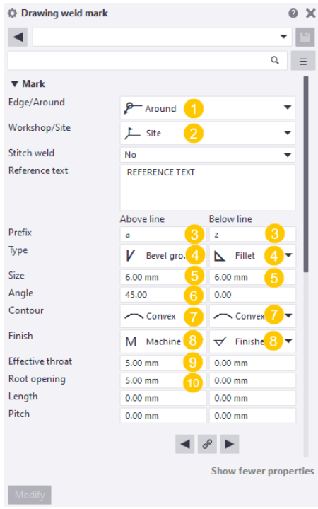
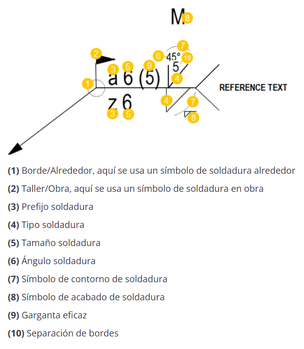

# Configuración inicial
{: .no_toc }

## Tabla de Contenidos
{: .no_toc .text-delta }

1. TOC
{:toc}

## Marcas

### Part Mark
Los usos más frecuentes de este tipo de marca es en perfiles metálicos y en armaduras, aunque puede ser usado en muchas más cosas.
Para colocarla en el dibujo hay que seguir los siguientes pasos:

1. Seleccionar el objeto al que se colocará la marca
2. Hacer click en `Part mark`.
3. Editar las propiedades.
4. Seleccionar `Modify`.

*Figura 1: Ejemplo "Part mark"*

#### Propiedades:

- Dentro del apartado de `content` en (1) seleccionamos lo que queremos que se vea en nuestra marca (en la imagen está puesto "Profile" por ejemplo).
- En (2) está el panel que controla lo que entra, lo que sale, y el orden como se muestran las marcas. Se pone `add` para agregar marcas desde (1) y `remove` para quitarlas desde (3), luego `Move up/down` para darle un orden linealmente en el renglón.
- En (3) vemos todas las marcas que hay en el renglón, siendo lo más arriba lo que está mas a la izquierda.
- En (4) está el panel de edición de las marcas, seleccionando la marca en (3) se puede agregar recuadros, cambiar colores, tamaño de texto, etc.

- Dentro del apartado de `General` en (1) podemos asignarle un recuadro alrededor de la marca y modificar el color de esta.
- En (2) podemos asignarle una flecha que permita mover el texto a diferentes lugares del dibujo sin perder la referencia de lo que se quiere mostrar, pudiendose modificar el tipo de flecha aquí y el color dependerá de (2).
- En (3) se modifica la posición del texto, aunque se suele modificar con el cursor manualmente.

### Weld Mark
Los pasos para hacer una marca de soldadura son:
1. Seleccionar `Weld mark`
2. Hacer click en el punto donde estará ubicada la soldadura.
3. Mover el cursor hacia donde estará ubicada la nota de la soldadura y hacer click.

#### Propiedades:

*Figura x: Configuración en "Content"*
- En el apartado de "Content" encontramos estos diferentes parámetros en (1) y (2):

| Atributo | Descripción | 
|----------|-------------|
| **Prefix** | Permite agregar un texto antes del valor de la soldadura. | 
| **Size** | Tamaño de la soldadura (cateto). | 
| **Type** | Determina el tipo de soldadura. |
| **Angle** | Ángulo de la preparación, biseles o ranura de soldadura. |
| **Contour** | Contorno de tipo de relleno de una soldadura. |
| **Finish** | G: Amolar ;  M: Mecanizar; C: Cepillar ;  Soldadura de acabado nivelado ;  Cara soldadura transición uniforme.
| **Lenght** | Define el valor de longitud que se muestra en la marca de soldadura.  |
| **Pitch** | Espacio entre las partes soldadas. |
| **Effective throat** | Tamaño de soldadura utilizado en el cálculo de fuerza de soldadura. |
| **Root opening** | Altura de la parte más estrecha dentro de la separación de bordes. |
| **Reference text** | Se agrega en caso de necesitar escribir alguna aclaración. |
| **Edge/Around** | Se define si la soldadura es solo en el borde o alrededor. |
| **Workshop/Site** | Se define si se suelda en taller o en obra. |
| **Stitch weld** | Soldadura intermitente escalonada. |

>En los tipos de soldadura compuestas se permitirá introducir dos valores de tamaño.

*Figura x: Configuración en "Appeareance"*

- En (1) se configura el color de la marca, y en (2) se configura el color y la morfología de la flecha.

*Figura x: Ejemplo de "Weld Mark" en el panel de propiedades*

*Figura x: Ejemplo de "Weld Mark" en el dibujo*

*Figura x: Ejemplo de "Weld Marks"*

### Level mark
Los pasos para hacer una marca de nivel son:
1. Seleccionar `Level mark`
2. Hacer click en el punto donde se desea marcar el nivel.
3. Mover el cursor hacia donde estará ubicada la nota del nivel y hacer click.

*Figura 1: Ejemplo colocación de `Level mark`*

#### Propiedades:

*Figura x: Configuración en "General" del "Level Mark"*

- En (1) dentro del apartado "General" se seleccionan todas las cosas que se desean mostrar, o no, en la marca de nivel, como por ejemplo el valor numérico, el signo "+" y algún texto como postfijo,etc.
- En (2) se elije el formato del valor numérico que aparecerá en la marca, si es que en (1) se decidió colocar.

*Figura x: Configuración en "Appearance" del "Level Mark"*

- En (1) dentro del apartado "Appearance" se configuran las características del texto en la marca, como puede ser el color o el tamaño.
- En (2) se configura la apariencia de la flecha que marca el nivel, su morfología, colores, etc.

### Section mark
Los pasos para hacer una marca de nivel son:
1. Seleccionar `Section mark`
2. Hacer click en el primer punto donde se hará la marca de corte (flecha). El lado izquierdo orientará la marca hacia arriba, y el lado derecho la orientará hacia abajo.
3. Hacer otro click en el otro punto donde se hará la segunda marca (flecha).
4. Mover el cursor hacia donde estará ubicada la nota de la soldadura y hacer click.

*Figura 2: Ejemplo colocación de `Section mark`*

>Aclaración: Como fue mencionado en generalidades, la section mark no suele usarse, ya que la vista de sección ya incluye el simbolo.

#### Propiedades:
Las propiedades son similares a las detalladas en [Section view](../dibujo/vistas_dibujo.md/#section-view), solo que en este caso el apartado de "View label" no tiene ninguna utilidad.

### Detail mark
Los pasos para hacer una marca de detalle son:
1. Seleccionar `Detail mark`
2. Hacer click en el punto central donde se desea detallar.
3. Mover el cursor hasta que el circulo se expanda cubriendo con la región a detallar.
4. Hacer click para definir la circunferencia, ubicar con el cursor donde se colocará la marca del detalle y hacer click.

#### Propiedades:
Las propiedades son similares a las detalladas en [Detail View](../dibujo/vistas_dibujo.md/#detail-view), solo que en este caso el apartado de "View label" no tiene ninguna utilidad.

### Revision mark

1. Seleccionar `Revisión mark` y en la lista desplegable seleccionar `Add revisión mark`.
2. Hacer click en el lugar donde se desea colocar la marca. Posteriormente editar las propiedades.

> Aclaración: Antes de colocar la Revisión Mark se recomienda completar los campos de revisión del drawing que se esté editando, así ciertas propiedades se completan automaticamente.

#### Propiedades:

*Figura x: Propiedades de marcas de revisión.*

- Dentro del apartado (1) se pueden guardar la configuración de la apariencia de marcas de revisión que se hayan hecho en otro momento, siendo útil ya que suelen ser siempre de la misma forma.
- Una vez que en (1) se carguen las configuraciones de apariencia, en (2) se seleccionará el número de revisión al que se hará alución, de las revisiones cargadas previamente.

*Figura x: Ejemplo de configuración de apariencia de marcas de revisión.*

- Si fuera el caso que se desee editar la apariencia de la marca, como se ve en la Figura x, puede editarse la geometría, tamaño del texto, colores, etc.

## Cotas
Como fue mencionado en [Views](../dibujo/generalidades_dibujo.md#descripción-del-modo-dibujo), los tipos más utilizados de cotas son la horizontal, vertical, free y la angular.
Para realizar las tres primeras se debe hacer lo siguiente:

1. Seleccionar alguna de las dos cotas que se van a utilizar.
2. Hacer click en el primer extremo de la región a acotar.
3. Hacer click en el otro extremo de la región a acotar. Si se quiere realizar varias cotas, clickear en los lugares parciales a acotar.
4. Ya habiendo aparecido el valor numérico, ubicar con el mouse en el sentido perpendicular a la cota el lugar en que esta se desea colocar. 
5. Cuando esté colocada donde se desea, hacer click con el `botón central del mouse`.

>La cota "Free"  funciona de la misma manera que las ortogonales, pudiendo ser paralela a cualquier elemento que se desee. Puede funcionar como la horizontal o vertical.

*Figura 2: Ejemplo cota horizontal*

Para realizar la cota angular se deben seguir los siguientes pasos:

1. Seleccionar la cota angular 
2. Hacer click en el punto de intersección de los lados a acotar.
3. Clickear en el primer lado de la cota, separado del punto de intersección lo suficiente para que entre el valor numérico del ángulo.
4. Clickear en el segundo lado siguiendo la trayectoria circular desde el click anterior.
5. Definir la ubicación con un último click. Suele suceder que la cota se mueve un poco del lugar que se asigna, pudiendose mover posteriormente con el click izquierdo del mouse hacia la ubicación deseada.

Por último, los pasos para una cota curva son los siguientes:
1. Seleccionar la cota curva con lineas de referencia radiales . Hay otra opción con lineas de referencia ortogonales pero no la solemos usar
2. Seleccionar el primer punto del radio interior de la curva a acotar.
3. Seleccionar el punto medio de la curva interior y el punto final.
4. Luego sobre la curva exterior seleccionar los puntos donde se desea realizar las cotas.
5. Por último perpendicular a la cota ubicar donde se quiera el valor numérico.
6. Cuando esté colocada donde se desea, hacer click con el `botón central del mouse`.

## Notas

1. Seleccionar `Note`.
2. Hacer click en el lugar al que va a hacer referencia la nota.
3. Hacer otro click donde se va a colocar el texto.

### Propiedades:

- En (1) seleccionamos lo que queremos que se vea en nuestra nota.
- En (2) está el panel que controla lo que entra, lo que sale, y el orden como se muestran las marcas. Se pone `add` para agregar marcas desde (1) y `remove` para quitarlas desde (3), luego `Move up/down` para darle un orden linealmente en el renglón.
- En (3) vemos todas las marcas que hay en el renglón, siendo lo más arriba lo que está mas a la izquierda.
- En (4) está el panel de edición de las marcas, seleccionando la marca en (3) se puede agregar recuadros, cambiar colores, tamaño de texto, etc.

## Textos
Como texto pueden colocarse dos tipos diferentes, `Text` y `Rich text`.

### Text
Se coloca haciendo click en `Text` y seleccionando el lugar donde se desea colocar.

Los textos se utilizan para colocar algo escrito en el lugar que se desee, y posteriormente se pueden agregar flechas, recuadros, y demás cosas alrededor de ese texto pudiendo simular una nota. Se usa para cosas puntuales y más chicas.

*Figura x: propiedades de texto*

- En (1) podemos editar todo lo relacionado al texto en sí, lo que se quiere incluir, el tamaño, colores, alineación, etc.
- En (2) podemos configurar el entorno de ese texto, como flechas, recuadros y el color de estos.

> Tip 1: Los textos permiten la función copiar y pegar para replicarlo entre vistas, a diferencia de las notas que hay que hacer los pasos de colocación por cada una que se desee agregar.
> Tip 2: El texto al modificarse en base a otro porque se quieren adoptar las mismas propiedades, puede que pierda el formato (2), por lo que hay que tener en consideración la edición posterior de este parámetro. Con el método del tip 1 no pasa esto.

*Figura x: Ejemplo Tip 1*

*Figura x: Ejemplo Tip 2*

### Rich text
El texto enriquecido se utiliza para importar desde un archivo de texto tipo word, textos más extensos con varios párrafos o con las características que tenga ese archivo de base.

Pasos para colocar el texto:

1. Se coloca primero editando las propiedades. Tener en cuenta que el archivo debe tener la extensión .rtf (Rich Text Format) o .txt (Plain Text), por lo que se deberá en caso de ser necesario, hacer un `Save As` de su archivo de texto en alguna de estas extensiones.

2. Luego se pone `Modify`/ `Apply`/ `OK`. 

3. Una vez que se cierra la ventana se selecciona `Rich Text` y con la ventana abierta se selecciona la ubicación del texto en el dibujo.

*Figura x: Ejemplo `Rich text`*`

>Aclaración: La altura de los textos se adoptan de los parámetros del archivo de texto importado, pero puede escalarse según se necesite desde este programa, aunque es recomendable editar el tamaño desde el archivo original.

## Simbolos
1. Para colocar símbolos seleccionamos `Symbol`.
2. Seleccionamos el lugar donde se va a colocar.

????

## Detallar armadura

[← Volver al inicio](index.md)