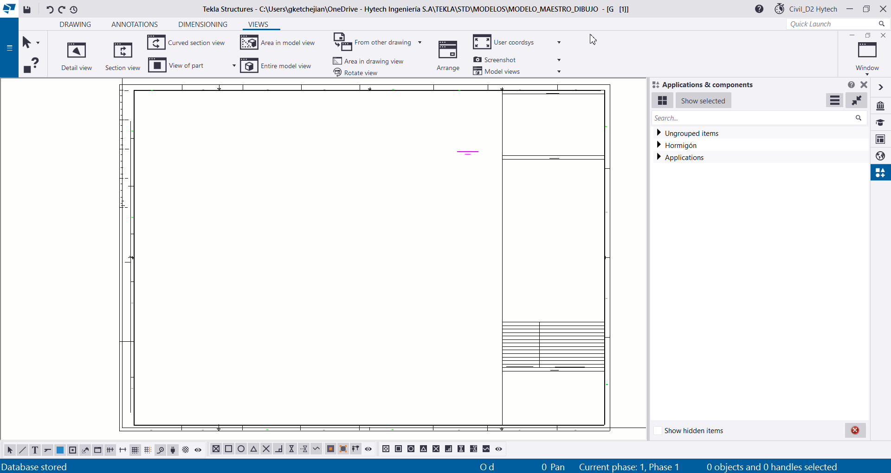
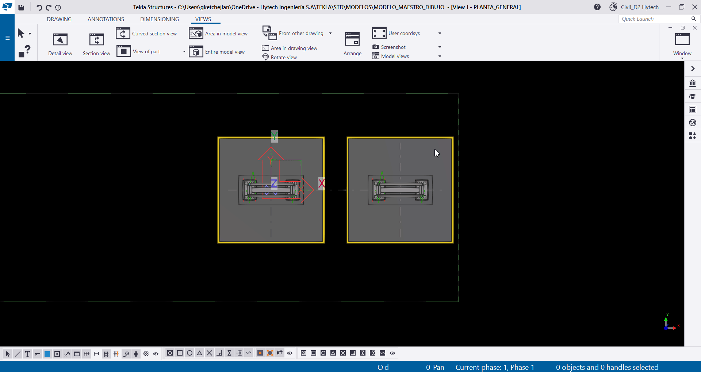
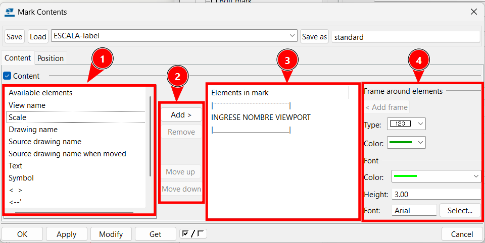

# Creación de vistas
{: .no_toc }

## Tabla de Contenidos
{: .no_toc .text-delta }

1. TOC
{:toc}

## Crear una nueva vista

Para crear una vista, debemos en primer lugar trasladarnos desde la pestaña `Window` a donde se encuentren las vistas que hayamos dejado preparadas en el Model.

*Figura 1: ver vistas en "Window"*

Al entrar al modelo con la pestaña `Window`, cuando se tenga la vista que desea mostrarse en el dibujo, puede optarse por tomar toda la vista ([Entire model view](../dibujo/vistas_dibujo.md#entire-model-view.md)) o una parte en especifico ([Area in model view](../dibujo/vistas_dibujo.md#area-in-model-view)).

### Entire model view

Esta opción permite llevar al dibujo todo lo que esté modelado como una vista, pudiendo uno recortarla a una parte en especifico si se quisiera. Para realizar esta vista:
1. Dentro de la vista debe hacerse click en `Entire model view`.
2. Tocar en cualquier parte de dicha vista.

*Figura 2: Creación de vista con "Entire model view"*

### Area in model view

Esta opción lo que permite es desde una vista, mostrar únicamente una parte que se desee mostrar en el plano. Para realizar esta vista:
1. Desde la vista donde está el modelo completo, se selecciona el botón de `Area in model view`.
2. Se hacen dos clicks, el primero representa un extremo de un recuadro, y el segundo el extremo contrario que cierra el recuadro.

*Figura 3: Creación de vista con "Area in model view"*

### Mover vista

Una vez que se haya creado la vista, desde la pestaña window se vuelve a la pestaña "G [x]" (siendo x el numero de hoja que se está haciendo el plano).
Allí se verá en la parte inferior izquierda, respecto el layout, las vistas creadas.

*Figura 4: Volver al drawing*

Para editar la ubicación de la vista se puede arrastrar el recuadro transparente hacia donde se desee. 

*Figura 5: Mover vista*

Una vez ubicado, se debe hacer click derecho en el recuadro transparente y tocar el botón `Properties`, o hacer un doble click en dicho recuadro.

*Figura 6: Acceder a las propiedades de la vista*

### Atributos de vista

*Figura 7: Attributes-Attributes 1*

- Al entrar en las propiedades de la vista, en el apartado `Attributes/ Attributes 1` hay vistas ya pre-configuradas con la escala como principal forma para distinguirse entre cada una (1). 
- En primer lugar hay que definir la escala del dibujo (2).
- Luego se puede editar la profundidad de la vista (3), esto siendo principalmente útil en vistas en planta. Nos dirá hasta cuanto de esa planta veremos hacia atrás o delante.
- Por último se aconseja (no solo acá sino en todas las propiedades del modo dibujo) dejar el valor (4) en "fixed" y no en "free" como a veces sucede por default, esto ya que garantiza que lo que se edite se mantenga tal cual uno lo desea.

{: .note}
> La escala de la vista dependerá de distintas variables:
> - Si se trata de IB o ID.
> - La información a mostrar en función de sus dimensiones.
> - Los textos asociados a ella tendrán más sentido en una escala u otra. Tiene sentido que veamos un detalle de estructura metálica en 1:10 y una planta de una estructura de hormigón en 1:100.

*Figura 8: Attributes-Label*

Luego en `Attributes/Label` se encuentra el lugar donde se puede editar el texto asociado a la vista. Cada marca "A1", "A2", etc. representa un renglón en el texto (1). Para editar el texto se debe hacer click en `[...]` a la derecha de cada "A".

Una vez dentro, por cada renglón tendremos a la izquierda opciones parametrizadas de diferentes marcas para agregar según se requiera.

*Figura 9: Edición de marcas en renglón `A1`*

- En (1) seleccionamos lo que queremos que se vea en nuestra marca.
- En (2) está el panel que controla lo que entra, lo que sale, y el orden como se muestran las marcas. Se pone `add` para agregar marcas desde (1) y `remove` para quitarlas desde (3), luego `Move up/down` para darle un orden linealmente en el renglón.
- En (3) vemos todas las marcas que hay en el renglón, siendo lo más arriba lo que está mas a la izquierda.
- En (4) está el panel de edición de las marcas, seleccionando la marca en (3) se puede agregar recuadros, cambiar colores, tamaño de texto, etc.

*Figura 10: Ejemplo agregar marca "scale"*

### Filter
Se usan principalmente para excluir de la vista a distintos elementos de modelo. Puede filtrarse por nombre, material, perfil, etc. Estos definen `Objects groups`. Los tipos de filtros son:

- **View filter**: Se accede desde las `View properties` y luego ingresamos a `Object group...`.
Este filtro se encarga de determinar que se ve y que no en nuestra vista.

- **Selection filter**: Al filtro de selección se accede desde el panel inferior, clickeando el logo: 
Se utiliza para elegir cuales elementos podriamos seleccionar en el model, y cuales no.

- **Object representation**: Este filtro se utiliza para designar si a diferentes elementos del modelo queremos asignarle un color o transparencia especificos.

. En (1) seleccionaremos el grupo de objetos al que queremos asignarle alguna característica de vista. Estos grupos de objetos se crean en `Object group...` de la misma manera que se detalla en [Propiedades de los filtros](./vistas_dibujo.md#propiedades-de-los-filtros). 

{: .note}
> Si en la edición de otros filtros elegimos la casilla de `Object representation` aparecerán aquí.

. En (2) podremos asignarle un color a los elementos que abarquen el `Object group`.

. En (3) controlaremos la transparencia, pudiendo ser esta:

. En (4) controlaremos la creación o eliminación de cada renglón de filtro, así como el orden que queremos darle. Esto es importante ya que este filtro tiene una jerarquía de orden descendente, por lo que se irá visualizando lo que englobe el primer renglón, luego el segundo y así.

- **All drawing types**:
Esta casilla permite que los filtros puedan ser utilizados en todos los drawings del modelo.

- **Selection filter**:
El filtro de selección permite decidir que elementos de modelo pueden seleccionarse, y cuales no. Para entender el funcionamiento de este filtro hay un ejemplo en [ejemplos filtros](../ejemplos/ejemplos_filtros.md#descripción-de-filtros).

- **Current drawing type**: Esta configuración solo estará disponible dentro del modo dibujo y sus propiedades se editarán de la misma manera que se detalla en [Propiedades de los filtros](./vistas_dibujo.md#propiedades-de-los-filtros), donde se detalla un ejemplo de su uso para no visualizar el H-15.

- **[Organizer](../avanzado/organizador.md)**: Los filtros dentro del organizer se podrán visualizar al crear una `Custom Category`:

- En (1) podemos crear una `Custom Category` y la veremos en la lista desplegable derecha (2).

- En (1) vemos dentro de `Object group...` el filtro que creamos, o mismo desde el menú desplegable que hay debajo.

#### Propiedades de los filtros

- En (1) se encontrarán guardados distintos filtros que se fueron creando según la necesidad de cada usuario. Estos podrán usarse como referencia, y si es necesario hacer modificaciones, en (2) podremos usar `Save as` y crear un filtro propio.

- En (3) tenemos las opciones para filtrar elementos, con expresiones lógicas que condicionan a los filtros que se crean. Las opciones que tenemos son las siguientes:
    - En la columna `-` podremos poner una tilde si queremos que el renglón del filtro que le corresponde queremos que esté activo o no.
    - En la columna `(` podremos separar los renglones de filtro entre sí, para que estas condiciones interactuen según se desea. Podremos usar `((` si queremos dejar una condición dentro de otra, o también un `-` si queremos agregar una condición dentro del parentesis.
    - En la columna `Category` seleccionaremos cual es el tipo de elemento que vamos a filtrar. Puede ser "Part", "Component", "Bolt" o "Reference object", entre otros.
    - En la columna `Property` elegiremos que propiedad de `Category` queremos que se le aplique la `Condition`. Estas propiedades pueden ser el `Name`, `Material`, `Profile`, etc.
    - En la columna `Condition` elegiremos que condición debe cumplir la `Property` según el `Value` que queramos. Tenemos `Equals`, `Does not equal`, `Begins with`, entre otros.
    - En la columna `Value` escribiremos el valor que tiene la `Property` que queremos filtrar en nuestro modelo.
    - En la columna `)` podremos hacer lo mismo que en `(` solo que en este caso se asocia más a evaluar que sigue a continuación de nuestra linea de filtro.
    - Por último en la columna de `And/Or` elegiremos si a nuestra linea de filtro le agregaremos otra condición más, o si queremos crear una linea de filtro nueva. Cuando ya se tenga definido el filtro, desde aquí agregaremos el `-` para darle un cierre.

- En (4) tenemos la posibilidad de añadir/eliminar filtros, mover los renglones de filtro arriba o abajo, crear un nuevo filtro, etc. Para copiar una linea de filtro, si seleccionamos una de ellas y seleccionamos `Add row` se copiará la que seleccionamos, y podremos trasladarla hacia arriba o abajo con `Move up/down`. `New filter` funciona de la misma forma que hacer un `Save as` del filtro.

- En (5) tenemos el panel de opciones avanzadas, que se ve de la siguiente manera:

donde podremos elegir en que apartado de filtros dentro del programa queremos que nuestro filtro pueda verse. El que aparezca tildado será el que estemos actualmente.

*Figura 11: Ejemplo filtrar hormigón de limpieza en modo dibujo*

Podrán ver más ejemplos de filtros en el apartado ["ejemplo filtros"](../ejemplos/ejemplos_filtros.md).

### Referencias externas con vistas

Dentro del apartado `Objects/ Reference object` podremos configurar la visualización de objetos que hayan sido cargados en el model como referencias, como pueden ser archivos de extensión ".ifc", ".nwd", ".dwg", etc.
Se puede configurar que referencias se desean mostrar en la vista dentro de `Content` y luego en "Visibility" se elige `Visible/Invisible`.

*Figura 12: Visibilidad de objetos de referencia*

Luego en `Appearance` ponemos la opción en `outline`(1) y podemos configurar el color, tipo de linea, etc. (2).

*Figura 13: Apariencia de objetos de referencia*

{: .note}
>**Aclaración 1**: El tiempo de carga de los modelos de referencia en la vista dependerá de la cantidad que haya de estos para cargar y cuanto contenido haya dentro de cada uno.
> **Aclaración 2**: Si el archivo de origen cuenta con layers, como puede ser un "3D DWG", esos layers pueden configurarse en "modelos de referencia" en el model. Si se oculta uno de estos layers allí, no se verán en el dibujo.

{: .warning}
>**Aclaración 3**: La visibilidad de los objetos estará supeditada a la profundidad a la que se haya modelado, y en la ubicación en que se encuentren, por lo que deberá ajustarse estos parámetros de la vista para que aparezcan en la solapa de visibilidad.

## Crear vista a partir de vista existente

Se pueden crear vistas y detalles a partir de Area in model view o Entire model view. Para esto una vez dentro de la vista:

1. ### Detail View:
    1. . Asegurarse estar dentro de la vista donde se desee hacer el detalle.
    2.  Hacer click en el botón `Detail view`.
    3. Hacer click en el punto central del lugar donde se desea hacer el detalle.
    4. Expandir el cursor hasta donde se desea mostrar en ese detalle y clickear.
    5. Hacer click para asignar donde irá el texto que señala la circunferencia de detalle
    6. Por último para asignarle un lugar a la vista detalle se clickea en el lugar donde quiere colocarse en la hoja.

{: .note}
>En el paso (iii.) puede editarse posteriormente la envergadura de lo que se desea mostrar.

*Figura 14: Ejemplo de creación de una "Detail view"*

Las propiedades de esta vista se dividen en tres: View label, Detail boundary y Detail mark

- **View label**: Representa el texto que va a colocarse en la vista que se creo en base al circulo del detalle.
Suele usarse solo el renglón A1 y la parte de Symbol de abajo no se usa en ninguno de los casos.

*Figura 15: Propiedades View label*

- **Detail boundary**: Representa el circulo que determina la ubicación del detalle.
Puede usarse otra forma geometrica (aunque no es recomendable) o cambiar el color.

*Figura 16: Propiedades Detail boundary*

- **Detail mark**: Como su nombre lo indica es la marca que acompaña al "Detail Boundary", suele ser "DETALLE X" y unicamente suele usarse el A1.

*Figura 17: Propiedades Detail mark*

2. ### Section view:
    1. Asegurarse estar dentro de la vista donde se desee hacer la sección.
    2. Hacer click en el botón `Section view`.
    3. Se deberá hacer dos clicks que definirán el sentido de la vista, y en su defecto de la flecha
    4. Hacer otros dos clicks que definen la profundidad de la vista, se formará un recuadro por delante de las flechas.
    5. Se hace un último click para definir la ubicación del dibujo de la sección.

{: .warning}
>Tener en cuenta que la ubicación en el caso de las secciones, aunque en el paso "v." se defina la ubicación, suele moverse en el eje "y" a otro lugar.

*Figura 15: ejemplo de creación de una "Section view"*

Las propiedades de esta vista se dividen en tres: Cutting line, Section mark y View.

- **Cutting line**: Representa la morfología de las flechas de la marca.

*Figura 18: Propiedades Cutting line*

- **Section mark**: Representa el texto que acompaña a la "Cutting line".

*Figura 19: Propiedades Section mark*

- **View label**: Representa el texto que va a colocarse en la vista que se creo en base al circulo del detalle.
Suele usarse solo el renglón A1 y la parte de Symbol de abajo no se usa en ninguno de los casos.

*Figura 20: propiedades View label*

3. ### Area in drawing view:
    1. Asegurarse estar dentro de la vista donde se desee hacer la otra vista.
    2. Hacer click en el botón `Area in drawing view`.
    3. Dentro de la vista, hacer un click en el primer extremo del recuadro que definirá de lo que se quiere llevar a una nueva vista.
    4. Hacer un segundo click cerrando ese recuadro.
    5. Hacer click en el lugar de la hoja donde se desea colocar la nueva vista.

*Figura 21: ejemplo de creación de un "Area in drawing view"*

Las propiedades de esta vista se podrán modificar de la misma manera que en [Atributos de vista](./vistas_dibujo.md#atributos-de-vista).

### Otro modelo de TEKLA

Se pueden copiar las vistas de un `GAdrawing` a otro, siguiendo estos pasos:
1. Desde el `Document manager` seleccionar el drawing del que se quiere obtener las vistas.
2. Dirigirse al apartado de views, seleccionar `from another drawing` y por último clickear en `copy` (puede ser con el layout también pero no es recomendable).
3. Aparecerán todas las vistas del dibujo como un bloque, si se quiere una en particular se pueden borrar las demás, ya que en el drawing original seguirán los dibujos intactos.

*Figura 21: hoja 2 con los dibujos a copiar*

*Figura 22: ejemplo copiar hoja 2 en la hoja 1*

[← Volver al inicio](index.md)