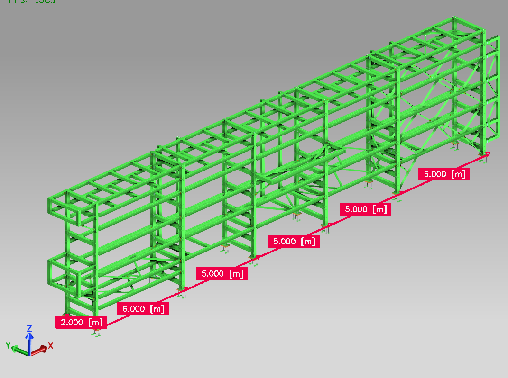

# Ejemplos - Acero
{: .no_toc }

## Tabla de Contenidos
{: .no_toc .text-delta }

1. TOC
{:toc}

## Parral de cañerías y bandejas

La idea del siguiente ejemplo es modelar desde cero un parral de cañerías y bandejas. Se describe el alcance buscado y se dividirá cada parte del proceso en videos cortos para rápida consulta.

### Alcance

El siguiente ejemplo consiste en armar a nivel ID un parral de cañerías y bandejas para una refinería. Se deberán realizar todas las vistas necesarias pensando en un plano de ingeniería de detalle. 

El parral tiene varios niveles de cañería, y en los últimos niveles cuenta con bandejas que llevan alimentación y señales a distintos equipos.

- Datos de entrada de proyecto: se comparten los siguientes archivos de referencia.
  - Areas vecinas para ver interferencias:
    - [Area 01](../ref/Ejemplo%20Acero/areas/AREA%2001.nwd)
    - [Area 06](../ref/Ejemplo%20Acero/areas/AREA%2006.nwd)
    - [Area 07](../ref/Ejemplo%20Acero/areas/AREA%2007.nwd)
  - [Cañerías](../ref/Ejemplo%20Acero/pip/PIP-03.DWG): `.dwg` con las cañerìas con patines dentro del parral.
  - [Bandejas Electricidad](../ref/Ejemplo%20Acero/bandejas/ELEC-BPC-03.dwg): `.dwg` con las bandejas de electricidad.
  - [Bandejas Instrumentos](../ref/Ejemplo%20Acero/bandejas/INSTR-BPC-03.dwg): `.dwg` con las bandejas de instrumentos.
  - [Modelo STAAD](../ref/Ejemplo%20Acero/PARRAL_SUR.STD)
  - **Punto base**: el punto base del proyecto es (0,0,100000), que es equivalente a que el resto de las disciplinas modela sobre un plano de **+100.000 mm**.

{: .important}
> No siempre se contarán con todos estos datos en formatos amigables o disponibles para cargar en el programa. En esos casos, el proyectista deberá buscar con las fuentes disponibles la mejor forma de ubicar en el espacio la estructura.

- Geometría del parral:
  - La estructura tiene **2m de ancho** entre ejes
  - Tiene dos **vanos extremos de 6m** y los **intermedios de 5m**.
  - El pórtico longitudinal se ubica en el último vano.
  - Las estructuras auxiliaries que tiene en extremos para subir las bandejas no se contemplan en este ejemplo

*Figura 1: modelo 3D del parral*

Se deja debajo el plano de estructura, para obtener el diseño final de placa base o conexiones. Se debe buscar lograr que sea lo más similar posible.

- [Plano estructura metálica](../ref/Ejemplo%20Acero/RBB24031-CI-DR-012-r2.pdf)

### Resolución

{: .highlight}
> Los objetivos son los siguientes:
> - Realizar el proyecto en Connect, creando una estructura de carpetas y subiendo las referencias.
> - Ubicar en el espacio viendo la maqueta y modelos disponibles. 
>
> - Modelar el parral auxiliándose del modelo de STAAD.
> - Asignar todos los atributos y propiedades de forma correcta, sincronizando el modelo con Connect
> - Modelar las uniones utilizando componentes
> - Preparar las vistas en un plano de ID, con una hoja A1. Se deberán presentar plantas por cada NSA, las elevaciones, detalles de uniones presentes, y un cómputo de materiales.

#### Creación de proyecto en Connect y colocación de referencias

<iframe width="700" height="393,75" src="https://www.youtube.com/embed/Ca-cqnSOwV8?si=WWt19nfqycQAVep5" title="YouTube video player" frameborder="0" allow="accelerometer; autoplay=1; clipboard-write; encrypted-media; gyroscope; picture-in-picture; web-share" referrerpolicy="strict-origin-when-cross-origin" allowfullscreen></iframe>

#### Importar modelo de STAAD en modelo y ajuste del mismo

<iframe width="700" height="393,75" src="https://www.youtube.com/embed/wrmDnypui3Y?si=iIuiDNIbVLyKwkLU" title="YouTube video player" frameborder="0" allow="accelerometer; autoplay=1; clipboard-write; encrypted-media; gyroscope; picture-in-picture; web-share" referrerpolicy="strict-origin-when-cross-origin" allowfullscreen></iframe>

#### Asignación de materiales, atributos, propiedades

<iframe width="700" height="393,75" src="https://www.youtube.com/embed/UwdXALfRkcI?si=zooOzCrpThe9LApo" title="YouTube video player" frameborder="0" allow="accelerometer; autoplay=1; clipboard-write; encrypted-media; gyroscope; picture-in-picture; web-share" referrerpolicy="strict-origin-when-cross-origin" allowfullscreen></iframe>

#### Sincronización con Connect y evaluación de interferencias

<iframe width="700" height="393,75" src="https://www.youtube.com/embed/UnLR4X4fblw?si=MxY3gOBv8vjEQf50" title="YouTube video player" frameborder="0" allow="accelerometer; autoplay=1; clipboard-write; encrypted-media; gyroscope; picture-in-picture; web-share" referrerpolicy="strict-origin-when-cross-origin" allowfullscreen></iframe>

#### Armado de dibujo: creación del dibujo usando un rótulo genérico.

<iframe width="700" height="393,75" src="https://www.youtube.com/embed/HIC1kGfr9q8?si=yWNtH6B4mbHP-bI8" title="YouTube video player" frameborder="0" allow="accelerometer; autoplay=1; clipboard-write; encrypted-media; gyroscope; picture-in-picture; web-share" referrerpolicy="strict-origin-when-cross-origin" allowfullscreen></iframe>

#### Creación de vistas y definición de layout

<iframe width="700" height="393,75" src="https://www.youtube.com/embed/jwxsP8qrIbA?si=vMH96kXI47fO-jKJ" title="YouTube video player" frameborder="0" allow="accelerometer; autoplay=1; clipboard-write; encrypted-media; gyroscope; picture-in-picture; web-share" referrerpolicy="strict-origin-when-cross-origin" allowfullscreen></iframe>

#### Retoque a vistas del dibujo

#### Impresión del documento

[← Volver al inicio](index.md)