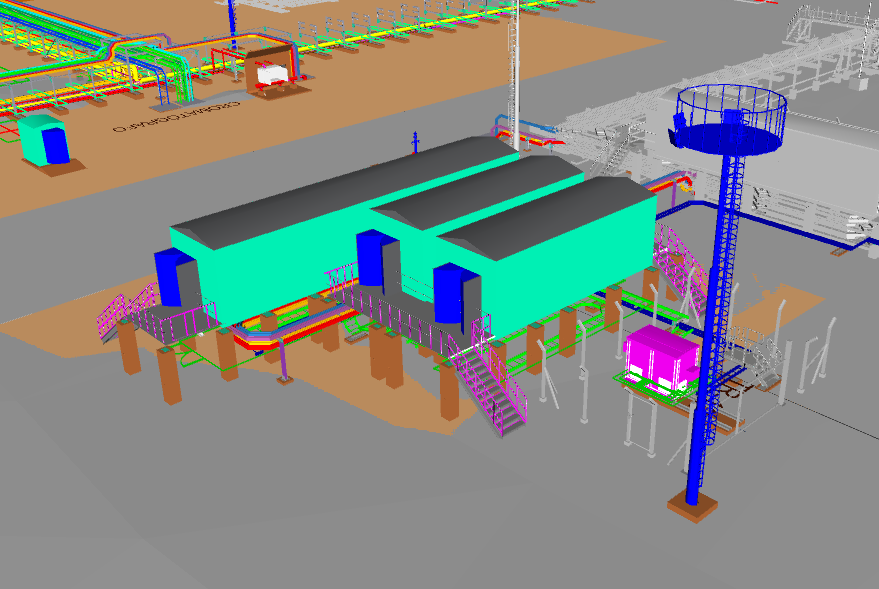

# Ejemplos - Hormigón
{: .no_toc }

## Tabla de Contenidos
{: .no_toc .text-delta }

1. TOC
{:toc}

## Fundación para shelter en altura

La idea del siguiente ejemplo es modelar desde cero las fundaciones y estructura de un shelter de electricidad. Normalmente se precisa circulación por debajo por la salida de bandejas acometiendo a tableros, por lo que suelen estar elevados para permitir mantenmiento futuro.

*Figura 1: modelo 3D de subestación*

### Alcance

El siguiente ejemplo consiste en armar a nivel ID la fundación y estructura del shelter. Se deberán realizar todas las vistas del plano de acuerdo con lo indicado en esta guía de uso.

Se trata de una subestación eléctrica

- Datos de entrada de proyecto: se comparten los siguientes archivos de referencia.
  - Areas vecinas para ver interferencias:
    - [Area 00](../ref/Ejemplo%20Hormigon/areas/AREA_00.nwd)
    - [Area 06](../ref/Ejemplo%20Acero/areas/AREA%2006.nwd)
    - Dentro del área 06, los archivos .ifc individuales de Civil para interferencias vecinas son:
      - [Camaras Cañeros](../ref/Ejemplo%20Hormigon/areas/SIM25031-A06-CIV-3D-3001-CAMARAS-CANEROS.ifc)
      - [Soportes Area 06](../ref/Ejemplo%20Hormigon/areas/SIM25031-A06-CIV-3D-3002-SOP-AREA06.ifc)
      - [TR-12](../ref/Ejemplo%20Hormigon/areas/SIM25031-A06-CIV-3D-3007-TR-12.ifc)
      - [Cruces peatonales](../ref/Ejemplo%20Hormigon/areas/SIM25031-A06-CIV-3D-3009-CRUCE-PEATONAL.ifc)
  - Cañerías: no aplica para este ejemplo
  - [Bandejas Electricidad](../ref/Ejemplo%20Hormigon/bandejas/SIM25031-ELE-3D-5000.nwd): `.nwd` con las bandejas de electricidad.
  - [Instrumentos1](../ref/Ejemplo%20Hormigon/bandejas/SIM25031-A00-INS-3D-4000.DWG): `.dwg` de instrumentos.
  - [Instrumentos - JB](../ref/Ejemplo%20Hormigon/bandejas/SIM25031-A00-INS-3D-JBOX.DWG): `.dwg` de instrumentos.
  - Información del shelter:
    - [Layout](../ref/Ejemplo%20Hormigon/shelter/TE-631-104728-LY-C-1701_0_CC.pdf)
    - [Plano Shelter 1](../ref/Ejemplo%20Hormigon/shelter/TE-631-104728-PL-C-1701_0_CC.pdf)
    - [Plano Shelter 2](../ref/Ejemplo%20Hormigon/shelter/TE-631-104728-PL-C-1702_0_CC.pdf)
    - [Plano Shelter 3](../ref/Ejemplo%20Hormigon/shelter/TE-631-104728-PL-C-1703_0_CC.pdf)
  - **Punto base**: el punto base del proyecto es (0,0,100000), que es equivalente a que el resto de las disciplinas modela sobre un plano de **+100.000 mm**.

{: .important}
> No siempre se contarán con todos estos datos en formatos amigables o disponibles para cargar en el programa. En esos casos, el proyectista deberá buscar con las fuentes disponibles la mejor forma de ubicar en el espacio la estructura.

- Geometría de la estructura: referir directamente al plano del equipo y las dimensiones del objeto del Navis de la estructura. Ante dudas, referir al [plano emitido](../ref/Ejemplo%20Hormigon/TE-631-104728-PL-C-1236-r3.pdf)

### Resolución

{: .highlight}
> Los objetivos son los siguientes:
> - Realizar el proyecto en Connect, creando una estructura de carpetas y subiendo las referencias.
> - Ubicar en el espacio viendo la maqueta y modelos disponibles. 
>
> - Modelar las columnas y fundaciones con ayuda de grillas
> - Asignar todos los atributos y propiedades de forma correcta, sincronizando el modelo con Connect
> - Modelar la placa base usando componentes. Utilizar componente para la armadura de viga de fundación y columnas.
> - Preparar las vistas en un plano de ID, con una hoja A1. Se deberán presentar plantas por cada NSA, las elevaciones, detalles de uniones presentes, y un cómputo de materiales.

#### Creación de proyecto en Connect y colocación de referencias

#### Modelado de grilla y elementos

#### Asignación de materiales, atributos, propiedades a los elementos

#### Sincronización con Connect y evaluación de interferencias

#### Modelado de armadura de columnas junto con placa base

#### Modelado de armadura de vigas de fundación

#### Modelado de armaduras de fundaciones

#### Armado de dibujo: creación del dibujo usando un rótulo genérico.

#### Creación de vistas y definición de layout

#### Retoque a vistas del dibujo

#### Impresión del documento

[← Volver al inicio](index.md)