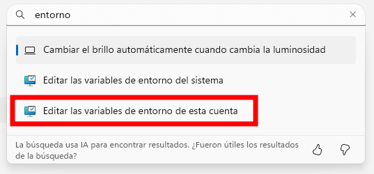
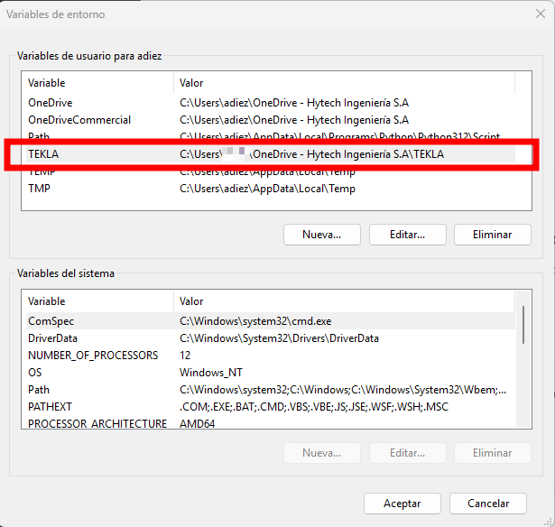

# Preguntas Frecuentes (FAQ)
{: .no_toc }

## Tabla de Contenidos
{: .no_toc .text-delta }

1. TOC
{:toc}


[← Volver al inicio](../index.md)

---
## Instalación y Configuración

### Validación IT: ¿está correctamente instalado?

```bash
# Ruta de instalación por defecto
C:\TeklaStructures\2022.0

# Ubicación de ajustes personalizados (user.ini)
C:\Users\<USUARIO>\AppData\Local\Trimble\Tekla Structures\2022.0\UserSettings
## Se debe habilitar visión de carpetas ocultas

```

### Definir variable de entorno

El TEKLA necesita definir una variable de entorno nueva en Windows.



1. Configuracion de Windows
2. Editar las variables de entorno de esta cuenta
3. Nombrar la ruta de la imagen debajo como TEKLA



### Archivos de inicio

El programa para funcionar correctamente necesita lo siguiente:
- Tener sincronizados los modelos a utilizar
- Tener sincronizadas las carpetas asociadas a nivel empresa y proyecto
- Copiar el archivo .ini de la empresa sobre la carpeta de UserSettings local

### Extensiones

El uso de extensiones depende del usuario, aunque las siguientes extensiones son obligatorias para todos los miembros del equipo

- ExcelToDrawing: para colocar hojas de excel en los dibujos
- NWDPlugin: para referenciar archivos .nwd en el modelo
- SelectSimilar: para seleccionar 

Cualquier extensión adicional utilizada deberá ser notificada al resto de los miembros del proyecto ya que todos deben contar con la herramienta.

Las extensiones se insta

Para extensiones, referir a [Tekla Warehouse](https://warehouse.tekla.com/)

```bash
# Ruta de extensiones (no eliminar los archivos al instalar)
C:\TeklaStructures\2022.0
```

### Voy a realizar cuadros, ¿necesito algo más?

Sí. El editor de cuadros y de símbolos maneja rutas independientes al programa. Ciertas propiedades avanzadas deben indicarse explícitamente.

Indicarlas entrando a 

---
## Previo a modelar

### Definición de punto base 

### Cargar referencias 

### Especificaciones tecnicas 

### Memorias de calculo, información 

---
## Modelado / errores comunes

### IB/IBE vs ID
```
IB: ingeniería básica
ID: ingeniería de detalle
```
El nivel de profundidad de los modelos dependerá de la etapa de ingeniería. Dichos alcances deben alinearse con el lider de especialidad dentro del proyecto, en función de las necesidades buscadas.

### Ciclo de vida de modelos - IB/IBE

A lo largo de un proyecto de ingeniería básica, a modo generalizado se enumera el listado de tareas vinculadas a TEKLA que se realizan a lo largo de un proyecto y sus responsabies

| Etapa | Responsable |
|----------|---------|
|1. Nomenclatura de modelos|LEP|
|2. Creación de modelos|Proyectista|
|3. Definición de criterios de modelado (atributos a considerar)|Proyectista/LEP|
|4. Modelado (sin armaduras ni uniones)|Proyectista|
|5. Administración de modelos (Trimble Connect)|LEP|

Esta tabla general enumera las etapas de uso del programa en un proyecto de ingeniería básica, donde:

- No se realizan planos
- Se busca obtener un MTO (a través de una correcta administración de modelos desde Trimble Connect)

En caso de emitir documentación (planos), se deberán sumar las tareas indicadas que correspondan del siguiente apartado.


### Ciclo de vida de modelos - ID

A lo largo de un proyecto de ingeniería de detalle, se enumeran las tareas que atraviesan los modelos de TEKLA y sus responsables

| Etapa | Responsable |
|----------|---------------|
|1. Nomenclatura de modelos|LEP|
|2. Creación de modelos|Proyectista|
|3. Definición de atributos a visualizar en maqueta|Coordinador de proyecto|
|4. Creación de preset de propiedades .ifc|Proyectista|
|5. Validación de criterios de modelado (atributos a considerar)|Proyectista/LEP|
|6. Modelado (con armaduras y uniones)|Proyectista|
|7. Modelado de atributos necesarios para informes (PDH) y planos así como los que se requieran ver en maqueta|Proyectista|
|8. Administración de modelos (Trimble Connect)|LEP|

### Gestión de modelos

En líneas generales se sugiere:

- Tener una nomenclatura de modelos validada por el coordinador y que permita su gestión.
- Utilizar continuamente Trimble Connect para hacer comentarios, obtener listados de cantidades, etc.
- En fase de ID, utilizar de forma obligatoria Trimble Connect para garantizar el mismo preset de propiedades en todos los modelos.
- En fase de ID, utilizar de forma obligatoria rutinas para mover archivos a las rutas del servidor y armar carpetas de trazabilidad de modelos.
  
### Quiero crear un filtro ¿Cómo hago?

Ver..

### A veces veo las partes de una forma y otra vez de otra

Explicar los modos de representación (Crtl+1 a 5)

### actualizacion de template local en modelos nuevos 
16/4/26 fer mati 

### Redondeo de coordenadas

### Configurar grillas

### Ubicación de fundaciones

### edicion de cuadro con guardar como
editar en creacion de tpls

### Perfil CBUILT para crear canaletas
ver modelo recinto proyecto pam25026 
ver modelo loc repulpin rti26011

### Anillos de fundación
para realizar mirar opción D900 (diametro) footing

### Concrete stairs componente

### Perfil OCTGON4800-4800 para tanques en forma de octogono

### Modelado correcto de la armadura

### Creación de antimaterial para chanfle a 45°
mta. ver modelo del proyecto rti26011, modelado del recinto


### En la numeración aparece el valor `Z0(?)`


### En el componente 1047 no aparecen mis bulones
modif separación

## Crear nuevos atributos a modelo existente

---
## Dibujos

### ¿Cómo creo un dibujo nuevo?

Para crear un dibujo nuevo se recomienda leer el apartado de [Crear nuevo GA drawing](../dibujo/generalidades_dibujo.md#crear-nuevo-ga-drawing).

### ¿Qué herramientas debo usar en el modo dibujo?

Las herramientas que pueden utilizarse en el modo dibujo podrán ser:

- Para crear vistas ver apartado ["Vistas dibujo"](../dibujo/vistas_dibujo.md).

- Para hacer anotaciones dentro de las vistas ver apartado ["Marcas, símbolos y notas"](../dibujo/marcas_simbolos_notas.md).

- Para elementos gráficos podrán ser los detallados en ["Elementos gráficos"](../dibujo/elementos_graficos.md).

- Para imprimir o exportar documentos ver apartado ["Impresión y exportación"](../dibujo/impresion_exportacion.md).


### ¿Cómo es el proceso para crear nuevos rótulos?

Para crear un nuevo rótulo primero se recomienda leer ["Crear un template de proyecto"](../proyecto_nuevo/creacion_template.md) y luego ["Creación de rótulo de proyecto"](../reportes/cuadro_rotulo.md).

### ¿Cuáles son los atributos que se utilizan en el modo dibujo y dónde se guardan?

Los atributos que se usan en el modo dibujo se guardarán en el archivo del modelo en la carpeta `Attributes`.

dentro de aquí, las extensiones más comunes del modo dibujo son:

| Extensión | Descripción | 
|----------|-------------|
| *.dwgsetting* | Propiedades de [exportación](../dibujo/impresion_exportacion.md#export-drawings-dwg) de archivos ".dwg" | 
| *.lev* | Propiedades de las ["Level marks"](../dibujo/marcas_simbolos_notas.md#level-mark) | 
| *.note* | Propiedades de las ["Notes"](../dibujo/marcas_simbolos_notas.md#notas) |
| *.drtxt* | Propiedades de los ["Text"](../dibujo/marcas_simbolos_notas.md#text) |
| *.wls* | Propiedades de las ["Weld marks"](../dibujo/marcas_simbolos_notas.md#weld-mark) |
| *.cs* | Propiedades de las ["Section marks"](../dibujo/marcas_simbolos_notas.md#section-mark) |
| *.detail* | Propiedades de las ["Detail marks"](../dibujo/marcas_simbolos_notas.md#detail-mark) |
| *.rm* | Propiedades de las ["Part marks"](../dibujo/marcas_simbolos_notas.md#weld-mark) en armadura |
| *.pm* | Propiedades de las ["Part marks"](../dibujo/marcas_simbolos_notas.md#part-mark) |
| *.vi* | Propiedades de las ["Vistas"](../dibujo/vistas_dibujo.md#crear-una-nueva-vista) |
| *.view mark* | Propiedades de los ["View marks"](../dibujo/vistas_dibujo.md#atributos-de-vista) |
| *.rep ; .adf ; .adnf ; .cuf ; .cunf ; .dsf ; .gdf ; .gdnf ; .OrgObjGrp ; PObjGrp ; SObjGrp ; .vf ; .vnf ; VObjGrp ; .wdf ; .wdnf* | Propiedades de los ["Filtros"](../dibujo/vistas_dibujo.md#filter) |
| *.lay* | Propiedades de los ["Layouts"](../proyecto_nuevo/creacion_template.md) |
| *.tpl* | Propiedades de los ["Templates"](../reportes/cuadro_rotulo.md) |
| *.gpg* | Propiedades de las ["REVCLOUDS"](../dibujo/marcas_simbolos_notas.md#revision-mark) |
| *.xml* | Propiedades de las ["Marcas armadura"](../dibujo/marcas_simbolos_notas.md#utilizando-un-componente) con un componente |

### ¿Cuál es la estructura de carpetas obligatoria en el modo dibujo?

La estructura de carpetas obligatorias serán las ubicadas dentro del modelo, donde se almacenarán los archivos para que estos no pierdan la ruta si otra persona lo usa. La carpeta a crear dentro podrá ser por ejemplo:

| Archivo | Ruta ejemplo | 
|----------|-------------|
| **Imagen** | *./Imágenes/Picture1.jpg* | 
|**.dwg** | *./Drawing/Drawing1.dwg* | 
|**Excel** | *./Excel/Excel1.xlsx* |
|**Texto** | *./Textos/Richtext1.rtf* |
|**.Xref**| *./Xref/archivo genérico.extensión genérica* |

{: .highlight}
> Este último (Xref) es recomendable en el caso en que se tengan pocos archivos vinculados al dibujo, mientras que las demás serán convenientes en los casos donde se tengan muchos archivos de ese tipo.

### no levanta el doc de referencia cargado en proyecto
Algunas veces puede suceder que un modelo de referencia no se puede visualizar bien en el modelo, y por ende en el dibujo. 
Por ejemplo al subir un `DWG 3D` los elementos sólidos pueden verse de forma unifilar. Una solución a esto es llevar el archivo a `Navisworks Manage` y transformar el modelo a `nwd` y luego volver a colocarlo como una referencia.
...

### no levanta el doc de referencia cargado en dibujo


### Vistas isometricas en tekla

Lo primero a realizar será colocar la vista en el model de forma isométrica, para esto las propiedades deberán ser las siguientes:


>Los valores de rotación que debe tener la vista serán los detallados en la figura anterior, en nuestro caso usamos el `1-2`

Luego editaremos los parámetros señalados en las propiedades de la vista.


Por último según las anteriores dos imágenes las propiedades de la vista quedarán de la siguiente manera:


### ¿Que pasa si elimino la marca de una vista?

Si elimino la marca de una vista al [crearse una vista en base a otra](../dibujo/vistas_dibujo.md#crear-vista-a-partir-de-vista-existente), se guarda la vista pero pierde la referencia y la posibilidad de editarse.

### No se ve mi modelo de referencia en la vista.

Es probable que esté mal la profundidad de la vista, por ejemplo en nuestro caso las cosas están modeladas en el +100.000, entonces...

--- 

## Lectura de archivos

### Guardé una determinada configuración y no la veo. ¿Por qué?

La estructura de lectura de archivos no es lineal pero el programa a nivel general tiene el siguiente orden de lectura:

Archivos de instalación
|_ Entorno SouthAmerica
|__ XS_FIRM
|___ XS_PROJECT
|____ MODELO

---

## Editor de cuadros

### No veo imágenes en el editor de cuadros

### ¿Cómo ordeno las filas en un cuadro?

### No sé cuál puede ser el atributo buscado

### Quiero rotar 90° mi texto

### Cómo hago condiciones sobre string

Los strings van entre ''. NO usar los "" para identifciarlos.l

### No levanta atributos a la hora de cargar un template

### Al generar una exclusion en la sintaxis de un rotulo  usar ** y no ""

---
## BIM Publisher

El BIM Publisher es una herramienta provista en el Tekla Warehouse que permite:

- Tener control de salida de varios modelos en simultáneo
- Definir formatos de extracción de modelos
- Extraer de forma automática múltiples modelos en una sola sesión sin hacerlo de forma manual.

Para mayor detalle referir al manual

### Tengo errores cuando comienza a intentar abrir modelos

### Lo corro y no pasa nada o tengo errores

---
## Trimble Connect

Trimble Connect es una herramienta que permite:

- Armar un proyecto e invitar a usuarios a participar o visualizar del mismo.
- Sincronizar todos los modelos propios de un proyecto, teniendo diálogo constante con lo que ejecuta quien modela.
- Realizar comentarios sobre los modelos subidos.
- Tener control de versiones de los modelos que conforman el proyecto.
- Realizar seguimiento de tareas, asignando responsables, plazos y estatus de cada punto.
- Visualizar propiedades/atributos de cada modelo, pudiendo exportar la información siguiendo algún filtro determinado.

Se trata de una herramienta central para el desarrollo del proyecto, ya que actúa de puente entre quienes modelan con quienes revisan la documentación a emitir.

Para mayor detalle referir al manual


## Características Avanzadas

### Como crear un material nuevo?

### al abrir tekla no aparece en la pantalla
MTA IT MAXIMIZAR

## NSA en estructuras


