# Preguntas Frecuentes (FAQ)
{: .no_toc }

## Tabla de Contenidos
{: .no_toc .text-delta }

1. TOC
{:toc}


[← Volver al inicio](../index.md)

---
## Instalación y Configuración

### Validación IT: ¿está correctamente instalado?

```bash
# Ruta de instalación por defecto
C:\TeklaStructures\2022.0

# Ubicación de ajustes personalizados (user.ini)
C:\Users\<USUARIO>\AppData\Local\Trimble\Tekla Structures\2022.0\UserSettings
## Se debe habilitar visión de carpetas ocultas

```

### Definir variable de entorno

El TEKLA necesita definir una variable de entorno nueva en Windows.


1. Configuracion de Windows
2. Editar las variables de entorno de esta cuenta
3. Nombrar la ruta de la imagen debajo como TEKLA


### Archivos de inicio

El programa para funcionar correctamente necesita lo siguiente:
- Tener sincronizados los modelos a utilizar
- Tener sincronizadas las carpetas asociadas a nivel empresa y proyecto
- Copiar el archivo .ini de la empresa sobre la carpeta de UserSettings local

### Extensiones

El uso de extensiones depende del usuario, aunque las siguientes extensiones son obligatorias para todos los miembros del equipo

- ExcelToDrawing: para colocar hojas de excel en los dibujos
- NWDPlugin: para referenciar archivos .nwd en el modelo
- SelectSimilar: para seleccionar 

Cualquier extensión adicional utilizada deberá ser notificada al resto de los miembros del proyecto ya que todos deben contar con la herramienta.

Las extensiones se insta

Para extensiones, referir a [Tekla Warehouse](https://warehouse.tekla.com/)

```bash
# Ruta de extensiones (no eliminar los archivos al instalar)
C:\TeklaStructures\2022.0
```

### Voy a realizar cuadros, ¿necesito algo más?

Sí. El editor de cuadros y de símbolos maneja rutas independientes al programa. Ciertas propiedades avanzadas deben indicarse explícitamente.

Indicarlas entrando a 

---
## Previo a modelar

### Al abrir tekla no aparece en la pantalla
Al iniciar la computadora y abrir el programa puede ser que aparezca como iniciado, el programa no responda y aparezca esta pestaña:
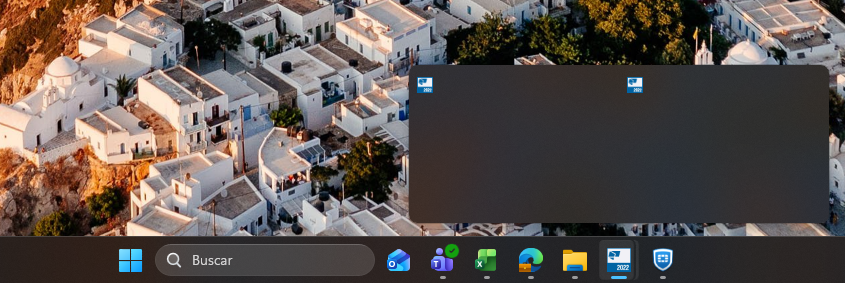
Para resolverlo, cliquear:
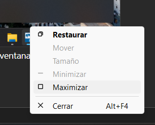
Estos problemas no se solucionan reiniciando y desconectando el HDMI de la pc, solo maximizando.

### Definición de punto base
Para definir el punto base debe leerse el apartado ["Definición de punto base"](../generalidades/generalidades.md#definición-punto-base).

### Cargar referencias 

Se puede leer apartado de ["Referencias externas"](../generalidades/generalidades.md#referencias-externas), también en ["¿Donde se suben los modelos?"](../connect/connect-ejecutor.md#donde-se-suben-los-modelos) se tiene noción de las referencias subidas en Trimble Connect, y por último en ["Ejemplo acero"](../ejemplos/ejemplos_acero.md#creación-de-proyecto-en-connect-y-colocación-de-referencias) se ve un ejemplo de como se cargan las referencias en Trimble Connect.
Para subir referencias en "Reference model", dentro de "model" se deben seguir los siguientes pasos:

1. Hacer click en "Reference models" 
2. Seleccionar `+ Add model`.
3. Hacer click en `Browse...` y seleccionar el archivo que se desea usar de referencia (recordando que el archivo debe estar con una ruta local de una carpeta del modelo como `./Xref` para que otras personas puedan abrir el modelo y ver la referencia).


*Pasos para cargar referencia desde el model*

Por último pueden modificarse parámetros como designarlo en un grupo, definir el origen asociado, desfasarlo del punto anterior alguna distancia, la escala o la rotación.

### Especificaciones técnicas 

Las especificaciones tecnicas, son los criterios de desarrolllo de la ingenieria de hytech, estas mismas suelen variar según el proyecto, se definen al iniciarlo. Consultar al LEP para mayore información.

### Memorias de cálculo, información 
Las memorias son documentos que contienen el cálculo de la estructura a modelar, las mismas contienen información como las dimensiones, alturas, niveles (tanto superficiales o de fundación), cargas, etc.  Estos mismos documentos, pueden ir variando según pase el tiempo, por lo tanto, nada es fijo hasta que se emita.

---
## Modelado / errores comunes

### IB/IBE vs ID
```
IB: ingeniería básica
ID: ingeniería de detalle
```
El nivel de profundidad de los modelos dependerá de la etapa de ingeniería. Dichos alcances deben alinearse con el lider de especialidad dentro del proyecto, en función de las necesidades buscadas.

### Ciclo de vida de modelos - IB/IBE

A lo largo de un proyecto de ingeniería básica, a modo generalizado se enumera el listado de tareas vinculadas a TEKLA que se realizan a lo largo de un proyecto y sus responsabies

| Etapa | Responsable |
|----------|---------|
|1. Nomenclatura de modelos|LEP|
|2. Creación de modelos|Proyectista|
|3. Definición de criterios de modelado (atributos a considerar)|Proyectista/LEP|
|4. Modelado (sin armaduras ni uniones)|Proyectista|
|5. Administración de modelos (Trimble Connect)|LEP|

Esta tabla general enumera las etapas de uso del programa en un proyecto de ingeniería básica, donde:

- No se realizan planos
- Se busca obtener un MTO (a través de una correcta administración de modelos desde Trimble Connect)

En caso de emitir documentación (planos), se deberán sumar las tareas indicadas que correspondan del siguiente apartado.


### Ciclo de vida de modelos - ID

A lo largo de un proyecto de ingeniería de detalle, se enumeran las tareas que atraviesan los modelos de TEKLA y sus responsables

| Etapa | Responsable |
|----------|---------------|
|1. Nomenclatura de modelos|LEP|
|2. Creación de modelos|Proyectista|
|3. Definición de atributos a visualizar en maqueta|Coordinador de proyecto|
|4. Creación de preset de propiedades .ifc|Proyectista|
|5. Validación de criterios de modelado (atributos a considerar)|Proyectista/LEP|
|6. Modelado (con armaduras y uniones)|Proyectista|
|7. Modelado de atributos necesarios para informes (PDH) y planos así como los que se requieran ver en maqueta|Proyectista|
|8. Administración de modelos (Trimble Connect)|LEP|

### Gestión de modelos

En líneas generales se sugiere:

- Tener una nomenclatura de modelos validada por el coordinador y que permita su gestión.
- Utilizar continuamente Trimble Connect para hacer comentarios, obtener listados de cantidades, etc.
- En fase de ID, utilizar de forma obligatoria Trimble Connect para garantizar el mismo preset de propiedades en todos los modelos.
- En fase de ID, utilizar de forma obligatoria rutinas para mover archivos a las rutas del servidor y armar carpetas de trazabilidad de modelos.
  
### Quiero crear un filtro ¿Cómo hago?

Para crear un filtro puede tomarse de referencia el ejemplo creado para ["grating"](../ejemplos/ejemplos_filtros.md) o la explicación en ["filtros"](../dibujo/vistas_dibujo.md#filter).

### A veces veo las partes de una forma y otra vez de otra

Esto ocurre ya que el programa permite ver de 5 formas diferentes los elementos del modelo:
- Estructura alambre.
- Estructura alambre sombreado.
- Partes escala grises.
- Partes render.
- Partes seleccionadas.

Los [métodos abreviados de teclado](../manuales/2022-Tekla-Structures-EN-KB-Shortcuts-flyer.pdf) que usamos son:

Representación | Atajo |
|-------|---------------|
|Estructura alambre **(Partes)**.|`Ctrl+1`|
|Estructura alambre sombreado **(Partes)**.|`Ctrl+2`|
|Partes escala grises **(Partes)**.|`Ctrl+3`|
|Partes render **(Partes)**.|`Ctrl+4`|
|Partes seleccionadas **(Partes)**.|`Ctrl+5`|
|Estructura alambre **(Componentes)**.|`Mayús+1`|
|Estructura alambre sombreado **(Componentes)**.|`Mayús+2`|
|Partes escala grises **(Componentes)**.|`Mayús+3`|
|Partes render **(Componentes)**.|`Mayús+4`|
|Partes seleccionadas **(Componentes)**.|`Mayús+5`|
|Estructura alambre **(Referencias)**.|`Ctrl+Mayús+1`|
|Estructura alambre sombreado **(Referencias)**.|`Ctrl+Mayús+2`|
|Partes escala grises **(Referencias)**.|`Ctrl+Mayús+3`|
|Partes render **(Referencias)**.|`Ctrl+Mayús+4`|
|Partes seleccionadas **(Referencias)**.|`Ctrl+Mayús+5`|

### Actualizacion de template local en modelos nuevos 
A la hora de actualizar templates, se debe de tener en cuenta, que los errores del mismo, se verán reflejados frente a la nueva corrección del .tpl. Estos archivos, se actualizaran solos cuando se decida crear un nuevo modelo, para los modelos viejos, es decir, que contengan un cuadro pasado, se debe de actualizar a la versión mas reciente del mismo. 

### Redondeo de coordenadas
A la hora de realizar el modelado de fundaciones o estructuras metalicas puede suceder que las coordenadas, queden fuera de un numero redondo (0 o 5). Se recomienda, siempre que sea posible, **redondear** las  coordenadas para que sean numeros redondos por ejemplo: 

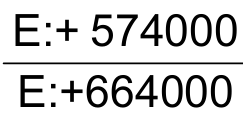

### Configurar grillas
Las grillas se utilizan dependiendo del ejecutor, las mismas son configurables en los 3 ejes, se pueden copiar, etc. Para mas informacón se recomienda leer este [Artículo](https://support.tekla.com/doc/tekla-structures/2026/mod_creating_a_grid)

### Ubicación de fundaciones
Las mismas se deben de ubicar según la información de la MC, para saber si está correctamente ubicada, se debe de mantener el NSH y el NF de la memoria. la fundación no debe de estár totalmente enterrada, (salvo contraindicación), y debe de tener un despeje indicado. Por ejemplo:
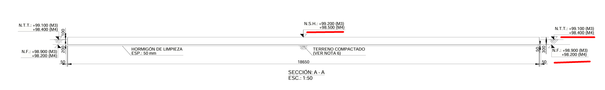

### Canaletas uso del perfíl CBUILT
Hay varias maneras de hacer canaletas en recintos o plateas, las mismas pueden estar hechas, con antimateriales o perfiles de viga, en específico el perfil CBUILT, estos tienen por defecto 4 valores parametrizados:
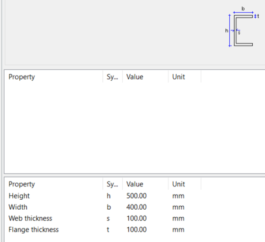
Estos permiten modificar su ancho, alto y espesor, definiendo su largo a la hora de modelar. Estos perfiles sirven para el modelado de canaletas, a pequeña escala:
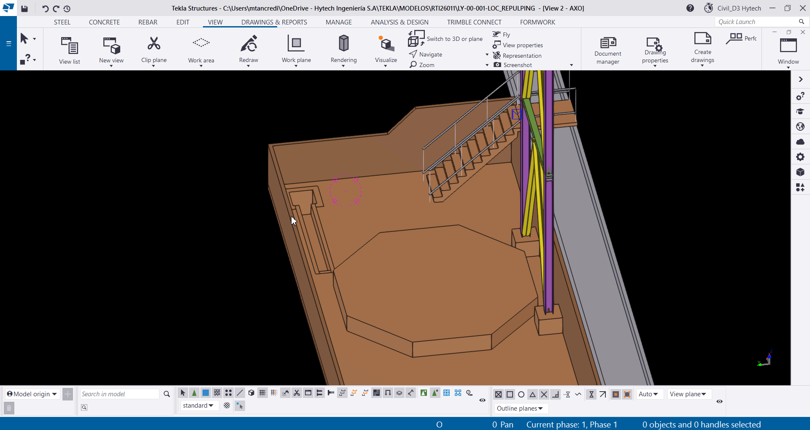
Y a GRAN escala:
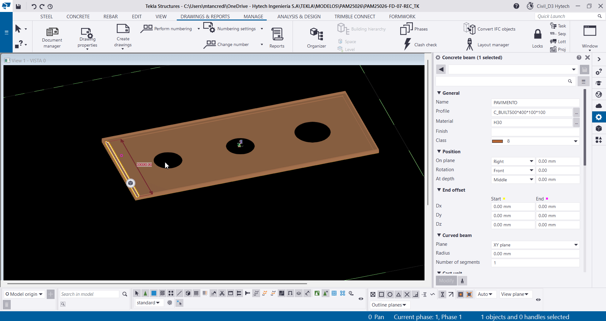

### Tanques: Anillos de fundación

Los anillos de fundación son elementos circulares, los mismos, suelen utilizarse en tanques de gran escala, llevan armadura siguiendo la forma del encofrado. Para realizarlos en tekla se deben de usar la opción de footing, utilizando el prefijo `D+DIAMETRO` Por ejemplo: D900
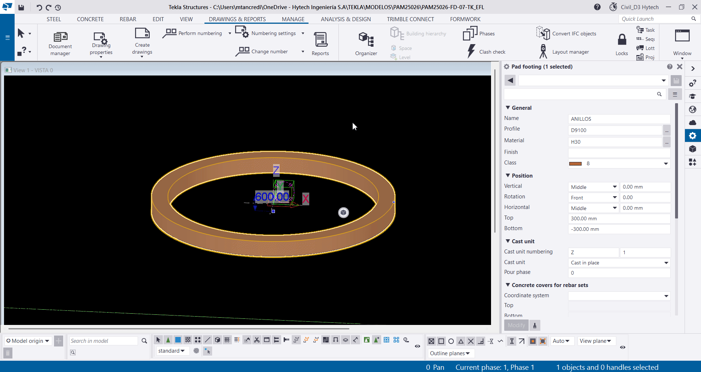

### Tanques: Fundación octogonal
Siguiendo con el modelado de tanques, puede que el mismo requiera en vez de un anillo o base aislada, un tanque octogonal, el mismo se hace con un perfil de footing, este es el perfil `OCTGON` 
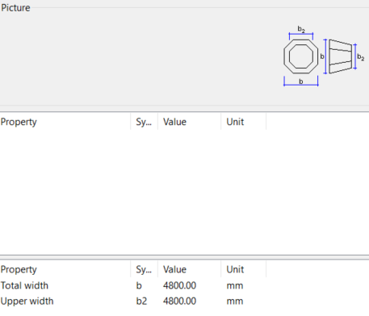
Este perfil nos permite modificar el largo y ancho sabiendo siempre que va a tener 8 lados, su altura se modifica con la [modificación directa](../generalidades/generalidades.md#modificación-directa-d).

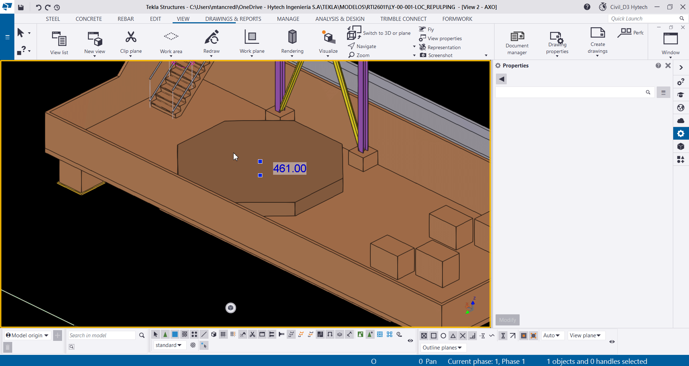
### Concrete stairs componente
En tekla para realizar escaleras de hormigón armado se debe de usar el componente n° 65: 
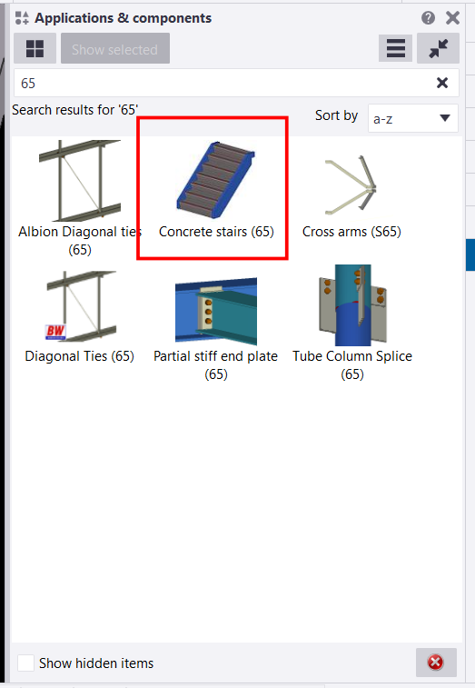
Este componente nos permite modificar la alzada, pedada, y alto del escalón
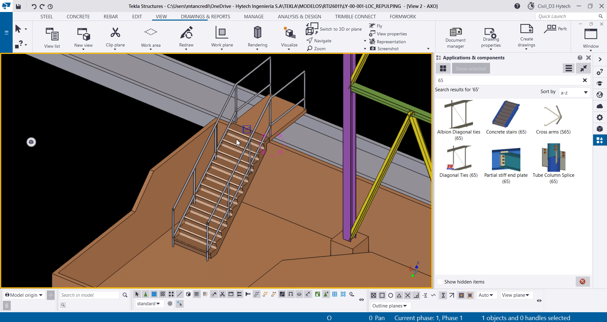

### En la numeración aparece el valor `Z0(?)`
Puede ocurrir que cuando uno enumere armaduras, puede ser que ocurran errores a la hora de enumerar, esto puede deberse a muchas razones, pero suele suceder por algun error a la hora de la numeración propia del programa, o si hay varias partes con distintas armaduras y no está siendo utilizada la unidad de colada. Para solucionar estos errores, se debe seguir los pasos descriptos en [armaduras](../hormigon/armaduras.md#numeración) y además, verificar el uso de la [unidad de colada](../hormigon/armaduras.md#unidad-de-colada). 

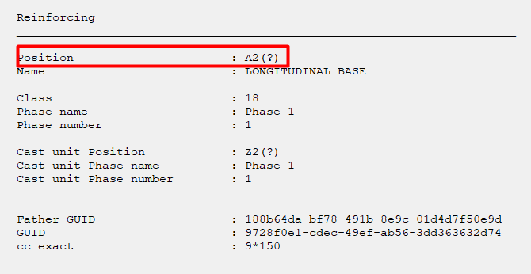

### Componente 128

El componente 128 por defecto hace un recorte de alas ovalado, y para modificar esto (por ejemplo ponerle un corte a 45°) debe modificarse desde acá:


*Modificar corte de alas*

y en picture podrá darse una medida si se quisiera.


*Modificar dimensiones de chaflán en alas*

### Verificar los NSA de la estructura

Para verificar que los NSA sean correctos, los elementos deben de estar visualmente apoyados, independientemente si son patines o bandejas de electricidad, los mismos deben de estar apoyados en la estructura. y seguir las recomendaciones del LEP. 

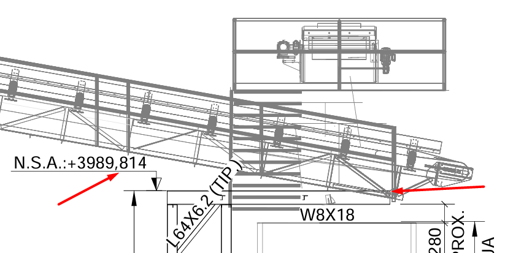

### El modelo no se ve:

Algunos modelos con muchos modelos de referencias o con estructuras complejas, sea en DWG, NWD. Suelen realentizar el programa, generando bugs que puede aparentar que el modelo se "rompió". Lo mas probable es que sea un simple error de rendimiento, estos se pueden corregir en este caso rotando la cámara del modelo o regenerando la vista de la misma.


### No puedo seleccionar nada

Ocasionalmente puede suceder que no nos deje seleccionar nada del modelo, ni partes, ni modelos de referencia. Esto sucede cuando las barras selectoras no tienen seleccionada ninguna ficha:

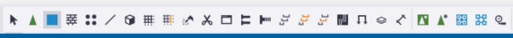
Si el mismo aparece como en la imagen superior, el programa no deja seleccionar lo que no está seleccionado en esa barra, para solucionarlo habrá que seleccionar el icono del mouse en el selector:

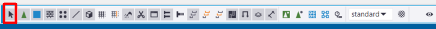
Tocar este ícono, prendera las opciones que se ven mas oscuras permitiendo así seleccionar todas las partes.

---
## Dibujos

### ¿Cómo creo un dibujo nuevo?

Para crear un dibujo nuevo se recomienda leer el apartado de [Crear nuevo GA drawing](../dibujo/generalidades_dibujo.md#crear-nuevo-ga-drawing).

### ¿Qué herramientas debo usar en el modo dibujo?

Las herramientas que pueden utilizarse en el modo dibujo podrán ser:

- Para crear vistas ver apartado ["Vistas dibujo"](../dibujo/vistas_dibujo.md).

- Para hacer anotaciones dentro de las vistas ver apartado ["Marcas, símbolos y notas"](../dibujo/marcas_simbolos_notas.md).

- Para elementos gráficos podrán ser los detallados en ["Elementos gráficos"](../dibujo/elementos_graficos.md).

- Para imprimir o exportar documentos ver apartado ["Impresión y exportación"](../dibujo/impresion_exportacion.md).

### ¿Cómo es el proceso para crear nuevos rótulos?

Para crear un nuevo rótulo primero se recomienda leer ["Crear un template de proyecto"](../proyecto_nuevo/creacion_template.md) y luego ["Creación de rótulo de proyecto"](../reportes/cuadro_rotulo.md).

### ¿Cuáles son los atributos que se utilizan en el modo dibujo y dónde se guardan?

Los atributos que se usan en el modo dibujo se guardarán en el archivo del modelo en la carpeta `Attributes`.

dentro de aquí, las extensiones más comunes del modo dibujo son:

<details>
<summary>
    Ver tabla completa
</summary>

| Extensión | Descripción | 
|----------|-------------|
| *.dwgsetting* | Propiedades de [exportación](../dibujo/impresion_exportacion.md#export-drawings-dwg) de archivos ".dwg" | 
| *.lev* | Propiedades de las ["Level marks"](../dibujo/marcas_simbolos_notas.md#level-mark) | 
| *.note* | Propiedades de las ["Notes"](../dibujo/marcas_simbolos_notas.md#notas) |
| *.drtxt* | Propiedades de los ["Text"](../dibujo/marcas_simbolos_notas.md#text) |
| *.wls* | Propiedades de las ["Weld marks"](../dibujo/marcas_simbolos_notas.md#weld-mark) |
| *.cs* | Propiedades de las ["Section marks"](../dibujo/marcas_simbolos_notas.md#section-mark) |
| *.detail* | Propiedades de las ["Detail marks"](../dibujo/marcas_simbolos_notas.md#detail-mark) |
| *.rm* | Propiedades de las ["Part marks"](../dibujo/marcas_simbolos_notas.md#weld-mark) en armadura |
| *.pm* | Propiedades de las ["Part marks"](../dibujo/marcas_simbolos_notas.md#part-mark) |
| *.vi* | Propiedades de las ["Vistas"](../dibujo/vistas_dibujo.md#crear-una-nueva-vista) |
| *.view mark* | Propiedades de los ["View marks"](../dibujo/vistas_dibujo.md#atributos-de-vista) |
| *.rep ; .adf ; .adnf ; .cuf ; .cunf ; .dsf ; .gdf ; .gdnf ; .OrgObjGrp ; PObjGrp ; SObjGrp ; .vf ; .vnf ; VObjGrp ; .wdf ; .wdnf* | Propiedades de los ["Filtros"](../dibujo/vistas_dibujo.md#filter) |
| *.lay* | Propiedades de los ["Layouts"](../proyecto_nuevo/creacion_template.md) |
| *.tpl* | Propiedades de los ["Templates"](../reportes/cuadro_rotulo.md) |
| *.gpg* | Propiedades de las ["REVCLOUDS"](../dibujo/marcas_simbolos_notas.md#revision-mark) |
| *.xml* | Propiedades de las ["Marcas armadura"](../dibujo/marcas_simbolos_notas.md#utilizando-un-componente) con un componente |

</details>

### ¿Cuál es la estructura de carpetas obligatoria en el modo dibujo?

La estructura de carpetas obligatorias serán las ubicadas dentro del modelo, donde se almacenarán los archivos para que estos no pierdan la ruta si otra persona lo usa. La carpeta a crear dentro podrá ser por ejemplo:

| Archivo | Ruta ejemplo | 
|----------|-------------|
| **Imagen** | *./Imágenes/Picture1.jpg* | 
|**.dwg** | *./Drawing/Drawing1.dwg* | 
|**Excel** | *./Excel/Excel1.xlsx* |
|**Texto** | *./Textos/Richtext1.rtf* |
|**.Xref**| *./Xref/archivo genérico.extensión genérica* |

{: .highlight}
> Este último (Xref) es recomendable en el caso en que se tengan pocos archivos vinculados al dibujo, mientras que las demás serán convenientes en los casos donde se tengan muchos archivos de ese tipo.


### Vistas isometricas en tekla

Lo primero a realizar será colocar la vista en el model de forma isométrica, para esto las propiedades deberán ser las siguientes:


>Los valores de rotación que debe tener la vista serán los detallados en la figura anterior, en nuestro caso usamos el `1-2`

Luego editaremos los parámetros señalados en las propiedades de la vista.


Por último según las anteriores dos imágenes las propiedades de la vista quedarán de la siguiente manera:


### ¿Que pasa si elimino la marca de una vista?

Si elimino la marca de una vista al [crearse una vista en base a otra](../dibujo/vistas_dibujo.md#crear-vista-a-partir-de-vista-existente), se guarda la vista pero pierde la referencia y la posibilidad de editarse.

### No se ve mi modelo de referencia en la vista.

Es probable que esté mal la profundidad de la vista, por ejemplo en nuestro caso las cosas están modeladas en el `+100.000`, entonces si el modelo de referencia está modelado en el 0.00 es muy probable que no se vea.


*Propiedades a editar para la profundidad de la vista*

En el ejemplo que mencionamos anteriormente, nuestro `Depth down` estará en `+100.000` para alcanzar al modelo de referencia que está en el `0.00`, y el valor `Depth up` podremos ponerle cualquier valor en este caso.

{: .note}
> Si el caso fuese al revés, donde nosotros modelaramos en el 0.00, y el modelo de referencia estuviese en +100.000, el valor de `Depth up` será 100.000 y el otro libre.

### ¿Como creo un filtro?

Para crear un filtro puede tomarse de referencia el ejemplo creado para ["grating"](../ejemplos/ejemplos_filtros.md) o la explicación en ["filtros"](../dibujo/vistas_dibujo.md#filter).

### ¿Puedo editar un simbolo?

Si se quiere editar un simbolo ya existente, es posible realizarlo, pero es recomendable en todo caso duplicar el que se quiere editar y editarlo, ya que si ese otro simbolo se tiene en otro lugar puede perjudicar a otro plano.


*Pasos para ingresar al editor de simbolos*

Se abrirá el [editor de simbolos](../dibujo/marcas_simbolos_notas.md#simbolos) y allí seleccionaremos el símbolo que queremos usar de referencia, ponemos copy y lo pegamos donde deseemos (donde lo copiemos será el número al que corresponde el símbolo).


Luego lo guardamos y cerramos el editor de simbolos, para luego en `Symbol properties`/`Number` poner el número al que corresponde su nuevo símbolo.

{: .warning}
Tener en cuenta que esto modificará el archivo de simbolos de todos, por lo que hay que tener cuidado en no eliminar ni sobreescribir nada.

### ¿Puedo crear un dibujo a partir de otro?

Esta es una de las opciones que nos permite el [document manager](../dibujo/generalidades_dibujo.md#document-manager), haciendo click derecho en el dibujo a copiar aparecera en la lista desplegable "Copy drawing views/with layout" (ver su uso en el link anterior).

### A la hora de abrir un dibujo, tarda mucho en abrir, se realentiza. 

Si el modelo tiene muchos modelos de referencia, puede ser que el mismo ande lento al abrir un dibujo, tarde en abrir, procese muchos cambios o objetos. Para solucionar momentaneamente este problema, se puede recurrir a borrar los archivos de la carpeta `RefCacheFolders` ya que la misma almacena, archivos temporales provenientes de los modelos de referencia insertados en el modelo, esos archivos se generan cada vez que se realiza un cambio en el mismo. Los mismos no guardan información importante y el modelo puede precindir de ellos. 

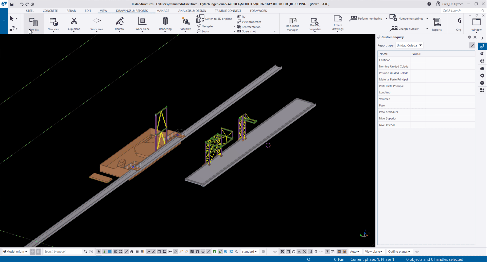

### Recuadros PHANTOM para delimitación de perimetros

Los recuadros en el tipo de linea PHANTOM son utiles para marcar permietros cuando no tienen formas convencionales, o cuando conviven con un layout de ubicación:

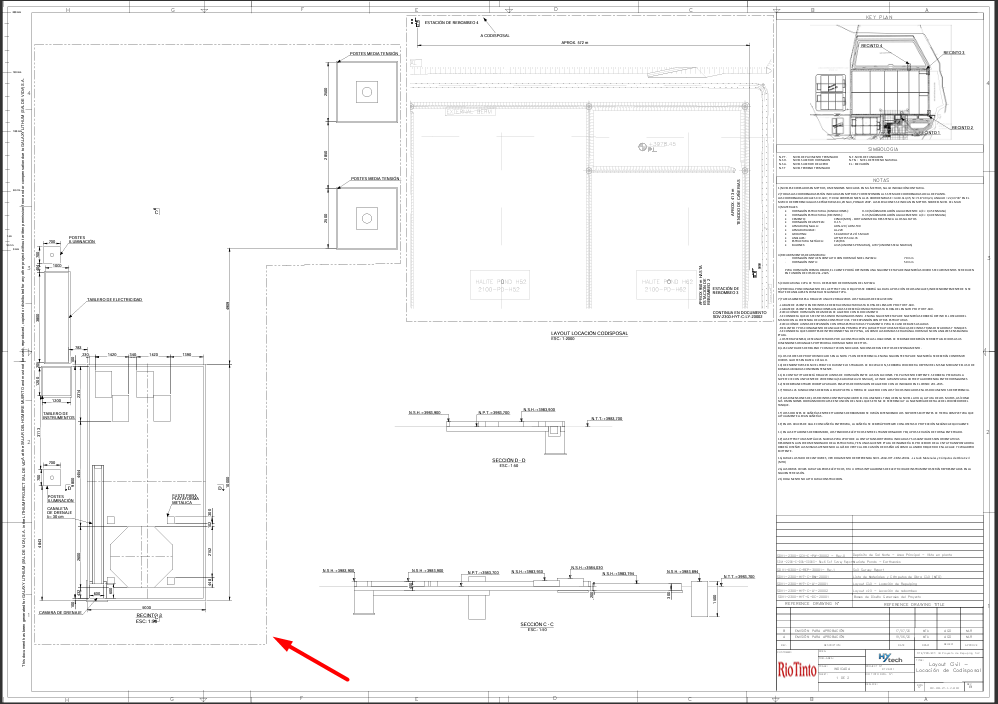

### Cambiar colores en la representación del dibujo
Con la tecla **`B`**, se puede cambiar la representación y ver como se verá impreso:
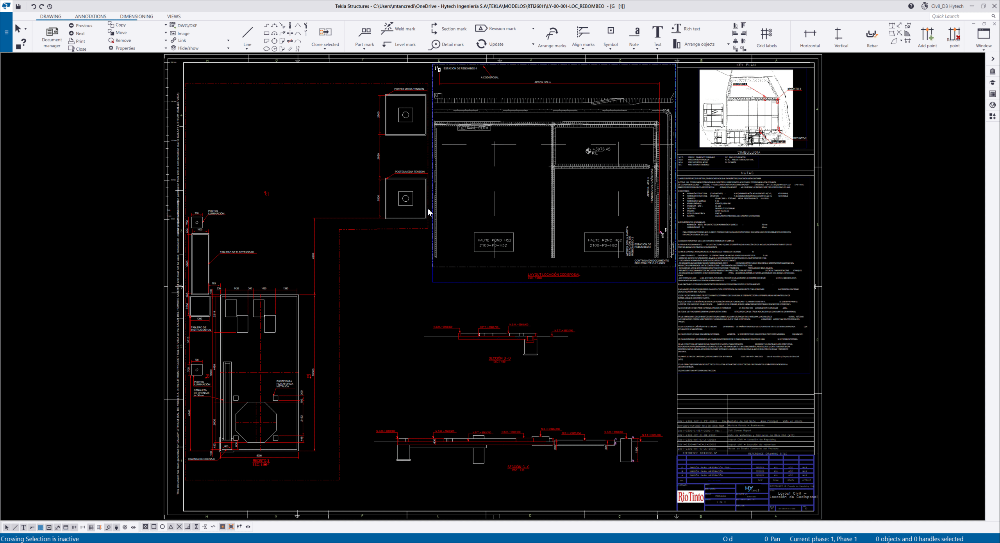

--- 

## Lectura de archivos

### Guardé una determinada configuración y no la veo. ¿Por qué?

La estructura de lectura de archivos no es lineal pero el programa a nivel general tiene el siguiente orden de lectura:

Archivos de instalación
|_ Entorno SouthAmerica
|__ XS_FIRM
|___ XS_PROJECT
|____ MODELO

---

## Editor de cuadros

### Agregar una imagen en el template / No veo imágenes en el editor de cuadros

Para agregar imágenes a los cuadros, recordar que el editor de cuadros trabaja de manera independiente al TEKLA, por lo que allí desde las preferencias del programa deberá editarse la ruta para mapear al `bitmaps` de la carpeta `FIRM`. Se deberá configurar la ruta descripta en [ cuadro rótulo](../reportes/cuadro_rotulo.md#validación-de-la-ruta-file-locations-en-el-template-editor).


### No sé cuál puede ser el atributo buscado
Los atribitos se dividen en varias categorias, los mas utilizados son los 
1. Proyect
2. Revisión
3. User defined
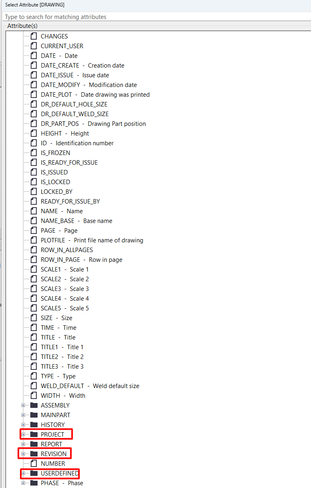

### Quiero rotar 90° mi texto
Cuando hay textos que requieran estar en vertical, se debe de modificar el valor de rotación
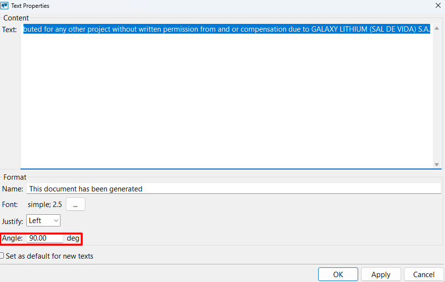

### Cómo hago condiciones sobre string

Cuando se quiere aplicar una condición en el editor de cuadros, en un value field. El lenguaje del editor de cuadros no va a leer la exclusión tipica: "", se debe de usar: ''. Por ejemplo:

```bash
if (CopyField("CODIGO_1")!= 0) then
  "1. "
else
  ""
endif
```
De esta manera la condición la tomará correctamente.

### Sintax error **
Al copiar en el editor de cuadros expresiones de código, pueden saltar ciertos errores de syntax, estos son solo errores de reconocimiento, puesto a que a la hora de la ejecución funcionará correctamente.
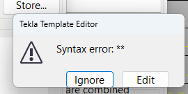
Si bien puede que un error de syntax no haga funcionar el cuadro, se recomienda probar el cuadro igualmente saliendo el error para identificar si realmente el error es el que está trabando el cuadro. 

### Edicion de cuadro con guardar como
Para ahorrar tiempo, con cuadros complejos, como puede ser la sintaxis del rotulo con los documentos de referencia, se recomienda, hacer un `Save as` del cuadro a editar y crear el nuevo cuadro en base a este: 
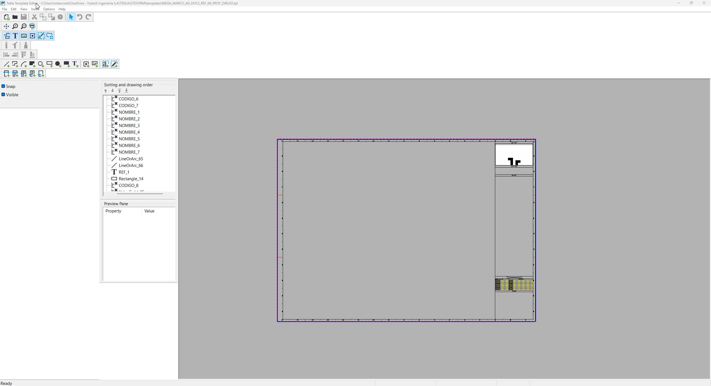

---
## BIM Publisher

### Tengo errores cuando comienza a intentar abrir modelos
Esto se puede deber a muchas causas, 
1. Inicio de sesión:
Para operar el programa, se debe de tener una licencia asignada al usuario que ejecutará la rutina. Si no se tiene una asignada el programa no se podrá ejecutar y el programa tirará error. 

2. Corrección de rutas `XS_SYSTEM` Y `XS_FIRM`:
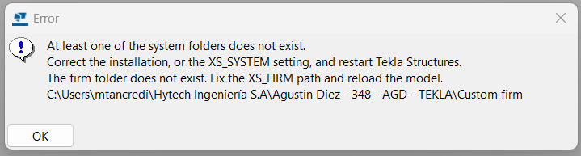
Para evitar el error, se debe de mantener la ruta XS_SYSTEM en la opción `SYSTEM`

3. No utilizar el programa cuando se corre la rutina:
Cuando se corra la rutina, los ejecutores no deben de usar el programa en algun modelo que forme parte de la misma. Ya que cuando la rutina se ejecute, tirará un error diciendo que el modelo, está en uso, y el mismo no saldrá en la exportación. 


### Al iniciar a correr se queda estático

Al iniciar la exportación el programa puede quedar paralizado, esto lo realiza siempre que se ejecuta la rutina, se debe de esperar 3 minutos para que inicie la exportación automatica de los modelos seleccionados. 

### Usar filtros de representación

Para utilizar filtros de representación en la exportación se debe seleccionar en la siguiente pestaña:
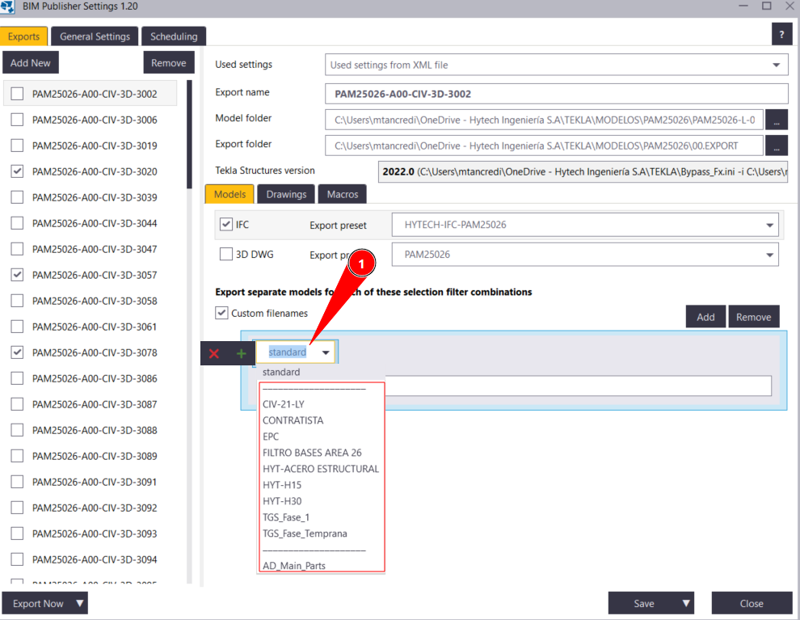


### Utilizar la configuración de una PC en otra distinta

Si se requiere que otro usuario use la configuración de otro, se debe hacer los siguientes pasos: 
1. Exportar la configuración:
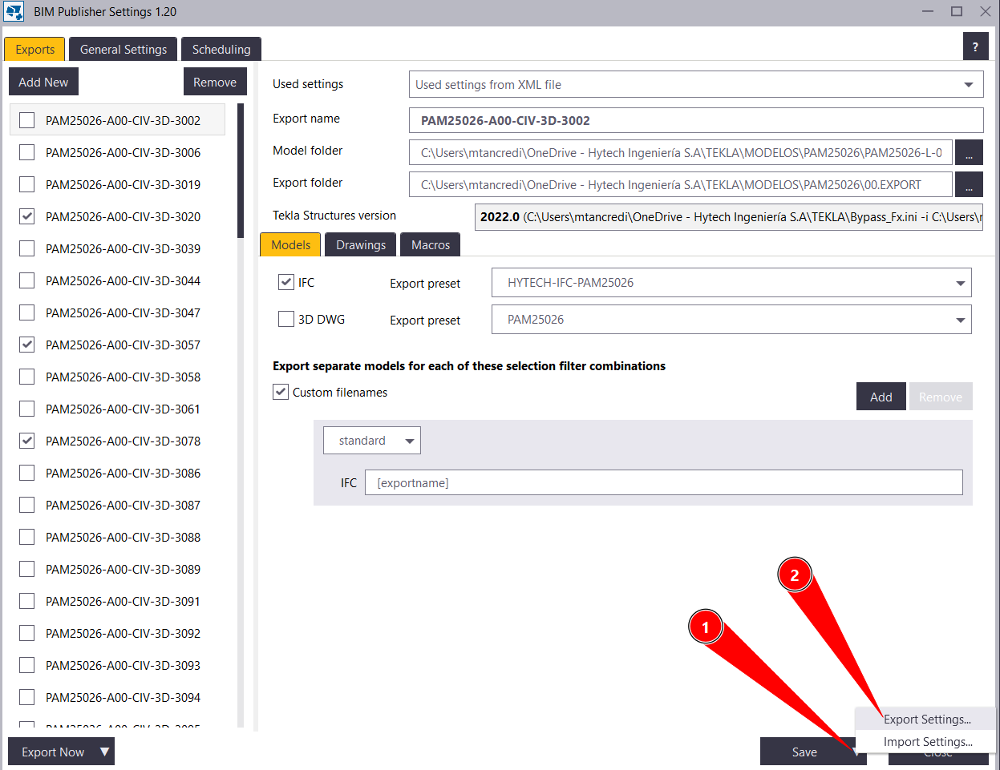
*Como se muestra en la imagen, las rutas especificas quedarán con el nombre del ultimo usuario que ejecutó esta rutina*
2. Cambiar rutas especificas:
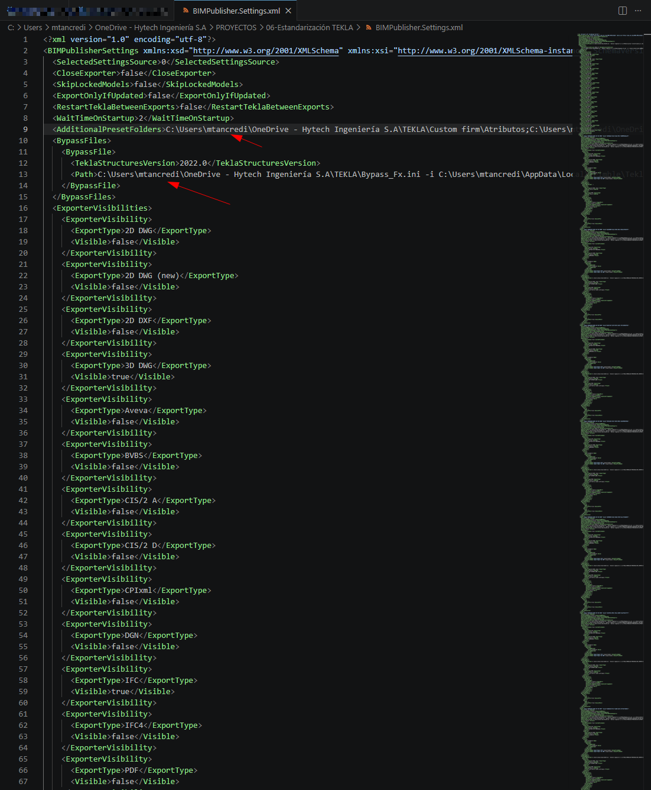
*En un editor que pueda abrir `.html` se debe de cambiar las rutas que contengan el usuario anterior y remplazar por el nuevo*
3. Importar la configuración:
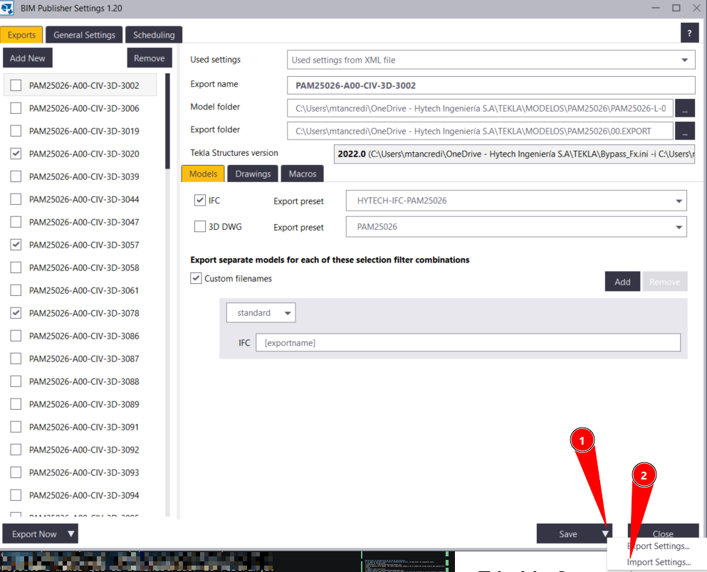
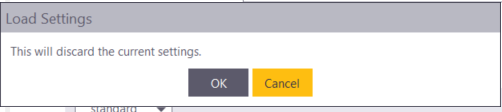
*Saldrá este aviso que nos recuerda que perderemos las configuraciones que tengamos actuales, se recomienda guardar la versión que se podria perder como un archivo local*
4. La importación finalizará y se podrá ejecutar de manera correcta, se recomienda hacer una corrida pequeña asi se puede verificar que todo salga correctamenete. 

---
## Trimble Connect

### Roles en los proyectos

Al usar el programa para la visualización de la maqueta civil, se debe de establecer roles claros para la administración de la plataforma:
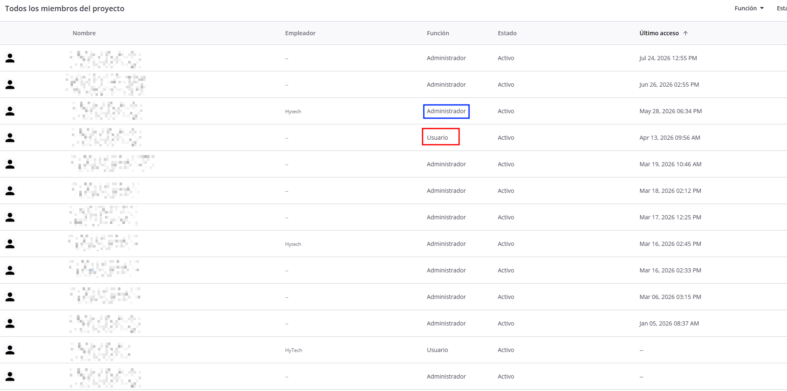
Puede haber muchas personas en el proyectos, y es clave para una gestión eficiente, que este la clara definición de roles:

**Usuarios del proyecto**
- Dependiendo de la configuración del proyecto, pueden invitar a otros a colaborar en proyectos.
- Tiene acceso a todas las carpetas y archivos del proyecto a menos que el administrador lo restrinja.
- Podrán realizar algunas operaciones de gestión para los datos que creen dentro del proyecto, como eliminar Vistas, Tareas Finales, Revocar el acceso a datos compartidos con un usuario específico, pero no podrán restaurar el contenido eliminado de archivos o carpetas (incluso si fueron ellos quienes realizaron la operación de eliminación).
- Tendrán acceso limitado a los datos creados por otros usuarios, a menos que hayan sido compartidos o asignados explícitamente con ellos.

**Administradores de proyectos**
- Puede invitar a cualquier persona al proyecto y proporcionar acceso al administrador al mismo. Tambien puede crear/editar/eliminar grupos de usuarios.
- Puede asignar un grupo de usuarios a un usuario mientras le invita.
- Puede establecer permisos de carpeta para cualquier usuario, sin embargo, los permisos de carpeta no se aplican a los administradores porque tienen acceso completo.
- Puede eliminar a cualquier usuario y editar los roles de usuario.

### ¿Cómo uso la `Data Table`?
La Tabla de Datos se puede usar para colorear, ordenar y filtrar objetos según sus atributos. Ademas de mostrar las propiedades del modelo, incluidas las propiedades personalizadas, en una vista de cuadrícula para fines de informes.
Se recomienda, filtrar según la propiedad que se busque, para proyectos grandes, es muy recomendable utilizar esta herramienta, para obtener datos de computos.
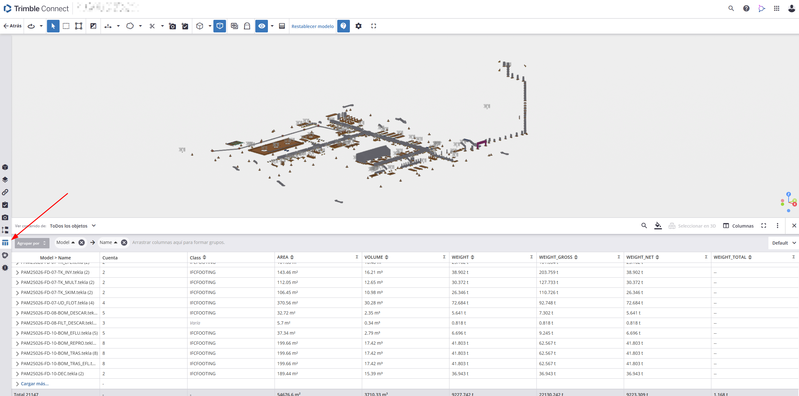

### Quiero ver otras propiedades en `Data Table`

El Trimble connect, posee la capacidad de leer varios tipos de archivos, uno de ellos es: `.tekla` (solo lectura en Trimble Connect). Los archivos `.IFC` se pueden subir directamente a Trimble Connect desde el cuadro de diálogo Exportar IFC
El formato `.tekla` está optimizado para rapidez y colaboración ligera dentro del ecosistema de Trimble, mientras que `.ifc` es el estándar para flujos de trabajo BIM abiertos.
Y en las `Data Table` se pueden filtrar los datos para obtener información de los dos tipos de archivos. 

### ¿Cómo genero un comentario?
1. Abrir pestaña de tareas
2. Seleccionar el ícono de crear nueva tarea
3. Asignar titulo y descripción
4. Asignar fecha de finalización
5. Asignar prioridad
6. Asignar ejecutor y etiqueta

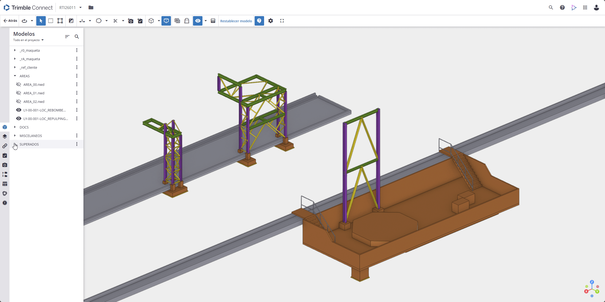

### ¿Quién genera comentarios sobre los modelos?

Los comentarios son responsabilidad del LEP, el mismo, debe indicar correcciones o comentarios al agregar al modelado. Una vez asignada la tarea, le llegará una notificación por mail al usuario asignado.

### ¿Donde puedo ver todos las tareas abiertas de un proyecto?
El trimble connect, nos permite filtar las tareas asignadas a uno mismo o todas las tareas asignadas a los distintos usuarios del proyecto. Tambien podemos ver las tareas cerradas o pendientes.
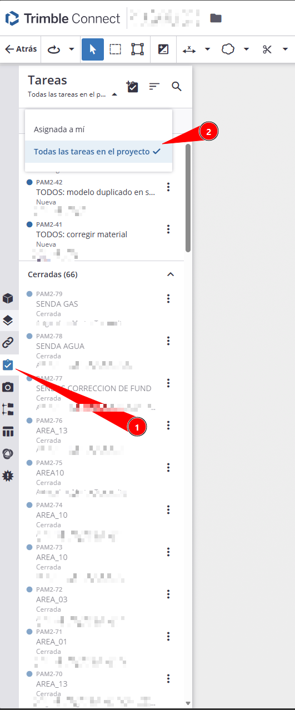

## Características Avanzadas

### Como crear un material nuevo?
Para crear un material nuevo en el programa hay que editar 2 archivos, el archivo denominado `HYTECH.lis`, esta extensión se edita en un editor como el `Visual Studio Code` o el `Notepad++`, por ejemplo:


```bash

MATERIAL_NAME = "F24"; MATERIAL_TYPE = 1;
{
    ALIAS_NAME1                    ""
    ALIAS_NAME2                    ""
    ALIAS_NAME3                    ""
    PROFILE_DENSITY                7.850000E+03
    PLATE_DENSITY                  7.850000E+03
    MODULUS_OF_ELASTICITY          0.000000E+00
    POISSONS_RATIO                 0.000000E+00
    THERMAL_DILATATION             0.000000E+00
    ACTIVE_DESIGN_CODE             0
    STEEL.FY                       0.000000E+00
    STEEL.FU                       0.000000E+00
    EA95.FY                        0.000000E+00
    USMETRIC.YIELD_STRENGTH        0.000000E+00
    USMETRIC.ULTIMATE_STRENGTH     0.000000E+00
    AISC.YIELD_STRENGTH            0.000000E+00
    AISC.ULTIMATE_STRENGTH         0.000000E+00
    EC3.FY_UNDER_40_MM             0.000000E+00
    EC3.FY_40_TO_100_MM            0.000000E+00
    EC3.FU_UNDER_40_MM             0.000000E+00
    EC3.FU_40_TO_100_MM            0.000000E+00
    EC3.STEEL_GRADE                0
};

```
En esta extracción del archivo, se muestran los atributos capaces de ser editados, son valores numericos que son editables pero, **SIEMPRE** deben mantener el formato predeterminado. 

Para crear uno nuevo, se copia y pega un bloque de los de arriba, manteniendo su separación, se modifica el nombre y los atributos y se guarda el archivo. Luego, se abre el programa, en la pestaña de `catalogs`
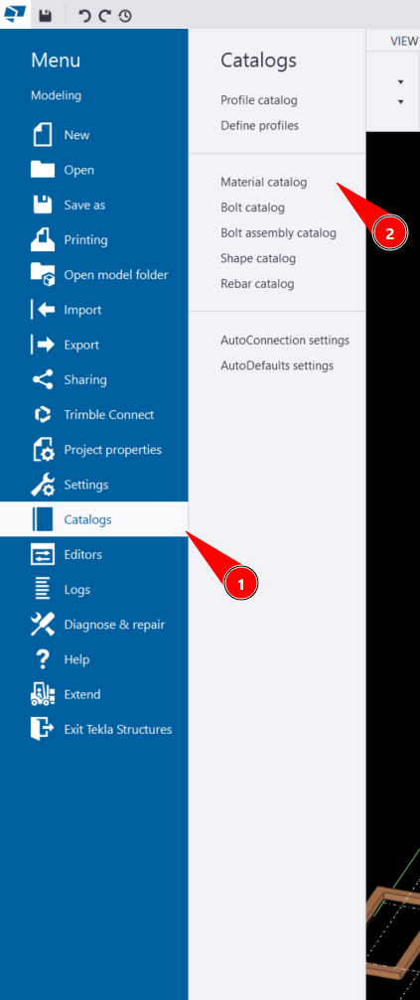
y se importa el archivo que editamos previamente:
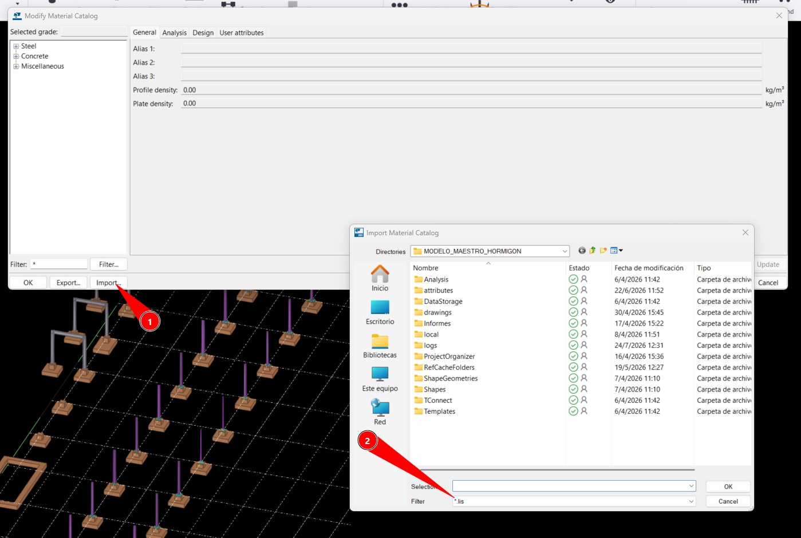

### Sumar nuevos atributos a la maqueta
A completar más adelante. Al día de la fecha no estamos necesitando su uso, pero podría ser útil eventualmente.


