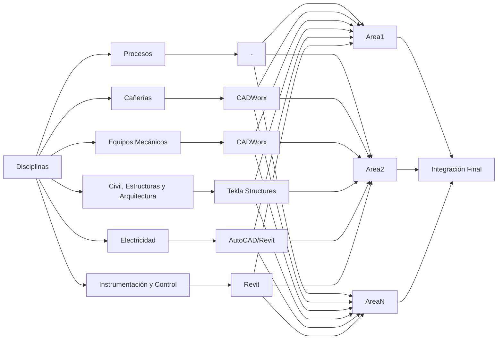

# BIM
{: .no_toc }
Esta sección tiene la finalidad de condensar ciertos conceptos asociados a la metodología BIM de trabajo.

{: .note}
>(BIM, Building Information Modeling ), también llamado modelado de información para la edificación,​ es un conjunto de procesos y métodos para la generación y gestión de datos de un edificio u obra de arquitectura y/o ingeniería civil durante su ciclo de vida , utilizando para ello un modelo digital compartido entre distintos actores de la cadena de valor. El objetivo es reducir tiempo y recursos en el diseño , la construcción y la gestión del activo. BIM se fundamenta en la colaboración interdisciplinar y el intercambio de información con otras herramientas de software, como GIS, etc

## Tabla de Contenidos
{: .no_toc .text-delta }

1. TOC
{:toc}

## Conceptos Clave

**Modelo Federado:** Combinación de modelos individuales en entorno coherente (*.nwf), mantiene autonomía de edición.

**Modelo Integrado:** Archivo consolidado (*.nwd) no editable, "captura" del estado del modelo en un momento determinado.

**Model Key:** Representación gráfica esquemática de sectorización del modelo 3D.

**WBS:** Work Breakdown Structure, desglose jerárquico por áreas/unidades.

**LOD (Level of Development):** Nivel de desarrollo del modelo correlacionado con etapas de ingeniería:
- **LOD 100:** Ingeniería Conceptual (información básica)
- **LOD 100-200:** Ingeniería Básica (formas genéricas)
- **LOD 300-350:** Ingeniería Básica Extendida (intención de diseño)
- **LOD 350-400:** Ingeniería de Detalle (detalle constructivo)
- **LOD 400:** Construcción/fabricación
- **LOD 500:** As Built (estado final verificado in situ)

## ¿Cómo estamos involucrados?

- Proyectistas/ingenieros trabajan sobre modelos en el directorio de OneDrive.
- De forma periódica, se exportan los modelos en formatos tipo .ifc a un directorio (**modelo federado**)
- De forma periódica, se genera una instantánea del proyecto (**modelo integrado**) que se conoce como la versión vigente de la maqueta del proyecto.

## ¿Cómo modelan las otras disciplinas?

Se presenta un diagrama, indicando los software que utiliza cada disciplina y como los archivos del modelo federado pasan a formar parte del modelo integrado.

[← Volver al inicio](index.md)