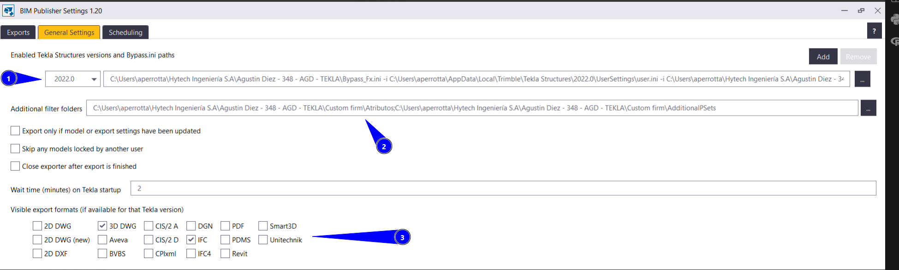

# BIM Publisher
{: .no_toc }

## Tabla de Contenidos
{: .no_toc .text-delta }

1. TOC
{:toc}


## ¿Qué es BIM Publisher?

El BIM Publisher es una aplicación de escritorio que realiza exportaciones masivas de múltiples modelos y sus planos en diversos formatos. Permite agregar tantos modelos como sea necesario, elegir qué filtros aplicar y exportarlos con cualquier versión instalada de Tekla Structures. Puede programarse para ejecutarse automáticamente en la PC.

Por ejemplo, es posible crear un filtro de selección en Tekla Structures basado en algún criterio de proyecto y sacar modelos a demanda en función de eso.

## Seteo y configuración

1. Descargar del [Tekla Warehouse](https://warehouse.tekla.com/#/packages/u1ea375b5-0819-40e4-8105-5f3d74474352). Se sugiere descargar la 1.20
2. Ajustar cada una de las hojas descriptas debajo

### Exports

)

1. Figuran los modelos cargados. Se tildan previo a tocar el botón de "Run" para correr el Publisher
2. Se asigna la carpeta del modelo, la carpeta donde irá el archivo a exportar y el nombre que tendrá el archivo.

{: .important}
> El Export name es el nombre del .ifc que debe tener el modelo de acuerdo con modelo federado de empresa

3. Se definen los filtros y presets a aplicar sobre los archivos exportados así como el nombre si se le agrega algun atributo.

### General Settings



En este apartado es importante ajustar la version del programa y agregar lo siguiente:

1. Archivo de bypass y de inicialización.
2. Indicarle carpetas donde se guardan atributos a nivel FIRM
3. Formatos de archivo que se desea sacar de los modelos.

{: .important}
> El 3D DWG **no** exporta con BASEPOINT de TEKLA

{: .warning}
> El formato para (1) responde a la siguiente sintaxis ```[BYPASS INI PATH] -i [USER/COMPANY INI PATH]```

#### Armado de bypass.ini

El archivo de bypass es personal permite abrir "a medias" el programa, y se construye de la siguiente forma:

1. Tomar archivo original que se puede descargar [acá](../archivos/Bypass.ini)
2. Abrir en editor de texto y dejar en *```set```* a ciertas propiedades avanzadas, dejandolas sin comentar:
   1. ```XS_DEFAULT_ENVIRONMENT```
   2. ```XS_DEFAULT_ROLE```
   3. ```XS_DEFAULT_LICENSE``` 

### Scheduling

Si interesa correrlo de forma automática de Windows en cierto horario. Si no, realizar manualmente.

## Roles

En función de la magnitud del proyecto, es aconsejable dejar alguien a cargo de la gestión de los modelos de TEKLA para visualizar dos aspectos:

- Gestión de archivos exportados en maqueta. Ver [Gestion de archivos](../avanzado/gestion_archivos.md) para detalle
- Sacar modelos con la periodicidad indicada por el LEP Civil del proyecto utilizando BIM Publisher.

[← Volver al inicio](index.md)