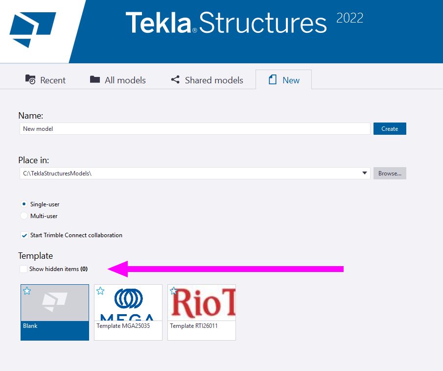
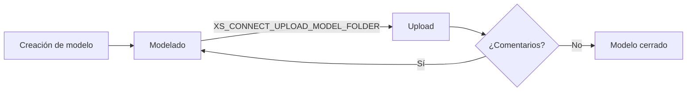
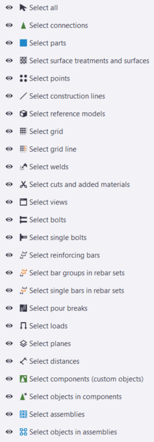

# Generalidades TEKLA
{: .no_toc }

## Tabla de Contenidos
{: .no_toc .text-delta }

1. TOC
{:toc}

---


## Antes de modelar

Se describen a continuación distintos apartados generales del modelado que deben tenerse en cuenta previo a comenzar un proyecto.

### Template de modelo

Previo al inicio de un proyecto, existen tareas que deben realizarse con antelación:

1. **Armado de rótulos**: de forma genérica se deberán crear 5 archivos de rótulos distintos en distintos tamaños. Referir a [Cuadros Rótulos](../reportes/cuadros-rotulos.md) para mayor detalle.
2. **Armado de template**: en caso de ser un cliente nuevo en la empresa deberá armarse un template del cliente. 

{: .note}
> El template del cliente se realiza tomando el template de empresa y seteando propiedades adicionales tales como XS_PROJECT, apúntandolas a la carpeta correspondiente al cliente.

3. Una vez creado el template, debe hacerse un *Save As* del modelo como template, darle una miniatura del cliente y dejarlo alojado en la carpeta de empresa correspondiente a los templates.

4. Realizados estos pasos, cualquier usuario podrá ver los templates de cliente disponibles al abrir el programa.


*Figura 1: Templates proyecto*

### Codificación de modelos

Los códigos de los modelos deberán ser definidos de forma temprana en el proyecto con la codificación. Se sugiere que sean lo suficientemente descriptivos y con los patrones necesarios para poder ubicarse.

{: .highlight}
> La codificación del archivo de exportación es distinta al nombre que tomará el modelo. Dicha codificación se basa en los criterios indicados para los modelos federados en el manual de empresa. Ver [Modelo 3D](modelo_3d.md) para mayor detalle.

Se propone la siguiente codificación completa para modelos:

```
<CAT>-<#AREA>-<ÚLTIMOS 4 DÍGITOS DEL DOC>-<DESCRIPCIÓN>
```

`<CAT>` corresponde a la categoría del modelo. Las categorías habilitadas son las siguientes:
- *`LY`* : Layouts de cualquier naturaleza.
- *`TIP`* : Típicos de cualquier naturaleza (cámaras, pasarelas, barandas, escaleras, fundaciones típicas, entre otros).
- *`EM`* : Estructura metálica.
- *`FD`* : Fundación.
- *`EH`* : Estructura de hormigón.

Por ejemplo, ```LY-02-1256-SOPORTES_AREA02``` indica que se trata de un modelo:
- De categoría ```LAYOUT```
- ```02``` nos indica el área del modelo
- ```1256``` los últimos 4 dígitos del documento en el proyecto
- ```SOPORTES_AREA02``` una descripción del documento para rápida referencia.

Para definición del área de proyecto, referir a [Modelo 3D](modelo_3d.md)


### Sincronización con Trimble Connect

El Trimble Connect es la herramienta de seguimiento que tiene el lider de especialidad o ingenieros para validar lo modelado y realizar comentarios. El flujo de uso del programa está definido en el capítulo de la documentación [Trimble Connect](../connect/index.md).

Cualquier modelo deberá seguir el siguiente flujo básico:


El proyectista/ingeniero realiza cambios sobre el modelo y debe subirlos a la carpeta del proyecto de Trimble Connect.

Referir al apartado [Trimble Connect](../connect/index.md) para seteo del proyecto. Se enfatiza el uso de la propiedad avanzada que figura en el diagrama de flujo ya que se aconseja en proyectos grandes sectorizar los modelos en carpetas y no tener nucleados todos los modelos bajo una misma carpeta.

### Atributos de proyecto

Los siguientes atributos deben llenarse al inicio del proyecto. Estos atributos generales serán tomados en reportes y rótulos dentro del proyecto:


*Figura 2: Atributos de proyecto*

### Definición Punto Base

Los proyectos suelen tener un punto base (`(0,0)` local) correlacionado con una coordenada geográfica que se define al inicio. Dicho punto en coordenadas POSGAR estará indicado en la documentación del proyecto.

Sin embargo, las maquetas de los proyectos se trabajan en coordenadas locales y en `mm` generalmente.

Definir un BASEPOINT de proyecto dentro del modelo, que generalmente corresponde a `(0,0,100.000)`, para que los modelos sean adecuados al exportar a la maqueta.

Referir a [Modelo 3D](modelo_3d.md) para más detalles respecto al modelo federado.


*Figura 3: Base points*

### Referencias externas

Las referencias externas son archivos que se cargan al modelo para auxiliar durante el modelado. Pueden subirse localmente (siempre en la carpeta `./xref` del modelo) o bien a Trimble Connect para cargar directamente la referencia/modelo en Tekla.

Instalar la extensión que permite cargar .nwd en el programa 

Si la maqueta está en continuo cambio, se recomienda armar una rutina que recopile los .nwd de cada área y los suba a Connect. Ver [Gestión de archivos](../avanzado/gestion_archivos.md) para mayor detalle.

---
## Creación de vistas

## Comandos


---
## Tipos de elementos

Hay distintos tipos de elementos a nivel modelo:

1. **PARTES**
Son los elementos principales de la estructura.

   - **Beam (Viga)**: Elementos lineales (vigas, columnas, diagonales)
   - **Column (Columna)**: Elementos verticales
   - **Polybeam**: Vigas con trayectoria poligonal
   - **Curved Beam**: Vigas curvas
   - **Orthogonal Beam**: Vigas ortogonales
   - **Contour Plate (Placa de Contorno)**: Placas definidas por contorno
   - **Pad Footing (Zapata)**: Fundaciones tipo zapata


{: note}
> Los objetos más usuales a usar en estos proyectos se basan en BEAMS, PAD FOOTING, COLUMN y PLATE. En función del tipo de objeto, los atributos a presentar pueden variar y ser distinto, por lo que es importante modelar con un mismo criterio

2. **PERNOS/SOLDADURAS**: se pueden modelar individualmente pero en general se aplican a través de componentes.
3. **ARMADURAS**: hay distintos tipos de armaduras. Ver apartado dentro del capítulo [Armaduras](../hormigon/armaduras.md) para mayor detalle.
4. **ASSEMBLIES**: la licencia actual es de piezas de hormigón por lo que se podrán crear lo que se denominan unidades de colada y que se cubre en los capitulos correspondientes dentro de [Hormigón](../hormigon/index.md).
5. **ELEMENTOS AUXILIARES**: aquello que auxiliará durante el modelado.
   1. Grillas
   2. Objetos de construcción (linea, planos, circulos)
   3. Puntos
6. **COMPONENTES**: los componentes actúan como *macros* que permiten modelar objetos de forma automática de cuestiones que se repiten (por ejemplo, una viga de encadenado o una placa base). Cada sección de [Hormigón](../hormigon/index.md) o [Acero](../acero/index.md) cuenta con una biblioteca de componentes usuales para utilizar.

---

## Herramientas de modelado

Se describen herramientas de modelado a continuación que resultan indispensables para el modelado rápido y eficas de las partes.

### Selectores de partes y unidades de colada

Los modelos complejos, pueden ser dificiles de trbajar cuando hay muchos objetos en el mismo. Para solucionar eso Tekla, tiene integrado Selectores de partes y unidades de colada. 


*Figura 4: Selectores*


*Figura 5: Significado de los selctores*


1. **Select all:** Activar o desactivar todos los interruptores de selección. Se Puede seleccionar todos los tipos de objetos, excepto Tornillos individuales.
2. **Select conections:** Se pueden seleccionar componentes.
3. **Select parts:** Se pueden seleccionar piezas, como columnas, vigas o placas.
4. **Select surface treatments and surfaces:** Se pueden seleccionar tratamientos superficiales y superficies.
5. **Select points:** Se pueden seleccionar puntos.
6. **Select construction lines:** Se pueden seleccionar líneas de construcción y círculos.
7. **Select reference models:** Se pueden seleccionar modelos de referencia, si se deselecciona no se pueden seleccionar los modelos de referencia y permite trabajar mas comodamente
8. **Select grids:**  Se pueden seleccionar gillas enteras.
9. **Select grid lines:** Se pueden seleccionar lineas de grillas.
10. **Select welds:** Se pueden selecionar soldaduras
11. **Select cuts and added materials:** Se puedenseleccionar cortes de línea, pieza y polígonos, accesorios y material añadido. 
12. **Select views:** Se pueden seleccionar vistas.
13. **Select bolts:** Se pueden seleccionar grupos de bulones.
14. **Select single bolts:** Se pueden seleccionar bulones singulares
15. **Select reinforcing bars:** Se pueden seleccionar sets de armadura, así como grupos de barras de refuerzo y barras de refuerzo individuales.
16. **Select bar groups in rebar sets:** Se pueden  seleccionar grupos de barras en sets de Armadura, así como grupos de reinforcing bars y single reinforcing bars. 
17. **Select single bars in rebar sets:** Se pueden seleccionar single bars in rebar sets, y reinforcing bar groups y single reinforcing bars.
18. **Select pour breaks:** Se pueden seleccionar rupturas a la hora del vertido.
19. **Select loads:** Se pueden seleccionar cargas puntuales, líneas, áreas, uniformes y de temperatura.
20. **Select planes:** Se pueden seleccionar planos de vistas
21. **Select distances:** Se pueden seleccionar distancias para metricas en componentes.
22. **Select components (custom objets):** Se puede seleccionar los componentes
23. **Select objets in components:** Se puede seleccionar objetos creados automáticamente por un componente.
24. **Select assemblies:** Se seleccionan unidades de colada, marcandola, con un recuadro azul
25. **Select objets in assemblies:** Se pueden seleccionar objetos individuales en las unidades de colada. 

{: .important}
> Al tocar el botón N°1 (select all) se tildan y seleccionan los puntos n° 2, 4 a 7, 10 a 13, 15, 17 a 21, esto genera que algunos objetos o partes del modelado puedan o no ser seleccionados. Importante tener en cuenta, si hay objetos no seleccionados, puede ser por este botón. 

### Modificación directa (D)


*Figura 6: Modificación directa*

La modificación directa permite redimensionar, remodelar y mover el modelo objetos utilizando pestañas de modificación directa. Cuando se selecciona un objeto, Tekla muestra las cotas y dimensiones de modificación directa que son específico para ese objeto modelado. 

{: .note}
> La modificación directa se activa y desactiva con el comando CONTROL+D y viene activada por defecto, a veces puede desactivarse sola, se vuelve a activar usando el comando. 


#### Alargar varios objetos

Los manipuladores de modificación directa suelen activarse para un solo objeto. No siempre se puede editar dimensiones específicas (como largo o posición de un extremo) en múltiples objetos simultáneamente. En armaduras o  componentes más complejos, es aún más restrictivo.


#### Desplazar algunos puntos del objeto

Las partes estan compuestas por puntos perimetrales de modificación perimetrales, estas tienen a la misma vez, subpuntos, que compuestos forman la parte en, si. Los mismos pueden ser alterados, para crear distintas formas, en H°A° los mas endebles suelen ser los modificadores de las losas.


*Figura 7: Desplazamiento de puntos y subpuntos*


[← Volver al inicio](index.md)