# Configuración inicial
{: .no_toc }

## Tabla de Contenidos
{: .no_toc .text-delta }

1. TOC
{:toc}
---
## Tipos de armadura
Tekla permite modelar armaduras, siendo estas elementos cilindricos lineales, la forma esta definida por el "rebar shape catalog". Actualmente se encuentran disponibles 4 catalogos dependiendo de la calidad y tipo de acero. Estos catalogos definen el tamaño de la barra:

- ADN-420
- AL-220
- AM500
- ATR500

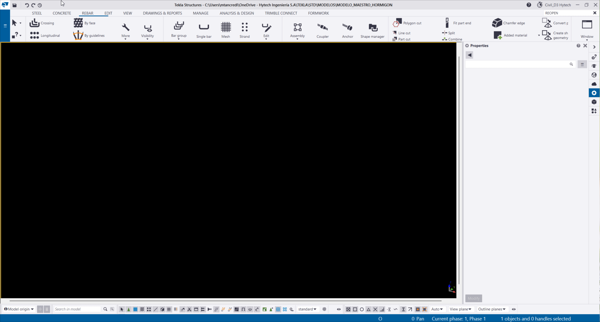
*Figura 1: Armadura y rebar shape catalog*

{: .note}

> La definición de la armadura, queda a cargo del Revisor / Ingeniero / LEP. **Puede variar según avanza el proyecto** (tanto en cantidad, separación y diametro)

Existen varias maneras de modelar la armadura de una estructura, las mas utilizadas suelen ser: 

### Bar group (Grupo de barras):

Modelar armadura por grupo de barras permite diseñar la forma de la armadura y repetirla a lo largo de un recorrido a reforzar. Una vez establecida la forma y el patron crea un camino editable en cuanto a la separación de armadura definida por el usuario.

1. **Definición de propiedades:** inicialmente, se selecciona la calidad de la armadura, el tamaño de la barra y finalmente la clase

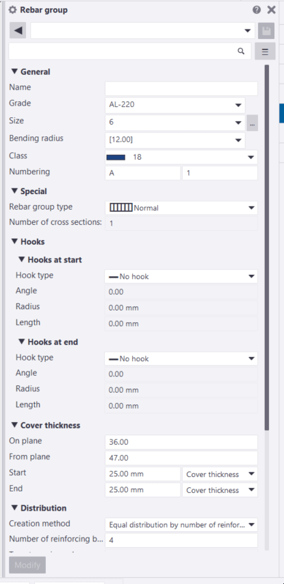
*Figura 2: Rebar properties*

2. **Definición de forma**: Se selecciona la parte a reforzar y se dibuja la forma de la armadura.
3. **Patron a reforzar**: Luego de definir la forma se debe indicar el camino que reforzará la armadura.

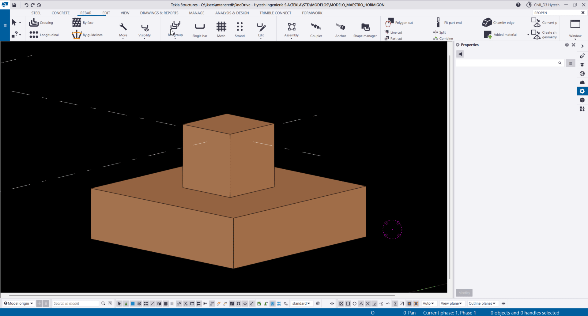
*Figura 3: Forman y patron a reforzar*

4. **Separación**: Una vez generada la armadura, se debe modificar la separación, hay varias opciones para modificarla
   1. `Equal distribution`: distribuye las barras equitativamente bajo dos opciones, por cantidad de barras o por un espaciado objetivo.
   2. `By exact spacings`: Distribuye las barras según una separación exacta. Tiene varias posibilidades de edición: 
        1. `By exact spacing with flexible last and first space` siendo la primera y ultima posición variables 
        2.  `By exact spacing with flexible middle` siendo las posiciones del 
        medio variables

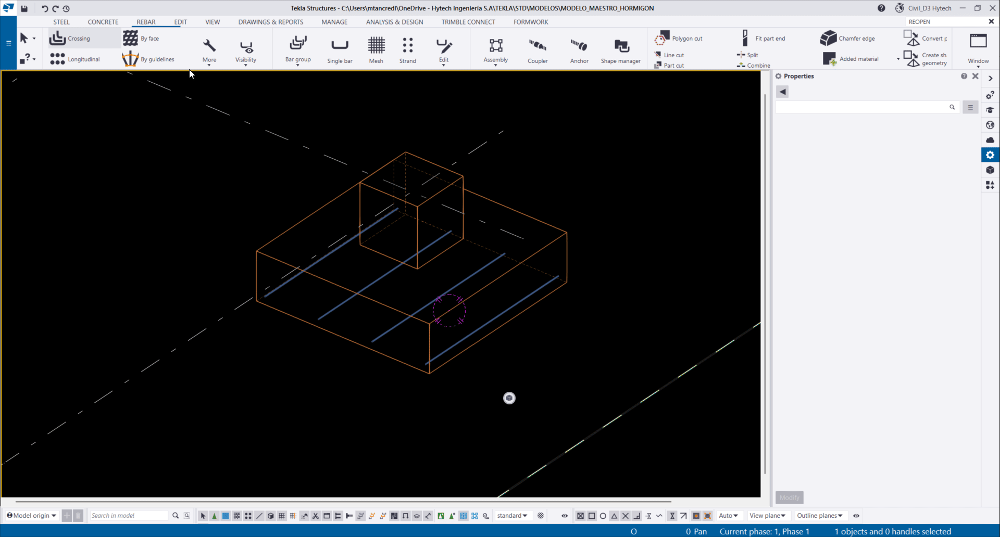
*Figura 4: Separación*

5. **Retoque de propiedades**: Por ultimo, se pueden modificar propiedades especificas, o que quedan en segundo plano a la hora de dibujar la armadura. 
    1. Hooks: pueden ser editados tanto al principio como al final de la armadura. Se recomienda empezar con alguna de las opciones por defecto ya que establecen el radio de doblado permitido por el tamaño y calidad de la barra. Si se quiere editar el largo del gancho, o cambiar el angulo, se recomienda editarlo con la opcion "Custom Hook"
    2. Cover thickness: Permite modificar el recubrimiento de la armadura, tanto en plano como en largo. 

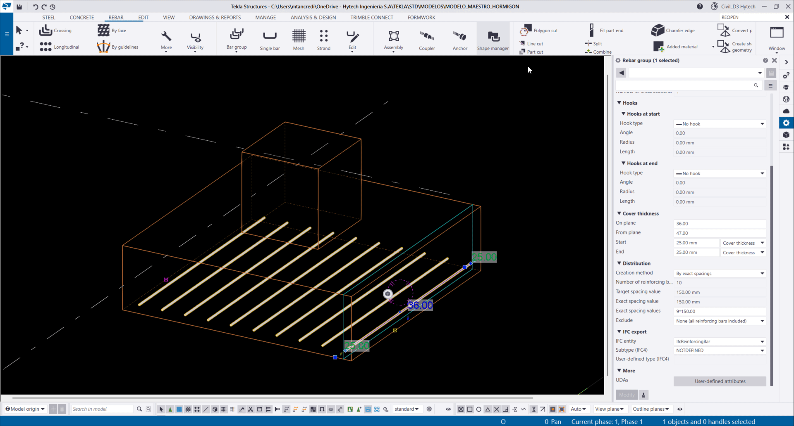
*Figura 5:  Hooks*

### Rebar set 

Los rebar set constan de armaduras que se agrupan automáticamente en función de la geometría de la barra y que puede modificar usando la modificación directa y las guías de conjunto de armaduras. Se pueden crear conjuntos de armaduras cuando desee reforzar flexiblemente varias áreas y geometrías en partes de hormigón u objetos de vertido.

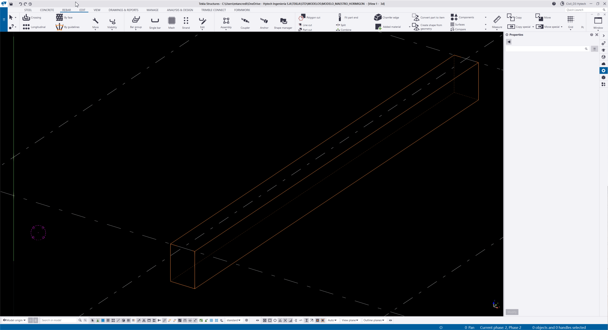
*Figura 6: Rebar set crossing*

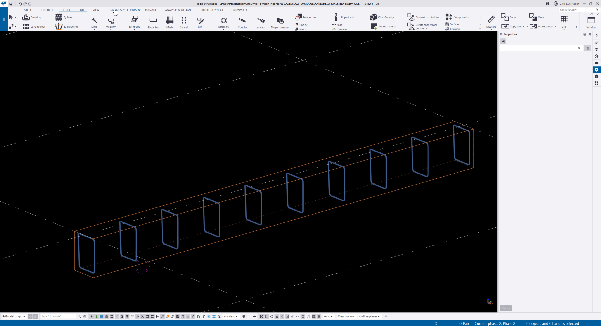
*Figura 7: Rebar set longitudinal*

### Malla (Malla)

El rebar mesh una malla prefabricada de barras de acero, compuesta por barras principales y secundarias ortogonales, generalmente soldadas entre sí, usada comúnmente en losas, muros y elementos de hormigón armado.

*Figura 8: Rebar mesh*

---
## Propiedades

## Unidad de colada
Cuando se modela un elemento que contiene varias partes de H° y las mismas contiene armadura, la forma correcta de trabajar es utilizar la unidad de colada, para ver mas información leer Ver [Unidad de colada](elementos.md#unidad-de-colada). Varias partes deben tener la misma unidad de colada para cuando salga el reporte de la Planilla de Doblado de Hierros, salgan con la cantidad y peso correctos, dentro de la misma parte. 

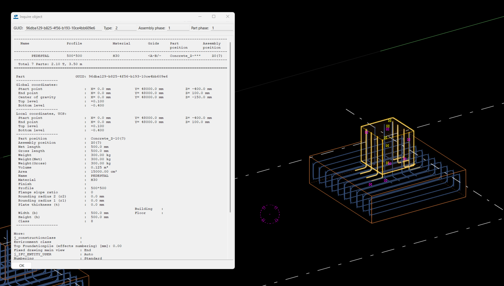
*Figura 9: Armadura en parte, fases de colada 1*
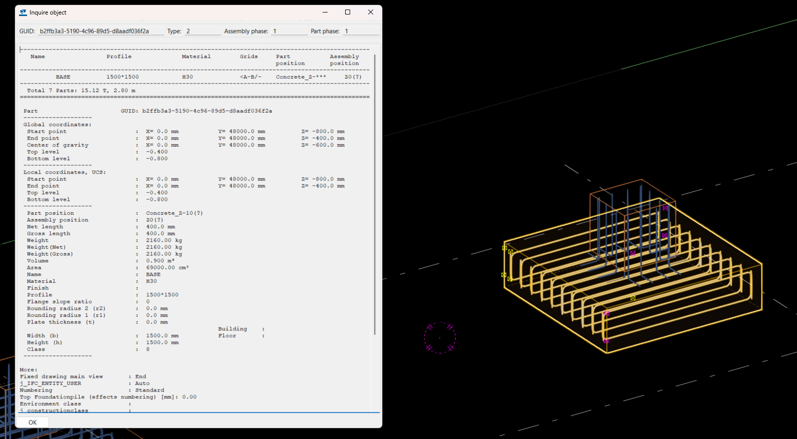
*Figura 10: Armadura en parte, fases de colada 1*
### Propiedades de la unidad de colada
Las unidades de colada, tienen propiedades, es recomendable **no** usar `PRECAST`, ya que a la hora de sacar el reporte saldrá con errores. Tambien, seleccionando la unidad de colada, se podrá modificar, el nombre, numeración y modificar los atributos definidos por el usuario. 

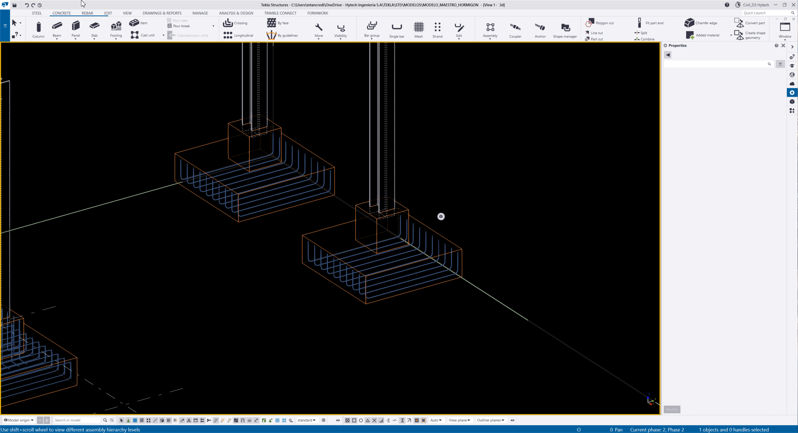
*Figura 11: Unidad de colada propiedades*

## Numeración

La numeración es el proceso mediante el cual Tekla asigna identificadores únicos a las piezas, ensamblajes y elementos del modelo, basándose en sus propiedades geométricas, materiales y atributos, con el fin de generar planos, listas y fabricación sin inconsistencias.

### Como enumerar:

*Figura 12: Ribbon numeración y funciones*

1. En el apartado "Change number" seleccionar las cuatro opciones de eliminar numeración existentes:
    1. `Clear part assembly numbers`
    2. `Clear part numbers`
    3. `Clear assembly numbers`
    4. `Clear reinforcing bar numbers`
2. Seleccionar el apartado de "Numbering settings:
    1. Al abrir la ventana, aparecerá la configuración de numeración. Por defecto estará seleccionada la opción `standard`.
    2. Hytech tiene 3 formatos de enumeración, el mas utilizado  es el `RE-ENUMERAR-2`. Al utilizar la unidad de colada se recomienda utilizar la `RE-ENUMERAR-3`.
    3. Se aplican y guardan los formatos de enumeración 
3. Seleccionar en el apartado de "Perform numbering" la opción de `Number series of selected objets` esta, ennumerará **solo** la armadura del objeto seleccionado
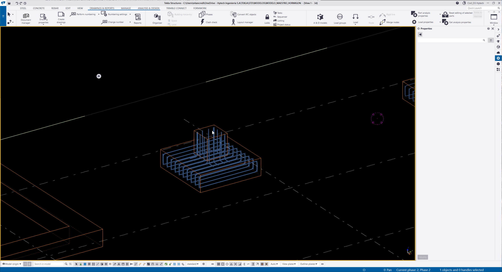
*Figura 13: Enumeración de armaduras de una parte*

## Planilla de doblado de aceros (PDH)

Una planilla de doblado de hierros es Un documento técnico que detalla, de forma **ordenada y precisa**, las características geométricas y constructivas de las barras de acero de refuerzo, indicando cómo deben cortarse y doblarse antes de su colocación en la estructura de hormigón armado.

### Como generar el reporte de una PDH

1. Se debe de realizar la numeración de las armaduras.
2. Seleccionar el apartado de "Reports"
3. Buscar el reporte de `HYT-PDH`
4. Seleccionar la opción de `Create from selected`
5. Se generará un pdf con las armaduras y su forma de doblado

### Como generar el formato de una PDH

1. En el siguiente link se encuentra la rutina de [Google Colab](https://colab.research.google.com/drive/12fXq9QDGkd16nXEkAKexgHfziEjB_yEo) que genera la planilla de doblados final.
2.  Se requiere completar la [PLANTILLA BASE](https://www.google.com/url?q=https%3A%2F%2Fdocs.google.com%2Fspreadsheets%2Fd%2F1PRK6W-IhIslE1Gx3XgKjs4684XgOAIxN%2Fedit%3Fusp%3Dsharing%26ouid%3D114357192518648123855%26rtpof%3Dtrue%26sd%3Dtrue) . y completarla con los datos del proyecto (se deberá subir con el nombre PLANTILLA_BASE.xlsx). En caso de modificarse, se debe de notificar.: 
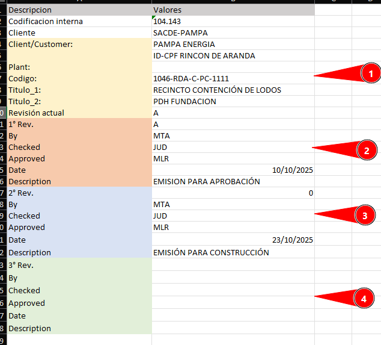
*Figura 14: Campos plantilla base*
    Bloques:
    1. **Bloque cliente**: Contiene información sobre el cliente y el plano.
        1. `Codificación interna`: Numero de obra/proyecto.
        2. `Cliente`: Nombre de cliente.
        3. `Cliente/customer`: Nombre de cliente 2.
        4. `Plant`: Nombre de la planta.
        5. `Codigo`: Codigo de la planilla de doblado.
        6. `Titulo 1&2`: Titulo de la planilla, dividido en dos para titulos largos, se recomienda dividir el titulo a la mitad para que quede centrado. 
        7. `Revisión actual`: Ultima revisión actual.
    2. **Bloque Rev A**: Contiene información sobre la primera revisión:
        1. `1°Rev`: Letra o numero de la primera revisión.
        2. `By`: Nombre del ejecutor de la planilla
        3. `Checked`: Nombre del revisior de la planilla (suele ser el LEP)
        4. `Aproved`: Nombre del lider del proyecto
        5. `Date`: Fecha de emisión de la planilla
        6. `Description`: Carácter de emisión de la planilla 
    3. **Bloque Rev B**: Contiene información sobre la segunda revisión
    4. **Bloque Rev C**: Contiene información sobre la tercera revisión
3. PDFs a compilar para la PDH final (reporte previamente explicado). Las hojas deben subirse como "_1", "_2" y así sucesivamente. Si es un solo documento, colocar "_1" al final del documento PDF (por ejemplo, se sube un archivo que se llama COMPRESOR_PDH_1.pdf).
4. Correr bloque de instalación (apartado 1).
5. Tocar Runtime -> Restart Runtime (Entorno de ejecución -> Reiniciar la sesión) en caso de que Colab no lo solicite en el paso previo. Esto es esencial por un problema entre paquetes.
6. Correr bloques siguientes, sin volver a correr el bloque de instalación (bloques 2 a 6).
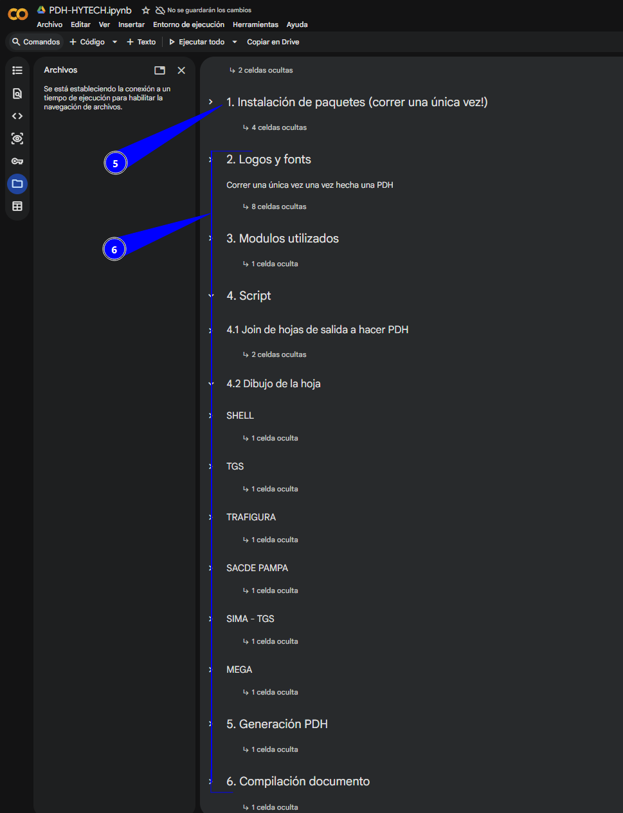
*Figura 15: Bloques del 1 a 6*
7. En caso de sacar múltiples planillas de doblado en la misma sesión, ir pisando el archivo PLANTILLA_BASE.xlsx y el informe que saca el TEKLA (borrar a mano archivo de requerirse) y correr bloques 3 a 6 nuevamente. El bloque 2 no debe ejecutarse más veces.

## Longitud de empalme

## Longitud de anclaje

---
## Listado de componentes

[← Volver al inicio](index.md)