# Diseño de armaduras
{: .no_toc }

## Tabla de Contenidos
{: .no_toc .text-delta }

1. TOC
{:toc}
---
## Tipos de armadura
Tekla permite modelar armaduras, siendo estas elementos cilindricos lineales, la forma esta definida por el "rebar shape catalog". Actualmente se encuentran disponibles 4 catalogos dependiendo de la calidad y tipo de acero. Estos catalogos definen el tamaño de la barra, geometría de ganchos, etc.:

- ADN-420
- AL-220
- AM500
- ATR500

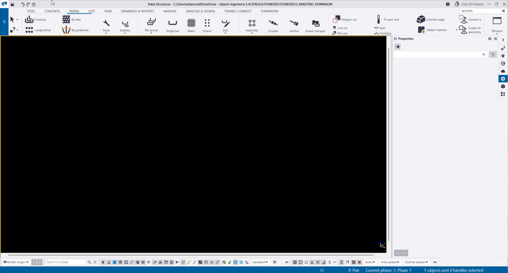
*Figura 1: Armadura y rebar shape catalog*

{: .note}

> La definición de la armadura, queda a cargo del Revisor / Ingeniero / LEP. **Puede variar según avanza el proyecto o el documento a emitir** (tanto en cantidad, separación y diametro)

Existen varias maneras de modelar la armadura de una estructura, las mas utilizadas suelen ser: 

### Bar group (Grupo de barras):

Modelar armadura por grupo de barras permite diseñar la forma de la armadura y repetirla a lo largo de un recorrido a reforzar. Una vez establecida la forma y el patron crea un camino editable en cuanto a la separación de armadura definida por el usuario.

1. **Definición de propiedades:** inicialmente, se selecciona la calidad de la armadura, el tamaño de la barra y finalmente la clase

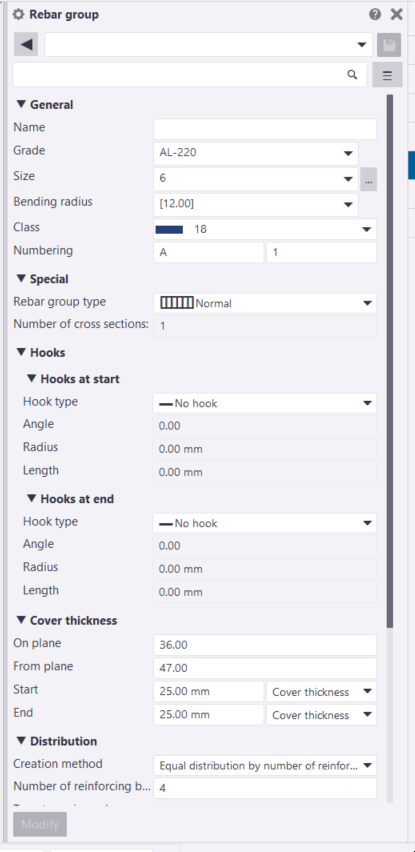
*Figura 2: Rebar properties*

2. **Definición de forma**: Se selecciona la parte a reforzar y se dibuja la forma de la armadura.
3. **Patron a reforzar**: Luego de definir la forma se debe indicar el camino que reforzará la armadura.

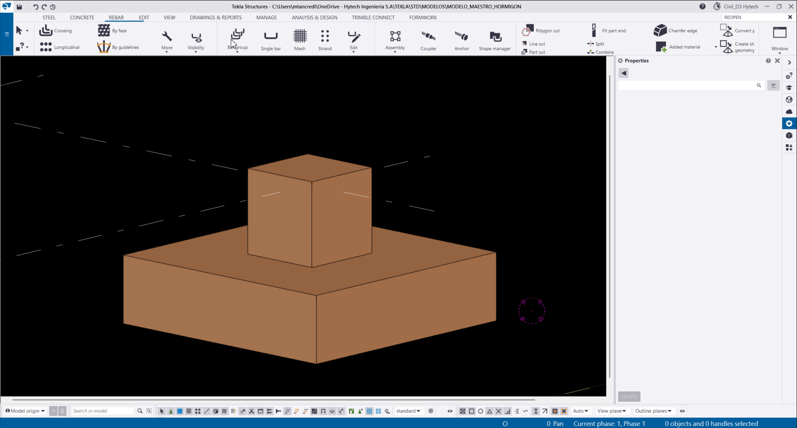
*Figura 3: Forma y patrón a reforzar*

4. **Separación**: Una vez generada la armadura, se debe modificar la separación, hay varias opciones para modificarla:
   1. `Equal distribution`: Distribuye las barras equitativamente bajo dos opciones, por cantidad de barras o por un espaciado objetivo.
   2. `By exact spacings`: Distribuye las barras según una separación exacta. Tiene varias posibilidades de edición: 
        1. `By exact spacing with flexible last and first space` siendo la primera y ultima posición variables 
        2.  `By exact spacing with flexible middle` siendo las posiciones del 
        medio variables.

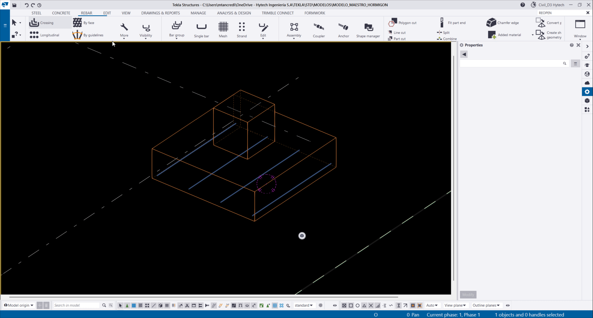
*Figura 4: Separación*

5. **Retoque de propiedades**: Por ultimo, se pueden modificar propiedades especificas, o que quedan en segundo plano a la hora de dibujar la armadura. 
    1. `Hooks`: Pueden ser editados tanto al principio como al final de la armadura. Se recomienda empezar con alguna de las opciones por defecto ya que establecen el radio de doblado permitido por el tamaño y calidad de la barra. Si se quiere editar el largo del gancho, o cambiar el ángulo, se recomienda editarlo con la opcion "Custom Hook"
    2. `Cover thickness`: Permite modificar el recubrimiento de la armadura, tanto en plano como en longitud. 

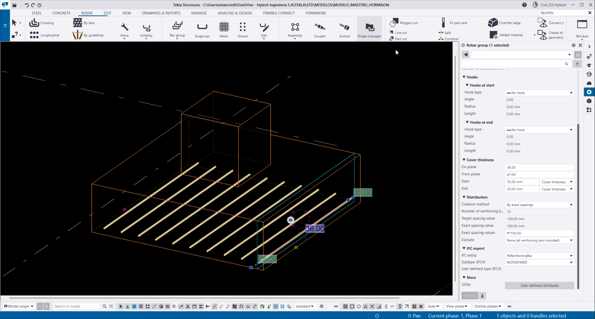
*Figura 5:  Hooks*

### Rebar set 

Los rebar set son conujntos de armaduras que se agrupan automáticamente en función de la geometría de la barra. Se puede modificar usando la modificación directa y las guías de conjunto de armaduras. Se recomienda crear conjuntos de armaduras cuando se desee reforzar flexiblemente varias áreas y geometrías en partes de hormigón. 

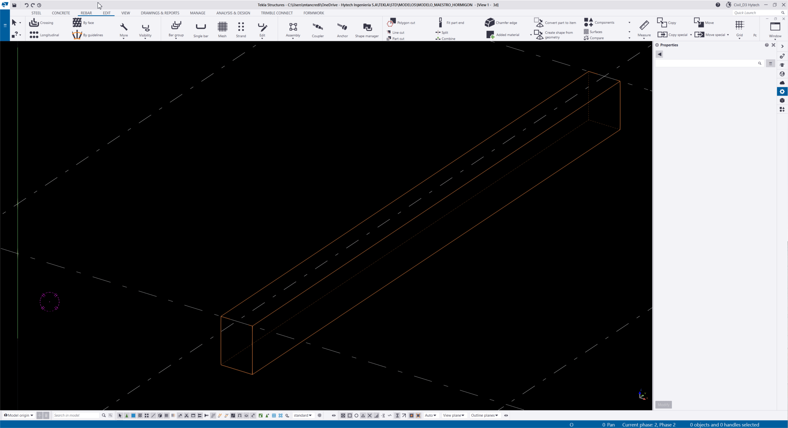
*Figura 6: Rebar set crossing*

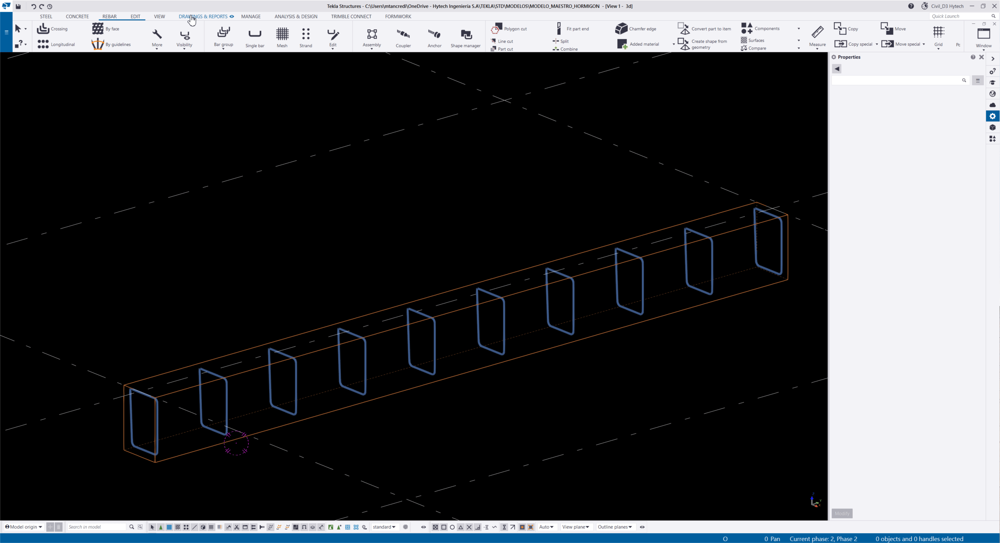
*Figura 7: Rebar set longitudinal*

### Mesh (Malla)

El rebar mesh una malla prefabricada de barras de acero, compuesta por barras principales y secundarias ortogonales, generalmente soldadas entre sí, usada comúnmente en losas, muros y plateas.

*Figura 8: Rebar mesh*

## Modelado correcto de la armadura
Para saber si una armadura esta bien modelada, hay que seguir un par de recomendaciones:

### ¿La armadura está dentro de la parte?

Suele ocurrir que en la rapidez de ejecución del modelado, la armadura, salga de la parte en la cual uno la está asociando. Esto es facil de corregir y de visualizar. Se debe de realizar una verificación visual alrededor de la parte, se recomienda usar los comandos `ctrl+1/2/3/4` para cambiar la representación de la armadura y las partes, y asi verificar que no este por fuera. 
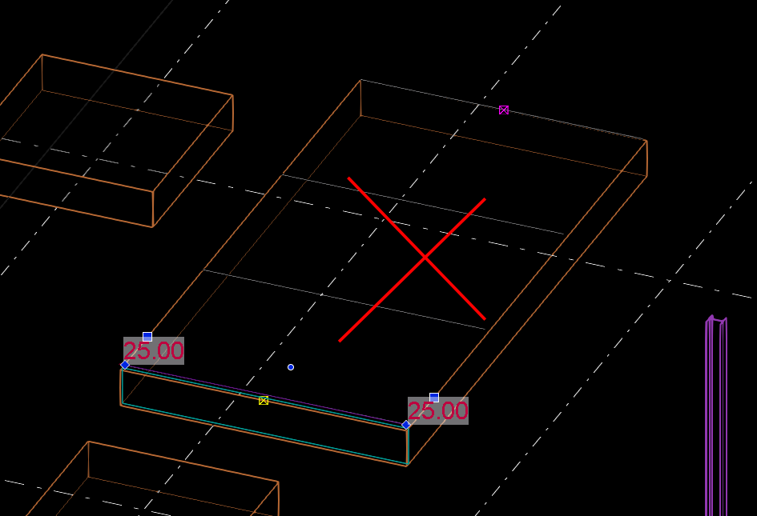
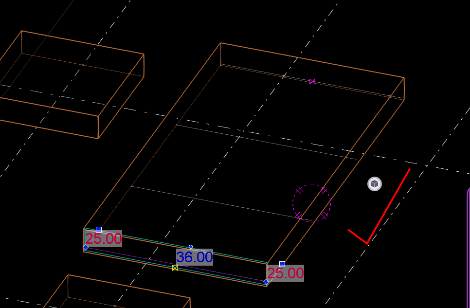

### ¿Los ganchos de la armadura estan bien modelados?
Para modelar ganchos en una barra, se debe de usar  la opción `Hooks` en la pestaña de modelado de armadura, la misma tiene configuraciones preseteadas, que 
determinan la forma de la misma.
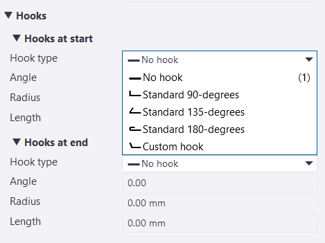

Si bien al modelar grupo de barras, se puede elegir la forma de la misma, y dibujar manualmente el gancho, la manera correcta del modelado es utilizar los hooks predefinidos por el programa. 

### ¿Hay doble armadura en las partes que lo requieran?
Las bases aisladas, plateas, y fundaciones en general, suelen tener doble armadura. Una superior y otra inferior, suelen ser de el mismo diametro, y separación por lo que si se modelo una inicialmente se deberá duplicar.

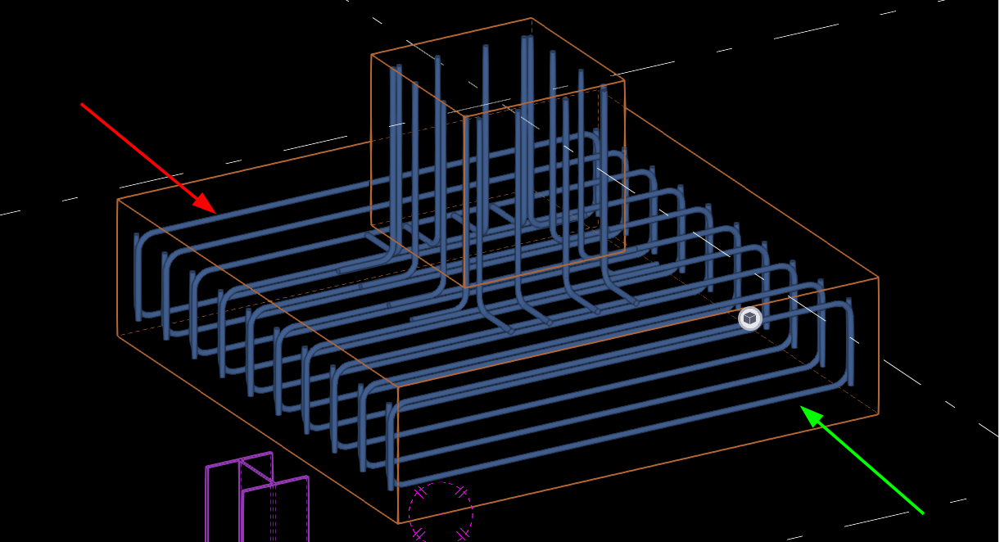

### ¿El radio de doblado de la armadura es correcto?
Las armaduras, tienen un radio de doblado asignado dependiente de su diametro, puede ocurrir que al generar un gancho para la misma la barra gire en un radio que no es el correcto, para chequear el correcto utilizar la opcion `standard hook` y modificar el largo.
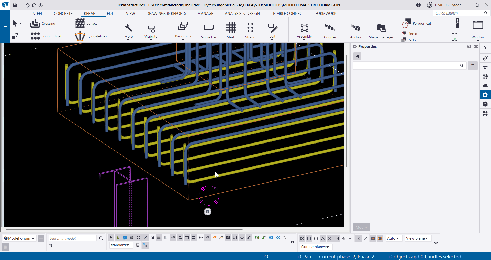

### ¿Se están utilizando nombres en la armadura?
Nombrar la armadura sirve para generar una distinsión en la PDH. Una barra, puede tener distinto nombre, pero misma forma, esto puede ser util cuando se requiera diferenciar una armadura superior de la inferior, o simplemente nombrar barras dependiendo de la forma.
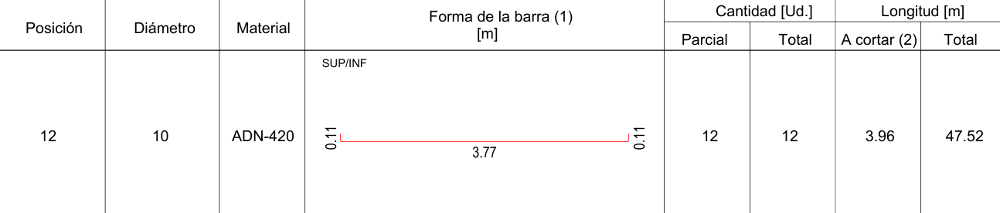
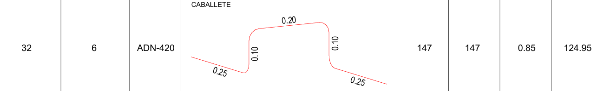

---

## Propiedades

## Unidad de colada

Cuando se modela un elemento que contiene varias partes de H° y las mismas contienen armadura, la forma correcta de trabajar es utilizar la `unidad de colada`, para ver mas información leer Ver [Unidad de colada](elementos.md#unidad-de-colada). Varias partes modeladas dentro de una misma estructura deben tener la misma unidad de colada para que cuando se ejecute el reporte de la **P**lanilla de **D**oblado de **H**ierros, las armaduras salgan con el nombre, cantidad y numeración correcta. 

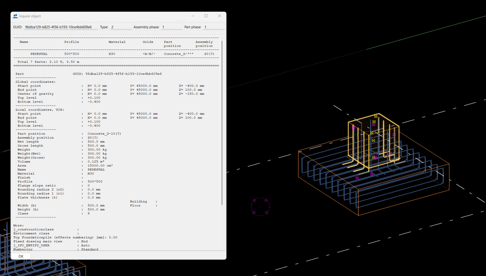
*Figura 9: Armadura en parte, fases de colada 1*
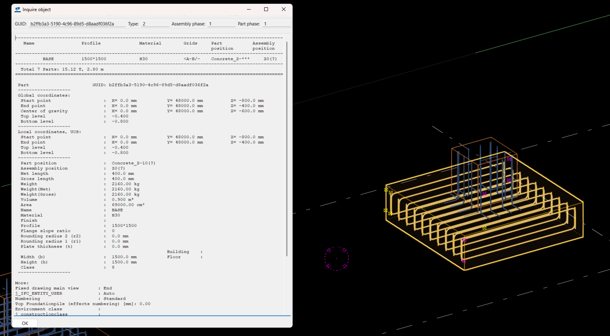
*Figura 10: Armadura en parte, fases de colada 1*

### Propiedades de la unidad de colada

Las unidades de colada, tienen propiedades que configuran sus caracteristicas, **NO** se debe usar `PRECAST`, ya que a la hora de sacar el reporte saldrá con errores. Ademas, seleccionando la unidad de colada, se podrá modificar, el nombre, numeración y los atributos definidos por el usuario. 

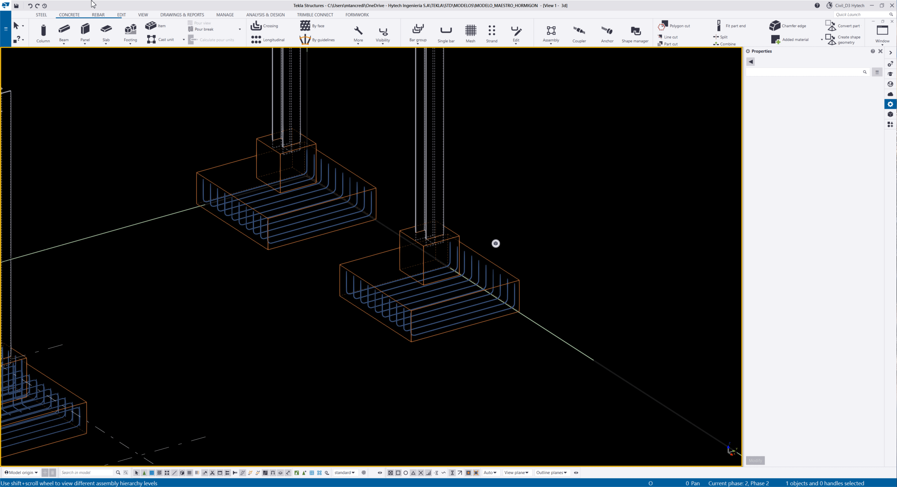
*Figura 11: Unidad de colada propiedades*

## Numeración

La numeración es el proceso mediante el cual Tekla asigna identificadores únicos a las piezas, ensamblajes y elementos del modelo, basándose en sus propiedades geométricas, materiales y atributos, con el fin de generar planos y listados sin inconsistencias.

### Como enumerar:

*Figura 12: Ribbon numeración y funciones*

1. En el apartado "Change number" seleccionar las cuatro opciones de eliminar numeración existentes:
    1. `Clear part assembly numbers`
    2. `Clear part numbers`
    3. `Clear assembly numbers`
    4. `Clear reinforcing bar numbers`
2. Seleccionar el apartado de "Numbering settings:
    1. Al abrir la ventana, aparecerá la configuración de numeración. Por defecto estará seleccionada la opción `standard`.
    2. Hytech tiene 3 formatos de enumeración, el mas utilizado  es el `RE-ENUMERAR-2`. Al utilizar la unidad de colada se recomienda utilizar la `RE-ENUMERAR-3` ya que está numeración es la más optima con el reporte y la unidad de colada.
    3. Se aplican y guardan los formatos de enumeración 
3. Seleccionar en el apartado de `Perform numbering` la opción de `Number series of selected objets` esta, ennumerará **solo** la armadura del objeto seleccionado

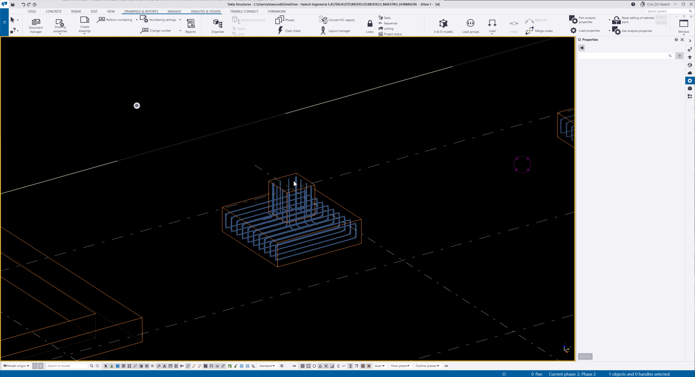
*Figura 13: Enumeración de armaduras de una parte*

Luego, validar los prefijos y sufijos dados a cada unidad de colada utilizando los *Inquiry* disponibles para unidades de colada.

## Planilla de doblado de aceros (PDH)

Una planilla de doblado de hierros es Un documento técnico que detalla, de forma **ordenada y precisa**, las características geométricas y constructivas de las barras de acero de refuerzo, indicando cómo deben cortarse y doblarse antes de su colocación en la estructura de hormigón.

### Como generar el reporte de una PDH

1. Se debe de realizar la numeración de las armaduras.
2. Seleccionar el apartado de "Reports"
3. Buscar el reporte de `HYT-PDH`
4. Seleccionar la opción de `Create from selected`
5. Se generará un pdf con las armaduras y su forma de doblado

### Como generar el formato de una PDH

1. En el siguiente link se encuentra la rutina de [Google Colab](https://colab.research.google.com/drive/12fXq9QDGkd16nXEkAKexgHfziEjB_yEo) que genera la planilla de doblados final.
2.  Se requiere completar la [PLANTILLA BASE](https://www.google.com/url?q=https%3A%2F%2Fdocs.google.com%2Fspreadsheets%2Fd%2F1PRK6W-IhIslE1Gx3XgKjs4684XgOAIxN%2Fedit%3Fusp%3Dsharing%26ouid%3D114357192518648123855%26rtpof%3Dtrue%26sd%3Dtrue) . y completarla con los datos del proyecto (se deberá subir con el nombre PLANTILLA_BASE.xlsx). 

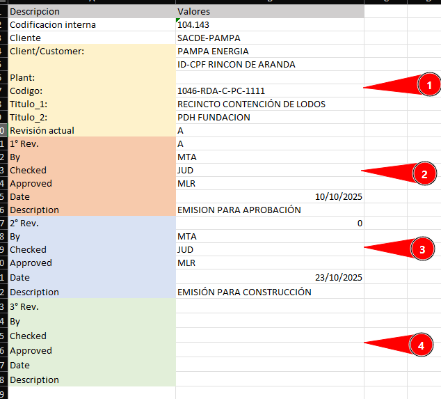
*Figura 14: Campos plantilla base*
    Bloques:
    1. **Bloque cliente**: Contiene información sobre el cliente y el plano.
        1. `Codificación interna`: Numero de obra/proyecto.
        2. `Cliente`: Nombre de cliente.
        3. `Cliente/customer`: Nombre de cliente 2.
        4. `Plant`: Nombre de la planta.
        5. `Codigo`: Codigo de la planilla de doblado.
        6. `Titulo 1&2`: Titulo de la planilla, dividido en dos para titulos largos, se recomienda dividir el titulo a la mitad para que quede centrado. 
        7. `Revisión actual`: Ultima revisión actual.
    2. **Bloque Rev A**: Contiene información sobre la primera revisión:
        1. `1°Rev`: Letra o numero de la primera revisión.
        2. `By`: Nombre del ejecutor de la planilla
        3. `Checked`: Nombre del revisor de la planilla (suele ser el LEP)
        4. `Aproved`: Nombre del lider del proyecto
        5. `Date`: Fecha de emisión de la planilla
        6. `Description`: Carácter de emisión de la planilla 
    3. **Bloque Rev B**: Contiene información sobre la segunda revisión
    4. **Bloque Rev C**: Contiene información sobre la tercera revisión
3. PDFs a compilar para la PDH final (reporte previamente explicado). Las hojas deben subirse como "_1", "_2" y así sucesivamente. Si es un solo documento, colocar "_1" al final del documento PDF (por ejemplo, se sube un archivo que se llama COMPRESOR_PDH_1.pdf).
4. Correr bloque de instalación (apartado 1).
5. Tocar Runtime -> Restart Runtime (Entorno de ejecución -> Reiniciar la sesión) en caso de que Colab no lo solicite en el paso previo. Esto es esencial por un problema entre paquetes.
6. Correr bloques siguientes, sin volver a correr el bloque de instalación (bloques 2 a 6).
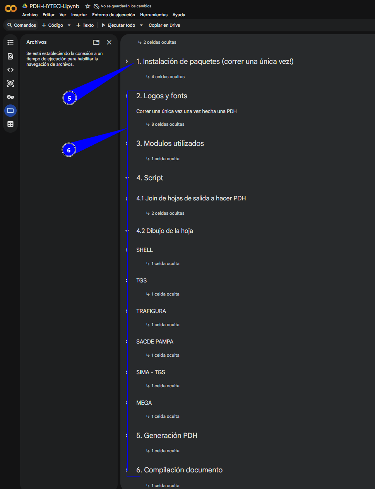
*Figura 15: Bloques del 1 a 6*
7. En caso de sacar múltiples planillas de doblado en la misma sesión, ir pisando el archivo PLANTILLA_BASE.xlsx y el informe que saca el TEKLA (borrar a mano archivo de requerirse) y correr bloques 3 a 6 nuevamente. El bloque 2 no debe ejecutarse más veces.

{: .important}
> Actualmente no se tiene integrado la PDH con un rótulo y atributos dentro del programa, por la dificultad aparejada de que los mismos se dividen por documento.
> En consecuencia, cada cliente nuevo o desvío respecto de los templates ya armados por cliente implicará la creación de un nuevo formato dentro del Colab.

## Longitud de anclaje

La longitud de anclaje es la longitud final que debe tener la barra para desarrollar la resistencia de diseño en una sección crítica. Se puede desarrollar de forma recta o a través de ganchos.

### Barras rectas

Su cálculo se encuentra indicado en CIRSOC 201-2005 bajo Art.12.2 (a responsabilidad del ingeniero en caso de tratarse de un lugar con poco espacio para anclar armadura) pero de manera simplificada se presenta la siguiente tabla:

| $d_b$ | $l_{dh} $ |
|----|-----|
| $\phi$ 6  | 300 mm |
| $\phi$ 8  | 305 mm |
| $\phi$ 10 | 380 mm |
| $\phi$ 12 | 460 mm |
| $\phi$ 16 | 600 mm |
| $\phi$ 20 | 760 mm |

{: .note}
> Los resultados de la tabla son para barras ADN-420 y hormigón H30.

Para el caso de ganchos (en extremos de barras con algún filo de hormigón, vale lo de la siguiente imagen)

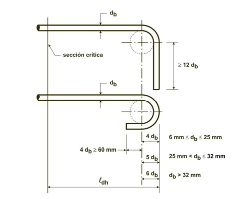
*Figura 15: Ganchos de acuerdo a CIRSOC 201-05*

| $$d_b$$ | $$l_{dh}$$ | $$L_{gancho,\min}$$ |
|---------|------------|---------------------|
| $\phi$ 6    | 150 mm        | 72 mm                  |
| $\phi$ 8      | 150 mm        | 96 mm                  |
| $\phi$ 10     | 150 mm        | 120 mm                 |
| $\phi$ 12   | 150 mm        | 144 mm                 |
| $\phi$ 16  | 150 mm        | 192 mm                 |
| $\phi$ 20      | 160 mm        | 240 mm                 |

## Longitud de empalme

Para el caso de barras de gran longitud o que deban separarse en tramos, aparece el empalme, que es una longitud donde ambas barras deben ir juntas (empalme por yuxtaposición). Un par de reglas:

- Las barras pueden estar alejadas solo hasta el máximo de 1/5 de la longitud de empalme o 150mm.
- La longitud es 1,3 veces la de anclaje recto.
- Escalonar empalmes cuando sea posible

En el caso que se tengan que cubrir distancias mayores a la longitud maxima, se debe de modelar el empalme correspondiente, el mismo se modela con la siguiente herramienta:
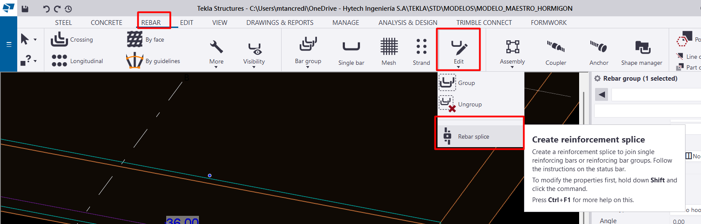

### Modelar empalmes

Hay componentes dentro del programa que permiten hacer splice de barras, aunque si se trata de una estructura particular donde debe estar pensado, es buena alternativa hacerlo manualmente e indicarlo en el plano de manera correcta:

*Figura 16: Rebar splice en empalmes*

Al tocar este comando, el mismo pedirá información sobre el corte de la barra a empalmar:

*Figura 17: Rebar splice configuración*

1. Joint type: muestra las distintas posiciones de solape, ofrece la posibilidad de solaparla, a la derecha, izquierda, ambas o de soldarlas y agregar una cupla
2. Lap Length: Longitud del solape, la misma depende del cálculo
3. Offset: Separación de las barras 
4. Bar Positions: Posición de las barras, esta opción puede ser o superpuestas entre si o paralelas. 

De forma general, las longitudes de empalme deben considerarse como $1,3 $ veces la longitud de anclaje de la barra

[← Volver al inicio](index.md)