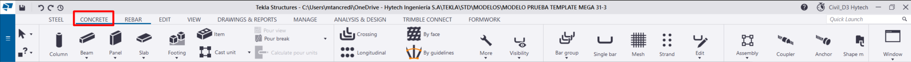
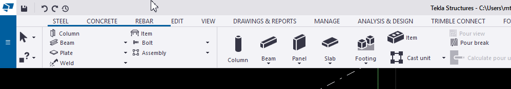
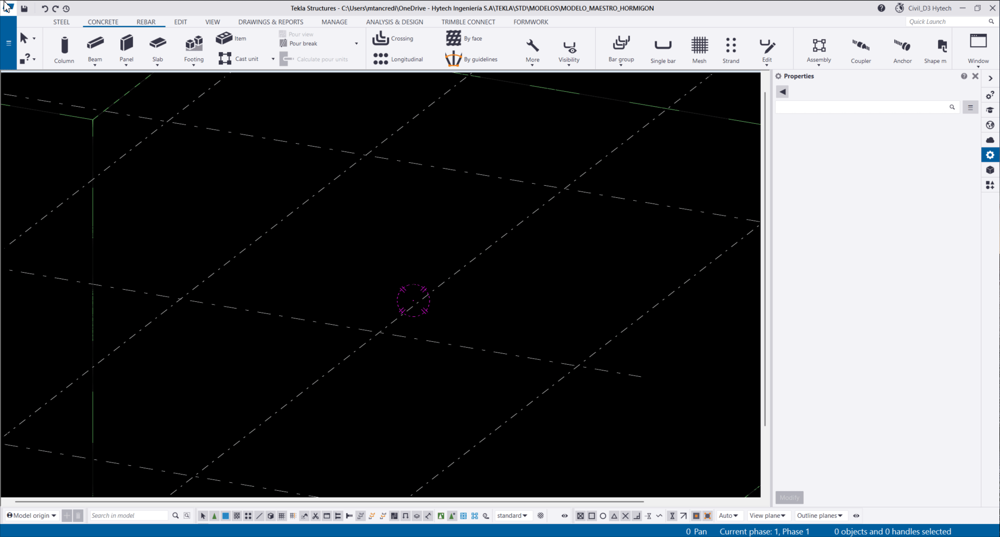
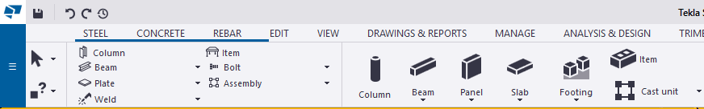
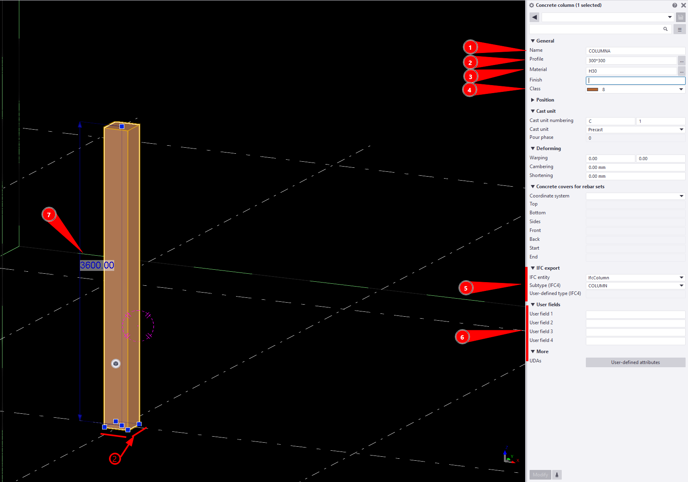
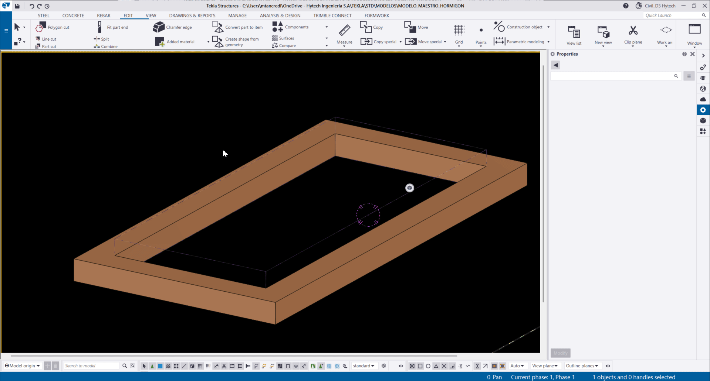

# Elementos - Hormigón
{: .no_toc }

## Tabla de Contenidos
{: .no_toc .text-delta }

1. TOC
{:toc}


## Objeto y alcance

Contiene los estándares y procedimientos para el modelado de estructuras de hormigón armado en Tekla Structures. Cubre elementos estructurales, propiedades a completar y buenas prácticas para garantizar modelos coordinados y homogéneos.

No es alcance de este instructivo mostrar cuestiones básicas del modelado de elementos si no brindar pautas de diseño y guiar en el proceso.


---

## Descripción de elementos

Tekla permite modelar estructuras de hormigon armado, este capitulo se centra en la creación de objetos de H°. Hay 4 principales opciones en el modelado. 



### Footing

Elementos en contacto con el suelo que distribuyen las cargas provenientes de la estructura. `Suele ser la función mas utilizada para modelar cualquier fundación independientemente de la forma`


 


**Atributos importantes**:

| Atributo | Descripción | Valor Ejemplo |
|----------|-------------|---------------|
| **Name** | Identificador del elemento | `ZAPATA` |
| **Profile** | Base y altura del elemento | `700*400` |
| **Material** | Material del elemento | `H30` |
| **Class** | Clase del elemento  | `8` |
| **Position** | Desplazamiento del elemento  | `-100` |
| **IFC export** | Config. de exportación | - |
| **User field / UDAS** | Atributos del elementos  | - |
| **Alto** | Alto del elemento |`400` |

- **1- Name**: Nombre del elemento, generalmente se suele definir antes del empezar el proyecto, como valor recomendado se puede definir "ZAPATA" o "BASE AISLADA"
- **2- Profile**: Base y altura del elemento, tienen dos maneras de editarse, en la pestaña de propiedades o en la parte superior o inferior del elemento.
- **3- Material**: Material del elemento, dependen de la base de datos de materiales, suele ser H25/H30/H35
- **4- Class**: Color del elemento, generalmente se suele definir antes del empezar el proyecto, como valor recomendado se puede definir "8", puede variar.
- **5-Position**: Desplazamiento del elemento, se puede modificar los puntos de inicio y final del elemento en cualquiera de sus ejes (X/Y/Z). 
- **6- IFC Export** : Atributos y configuraciones de la exportación a IFC.
- **7- User field / UDAS**: Atributos tanto definidos por el usuario como los "userfield" estas filas tienen varios usos, tanto como la numeración, o especificaciones, estas filas pueden usarse para tablas, reportes, cuadros.
- **8- Altura**: Altura del elemento, se edita desde el elemento




### Beam

Son elementos horizontales o inclinados que transmiten cargas por flexión.


**Atributos importantes**:

| Atributo | Descripción | Valor Ejemplo |
|----------|-------------|---------------|
| **Name** | Identificador del elemento | `VIGA` |
| **Profile** | Base y altura del elemento | `700*400` |
| **Material** | Material del elemento | `H30` |
| **Class** | Clase del elemento  | `8` |
| **Offset** | Desplazamiento del elemento  | `-100` |
| **IFC export** | Config. de exportación | - |
| **User field / UDAS** | Atributos del elementos  | - |
| **Largo** | Largo del elemento |`6000` |

- **1- Name**: Nombre del elemento, generalmente se suele definir antes del empezar el proyecto, como valor recomendado se puede definir "VIGA"
- **2- Profile**: Base y altura del elemento, tienen dos maneras de editarse, en la pestaña de propiedades o en la parte superior o inferior del elemento.
- **3- Material**: Material del elemento, dependen de la base de datos de materiales, suele ser H25/H30/H35
- **4- Class**: Color del elemento, generalmente se suele definir antes del empezar el proyecto, como valor recomendado se puede definir "8", puede variar.
- **5-Offset**: Desplazamiento del elemento, se puede modificar los puntos de inicio y final del elemento en cualquiera de sus ejes (X/Y/Z). 
- **6- IFC Export** : Atributos y configuraciones de la exportación a IFC.
- **7- User field / UDAS**: Atributos tanto definidos por el usuario como los "userfield" estas filas tienen varios usos, tanto como la numeración, o especificaciones, estas filas pueden usarse para tablas, reportes, cuadros.
- **8- Altura**: Altura del elemento, se edita desde el elemento.


### Column

Son elementos verticales que transmiten cargas axiales y momentos desde niveles superiores hacia la fundación.





**Atributos importantes:**
| Atributo | Descripción | Valor Ejemplo |
|----------|-------------|---------------|
| **Name** | Identificador del elemento | `COLUMNA` |
| **Profile** | Dimensiones del elemento | `300*300` |
| **Material** | Material del elemento | `H30` |
| **Class** | Clase del elemento  | `8` |
| **IFC export** | Config. de exportación | - |
| **User field / UDAS** | Atributos del elementos  | - |
| **Altura** | Altura del elemento |`3600` |

- **1- Name**: Nombre del elemento, generalmente se suele definir antes del empezar el proyecto, como valor recomendado se puede definir "COLUMNA"
- **2- Profile**: Dimension del elemento, tienen dos maneras de editarse, en la pestaña de propiedades o en la parte superior o inferior del elemento.
- **3- Material**: Material del elemento, dependen de la base de datos de materiales, suele ser H25/H30/H35
- **4- Class**: Color del elemento, generalmente se suele definir antes del empezar el proyecto, como valor recomendado se puede definir "8", puede variar.
- **5- IFC Export** : Atributos y configuraciones de la exportación a IFC.
- **6- User field / UDAS**: Atributos tanto definidos por el usuario como los "userfield" estas filas tienen varios usos, tanto como la numeración, o especificaciones, estas filas pueden usarse para tablas, reportes, cuadros.
- **7- Altura**: Altura del elemento, se edita desde el elemento.


### Slab

Son elementos superficiales horizontales o inclinados que trabajan en dos direcciones.


**Atributos importantes:**
| Atributo | Descripción | Valor Ejemplo |
|----------|-------------|---------------|
| **Name** | Identificador del elemento | `LOSA` |
| **Thickness** | Espesor del elemento | `200` |
| **Material** | Material del elemento | `H30` |
| **Class** | Clase del elemento  | `8` |
| **Position** | Posición del elemento  | `+-200` |
| **IFC export** | Config. de exportación | - |
| **User field / UDAS** | Atributos del elementos  | - |
| **Dimensiones** | Largo y ancho del elemento |`3000 X 2400` |

- **1- Name**: Nombre del elemento, generalmente se suele definir antes del empezar el proyecto, como valor recomendado se puede definir "LOSA"
- **2- Profile**: Dimension del elemento, tienen dos maneras de editarse, en la pestaña de propiedades o en la parte superior o inferior del elemento.
- **3- Material**: Material del elemento, dependen de la base de datos de materiales, suele ser H25/H30/H35
- **4- Class**: Color del elemento, generalmente se suele definir antes del empezar el proyecto, como valor recomendado se puede definir "8", puede variar.
- **5- Position**: Modifica el punto o linea de inserción del elemento, en su profundidad
- **6- IFC Export** : Atributos y configuraciones de la exportación a IFC.
- **7- User field / UDAS**: Atributos tanto definidos por el usuario como los "userfield" estas filas tienen varios usos, tanto como la numeración, o especificaciones, estas filas pueden usarse para tablas, reportes, cuadros.
- **8- Dimensiones**: Largo y ancho, se edita desde el elemento.


### Item

Son objetos modelados en 3D, que permiten colocarse en el modelo, dependen del Shape Catalog. Sus materiales son editables en base a la base de datos de materiales, son identificados por el organizer como elementos. 


### Unidad de colada


---

## Antes de modelar

- Referencias de connect
- Referencias externas de cliente
- Referencias internas del proyecto de otras disciplinas

EL Lep deberá indicar a quien modele lo que debe tomar como información valida y tener en cuenta

Para referencias de Connect, ver [Connect - Ejecutor](../connect/connect-ejecutor.md)

---

## Atributos a modelar

Va a depender de IB/ID, definiciones de proyecto, pero en caracter general:

---

## Diseño de armaduras

Ver [Armaduras](./armaduras.md) para detalle de cómo modelar, tipo de armaduras, y reportes asociados.

---

## Componentes

---

## Miscelaneos

### Diseño de anclajes

Referir a los componentes que lo modelan y derivar a la tabla de conexiones


### Antimaterial

Los antimateriales son piezas que generan un vacio en otro elemento, suelen utilizarse principalmente en las estructuras de hormigón.

 

1. Para crear un antimaterial, se debe crear una parte del tamaño a recortar (Para identificarlo mejor, se puede aumentar su altura y cambiar la clase.)

2. Al tener las dimensiones correctas, se coloca en la parte a recortar, luego en la pestaña de "edit" se selecciona "part cut" y se genera el corte.

3. Se elimina la parte cortante y el corte queda hecho


{: .note}

>Los antimateriales quedan representados con una linea punteada, representando su corte en el material, son invisibles y no se exportan, sus propiedades otorgan que el material recortado aparezca como una pieza monolítica si así fue modelada.`

Los antimateriales modelados pueden aparecer o no, para reiniciar su forma de representación se puede tocar la opcion "Redraw View" para que se escondan, o borrar el material cortado y volver hacia atras para que vuelva a aparecer:


### Tipo de fundaciones

Se presenta listado de tipo de fundaciones.

Lo complejo suele ser el armado de las mismas. para esas definciiones ver [Armaduras](./armaduras.md)


---

## 3. Unidades de Colada (Pour Objects / Cast Units)

### 3.1 ¿Qué son las Unidades de Colada?

Las **unidades de colada** (Cast Units o Pour Objects) son agrupaciones lógicas de elementos de hormigón que se colarán en una misma operación constructiva. Representan el hormigón que se vierte en un evento de colada continuo, respetando juntas constructivas, fases de obra y limitaciones prácticas.

### 3.2 ¿Para qué sirven?

1. **Planificación Constructiva**: Definir secuencia y fases de hormigonado
2. **Cubicaciones**: Calcular volúmenes de hormigón por colada
3. **Encofrados**: Extraer áreas de encofrado por etapa
4. **Logística**: Estimar camiones mixer necesarios
5. **Juntas Constructivas**: Representar separaciones físicas entre coladas
6. **Reportes**: Generar listados por unidad de colada
7. **Color Coding**: Visualizar fases en modelo 3D

### 3.3 Tipos de Unidades de Colada

#### Cast-in-Place (Colado in situ)
```
Cast Unit Type: CAST_IN_PLACE
```

Elementos colados en obra con encofrado tradicional.

**Ejemplos**:
- Losas de entrepisos
- Vigas y columnas in situ
- Muros de contención
- Fundaciones

#### Precast (Prefabricado)
```
Cast Unit Type: PRECAST
```

Elementos fabricados en planta y transportados.

**Ejemplos**:
- Vigas pretensadas
- Paneles arquitectónicos
- Losas alveolares

#### Site Precast (Prefabricado en Sitio)
```
Cast Unit Type: SITE_PRECAST
```

Elementos prefabricados en zona de acopio del proyecto.

---

### 3.4 Creación de Unidades de Colada

#### Método 1: Automático

Tekla crea unidades automáticamente cuando elementos se tocan y tienen propiedades compatibles.

**Condiciones para unión automática**:
- Mismo material
- Mismo `Cast Unit Type`
- `Pour Object` = `Yes` o `Auto`
- Geometrías en contacto (tolerance < 20mm default)

**Configuración**:
```
Ribbon > Concrete > Cast Units > Pour Management
```

#### Método 2: Manual

Seleccionar elementos y asignar a unidad de colada específica.

**Pasos**:
1. Seleccionar partes a agrupar
2. `Ribbon > Concrete > Cast Units > Create Cast Unit`
3. Asignar propiedades

#### Método 3: Por Componente

Algunos componentes crean unidades de colada automáticamente.

**Ejemplo**: Stair Component crea una unidad para todo el tramo.

---

### 3.5 Propiedades de Unidades de Colada

**Acceso**: Doble click en unidad de colada o desde Object Browser

| Propiedad | Descripción | Uso |
|-----------|-------------|-----|
| **Cast Unit ID** | Identificador único | `CU-001`, `POUR-1A` |
| **Cast Unit Prefix** | Prefijo para numeración | `CU-`, `POUR-` |
| **Start Number** | Número inicial | `1`, `100` |
| **Phase** | Fase de obra | `FOUNDATIONS`, `LEVEL-1` |
| **Pour Date** | Fecha programada de colada | `2024-03-15` |
| **Volume** | Volumen calculado (auto) | `12.5 m³` |
| **Pour Sequence** | Secuencia de colada | `1`, `2`, `3` |

**UDAs Recomendados**:
```
CONCRETE_SUPPLIER: Proveedor de hormigón
CONCRETE_MIX: Dosificación específica
CURING_METHOD: Método de curado
FORMWORK_TYPE: Tipo de encofrado
POUR_RATE: Velocidad de colada (m³/hr)
STRENGTH_28D: Resistencia a 28 días
TEST_CYLINDER_ID: Identificador de probetas
```

---

### 3.6 Separación de Unidades de Colada

#### Por Juntas Constructivas

Usar **Pour Break** para separar lógicamente elementos que se tocan:

**Herramienta**: `Ribbon > Concrete > Cast Units > Pour Break`

**Método**:
1. Seleccionar elementos a separar
2. Aplicar Pour Break
3. Se crean dos unidades independientes

**Casos de uso**:
- Separar columna de losa superior
- Dividir losa larga por juntas de contracción
- Separar muros por fases de colada

#### Por Atributos

Cambiar propiedades para evitar unión automática:
```
Parte A: Material = H30, Cast Unit Type = CAST_IN_PLACE
Parte B: Material = H21, Cast Unit Type = CAST_IN_PLACE
→ No se unen automáticamente
```

---

### 3.7 Workflow de Modelado con Unidades de Colada

#### Fase 1: Modelado Estructural

1. Modelar elementos sin preocuparse por unidades
2. Asignar propiedades correctas (material, clase, etc.)
3. Verificar que `Pour Object = Auto`

#### Fase 2: Definición de Unidades

1. Ejecutar `Create Cast Units` (automático o manual)
2. Revisar agrupaciones en Object Browser
3. Aplicar Pour Breaks donde sea necesario

#### Fase 3: Propiedades y Fases

1. Asignar IDs y prefijos
2. Definir fases de obra (`Phase`)
3. Agregar fechas de colada (`Pour Date`)
4. Completar UDAs de producción

#### Fase 4: Visualización

1. Usar `Object Representation` para color por unidad de colada
2. Activar filtros por fase
3. Generar vistas por secuencia de colada

---

### 3.8 Reportes de Unidades de Colada

#### Reporte de Volúmenes

**Template**: `Cast_Unit_Volume_Report.rpt`

**Campos clave**:
- Cast Unit ID
- Phase
- Volume (m³)
- Pour Date
- Number of Parts

#### Reporte de Encofrados

**Template**: `Formwork_Area_Report.rpt`

**Campos clave**:
- Cast Unit ID
- Formwork Area (m²)
- Formwork Type
- Surface Finish

#### Cubicación Detallada
```sql
SELECT 
    CU.CAST_UNIT_ID,
    CU.PHASE,
    SUM(P.VOLUME) as TOTAL_VOLUME,
    COUNT(P.ID) as PART_COUNT,
    CU.POUR_DATE
FROM CAST_UNIT CU
JOIN PART P ON P.CAST_UNIT_ID = CU.ID
GROUP BY CU.CAST_UNIT_ID, CU.PHASE, CU.POUR_DATE
ORDER BY CU.POUR_DATE
```

---

### 3.9 Ejemplos Prácticos

#### Ejemplo 1: Fundaciones
```
Unidad: FOUND-01
Contiene:
  - Zapata Z-1 (2.5 m³)
  - Zapata Z-2 (2.5 m³)
  - Viga de riostra VR-1 (1.2 m³)
Total: 6.2 m³
Fase: FOUNDATIONS
Fecha: 2024-03-10
```

**Configuración**:
- Todas las partes con `Cast Unit Type = CAST_IN_PLACE`
- Geometrías en contacto
- Mismo material: H21

#### Ejemplo 2: Columnas de Nivel 1
```
Unidad: COL-L1-01
Contiene:
  - Columnas C1 a C6 del nivel 1
Total: 14.8 m³
Fase: LEVEL-1-COLUMNS
Fecha: 2024-03-15
```

**Configuración**:
- Columnas NO unidas entre sí (no se tocan)
- Usar selección manual y `Create Cast Unit`
- Pour Break con losa superior

#### Ejemplo 3: Losa de Entrepiso
```
Unidad: SLAB-L2-A
Contiene:
  - Losa de 150mm (45 m³)
  - Vigas perimetrales (8 m³)
Total: 53 m³
Fase: LEVEL-2-DECK
Fecha: 2024-03-20
```

**Configuración**:
- Losa y vigas se unen automáticamente (en contacto)
- Pour Break con columnas inferiores
- Verificar espesor de losa para volumen correcto

---

### 3.10 RECOMENDACIONES
#### ✅ Hacer

1. **Definir fases temprano**: Establecer convención de nombres
2. **Usar prefijos consistentes**: `CU-`, `POUR-`, `CAST-`
3. **Verificar volúmenes**: Comparar con cálculos manuales
4. **Documentar juntas**: Usar Pour Breaks explícitos
5. **Color por fase**: Visualizar secuencia constructiva
6. **Incluir UDAs**: Agregar información de producción
7. **Sincronizar con cronograma**: Alinear fechas con planificación

#### ❌ Evitar

1. No dejar unidades automáticas sin revisar
2. No mezclar Cast-in-Place con Precast en misma unidad
3. No ignorar tolerancias de unión (ajustar si es necesario)
4. No usar IDs genéricos (dificultan trazabilidad)
5. No omitir Pour Breaks en juntas críticas
6. No olvidar actualizar después de cambios geométricos

---


#### Numeración Automática

**Ruta**: `Setup > Numbering > Cast Unit Numbering`

Configurar prefijos y rangos por fase.

#### Templates de Propiedades

Guardar configuraciones de unidades de colada como templates para reutilizar.

---

## 4. Checklist de Modelado en Hormigón

### Antes de Modelar

- [ ] Definir grid y niveles de referencia
- [ ] Establecer convención de nombres y clases
- [ ] Configurar materiales (H21, H30, etc.)
- [ ] Definir fases de colada y secuencia constructiva

### Durante el Modelado

- [ ] Verificar Profile y Material en cada elemento
- [ ] Asignar Class correctamente (7=columna, 8=viga, etc.)
- [ ] Definir Position para alineaciones correctas
- [ ] Aplicar offsets donde sea necesario
- [ ] Verificar empotramientos y conexiones
- [ ] Completar UDAs requeridos

### Unidades de Colada

- [ ] Ejecutar creación de unidades (auto o manual)
- [ ] Verificar agrupaciones lógicas
- [ ] Aplicar Pour Breaks en juntas
- [ ] Asignar IDs y fases
- [ ] Agregar fechas de colada
- [ ] Validar volúmenes calculados

### Verificación Final

- [ ] Clash detection (hormigón vs MEP)
- [ ] Verificar coberturas de armado
- [ ] Revisar espesores y dimensiones
- [ ] Validar niveles y cotas
- [ ] Generar reportes de cubicación
- [ ] Exportar modelo a planificación (4D)

---

## 5. Troubleshooting Común

### Problema: Unidades no se unen automáticamente

**Causas**:
- Materiales diferentes
- Gap > tolerancia (20mm)
- `Pour Object = No` en alguna parte
- `Cast Unit Type` diferentes

**Solución**:
- Verificar propiedades
- Ajustar tolerancia
- Forzar unión manual

### Problema: Volúmenes incorrectos

**Causas**:
- Overlaps entre elementos
- Profile mal definido
- Unidades incorrectas (mm vs m)

**Solución**:
- Clash detection
- Revisar geometrías
- Verificar unidades del modelo

### Problema: Numeración duplicada

**Causas**:
- Configuración de numeración errónea
- Modelo no renumerado

**Solución**:
- `Ribbon > Numbering > Renumber All`
- Verificar `Numbering Setup`

---

## 6. Recursos Adicionales

### Templates Recomendados

- `Concrete_Standard.ini`: Configuración base
- `Cast_Unit_Properties.uel`: Template de propiedades
- `Concrete_Classes.std`: Clases estándar

### Componentes Útiles

- `(14) Concrete console`: Ménsula hormigón
- `(81) Slab bay`: Paño de losa entre ejes
- `(146) Stairs`: Escaleras de hormigón
- `(71) Wall opening`: Aberturas en muros

### Plugins Externos

- **Concrete Quantity Takeoff**: Cubicaciones avanzadas
- **Rebar Visibility**: Control de visualización de armaduras
- **Pour Management Pro**: Gestión avanzada de coladas

---

## 7. Estándares de Nomenclatura

### Convención de Names
```
Columnas: C-<GRID>-<NIVEL>  → C-A1-L1
Vigas:    V-<EJE>-<NIVEL>   → V-AB-L2
Losas:    S-<NIVEL>         → S-L1, S-ROOF
Muros:    W-<ID>-<NIVEL>    → W-X1-L1
Zapatas:  F-<COLUMNA>       → F-C1, F-A1
```

### Convención de Classes
```
7:  Columnas
8:  Vigas
9:  Losas
10: Muros portantes
11: Fundaciones
12: Muros de contención
13: Escaleras
14: Muros (general)
```

### Convención de Cast Unit IDs
```
CU-<FASE>-<SECUENCIA>  → CU-FOUND-01, CU-L1-COL-01
```


[← Volver al inicio](index.md)