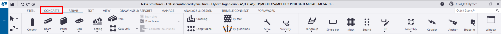
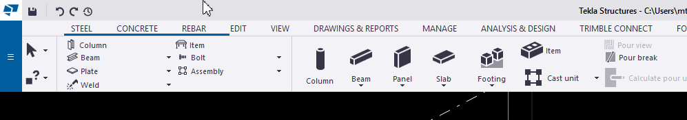
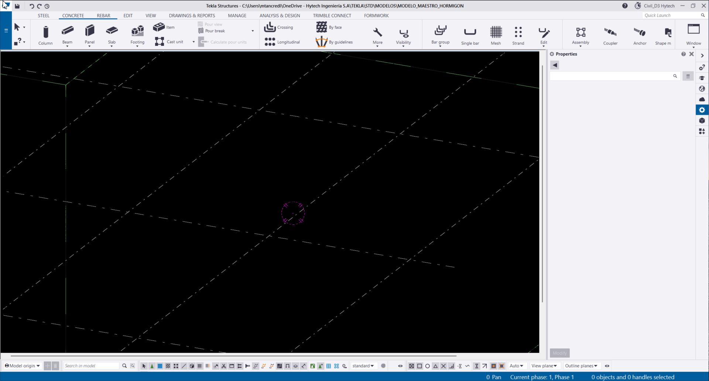
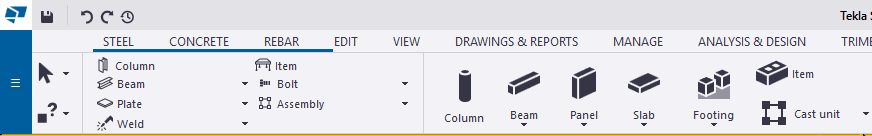
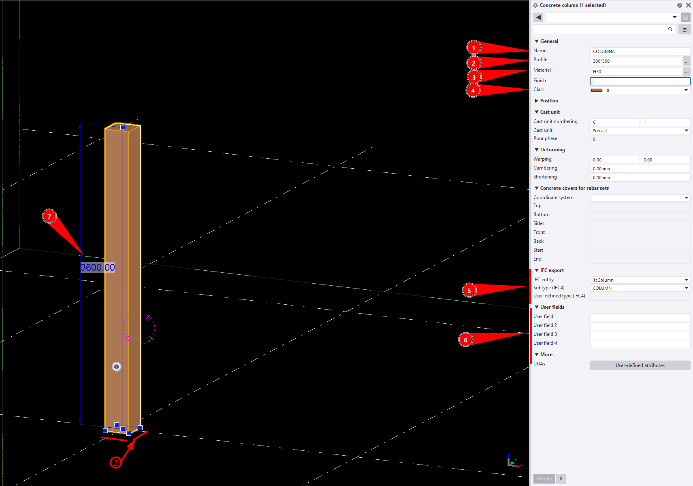
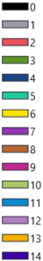
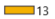
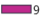
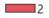
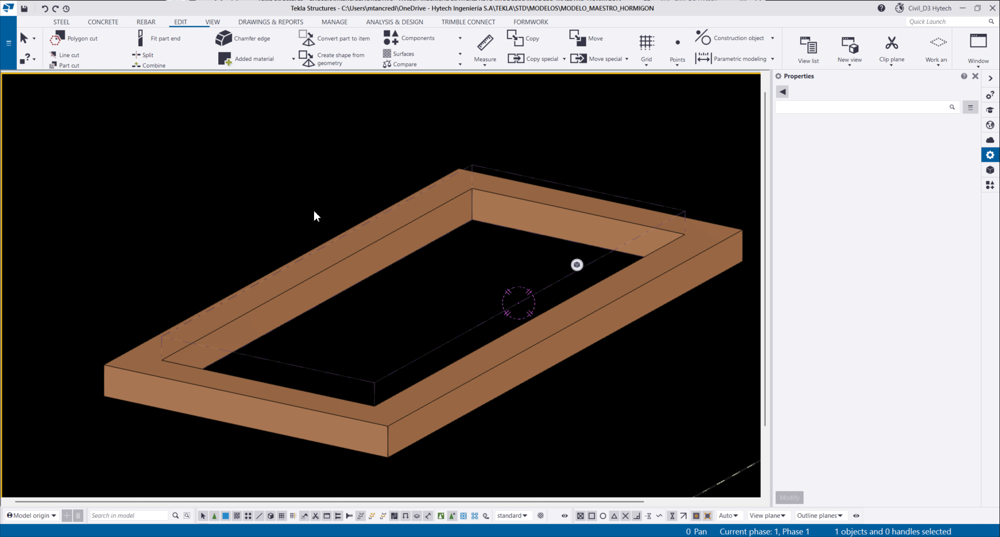

# Elementos - Hormigón
{: .no_toc }

## Tabla de Contenidos
{: .no_toc .text-delta }

1. TOC
{:toc}

## Objeto y alcance

Contiene los estándares y procedimientos para el modelado de estructuras de hormigón armado en Tekla Structures. Cubre elementos estructurales, propiedades a completar y buenas prácticas para garantizar modelos coordinados y homogéneos.

No es alcance de este instructivo mostrar cuestiones básicas del modelado de elementos si no brindar pautas de diseño y guiar en el proceso.

El objeto de este instructivo es mencionar los estándares y procedimientos para el modelado de estructuras de hormigón armado en Tekla Structures, a fin de mantener un modelado homogeneo a nivel empresa. 

Se cubriran los siguientes aspectos para cada elemento:
- Definición
- Propiedades a completar
- Buenas prácticas

No es alcance de este instructivo mostrar cuestiones básicas del modelado de elementos si no brindar pautas de diseño y guiar en el proceso. Para pautas más básicas de modelado, referir a la [Bibliografía](../index.md#documentación-oficial)

---

## Descripción de elementos

Tekla permite modelar estructuras de hormigon armado, este capitulo se centra en la creación de objetos de H°. Hay 4 principales opciones en el modelado. 

*Figura 1: Ribbon ubicación concrete*
### Footing

Elementos en contacto con el suelo que distribuyen las cargas provenientes de la estructura. 

#### Usos

- Dados
- Bases aisladas
- Fundaciones de equipos (horizontales/verticales)
- Bases tipo cuenco
- Plateas
- Zapata corrida
  
  {: .note}
>Suele ser la función mas utilizada para modelar cualquier fundación independientemente de la forma

 

*Figura 2: Atributos footing*

**Atributos importantes**:

| Atributo | Descripción | Valor Ejemplo |
|----------|-------------|---------------|
| **Name** | Identificador del elemento | `BA` |
| **Profile** | Base y altura del elemento | `700*400` |
| **Material** | Material del elemento | `H30` |
| **Class** | Clase del elemento  | `8` |
| **Position** | Desplazamiento del elemento  | `-100` |
| **IFC export** | Config. de exportación | - |
| **User field / UDAS** | Atributos del elementos  | - |
| **Alto** | Alto del elemento |`400` |

- **1. Name**: Nombre del elemento, generalmente se suele definir antes del empezar el proyecto, como valor recomendado se puede definir "ZAPATA" o "BASE AISLADA"
- **2- Profile**: Base y altura del elemento, tienen dos maneras de editarse, en la pestaña de propiedades o en la parte superior o inferior del elemento.
- **3- Material**: Material del elemento, dependen de la base de datos de materiales, suele ser H25/H30/H35
- **4- Class**: Color del elemento, generalmente se suele definir antes del empezar el proyecto, como valor recomendado se puede definir "8", puede variar.
- **5-Position**: Desplazamiento del elemento, se puede modificar los puntos de inicio y final del elemento en cualquiera de sus ejes (X/Y/Z). 
- **6- IFC Export** : Atributos y configuraciones de la exportación a IFC.
- **7- User field / UDAS**: Atributos tanto definidos por el usuario como los "userfield" estas filas tienen varios usos, tanto como la numeración, o especificaciones, estas filas pueden usarse para tablas, reportes, cuadros.
- **8- Altura**: Altura del elemento, se edita desde el elemento

*Figura 2.5: Como crear una footing*

### Beam

Son elementos horizontales o inclinados que transmiten cargas por flexión.

#### Usos

- Vigas de encadenado
- Vigas en estructura de hormigón
- Anillos de tanques

*Figura 3: Atributos Beam*

**Atributos importantes**:

| Atributo | Descripción | Valor Ejemplo |
|----------|-------------|---------------|
| **Name** | Identificador del elemento | `VIGA` |
| **Profile** | Base y altura del elemento | `700*400` |
| **Material** | Material del elemento | `H30` |
| **Class** | Clase del elemento  | `8` |
| **Offset** | Desplazamiento del elemento  | `-100` |
| **IFC export** | Config. de exportación | - |
| **User field / UDAS** | Atributos del elementos  | - |
| **Largo** | Largo del elemento |`6000` |

- **1- Name**: Nombre del elemento, generalmente se suele definir antes del empezar el proyecto, como valor recomendado se puede definir "VIGA"
- **2- Profile**: Base y altura del elemento, tienen dos maneras de editarse, en la pestaña de propiedades o en la parte superior o inferior del elemento. Tocando los 3 puntos del lado derecho, se obtiene acceso a la biblioteca de perfiles, la cual da accede a una gran variedad de formas totalmente parametrizables. 
- **3- Material**: Material del elemento, dependen de la base de datos de materiales, suele ser H25/H30/H35
- **4- Class**: Color del elemento, generalmente se suele definir antes del empezar el proyecto, como valor recomendado se puede definir "8", puede variar.
- **5-Offset**: Desplazamiento del elemento, se puede modificar los puntos de inicio y final del elemento en cualquiera de sus ejes (X/Y/Z). 
- **6- IFC Export** : Atributos y configuraciones de la exportación a IFC.
- **7- User field / UDAS**: Atributos tanto definidos por el usuario como los "userfield" estas filas tienen varios usos, tanto como la numeración, o especificaciones, estas filas pueden usarse para tablas, reportes, cuadros.
- **8- Altura**: Altura del elemento, se edita desde el elemento.

*Figura 3.5: Como crear una beam*

### Column

Son elementos verticales que transmiten cargas axiales y momentos desde niveles superiores hacia la fundación.

#### Usos

- Columnas sobre estructuras de hormigón
  

*Figura 4: Atributos Column*

**Atributos importantes:**
| Atributo | Descripción | Valor Ejemplo |
|----------|-------------|---------------|
| **Name** | Identificador del elemento | `COLUMNA` |
| **Profile** | Dimensiones del elemento | `300*300` |
| **Material** | Material del elemento | `H30` |
| **Class** | Clase del elemento  | `8` |
| **IFC export** | Config. de exportación | - |
| **User field / UDAS** | Atributos del elementos  | - |
| **Altura** | Altura del elemento |`3600` |

- **1- Name**: Nombre del elemento, generalmente se suele definir antes del empezar el proyecto, como valor recomendado se puede definir "COLUMNA"
- **2- Profile**: Dimension del elemento, tienen dos maneras de editarse, en la pestaña de propiedades o en la parte superior o inferior del elemento.
- **3- Material**: Material del elemento, dependen de la base de datos de materiales, suele ser H25/H30/H35
- **4- Class**: Color del elemento, generalmente se suele definir antes del empezar el proyecto, como valor recomendado se puede definir "8", puede variar.
- **5- IFC Export** : Atributos y configuraciones de la exportación a IFC.
- **6- User field / UDAS**: Atributos tanto definidos por el usuario como los "userfield" estas filas tienen varios usos, tanto como la numeración, o especificaciones, estas filas pueden usarse para tablas, reportes, cuadros.
- **7- Altura**: Altura del elemento, se edita desde el elemento.

*Figura 4.5: Como crear una column*

### Slab

Son elementos superficiales que trabajan en una o dos direcciones

#### Usos

- Losas en estructuras de hormigón.
- **No** usar para plateas de fundación
  

*Figura 5: Atributos slab*

**Atributos importantes:**

| Atributo | Descripción | Valor Ejemplo |
|----------|-------------|---------------|
| **Name** | Identificador del elemento | `LOSA` |
| **Thickness** | Espesor del elemento | `200` |
| **Material** | Material del elemento | `H30` |
| **Class** | Clase del elemento  | `8` |
| **Position** | Posición del elemento  | `+-200` |
| **IFC export** | Config. de exportación | - |
| **User field / UDAS** | Atributos del elementos  | - |
| **Dimensiones** | Largo y ancho del elemento |`3000 X 2400` |

- **1- Name**: Nombre del elemento, generalmente se suele definir antes del empezar el proyecto, como valor recomendado se puede definir "LOSA"
- **2- Profile**: Dimension del elemento, tienen dos maneras de editarse, en la pestaña de propiedades o en la parte superior o inferior del elemento.
- **3- Material**: Material del elemento, dependen de la base de datos de materiales, suele ser H25/H30/H35
- **4- Class**: Color del elemento, generalmente se suele definir antes del empezar el proyecto, como valor recomendado se puede definir "8", puede variar.
- **5- Position**: Modifica el punto o linea de inserción del elemento, en su profundidad
- **6- IFC Export** : Atributos y configuraciones de la exportación a IFC.
- **7- User field / UDAS**: Atributos tanto definidos por el usuario como los "userfield" estas filas tienen varios usos, tanto como la numeración, o especificaciones, estas filas pueden usarse para tablas, reportes, cuadros.
- **8- Dimensiones**: Largo y ancho, se edita desde el elemento.

*Figura 5.5: Como crear una slab*

### Item

Son objetos modelados en 3D, que permiten colocarse en el modelo, dependen del Shape Catalog. Sus materiales son editables en base a la base de datos de materiales, son identificados por el organizer como elementos. 

*Figura 6: Como crear un item*

---

## Antes de modelar

Para modelar y ubicarnos respecto al proyecto debemos usar referencias externas a nuestro modelo, que permiten ubicar la estructura a modelar en el espacio.

El proyecto en el que se esté modelando ya tendrá un modelo de Connect asociado. Allí habrá referencias a otros modelos y de otras disciplinas. Ver [Trimble - Ejecutor](../connect/connect-ejecutor.md) para detalle. En caracter general se describen cómo pueden tomar las referencias

- Referencias de Trimble Connect 
- Referencias externas del cliente
- Referencias internas del proyecto de otras disciplinas (si no estuviesen cargadas en Connect)

Es responsabilidad del LEP indicar cuáles son las estructuras vigentes del proyecto y a tener en cuenta en caso de existir interferencias.

Para referencias de Connect, ver [Connect - Ejecutor](../connect/connect-ejecutor.md)

---

## Conceptos generales:

### Unidad de colada

Una unidad de colada es un valor numerico creado por el usuario que establece la union monolitica de dos o mas partes de hormigón. Por defecto cada parte de hormigón modelada se considera su propia unidad de colada. Al modelar partes de hormigón en Tekla, debe crear unidades de colada cuando hay varias partes de hormigón que se deben fundir como una estructura monolítica.

Previo a usar unidades de colada, familiarizarse con las herramientas de selección de elementos, descriptas en... [Herramientas de modelado](../generalidades/generalidades.md#herramientas-de-modelado)

La unidad de colada es mandatoria para realizar reportes de armadura (planillas de doblado). Su creación, modificación y numeración se describe en el apartado del manual [Armaduras](./armaduras.md).

Para verificar que la unidad de colada sea la correcta a la hora de numerar y trabajarla se debe de hacer una verificación con la herramienta `Inquire objets`.

Al utilizar esta herramienta la misma brindará la información sobre la unidad de colada, su nombre, posición, etc. 

### Atributos a modelar

Va a depender de IB/ID, definiciones de proyecto, pero en caracter general y como obligatorios tenemos los siguientes:

- NAME
- CLASS
- PROFILE
- MATERIAL
- UDAs (_Atributos definidos por el usuario_): es responsabilidad del LEP indicar cuáles se precisan, de acuerdo al preset de propiedades creado, descripto en [Preset Propiedades](../proyecto_nuevo/uso_template.md#).

#### Name

Tabla de nombres:

| Elemento                      | Nomenclatura      |
|:------------------------------|:------------------|
| Sleeper                       | SL                |
| Platea                        | PLATEA            |
| Base Aislada                  | BA                |
| Viga de Encadenado            | VE                |
| Zapata Corrida                | ZC                |
| Cabezal                       | CAB               |
| Pilote                        | PIL               |
| Hormigón de Limpieza          | HL                |
| Grout                         | GROUT             |
| Columna de H°A                | COL               |
| Viga de H°A                   | VIG               |
| Placa Base/Chapa Embebida     | PB_<# Secuencial> |
| Bulones de Anclaje 1° Etapa   | ANCLAJE_1         |
| Bulones de Anclaje 2° Etapa   | ANCLAJE_2         |

#### Clases
Hay 14 clases/colores definidos en tekla, esta sirve para discriminar elementos en Trimble Connect con colores. 

Por simplicidad, seguir lo siguiente:

| Elemento                      | Nomenclatura      | Clase                               |
|:------------------------------|:------------------|:----------------------------------- |
| Sleeper                       | SL                ||
| Platea                        | PLATEA            ||
| Base Aislada                  | BA                ||
| Viga de Encadenado            | VE                ||
| Zapata Corrida                | ZC                ||
| Cabezal                       | CAB               ||
| Pilote                        | PIL               ||
| Hormigón de Limpieza          | HL                ||
| Grout                         | GROUT             ||
| Columna de H°A                | COL               ||
| Viga de H°A                   | VIG               ||
| Placa Base/Chapa Embebida     | PB_<# Secuencial> ||
| Bulones de Anclaje 1° Etapa   | ANCLAJE_1         ||
| Bulones de Anclaje 2° Etapa   | ANCLAJE_2         ||

---

## Diseño de armaduras

Ver [Armaduras](./armaduras.md) para detalle de cómo modelar, tipo de armaduras, y reportes asociados.

---

## Miscelaneos

### Diseño de anclajes

Los anclajes son alcance de las estructuras de hormigón a nivel diseño. Para modelarlos tendremos que modelar la estructura metálica superior asociada (que luego podemos ocultar).

#### Calidades
Los materiales disponibles para anclajes son los siguientes. Si se precisa otro, se deberá sumar a la base de datos de materiales a nivel local en ese modelo:

- ASTM F1554 Gr.36
- ASTM F1554 Gr.55

A través del nombre del anclaje se indicará ANCLAJE_1 o ANCLAJE_2 de acuerdo a si se trata de primera o segunda etapa.

Para acelerar el análisis, utilizar el componente 1047 del TEKLA para modelar placas base, donde ya se encuentran varias configuraciones guardadas para distintas configuraciones.

{: .important}
> El largo por default de estas configuraciones será $12d_o$ para longitud embebida. La proyección siempre se considerará con doble tuerca. Ajustar de acuerdo a ingeniería en cada caso.

Las configuraciones guardadas consideran lo siguiente:

- Doble tuerca superior
- Tuerca de nivelacion inferior
- Espesor de PB igual al diámetro considerado
- El grout será 25mm hasta 3/4''. De 1'' para arriba se considera 30mm para que entre la tuerca de nivelación

| Perfil | 200x200 | 250x200 | 250x250 | 280x280 | 300x250 | 300x300 | 350x280 | 350x300 | 350x350 | 400x300 | 400x350 | 400x400 | 450x350 | 450x450 |
|---------|---------|---------|---------|---------|---------|---------|---------|---------|---------|---------|---------|---------|---------|---------|
| **W6x15**   | [Articulada 1°](../ref/Placa%20Base/W6x15-ART-1°.j1047) |   |   |   |   | [Empotrada 1°](../ref/Placa%20Base/W6x15-EMP-1°.j1047) |   |   | [Empotrada 2°](../ref/Placa%20Base/W6x15-EMP-2°.j1047) |   |   |   |   |   |
| **W8x18**   |   |   | [Articulada 1°](../ref/Placa%20Base/W8x18-ART-1°.j1047) |   |   |   | [Empotrada 1°](../ref/Placa%20Base/W8x18-EMP-1°.j1047) |   |   |   | [Empotrada 2°](../ref/Placa%20Base/W8x18-EMP-2°.j1047) |   |   |   |
| **W8x31**   |   |   | [Articulada 1°](../ref/Placa%20Base/W8x31-ART-1°.j1047) [Articulada 2°](../ref/Placa%20Base/W8x31-ART-2°.j1047) |   |   |   |   |   | [Empotrada 1°](../ref/Placa%20Base/W8x31-EMP-1°.j1047) |   |   | [Empotrada 2°](../ref/Placa%20Base/W8x31-EMP-2°.j1047) |   |   |
| **W10x45**  |   |   |   |   |   | [Articulada 1°](../ref/Placa%20Base/W10x45-ART-1°.j1047) |   |   |   |   |   | [Empotrada 1°](../ref/Placa%20Base/W10x45-EMP-1°.j1047) |   | [Empotrada 2°](../ref/Placa%20Base/W10x45-EMP-2°.j1047) |
| **W12x50**  |   |   |   |   |   |   |   |   | [Articulada 1°](../ref/Placa%20Base/W12x50-ART-1°.j1047) |   |   |   |   | [Empotrada 1°](../ref/Placa%20Base/W12x50-EMP-1°.j1047) |
| **W14x74**  |   |   |   |   |   |   |   |   |   |   |   | [Articulada 1°](../ref/Placa%20Base/W14x74-ART-1°.j1047) |   | [Empotrada 1°](../ref/Placa%20Base/W14x74-EMP-1°.j1047) |
| **HEB160**  |   |   |   | [Empotrada 1°](../ref/Placa%20Base/HEB160-EMP-1°.j1047) |   |   |   |   | [Empotrada 2°](../ref/Placa%20Base/HEB160-EMP-2°.j1047) |   |   |   |   |   |
| **HEB200**  |   |   | [Articulada 1°](../ref/Placa%20Base/HEB200-ART-1°.j1047) |   |   |   |   |   | [Empotrada 1°](../ref/Placa%20Base/HEB200-EMP-1°.j1047) |   |   |   |   | [Empotrada 2°](../ref/Placa%20Base/HEB200-EMP-2°.j1047) |
| **UPN140C** |   | [Empotrada 1°](../ref/Placa%20Base/UPN140C-EMP-1°.j1047) |   |   | [Empotrada 2°](../ref/Placa%20Base/UPN140C-EMP-2°.j1047) |   |   |   |   |   |   |   |   |   |
| **UPN180C** |   |   |   |   | [Empotrada 1°](../ref/Placa%20Base/UPN180C-EMP-1°.j1047) |   |   | [Empotrada 2°](../ref/Placa%20Base/UPN180C-EMP-2°.j1047) |   |   |   |   |   |   |
| **UPN220C** |   |   |   |   |   |   |   |   |   | [Empotrada 1°](../ref/Placa%20Base/UPN220C-EMP-1°.j1047) |   |   | [Empotrada 2°](../ref/Placa%20Base/UPN220C-EMP-2°.j1047) |   |

### Antimaterial

Los antimateriales son piezas que generan un vacio en otro elemento, suelen utilizarse principalmente en las estructuras de hormigón.

 
*Figura 7: Efecto del antimaterial*
1. Para crear un antimaterial, se debe crear una parte del tamaño a recortar (Para identificarlo mejor, se puede aumentar su altura y cambiar la clase.)

2. Al tener las dimensiones correctas, se coloca en la parte a recortar, luego en la pestaña de "edit" se selecciona "part cut" y se genera el corte.

3. Se elimina la parte cortante y el corte queda hecho

*Figura 7.5: Como crear un antimaterial*

{: .note}

>Los antimateriales quedan representados con una linea punteada, representando su corte en el material, son invisibles y no se exportan, sus propiedades otorgan que el material recortado aparezca como una pieza monolítica si así fue modelada.`

Los antimateriales modelados pueden aparecer o no, para reiniciar su forma de representación se puede tocar la opcion "Redraw View" para que se escondan, o borrar el material cortado y volver hacia atras para que vuelva a aparecer:

*Figura 8: Como regenerar el antimaterial*

### Publicar una fundación (NUEVO)

Aca podemos describir como guardar una serie de objetos (por ejemplo dado 1, y extenderlo a todo un proyecto, ya que ahora contamos con XS_PROJECT dentro de cada template)

Se indicarán pasos a modo de ejemplo con un dado de 60x60 con chapa embebida y armadura phi 8 c/15 tipo jaula. LLamarlo DADO_1_PAM25026
