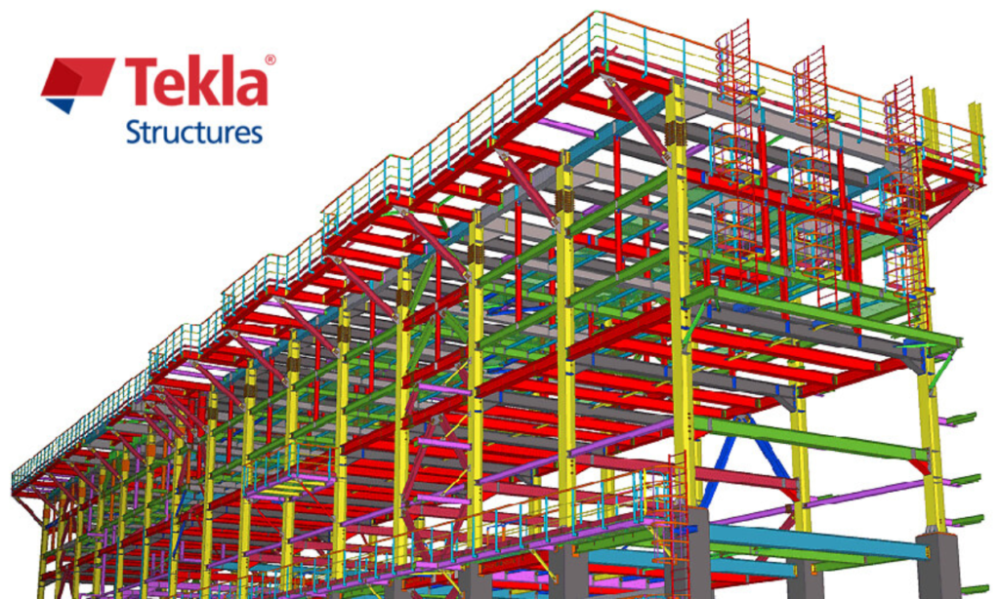
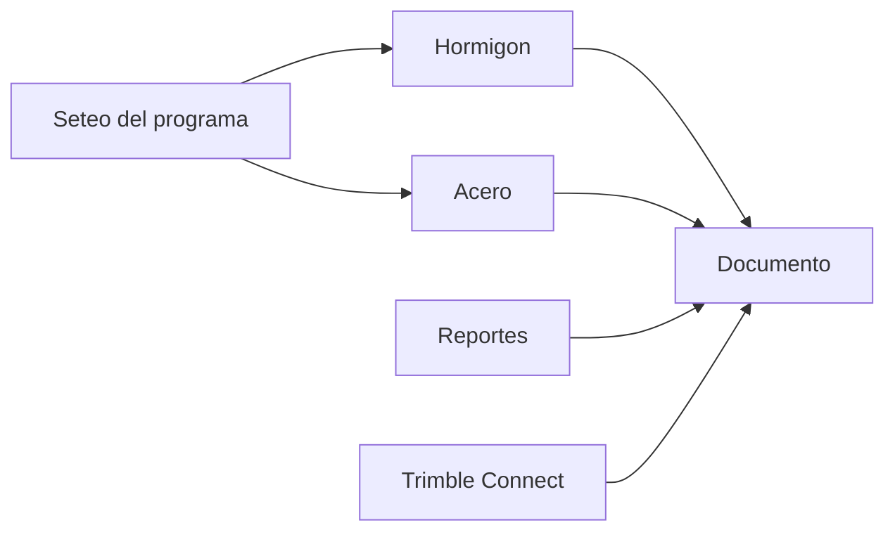

# Tekla Structures - Guía de uso

---
## Objeto y alcance

Este portal centraliza las buenas prácticas de uso de TEKLA Structures en Hytech, desarrolladas a partir de los años de experiencia con el programa y la documentación oficial.

{: .highlight}
>**Objetivos**:
>
> - Proporcionar soporte para tareas específicas en TEKLA
> - Servir como guía de referencia para nuevos usuarios en modelado y documentación
> - La versión de la documentación y lo aquí indicado se corresponde con la versión `2022`

---
## Cómo usar el sitio

A continuación se describe como recorrer el sitio para distintos roles, o donde se encuentra la información relevante para cada rol, entendiendo como `ejecutores` a proyectistas e ingenieros trabajando día a día con el programa, `revisores` a aquellos que usan el programa desde Trimble Connect como herramienta de gestión. Para nuevos ingresantes o externos comenzando a usar el programa, seguir lo indicado en `Nuevos usuarios`.

### Ejecutor en proyecto en curso

### Ejecutor en nuevo proyecto

### Ejecutor + Responsable de maqueta

### Revisor

### Nuevos usuarios

---

## Contenido del sitio

- [Setup](setup/index.md) - Primeros pasos con el programa (instalación y configuración)
- [Generalidades](generalidades/index.md) - Conceptos fundamentales de TEKLA y BIM
- [Modelado - Hormigón](hormigon/index.md) - Modelado de elementos de hormigón
- [Modelado - Acero](acero/index.md) - Modelado de elementos de acero
- [Modo Dibujo](dibujo/index.md) - Generación y edición de planos
- [Reportes y cuadros](reportes/index.md) - Reportes y cuadros: guía de uso
- [Ejemplos](ejemplos/index.md) - Ejemplos prácticos de modelado y reportes
- [Avanzado](avanzado/index.md) - Aspectos avanzados del programa
- [FAQ](faq/faq.md) - Preguntas frecuentes

---

## Material complementario

Se recomienda consultar los manuales internos de Hytech sobre metodología BIM y gestión de modelos federados.

- [Uso de modelo 3D](manuales/PR-O-P-001-r1%20Uso%20de%20Modelos%203D_rxxiv.docx) **EN PROCESO**
- [BIM por Civil y Estructuras] - En desarrollo

---

## Documentación oficial

Se indica debajo documentación del programa a la cual se hará referencia en varios apartados.

### Generales

Sobre aspectos o cuestiones básicas:
- [Comenzando con el programa](manuales/TS_GEM_2022_en_Get_familiar_with_Tekla_Structures.pdf)
- [Crear modelos](manuales/TS_MOD_2022_en_Create_models.pdf)
- [Crear dibujos](manuales/TS_DRA_2022_en_Create_drawings.pdf)

Para tener a mano en cualquier ocasión:
- [Atajos Teclado](manuales/2022-Tekla-Structures-EN-KB-Shortcuts-flyer.pdf)
- [Editor de cuadros](manuales/TE_USG_420_en_Template_editor_user_guide.pdf)
- [Editor de símbolos](manuales/SE_USG_300_en_Symbol_editor_user_guide.pdf)

### Particulares

Para gestión del editor de cuadros y atributos:
- [Atributos del programa](manuales/TS_TEA_2025_en_Template_attributes_0.pdf)
- [Propiedades avanzadas](manuales/TS_REF_2022_en_Reference.pdf)

Para quien deba tomar tareas de mantenimiento o seguimiento de los proyectos usando TEKLA:
- [Monitoreo TEKLA](manuales/TS_MGE_2022_en_Manage_Tekla_Structures.pdf)
- [Track Proyectos](manuales/TS_PLA_2022_en_Plan_and_track_projects.pdf)
- [Model Sharing](manuales/TS_SHA_2022_en_Share_models_and_files.pdf)

---

