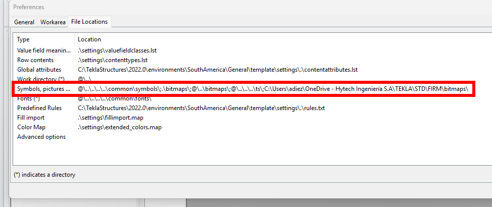

# Crear un template de proyecto
{: .no_toc }

## Tabla de Contenidos
{: .no_toc .text-delta }

1. TOC
{:toc}

## ¿Qué es el template?

Un template es el conjunto de propiedades con el que se trabaja en un proyecto, estos templates, contienen atributos definido, vistas, documentos de referencia y el rótulo de proyecto. 

## Crear un nuevo modelo 

Se debe de crear un nuevo modelo sin ninguna plantilla para evitar trasladar errores, se sugiere nombrar como "Template PROY" por ej: `Template RTI26011`

*Figura 1: Crear modelo nuevo*

## Definición de atributos

Se deben de completar los atributos que se vayan a utilizar  tanto a nivel proyecto como atributos que utilicen los cuadros de los dibujos:

| PROJECT PROPERTIES | DESCRIPCIÓN |  EJEMPLO |
|:---------------|:----------:|:----------:|
| **Project number** | Especifica el numero de proyecto | `RTI26011`  |
| **Name** | Especifica el nombre del proyecto  | `IB Proyecto de Repulping SdV`  | 
| **Designer**| Autor del proyecto |  `HYTECH` |
| **Location**| Ubicación del proyecto  | `Loma la lata`  |
| **Info 1 & 2**    | Info adicional del proyecto  | `TE-631-104580-PL-C-0165-rA`  | 
| **Description**    | Descripción del plano/proyecto  | -  |  

*Figura 2: Proyect properties a completar en el template*

## Definición de rotulo

Se debe de crear un rotulo acorde al proyecto, estos formatos son definidos por control de documentos. Para ver el paso a paso [Cuadros Rótulos](../reportes/cuadro_rotulo.md).

## Guardado del template

Realizado los pasos previos, ya es posible guardar nuestro template en la siguiente ruta:

>`%TEKLA%\STD\FIRM\proyectos`

Dentro de dicha carpeta, debemos nombrar nuestro template como si fuese un cliente, de forma tal que al abrir el programa veamos la posibilidad de crear un modelo de acuerdo con una plantilla.

{: .highlight}
> La propiedad avanzada de `set XS_MODEL_TEMPLATE_DIRECTORY` nos dice donde guardar el template
> Ver [user.ini](../setup/user_ini.md) para mayor detalle.

En general deberán crearse rótulos para tamaño `A0/A1`. Para cada hoja, la configuración de cuadros será armada considerando 3 cuadros básicos:

1. Cuadro de rótulo externo
2. Cuadro con documentos de referencia
3. Cuadro de revisiones

## ¿Cómo cambiar un template existente?

En caso de que sea necesario cambiar un template ya creado, se deberán editar los `.tpl` o `.lay` asociado al proyecto de referencia. 

{: .important}
> Al modificar un template existente, modelos ya creados con ese template no tendrán esos cambios reflejados y deberan moverse manualmente en ese caso los cuadros.

Los cambios que se harán sobre el template serán fundamentalmente sobre la cantidad de documentos de referencia a mostrar en los cuadros, o para ajustar la posición de los mismos en caso de que el plano tenga HOLDs a mostrar, las notas no entren, etc.

En caso de querer replicar los cambios en cualquier nuevo modelo que use el template, deberá pisarse el mismo en el directorio señalado más arriba.

Para explicación sobre cada uno de estos cambios ver [Uso del template](./uso_template.md#cambios-sobre-el-template)

## Agregar una imagen en el template

Para agregar imágenes a los cuadros, recordar que el editor de cuadros trabaja de manera independiente al TEKLA, por lo que allí desde las preferencias del programa deberá editarse la ruta para mapear al `bitmaps` de la carpeta `FIRM`.

[← Volver al inicio](index.md)