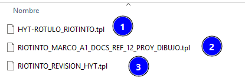
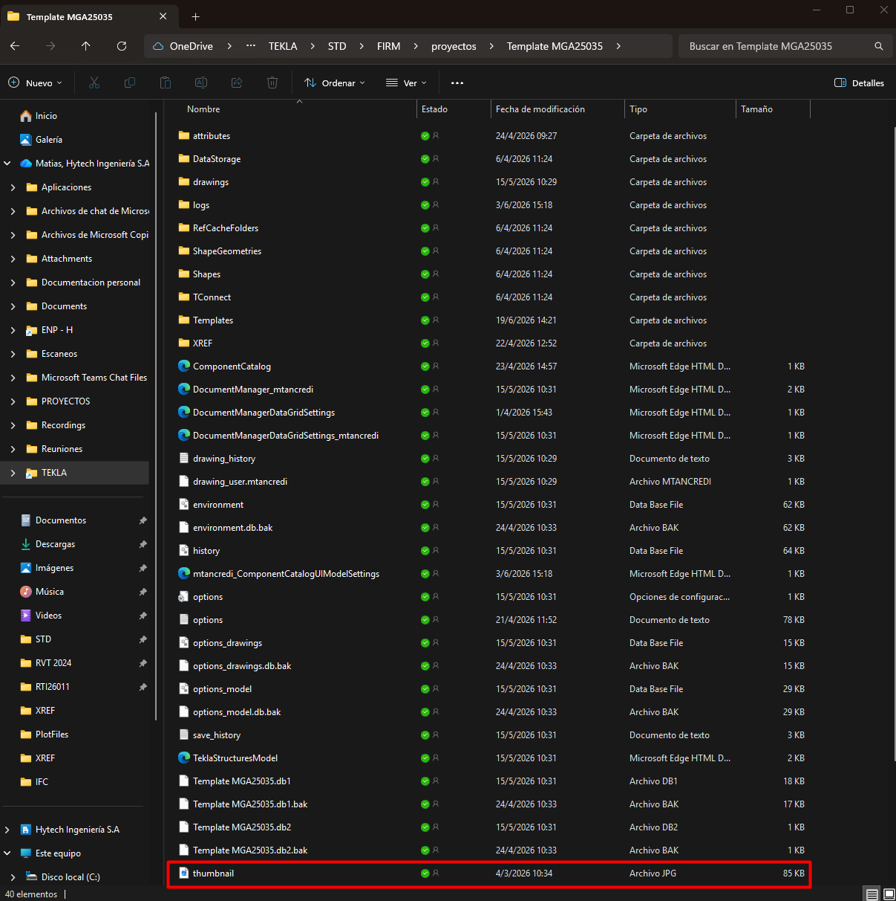

# Crear un template de proyecto
{: .no_toc }

## Tabla de Contenidos
{: .no_toc .text-delta }

1. TOC
{:toc}

## ¿Qué es el template?

Un template es el conjunto de propiedades con el que se trabaja en un proyecto, estos templates, contienen atributos definidos, vistas, documentos de referencia y el rótulo de proyecto. 

## Crear un nuevo modelo 

Se debe de crear un nuevo modelo sin ninguna plantilla para evitar trasladar errores, se sugiere nombrar como "Template PROY" por ej: `Template RTI26011`

*Figura 1: Crear modelo nuevo*

## Definición de atributos

Se deben de completar los atributos que se vayan a utilizar tanto a nivel proyecto como atributos que utilicen los cuadros:

| PROJECT PROPERTIES | DESCRIPCIÓN |  EJEMPLO |
|:---------------|:----------:|:----------:|
| **Project number** | Especifica el numero de proyecto | `RTI26011`  |
| **Name** | Especifica el nombre del proyecto  | `IB Proyecto de Repulping SdV`  | 
| **Designer**| Autor del proyecto |  `HYTECH` |
| **Location**| Ubicación del proyecto  | `Loma la lata`  |
| **Info 1 & 2**    | Info adicional del proyecto  | `TE-631-104580-PL-C-0165-rA`  | 
| **Description**    | Descripción del plano/proyecto  | -  |  

*Estos atributos son los basicos que se recomiendan utilizar, hay muchos mas disponibles que varian según la necesidad del proyecto*

*Figura 2: Proyect properties a completar en el template*

## Definición de rotulo

Se debe crear un rotulo acorde al proyecto, estos formatos son definidos por control de documentos. Para ver el paso a paso referir a [Cuadros Rótulos](../reportes/cuadro_rotulo.md).

En general deberán crearse rótulos para tamaño `A0/A1`. Para cada hoja, la configuración de cuadros será armada considerando 3 cuadros básicos:

1. Cuadro de rótulo externo
2. Cuadro con documentos de referencia
3. Cuadro de revisiones

## Agregar una imagen de portada 
Para finalizar con la creación del template se le suele agregar una imagen de portada así se puede lograr una rapida visualización:

*Figura 3: Imagenes de clientes en templates*

Para configurar esta ruta se debe tener una imagen que se quiera utilizar de portada en formato jpg o png guardarla en la carpeta del modelo y renombrarla como `thumbnail`

*Figura 4: Ubicación thumbnail*

## Guardado del template

Realizado los pasos previos, ya es posible guardar nuestro template en la siguiente ruta:

>`%TEKLA%\STD\FIRM\proyectos`

Dentro de dicha carpeta, debemos nombrar nuestro template como si fuese un cliente, de forma tal que al abrir el programa veamos la posibilidad de crear un modelo de acuerdo con una plantilla, por ejemplo: `Template MGA25025` `Template RZR26005` 

{: .highlight}
> La propiedad avanzada de `set XS_MODEL_TEMPLATE_DIRECTORY` nos dice donde guardar el template
> Ver [user.ini](../setup/user_ini.md) para mayor detalle.

## ¿Cómo cambiar un template existente?

En caso de que sea necesario cambiar un template ya creado, se deberán editar los `.tpl` o `.lay` asociado al proyecto de referencia. 

{: .important}
> Al modificar un template existente, modelos ya creados con ese template no tendrán esos cambios reflejados y deberan moverse manualmente en ese caso los cuadros.

Los cambios que se harán sobre el template serán fundamentalmente sobre la cantidad de documentos de referencia a mostrar en los cuadros, o para ajustar la posición de los mismos en caso de que el plano tenga HOLDs a mostrar, las notas no entren, etc.

En caso de querer replicar los cambios en cualquier nuevo modelo que use el template, deberá pisarse el mismo en el directorio señalado más arriba.

Para explicación sobre cada uno de estos cambios ver [Uso del template](./uso_template.md#cambios-sobre-el-template)

[← Volver al inicio](index.md)