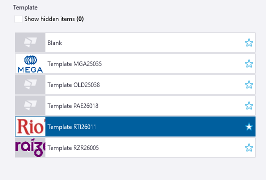
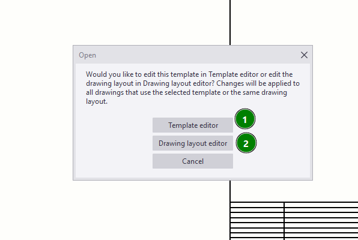
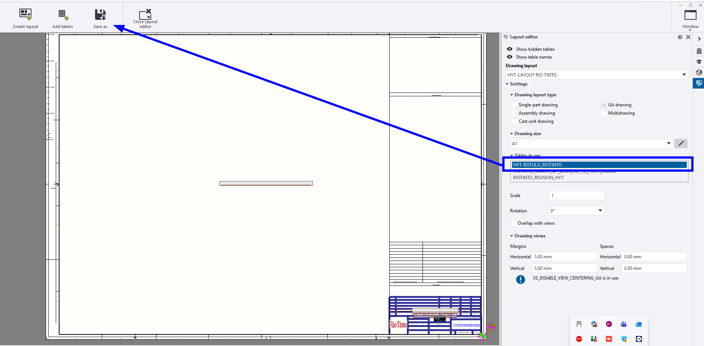

# Uso del template
{: .no_toc }

## Tabla de Contenidos
{: .no_toc .text-delta }

1. TOC
{:toc}

---


## Crear un nuevo modelo

Para crear un nuevo modelo utilizando un template existente deben seguirse los siguientes pasos:

1. Validar el nombre del modelo junto con el LEP del proyecto, en función de la codificación descripta en [Codificación de modelos](../generalidades/generalidades.md#codificación-de-modelos).
2. Definir el alcance del modelo a nivel documentos a realizar.
3. Crear nuevo modelo, eligiendo el template del proyecto en el menú principal.
4. Validar tener en los dibujos los rótulos cargados.



---

## Cambios sobre el template

Se describen posibles cambios que harán sobre el template existente por nuevas necesidades. Referir al apartado [Orden de lectura](uso_template.md#orden-de-lectura) para entender como es el orden de lectura de los archivos.

- Alterar rótulos del proyecto por problemas para que entren las notas, mayor cantidad de documentos de referencia, etc.
- Crear nuevos atributos sobre el modelo
- Crear nuevos filtros para el proyecto, definiendo grupos de objetos. Ver [Ejemplo de filtro](../ejemplos/ejemplos_filtros.md)

Se describe como realizar cada uno de esos cambios a continuación:

### Alterar rótulos

{: .highlight}
> Los rótulos constan de dos archivos:
> - Los `.tpl` que se usan como cuadros.
> - Los `lay` que organizan los cuadros en un determinado layout. Este archivo condensa todas las configuraciones posibles para distintos tamaños de hoja.

Por lo tanto, el template vive en un modelo aparte que no debe tocarse. Las modificaciones a cuadros deberán hacerse de forma local.

{: .important}
> Al abrir un `.tpl` en el editor de cuadros, verificar la ruta que se está editando. Los cambios **NUNCA** deben grabarse sobre el mismo archivo ya que alteraría el resto de los dibujos del proyecto que estén usando el mismo archivo.

Para lograr esto, seguir de forma general los siguientes pasos, haciendo doble click sobre el cuadro a editar:



1. Editar los cuadros a modificar, guardando los mismos dentro del modelo en la carpeta `/templates` de nuestro modelo.
2. Ir al `Drawing Layout Editor` y sumar los nuevos cuadros en las disposiciones a modificar (A0, A1, A2) y guardar el layout. Al hacer esto se generará un archivo `.lay` dentro de nuestro modelo.
3. De esta forma, los `.tpl` y `.lay` creados en este apartado se pueden copiar y pegar en los modelos que lo requieran.



### Crear nuevos atributos para un modelo

Otro cambio que se puede hacer a nivel de modelos es la necesidad de usar atributos adicionales a los que tiene el programa, para guardar nuevas variables o información que deba aparecer en el modelo 3D.

Los User-Defined Attributes (UDAs) en Tekla Structures se definen en el archivo `objects.inp`, que se ubica preferentemente en la carpeta de modelo, proyecto o empresa. **Ese archivo no debe modificarse**, pero se puede tomar de referencia para crear neuvos.

La estructura base de cada atributo es:

```
attribute("MY_INFO_1", "My Info 1", string, "%s", no, none, "0.0", "0.0")
{
    value("", 0)
}
```

Donde cada atributo tiene propiedades o parámetros, que se describen en la tabla debajo:

| Parámetro | Ejemplo | Descripción |
|---|---|---|
| `attribute` / `unique_attribute` | `attribute` | Regular (copiable) o no copiable al duplicar objetos |
| `attribute_name` | `MY_INFO_1` | Nombre interno, case-sensitive, máx. 19 caracteres, sin espacios |
| `label_text` | `"My Info 1"` | Etiqueta visible en el diálogo |
| `value_type` | `string` | Tipo de dato: `string`, `integer`, `float`, `option`, `date`, etc. |
| `field_format` | `"%s"` | `%s` para texto, `%d` para números |
| `special_flag` | `no` | Si afecta la numeración (`yes`/`no`) |
| `check_switch` | `none` | Sin uso, siempre `none` |
| `max` / `min` | `"0.0"` / `"0.0"` | Sin uso, siempre `"0.0"` |

Estos atributos al crearse podrán usarse en reportes dentro de modelos que los tengan cargados. A su vez, debemos incorporar su definición a lo que sería una `Tab Page`, que es básicamente alguna pestaña en el menú de propiedades del objeto:

La regla clave es que **la definición completa del atributo debe estar en la sección `part`**, y las secciones específicas (`column`, `beam`, etc.) solo referencian esa tab por nombre:

```
part(0, "Part")
{
    tab_page("My UDA tab")
    {
        attribute("MY_UDA", "My UDA", string, "%s", no, none, "0.0", "0.0")
        {
            value("", 0)
        }
    }
    tab_page("My UDA tab", "My UDA tab", 19)
    modify(1)
}

column(0, "j_column")
{
    tab_page("My UDA tab", "My UDA tab", 19)
    modify(1)
}
```

La estructura de los atributos y tabs debe guardarse en un `objects_<DESCRIPCION>.inp` a nivel modelo y si fue correctamente cargado tendremos los atributos atados a los tipos de elementos a los que se agregaron.

---

## Orden de lectura

Para el caso de nuevos cuadros creados, siempre recordar que el orden de lectura es el siguiente. Esto podría traer algún problema de sobreescritura si no se trabaja correctamente.

1. Carpeta que contiene la propiedad avanzada XS_​TEMPLATE_​DIRECTORY.
   >Esto ya lo tenemos seteado a través del .ini 
2. Carpeta de modelo o `\templates` dentro de la carpeta del modelo.
3. Carpeta proyecto (XS_PROJECT)
    >No se está utilizando  
4. Carpeta FIRM (XS_FIRM)
5. Cuadros del entorno SouthAmerica
6. Cuadros del sistema

Por lo tanto, cualquier archivo que se llame igual a nivel modelo podrá eventualmente pisar alguno del servidor.

## Preset de propiedades

Los archivos .ifc son los archivos entregables de la maqueta y que formarán parte de los modelos federados. Básicamente se trata de archivos que combinarán elementos geométricos con información. Cada parte contendrá una serie de atributos que ya vendrán definidos de forma predefinida en el preset de empresa.

A modo informativo, se dejan a continuación todos los atributos con los que sale la configuración vigente de archivos .ifc

{: .important}
> Cualquier solicitud de información adicional por el cliente deberá ser tomada por el LEP del proyecto con asistencia del gestor de modelo 3D Civil para incorporar dichos atributos al modelo entregable al cliente.

El **preset de propiedades** consta de todos aquellos atributos que contendrán los modelos `.ifc` que se exporten desde el modelo o utilizando el [BIM Publisher](../generalidades/bim_publisher.md)

La configuración utilizada actualmente ([`HYTECH_CONFIGURATION_FILE`](../ref/HYTECH_CONFIGURATION_FILE.xml)) es completa y cubre gran cantidad de atributos que se precisan tener a mano en la maqueta. Para crear nuevos preset de propiedades, deberá hacerse atendiendo a nuevos atributos a sumar en la maqueta.


[← Volver al inicio](index.md)