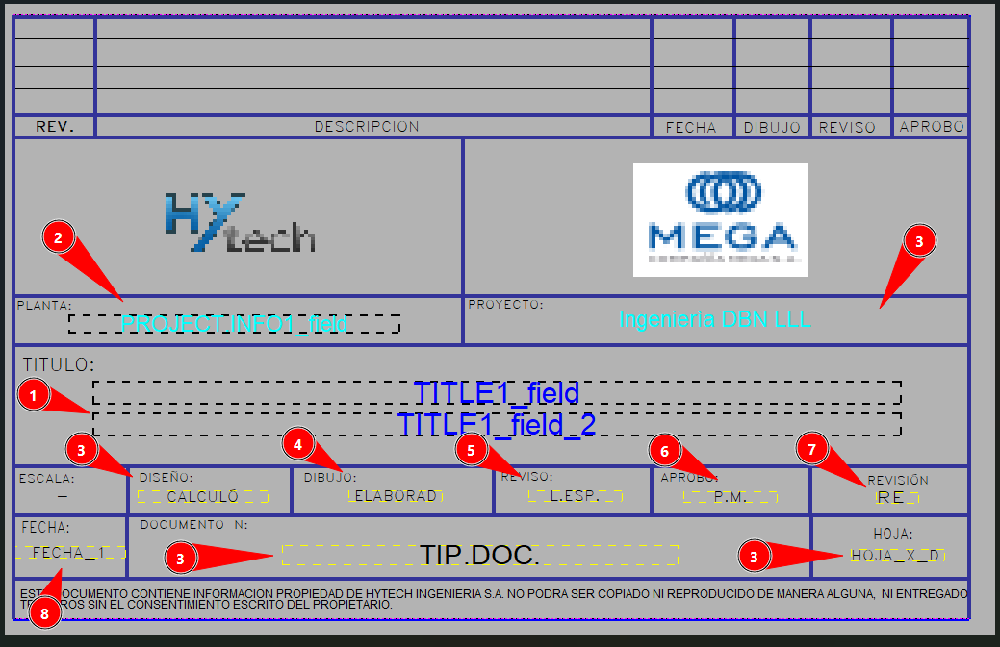
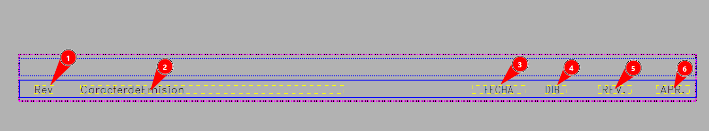

# Creación de rótulo de proyecto
{: .no_toc }

## Tabla de Contenidos
{: .no_toc .text-delta }

1. TOC
{:toc}

## Creación de rótulos - Paso a paso

Al comenzar un nuevo proyecto se debe de crear el rotulo determinado por el cliente: 
1. Validacion de FIle Locations del Template Editor
El template editor es un programa aparte del tekla structures, por lo tanto, hay ciertas configuraciones independientes que hay q actualizar. 

*Figura 1: File locations template editor*

la ruta a customizar es la correspondiente a "Symbols, pictures" Y agregar la ruta:
```
;C:\Users\NOMBRE DE USUARIO\OneDrive - Hytech Ingeniería S.A\TEKLA\STD\FIRM\bitmaps\
```
2. Descarga de formatos en formato CAD:
Los formatos se encuentran en el SPDMS, en la carpeta del cliente, con su correspondiente nombre y codigo, ahi se encuentran los formatos CAD, para los planos, en los tamaños acordados. 
 
*Figura 2: Extracción formato CAD*

3. Creación de los .tpl:
Los archivos .tpl son formatos que permiten generar cuadros. Estos archivos se crean en el [Editor de Cuadros](./editor_cuadros.md)
Los archivos utilzados en un rotulo, por lo general son
    1. Marco de rotulo
    2. Cuadro de rotulo cliente
    3. Cuadro revisión

*Figura 3: Archivo .lay y tpls utilizados*

4. Atributos a utilizar marco de rotulo: 
    1. `DR_x_COD_PROY`: Son textos que representan los codigos de los documentos de referencia a nivel _PROYECTO_. 
    2. `DR_x_COD`: Son textos que representan los codigos de los documentos de referencia a nivel _PLANO_. 
    3. `DR_x_DESC_PROY`: Son textos que representan los nombres de los documentos de referencia a nivel _PROYECTO_.
    4.  `DR_1_DESC`:Son textos que representan los nombres de los documentos de referencia a nivel _PLANO_. 
    
    *Figura 4: Cuadro de docs de referencia*
5. Atributos a utilizar cuadro de rotulo cliente:
    1. `TITLES 1/2/3`: Muestra el titulo del plano, suelen utilizarse los primeros 2, suele utilizarse el titulo 3 si tiene un rotulo chico o segmentado.
    2. `PROJECT.INFO1/LOCATION/NAME`: Muestra la ubicación del proyecto
    3. `USERDEFINED.DRAWING_USERFIELD`:Los UDAS, pueden ser utilizados para rellenar varios aspectos del dibujo, suelen utilizarse para indicar quien calculó el plano, su codigo, la cantidad de hojas, etc.
    4. `REVISION.LAST_CREATED_BY`: Muestra el ejecutor de la ultima revisión.
    5. `REVISION.LAST_CHECKED_BY`: Muestra el revisor de la ultima revisión. 
    6. `REVISION.LAST_APPROVED_BY`:Muestra el aprobador de la ultima revisión. 
    7. `REVISION.LAST_MARK`: Muestra la ultima marca de la revisión. 
    8. `REVISION.LAST_DATE_CREATE`: Muestra la ultima fecha de revisión 
    
    *Figura 5: Cuadro de rotulo*

6. Atributos a utilizar en el cuadro de revisión :
    1. `MARK`: Muestra la marca de la revisión
    2. `TEXT1`: Muestra el caracter de emisión de la revisión 
    3. `DATE_CREATE`: Muestra la fecha de la revisión.
    4. `CREATED_BY`: Muestra el ejecutor de la revisión 
    5. `CHECKED_BY`: Muestra el revisor de la revisión.
    6. `APPROVED_BY`: Muestra el aprobador de la revisión 
    
    *Figura 6: Cuadro de revisión*

7. Notificación a coordinador de modelos 3D CIVIL, para que guarde los cuadros y .lay dentro de la carpeta del cliente.

8. Creación del template actualizado del cliente [TEMPLATE](../proyecto_nuevo/creacion_template.md).

[← Volver al inicio](index.md)

