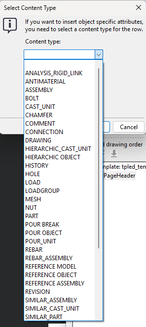
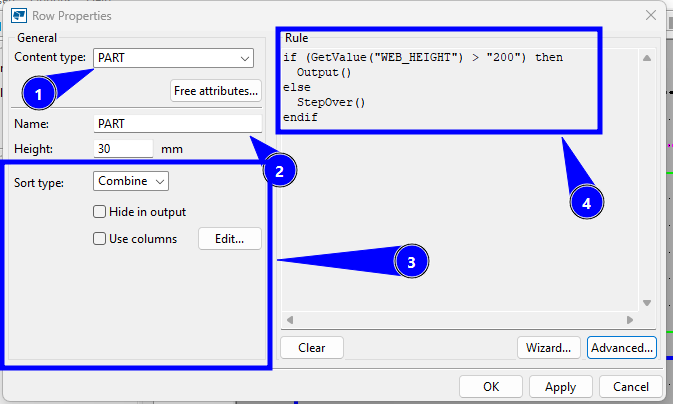
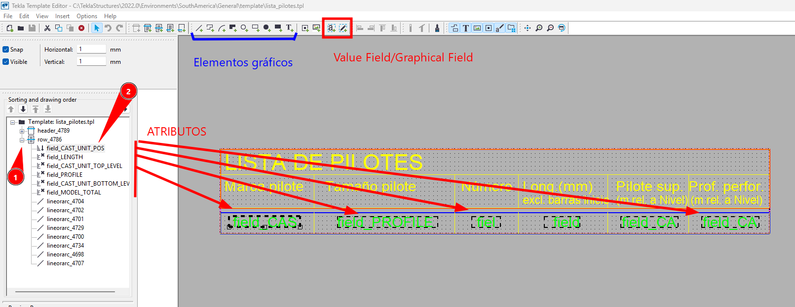

# Editor de cuadros
{: .no_toc }

## Tabla de Contenidos
{: .no_toc .text-delta }

1. TOC
{:toc}

## ¿Qué es el editor de cuadros y cuándo usarlo?

El editor de cuadros es un programa anexo al Tekla Structures, que permite crear:
- Cuadros gráficos
- Cuadros de texto

La extensión del archivo responde a que tipo de cuadro se trata.

No es alcance de este instructivo listar todas las funciones disponibles dentro el editor o todos los objetos que podemos manipular con el mismo. Solo se dará un pantallazo de cuestiones generales y cómo pensar un cuadro desde el comienzo hasta el fin. Para ejemplos de aplicación, referir a [Ejemplo](../ejemplos/index.md).

Se menciona en detalle como crear rótulos, ya que es una tarea que se repite al comienzo de cualquier proyecto en [Cuadros - Rótulos](cuadros-rotulos.md)

{: important}
> El editor de cuadros consiste en identificar alguna situación del modelo que interese extraer en una serie de objetos. Una planilla de doblados es un reporte que itera sobre partes y extrae armaduras.
>
> La finalidad

## Componentes principales

Los componentes principales que tiene el editor de cuadros son los siguientes:

|Item| Descripcion|
|-|-|
|Header|Aparece al comienzo del template|
|Page Header|Aparece al comienzo de la hoja del template|
|Row|Una fila define las cosas que vamos a listar en el template. Cada fila es un objeto. Las filas contienen objetos de los cuales se extraen **atributos**|
|Page Footer|Footer de página|
|Footer|Footer de cierre del template|

## Antes de comenzar

El *Editor de Cuadros* tiene sus propias propiedades avanzadas y deben setearse para ver las imágenes del nivel de empresa en el programa.


*Figura 1: propiedades avanzadas a editar*


## Paso a paso

### Objeto y alcance

Primero debe identificarse el propósito del cuadro a realizar. Debe validarse principalmente que pueda hacerse en función de la biblioteca de atributos del programa, referenciada en el índice de la documentación [Atributos disponibles](../manuales/TS_TEA_2025_en_Template_attributes_0.pdf)

### Diagramación

En función del tipo de cuadro, puede prescindirse o no de elementos gráficos, dependiendo del tipo de salida a generar. Sin importar esto, se debe diagramar las partes que aparecerán. Por defecto siempre se debe tener un *Page Header* para dar título a la tabla y luego tendremos elemento *Row* sobre el cual se iterarán las partes/objetos

{: note}
> Las extensiones de archivo son:
> .tpl
> .rpt
> 

### Tipo de objeto

Luego, deberá verificarse el tipo de objeto a iterar y seleccionar adecuadamente lo que precisamos sacar de salida.

>Content types are object types in the product database. Content types in template row definitions automatically filter out unwanted object types from the output template. The current version of Template Editor uses content type listings. The list of content types as well as their effect is product-specific.

When you create a new row in the template, you should select a content type for the row. The content type determines which template attributes can be used in that row.


*Figura 2: visualizacion de los tipos de contenido de fila*

Debajo se presenta tabla con todos los tipos de **```CONTENT TYPE```**:

<details>
<summary>
    Ver tabla completa
</summary>

| Content Type | Descripción |
|:-------------|:------------|
| `ANALYSIS_RIGID_LINK` | Crea listas de analysis rigid links |
| `ANTIMATERIAL` | Crea listas de agujeros y recesos, o partes removidas por cortes. Incluye atributos: NAME, LENGTH, WIDTH, HEIGHT, AREA, PROFILE, NUMBER y UDAs |
| `ASSEMBLY` | Crea listas de assemblies y single parts. Incluye todos los assemblies que contienen las partes y bulones seleccionados |
| `BOLT` | Crea listas de tornillos y bulones. Incluye todos los bulones conectados a partes seleccionadas |
| `BUILDING` | Crea listas de buildings en jerarquía de edificios |
| `BUILDING_SECTION` | Crea listas de building sections en jerarquía de edificios |
| `BUILDING_STOREY` | Crea listas de building storeys en jerarquía de edificios |
| `CAST_UNIT` | Crea listas de cast units |
| `CHAMFER` | Crea listas de longitudes de chaflanes |
| `COMMENT` | Crea filas vacías o con datos textuales/líneas en cualquier lugar del template |
| `CONNECTION` | Crea listas de connections. **Solo funciona para connections y details (object type 3)**, no para modeling tools o custom parts (object type 4) |
| `DRAWING` | Crea listas de planos sin información de revisiones. Usar para reportes y planos incluidos |
| `HIERARCHIC_CAST_UNIT` | Crea reportes listando subassemblies de hormigón |
| `HIERARCHIC_OBJECT` | Crea listas de varios tipos de jerarquías. Lista objetos jerárquicos en Organizer |
| `HISTORY` | Recupera información histórica del modelo. Usar con PART, REBAR, CONNECTION y DRAWING. Atributos disponibles: TYPE, USER, TIME, COMMENT, REVISION_CODE |
| `HOLE` | Crea listas de agujeros |
| `LOAD` | Crea listas de cargas |
| `LOADGROUP` | Crea listas de grupos de cargas |
| `MESH` | Crea listas de mallas |
| `NUT` | Crea listas de tuercas. Contiene todas las tuercas para bulones asociados a partes seleccionadas |
| `PART` | Crea listas de partes |
| `POUR_BREAK` | Crea listas de pour breaks |
| `POUR_OBJECT` | Crea listas de pour objects |
| `POUR_UNIT` | Crea listas de pour units |
| `REBAR` | Crea listas de barras de refuerzo |
| `REBAR_ASSEMBLY` | Crea listas de rebar assemblies |
| `REFERENCE_MODEL` | Lista los modelos de referencia |
| `REFERENCE_OBJECT` | Lista los reference model objects en un modelo de referencia. **Solo se muestran objetos con UDAs** |
| `REFERENCE_ASSEMBLY` | Lista los reference assemblies en un modelo de referencia |
| `REVISION` | Crea listas de marcas de revisión. **Debe definirse junto con una fila DRAWING** |
| `SIMILAR_ASSEMBLY` | Crea listas de objetos similares. Requiere fila vacía (hidden) ASSEMBLY/CAST_UNIT/PART/REBAR_ASSEMBLY arriba en jerarquía. **No puede tener filas debajo** |
| `SIMILAR_CAST_UNIT` | Crea listas de cast units similares (ver SIMILAR_ASSEMBLY) |
| `SIMILAR_PART` | Crea listas de partes similares (ver SIMILAR_ASSEMBLY) |
| `SIMILAR_REBAR_ASSEMBLY` | Crea listas de rebar assemblies similares (ver SIMILAR_ASSEMBLY) |
| `SINGLE_REBAR` | Crea listas de barras individuales en grupos de refuerzo. Útil para obtener longitudes de barras individuales en grupos cónicos. Para rebar sets funciona igual que REBAR |
| `SINGLE_STRAND` | Crea listas de strands pretensados individuales |
| `SPACE` | Crea listas de spaces en jerarquía de edificios |
| `STRAND` | Crea listas de strands pretensados |
| `STUD` | Crea listas de studs |
| `SURFACE` | Crea listas de superficies |
| `SURFACING` | Crea listas de surface treatments |
| `SUMMARY` | Resume los contenidos de las filas superiores en jerarquía. Ej: PART - SUMMARY resume las filas PART |
| `TASK` | Crea listas de tasks |
| `WASHER` | Crea listas de arandelas. Contiene todas las arandelas para bulones asociados a partes seleccionadas |
| `WELD` | Crea listas de soldaduras |

</details>

Tomar de referencia cuadros existentes del programa para entender distintas posibilidades

### Filtrado sobre tipo de objeto

De lo de arriba, se desprende por ejemplo que no nos interese sacar todas la partes seleccionadas de un modelo. Puede suceder que queramos sacar aquellas partes que entran a través de cierto filtrado.

La mayoría de las reglas de entrada serán condicionales. Por ejemplo. la imagen debajo nos saca una fila que tendrá 3cm de altura por parte identificada donde solamente tendremos ```Output()``` en caso de que el alma del perfil supere los 200mm


*Figura 3: propiedades de fila*

1. Definición de tipo de objeto. En este caso el más general de ```PARTE```
2. Nombre que le damos a la fila. Sirve para ordenar los cuadros, ya que nos podrá interesar sacar múltiples filas.
3. Como ordenar las múltiples filas y qué hacer en caso de filas coincidentes. Por ejemplo, si dentro de la fila tuviésemos la longitud del perfil, el tipo de perfil (Ej: W8x24) y el peso.. al asignar "Combine" juntaremos todas aquellas filas que tengan el mismo output (igual longitud y perfil).
4. La regla condicional con if-else (el "Wizard..." ayuda a redactar reglas típicas).

### Armado de fila

Acto seguido, se colocan todos ```Value Field``` o ```Graphical Field``` dentro de las filas y todos los elementos gráficos, que son basicamente atributos y cualquier tipo de auxilio visual para separar columnas respectivamente.

Definidos todos los campos o atributos que se sacan del objeto que se está iterando, se le asigna un criterio de ordenamiento a las filas (que bien podrán ser combinadas o agrupadas como se indicó en el apartado anterior).


*Figura 4: objetos a colocar en filas*

En la imagen se indica donde aparecen los elementos gráficos y aquellos que son atributos.

Con (1) se indica el árbol de jerarquía de partes, ya que es posible anidar filas dentro de otras. Por ejemplo, si se arma un reporte de unidades de colada, se puede anidar una fila tipo ```PART``` o ```REBAR``` dentro que iterarán todas las partes o barras que conforman esa unidad de colada.

Con (2) se indica el criterio de orden de las filas que compondrán el cuarto. En este caso, el criterio de orden es por el atributo ```CAST_UNIT_POS```, que sería equivalente a poner en orden una serie de números.

### Buenas prácticas

Ya habiendo respondido y cuidado lo indicado en los apartados, se debe probar el cuadro desde los reportes del programa para validar que funcione correctamente.

Se mencionan buenas prácticas a tener en cuenta:

- Ajustar correctamente lo visual: alineamientos de texto, tamaño, colores, etc.
- Dar nombres a los ```Value Field``` que se ingresen, dandole algo descriptivo que los permita distinguir en el árbol de selección de la izquierda de la *Figura 4*.
- No buscar complejizar demasiado los cuadros.
- En caso de requerir post-procesar algún atributo (por ejemplo, extraer los primeros 3 caracteres de un atributo), TEKLA tiene funciones incorporadas en el programa para manipular atributos. Referir a este enlace para ver todas las disponibles ([Formula Rule Reference](https://support.tekla.com/doc/tekla-structures/2026/tpled_formula_rule_reference)). Para mayor detalle referir al manual en [Índice](../index.md)


[← Volver al inicio](index.md)