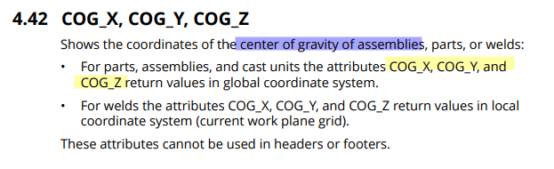

# Ejemplos de cuadros
{: .no_toc }

## Tabla de Contenidos
{: .no_toc .text-delta }

1. TOC
{:toc}

## Introducción

Los siguientes ejemplos buscan ejemplificar el armado de ciertos cuadros, siguiendo la lógica para crearlos.

En ese proceso siempre estaremos haciendo lo siguiente:

1. Identificar una **necesidad** (que bien puede ser para validar lo modelado, sacar cantidades, sacar información, etc.). Hacerse la pregunta correcta es la parte más importante del proceso, para entender que puede hacerse con el programa.
2. Identificar **los atributos necesarios** para hacerlo. Para ello, referir a la guía de atributos dada en [Documentación oficial](../index.md#documentación-oficial)
3. **Armar el .tpl** con los elementos correctos en función de las partes involucradas. Ver [Editor de cuadros](editor_cuadros.md) para diferenciar los tipos de fila dentro del cuadro.
4. Comenzar a probar el cuadro dentro del programa hasta obtener lo buscado.

Los cuadros enunciados a modo de ejemplo se encuentran para descargar al fin de la explicación.
   
---
## Cuadro de coordenadas

>Se busca extraer una tabla de coordenadas de todas las fundaciones de un modelo, ordenandolas por tag.

1. Como nos interesa tomar fundaciones, debemos utilizar unidades de colada a nivel de ROW. Ver [Editor de cuadros](editor_cuadros.md) y tipos de fila.
2. ¿Qué atributos necesitamos? Vemos que tenemos las siguientes disponibles para el centro de gravedad. 

3. Entonces, debemos iterar por todas las unidades de colada y tirando de output las coordenadas en X e Y de cada una.

{. :important}
>A nivel fila, no nos interesa combinar en este caso, ya que cada fundación tendrá su fila.

4. A su vez, debemos ordenar por tag a las distintas unidades de colada. Hacemos uso del sorting dentro de la fila por ese atributo.

[__Descarga coordenadas__]

## Listado de materiales

>Se busca armar un listado de cantidades para incorporar dentro del plano. Se debe buscar lo siguiente:
> - Hormigón estructural
> - Hormigón de limpieza
> - Acero
> - Anclajes por diámetro

1. En este caso pensaremos en tomar partes únicamente.
2. Cada fila deberá estar atada por material y le haremos el formato.
3. Como en este caso nos interesa obtener materiales totales, buscaremos combinar las filas de salida.

## Verificar coordenadas de modelado

>Las estructuras, sin importar si son de hormigón o acero siempre se ubican sobre un grillado o siguen ángulos rectos. Se busca armar un cuadro que valide que todas las partes no tengan errores casi imperceptibles en el modelado.

1. Iteraremos sobre elementos tipo vigas o columnas en este caso.
2. Para qué algo sea ortogonal, deberemos comparar coordenadas de inicio y de fin en 3D y que sigan la dirección de algún eje (es decir, que tengan igual coordenadas en X, Y o Z en inicio y fin).
3. Como en este caso usaremos atributos que no necesariamente los queremos visualizar en el reporte, los ocultaremos en la salida.
4. 

[← Volver al inicio](index.md)

