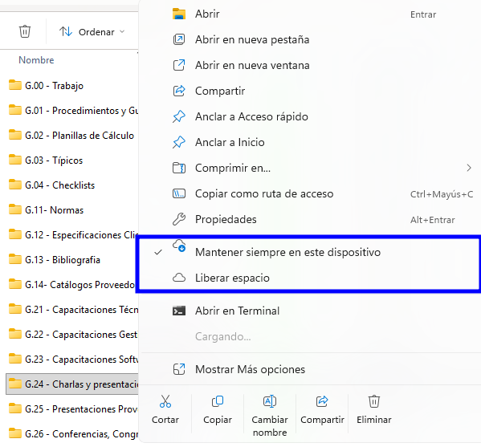
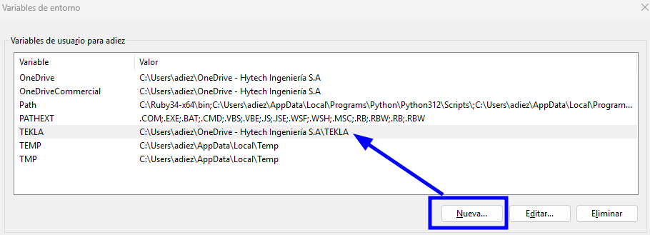
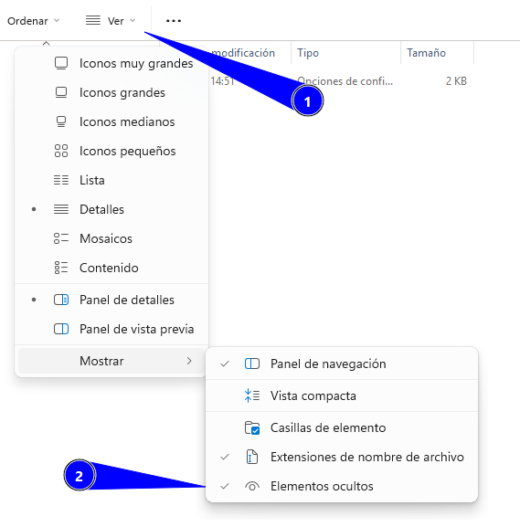

# Configuración inicial
{: .no_toc }

## Tabla de Contenidos
{: .no_toc .text-delta }

1. TOC
{:toc}


## Inicio del programa

En primer lugar, validar que el programa fue instalado correctamente ingresando al mismo y pudiendo pasar con éxito la ventana de seleccion de licencia. Las licencias deberán consultarse con IT para saber qué tipo de licencias hay disponibles.

La gestión de licencias tipo suscripción quedan a cargo del equipo, a través del siguiente enlace: [Online Admin Tool](https://admin.account.tekla.com/#/)

Al abrirse, el programa solicita hacer *login* en Trimble. Crear cuenta en caso de no contar con una y compartirla con IT o el coordinador Civil para que se sume el nuevo usuario a la carpeta compartida.

## Cliente de OneDrive 

El departamento usa una carpeta civil de OneDrive donde se guardan los modelos. Solicitar acceso al coordinador civil o líder de disciplina si no se cuenta con él.

La carpeta organiza los modelos por proyecto e incluye una carpeta con todas las configuraciones de la empresa (FIRM).

Validar lo siguiente antes de continuar:

1. Validar que se tiene acceso y agregar la carpeta al cliente de OneDrive  ([Agregar atajo a carpeta](https://support.microsoft.com/en-us/office/add-shortcuts-to-shared-folders-in-onedrive-d66b1347-99b7-4470-9360-ffc048d35a33))
2. Dar tiempo al cliente para mapear todos los archivos del directorio (puede tardar bastante)
3.  Una vez que en ajustes del cliente se puedan seleccionar carpetas, marcar como "Mantener en este dispositivo" la carpeta FIRM y todos los proyectos que se vayan a usar. El resto puede quedar en "Liberar espacio"


*Figura 1: las dos posibilidades de tener archivos en el cliente de OneDrive*


{: .warning}
> NO borrar las carpetas compartidas de OneDrive para eliminarlas localmente, ya que todo el equipo tiene permisos de escritura. Si se borra un archivo en la carpeta, todos verán ese cambio reflejado.
>
>Si no se quieren ver ciertos modelos o archivos, dejar de sincronizar la carpeta o ponerla en modo "Liberar espacio" para no ocupar espacio en el disco C:/

## Manejo de licencias


Las licencias pueden estar ancladas al servidor o ser por suscripción. Validar con el coordinador de IT que el usuario esté sumado al equipo y consultar qué licencias están disponibles.

No se dan más detalles en este instructivo porque depende de las licencias disponibles en cada momento. Las asignaciones de licencias no ancladas al servidor se realizan por el portal que provee Trimble.

{: .important}
> Administración de licencias
>
>Link: [Tekla Administration Tool](admin.account.tekla.com)

## Archivos de inicialización

El TEKLA debe poder llamar a una carpeta en común de la empresa, donde quedan guardadas configuraciones personalizadas, rótulos de empresa, imágenes, reportes, etc. 

Todo el equipo debe poder visualizar la misma información, por lo que para eso el programa cuenta con un archivo de inicialización que debe pisarse al existente, para que cada vez que abra el programa haga el *mapeo* de ciertas propiedades a carpetas compartidas.


### Definición de variable de entorno


Actualmente la empresa trabaja los modelos del programa en un servidor de Onedrive. Esto ocasiona que los directorios de cada usuario sean distintos, ya que el cliente de Onedrive se instala por usuario y no por sistema.

Por lo tanto, debemos definir una variable de entorno ```%TEKLA%```


{: .note}
>Una variable de entorno es una **variable dinámica** que puede afectar al comportamiento de los procesos en ejecución en un ordenador.
\
\
Son parte del entorno en el que se ejecuta un proceso. Por ejemplo, un proceso en ejecución puede consultar el valor de la variable de entorno TEMP para descubrir una ubicación adecuada para almacenar archivos temporales, o la variable HOME o USERPROFILE para encontrar la estructura de directorios propiedad del usuario que ejecuta el proceso.

1. Desde Configuracion/Settings ir a editar las variables locales del sistema


*Figura 2: Acceso a variables de entorno*

2. Crear la variable y llamarla TEKLA. La ruta a colocar es personal y depende de cada PC en donde esté ubicada la carpeta TEKLA de la carpeta compartida

*Figura 3: Acceso a variables de entorno*

{: .highlight}
>Realizados estos dos pasos, Windows tomará ```%TEKLA%``` como un path que será común para todo el equipo.

{: .warning}
> No modificar las variables del sistema existentes.


### Copiado de archivo .ini

Dentro de la carpeta FIRM se encuentra el archivo ```user.ini``` a tomar. Para descripción de que es cada línea ver [Archivos de configuración](./user_ini.md).

{: .note}
> Un archivo INI es un archivo de texto simple usado comúnmente en informática y programación para almacenar configuraciones de software. Es un formato sencillo y ampliamente compatible que organiza la información en secciones y pares clave-valor. Puedes pensar en él como una forma estructurada de **guardar las preferencias para diversos aspectos de un programa**.

1. Copiar el archivo original ```user.ini```

```
#Ruta Origen
%TEKLA%\STD\INI FILES\user.ini
```


2. Pegar el archivo en el siguiente directorio. El año dependerá de la versión de TEKLA que se trate. La carpeta AppData está oculta, por lo que debe habilitarse en Windows la visión de carpetas ocultas.

v
```
#Ruta Destino
C:\Users\<USUARIO>\AppData\Local\Trimble\Tekla Structures\2022.0\UserSettings
```


*Figura 4: Permitir elementos ocultos*

{: .warning}
> No modificar el archivo .ini de la ruta del directorio de la empresa


{: .highlight}
>Al pisar el archivo, todas las opciones avanzadas que son vistas por los miembros del equipo son las mismas, pudiendo acceder a las mismas bases de datos, reportes, templates, etc.

## Verificación

Para verificar tener todo correctamente seteado, basta con abrir el programa en "New Model" ya se deberán visualizar los templates de proyecto disponibles, los cuáles

Cualquier desvío o consulta particular, referir al [FAQ](../faq/faq.md) o al lider de disciplina.

## Próximos Pasos

- Leer el apartado de generalidades, para ver como se trabaja internamente la maqueta en la empresa y que herramientas utiliza el equipo Civil.
- Comenzar a modelar con auxilio de esta guía. Referir al [Índice](../index.md)

[← Volver al inicio](index.md)
