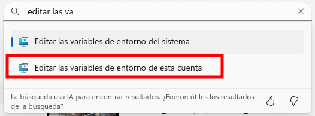

# Configuración inicial
{: .no_toc }

## Tabla de Contenidos
{: .no_toc .text-delta }

1. TOC
{:toc}

[← Volver al inicio](index.md)

## Inicio del programa

Primero, deberá validarse que el programa fue instalado correctamente ingresando al mismo y pudiendo visualizar.

Al abrirse, se pedirá loguearse en Trimble. Crear cuenta en caso de no contar con una y compartirla con IT para que se sume al equipo.

## Cliente de Onedrive

Actualmente, todo el departamento hace uso de una carpeta civil de Onedrive donde se guardan los modelos.

Deberá validarse lo siguiente previo a seguir:

1. Validar estar invitado y descargar la carpeta a través del cliente

## Manejo de licencias

Las licencias podrán ser ancladas al servidor o con suscripción. Debe validarse con el coordinador de IT que su usuario sea sumado al equipo e informar las licencias que están disponibles

## Archivos de inicialización

El TEKLA debe poder llamar a una carpeta en común de la empresa, donde quedan guardadas configuraciones personalizadas, rótulos de empresa, imágenes, reportes, etc. 

Todo el equipo debe poder visualizar la misma información, por lo que para eso el programa cuenta con un archivo de inicialización que debe pisarse al existente, para que cada vez que abra el programa haga el *mapeo* de ciertas propiedades a carpetas compartidas.

### Definición de variable de entorno

Actualmente la empresa trabaja los modelos del programa en un servidor de Onedrive. Esto ocasiona que los directorios de cada usuario sean distintos, ya que el cliente de Onedrive se instala por usuario y no por sistema.

Por lo tanto, debemos definir una variable de entorno **%TEKLA%**

{: .note}
>Una variable de entorno es una **variable dinámica** que puede afectar al comportamiento de los procesos en ejecución en un ordenador.
\
\
Son parte del entorno en el que se ejecuta un proceso. Por ejemplo, un proceso en ejecución puede consultar el valor de la variable de entorno TEMP para descubrir una ubicación adecuada para almacenar archivos temporales, o la variable HOME o USERPROFILE para encontrar la estructura de directorios propiedad del usuario que ejecuta el proceso.

1. Desde Configuracion/Settings ir a editar las variables locales del sistema

2. Crear 

### Copiado de archivo .ini

En la siguiente ruta 

{: .note}
> Un archivo INI es un archivo de texto simple usado comúnmente en informática y programación para almacenar configuraciones de software. Es un formato sencillo y ampliamente compatible que organiza la información en secciones y pares clave-valor. Puedes pensar en él como una forma estructurada de **guardar las preferencias para diversos aspectos de un programa**.

## Verificación

## Próximos Pasos

- Leer el apartado de generalidades, para ver como se trabaja internamente la maqueta en la empresa y que herramientas utilizamos.
- Comenzar a modelar con auxilio de esta guía.

{: .warning}
> No modificar las variables sin consultar con el administrador de Tekla