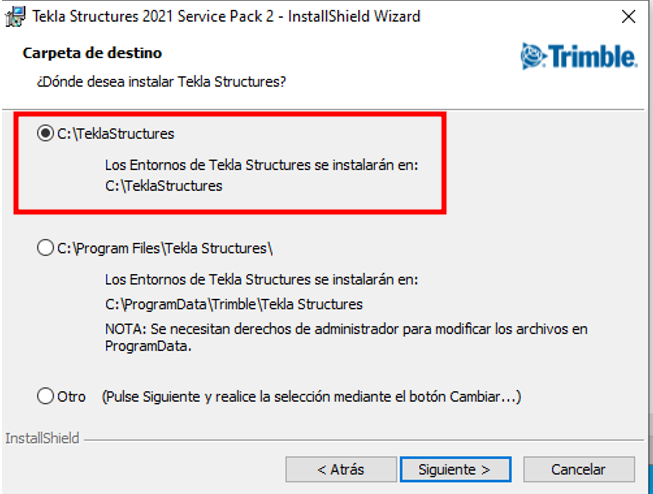
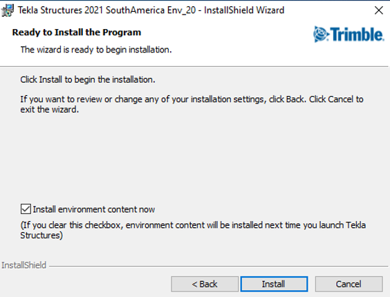

# Instalación

[← Volver al inicio](index.md)

## Versión del programa

La versión de referencia utilizada para este portal es Tekla Structures 2022. La documentación presentada mantiene un enfoque general, por lo que los conceptos y procedimientos son aplicables a versiones posteriores del software.

Los cambios que pudiesen existir por cambios de interfaz o nuevas funcionalidades del programa no estarán reflejados.

El programa base de Tekla Structures requiere la instalación de **entornos** específicos, los cuales agregan reportes, bases de datos de perfiles y configuraciones regionales. En HYTECH, el entorno estándar utilizado es **SouthAmerica**.

## Descarga del programa

{: .warning} 

> La instalación del programa es responsabilidad del departamento de IT de la empresa. Los pasos 1 a 3 descriptos a continuación son gestionados exclusivamente por IT-Hytech. El paso 4 debe ser completado por cada usuario según las indicaciones en [Configuración inicial](configuracion-inicial.md).

Para garantizar tener instalado el programa correctamente, se debe seguir lo siguiente:

1. Descarga de programa y entorno (con el mismo Service Pack!).  
2. Instalación del TEKLA en la ruta por default del programa

 
*Figura 1: carpeta por default*

3. Instalación de entornos

*Figura 2: seteo de entornos* 

4. Seteo de configuraciones de usuario (ver [Configuración inicial](configuracion-inicial.md))

## Trimble Connect

{: .new}

> Trimble Connect ya no debe instalarse localmente en la PC. Se accede de forma online a través del siguiente enlace:

Para mayor información de Connect, referir al apartado [Trimble Connect](../connect/index.md)

## Próximos Pasos

- Hacer los ajustes de [Configuracion inicial](configuracion-inicial.md)

