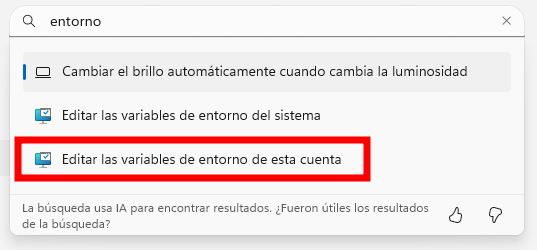
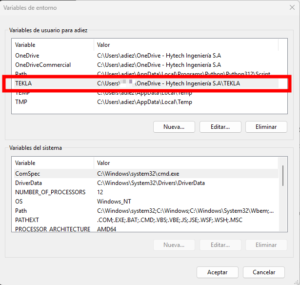

# Preguntas Frecuentes (FAQ)

[← Volver al inicio](index.md)

## Índice
- [Instalación y Configuración](#instalación-y-configuración)
  - [Validación IT: ¿está correctamente instalado?](#validación-it-está-correctamente-instalado)
- [Uso General](#uso-general)
- [Solución de Problemas](#solución-de-problemas)
- [Características Avanzadas](#características-avanzadas)

---

## Instalación y Configuración


### Validación IT: ¿está correctamente instalado?

```bash
# Ruta de instalación por defecto
C:\TeklaStructures\2022.0

# Ubicación de ajustes personalizados (user.ini)
C:\Users\<USUARIO>\AppData\Local\Trimble\Tekla Structures\2022.0\UserSettings
## Se debe habilitar visión de carpetas ocultas

```

### Definir variable de entorno

El TEKLA necesita definir una variable de entorno nueva en Windows.



1. Configuracion de Windows
2. Editar las variables de entorno de esta cuenta
3. Nombrar la ruta de la imagen debajo como TEKLA



### Archivos de inicio

El programa para funcionar correctamente necesita lo siguiente:
- Tener sincronizados los modelos a utilizar
- Tener sincronizadas las carpetas asociadas a nivel empresa y proyecto
- Copiar el archivo .ini de la empresa sobre la carpeta de UserSettings local

### Extensiones

El uso de extensiones depende del usuario, aunque las siguientes extensiones son obligatorias para todos los miembros del equipo

- ExcelToDrawing: para colocar hojas de excel en los dibujos
- NWDPlugin: para referenciar archivos .nwd en el modelo
- SelectSimilar: para seleccionar 

Cualquier extensión adicional utilizada deberá ser notificada al resto de los miembros del proyecto ya que todos deben contar con la herramienta.

Las extensiones se insta

Para extensiones, referir a [Tekla Warehouse](https://warehouse.tekla.com/)

```bash
# Ruta de extensiones (no eliminar los archivos al instalar)
C:\TeklaStructures\2022.0
```

### Voy a realizar cuadros, ¿necesito algo más?

Sí. El editor de cuadros y de símbolos maneja rutas independientes al programa. Ciertas propiedades avanzadas deben indicarse explícitamente.

## Modelado

### IB/IBE vs ID
```
IB: ingeniería básica
ID: ingeniería de detalle
```
El nivel de profundidad de los modelos dependerá de la etapa de ingeniería. Dichos alcances deben alinearse con el lider de especialidad dentro del proyecto, en función de las necesidades buscadas.

### Ciclo de vida de modelos - IB/IBE

A lo largo de un proyecto de ingeniería básica, a modo generalizado se enumera el listado de tareas vinculadas a TEKLA que se realizan a lo largo de un proyecto y sus responsabies

| Etapa | Responsable |
|----------|---------------|
|1. Nomenclatura de modelos|LEP|
|2. Creación de modelos|Proyectista|
|3. Definición de criterios de modelado (atributos a considerar)|Proyectista/LEP|
|4. Modelado (sin armaduras ni uniones)|Proyectista|
|5. Administración de modelos (Trimble Connect)|LEP|

Esta tabla general enumera las etapas de uso del programa en un proyecto de ingeniería básica, donde:

- No se realizan planos
- Se busca obtener un MTO (a través de una correcta administración de modelos desde Trimble Connect)

En caso de emitir documentación (planos), se deberán sumar las tareas indicadas que correspondan del siguiente apartado.

---

### Ciclo de vida de modelos - ID

A lo largo de un proyecto de ingeniería de detalle, se enumeran las tareas que atraviesan los modelos de TEKLA y sus responsables

| Etapa | Responsable |
|----------|---------------|
|1. Nomenclatura de modelos|LEP|
|2. Creación de modelos|Proyectista|
|3. Definición de atributos a visualizar en maqueta|Coordinador de proyecto|
|4. Creación de preset de propiedades .ifc|Proyectista|
|5. Validación de criterios de modelado (atributos a considerar)|Proyectista/LEP|
|6. Modelado (con armaduras y uniones)|Proyectista|
|7. Modelado de atributos necesarios para informes (PDH) y planos así como los que se requieran ver en maqueta|Proyectista|
|8. Administración de modelos (Trimble Connect)|LEP|

### Gestión de modelos

En líneas generales se sugiere:

- Tener una nomenclatura de modelos validada por el coordinador y que permita su gestión.
- Utilizar continuamente Trimble Connect para hacer comentarios, obtener listados de cantidades, etc.
- En fase de ID, utilizar de forma obligatoria Trimble Connect para garantizar el mismo preset de propiedades en todos los modelos.
- En fase de ID, utilizar de forma obligatoria rutinas para mover archivos a las rutas del servidor y armar carpetas de trazabilidad de modelos.

## Dibujos

### ¿Cómo creo un dibujo nuevo?

### ¿Qué herramientas debo usar en el modo dibujo?

### ¿Cómo es el proceso para crear nuevos rótulos?

### ¿Cuáles son los atributos que se utilizan en el modo dibujo y dónde se guardan?

### ¿Cuál es la estructura de carpetas obligatoria en el modo dibujo?

### 
--- 

## Lectura de archivos

### Guardé una determinada configuración y no la veo. ¿Por qué?

La estructura de lectura de archivos no es lineal pero el programa a nivel general tiene el siguiente orden de lectura:

Archivos de instalación
|_ Entorno SouthAmerica
|__ XS_FIRM
|___ XS_PROJECT
|____ MODELO


---

## BIM Publisher

El BIM Publisher es una herramienta provista en el Tekla Warehouse que permite:

- Tener control de salida de varios modelos en simultáneo
- Definir formatos de extracción de modelos
- Extraer de forma automática múltiples modelos en una sola sesión sin hacerlo de forma manual.

Para mayor detalle referir al manual

## Trimble Connect

Trimble Connect es una herramienta que permite:

- Armar un proyecto e invitar a usuarios a participar o visualizar del mismo.
- Sincronizar todos los modelos propios de un proyecto, teniendo diálogo constante con lo que ejecuta quien modela.
- Realizar comentarios sobre los modelos subidos.
- Tener control de versiones de los modelos que conforman el proyecto.
- Realizar seguimiento de tareas, asignando responsables, plazos y estatus de cada punto.
- Visualizar propiedades/atributos de cada modelo, pudiendo exportar la información siguiendo algún filtro determinado.

Se trata de una herramienta central para el desarrollo del proyecto, ya que actúa de puente entre quienes modelan con quienes revisan la documentación a emitir.

Para mayor detalle referir al manual

## Errores comunes

### 

## Características Avanzadas


---

## ¿Sin respuesta?
